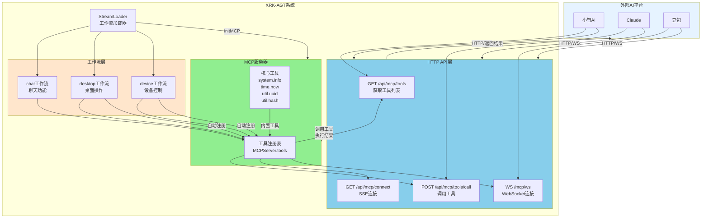
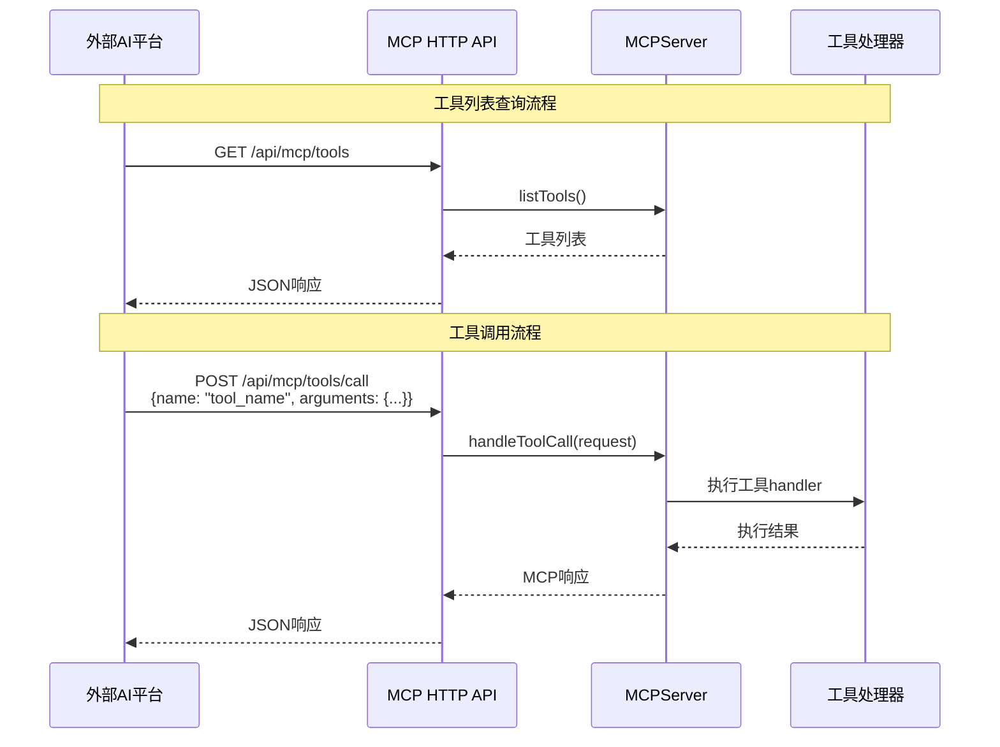
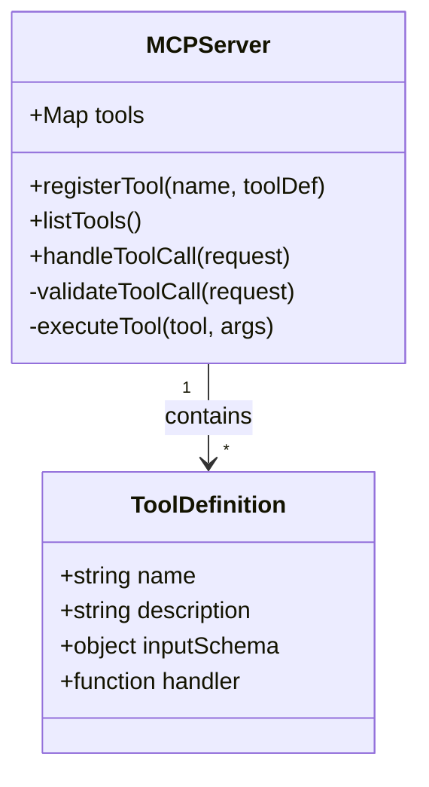
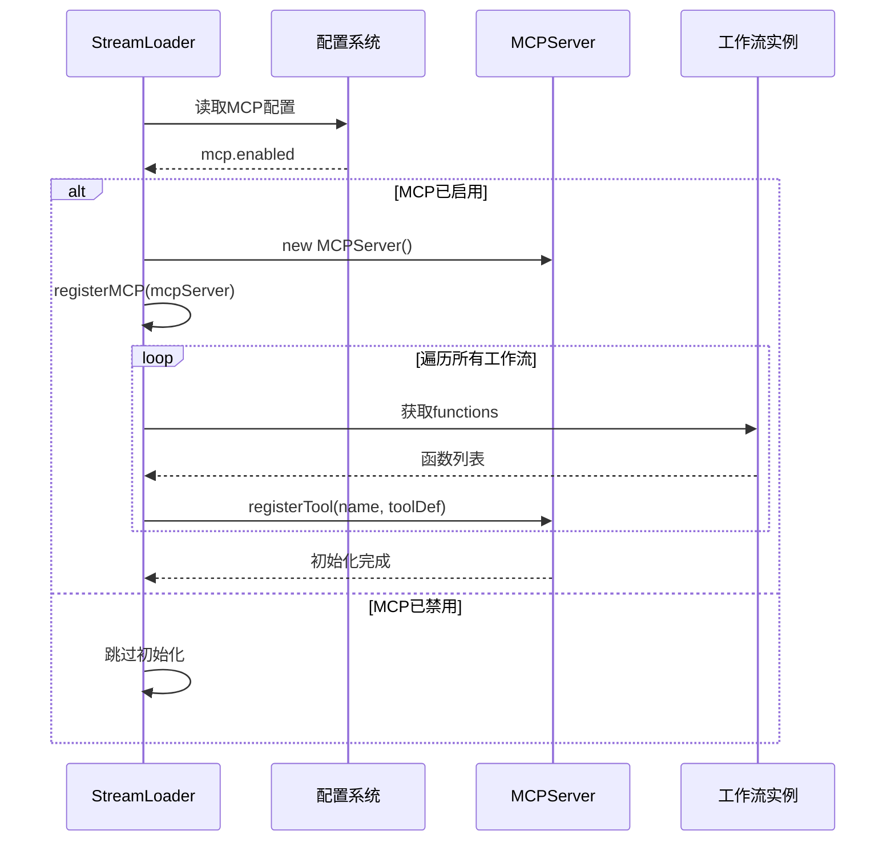
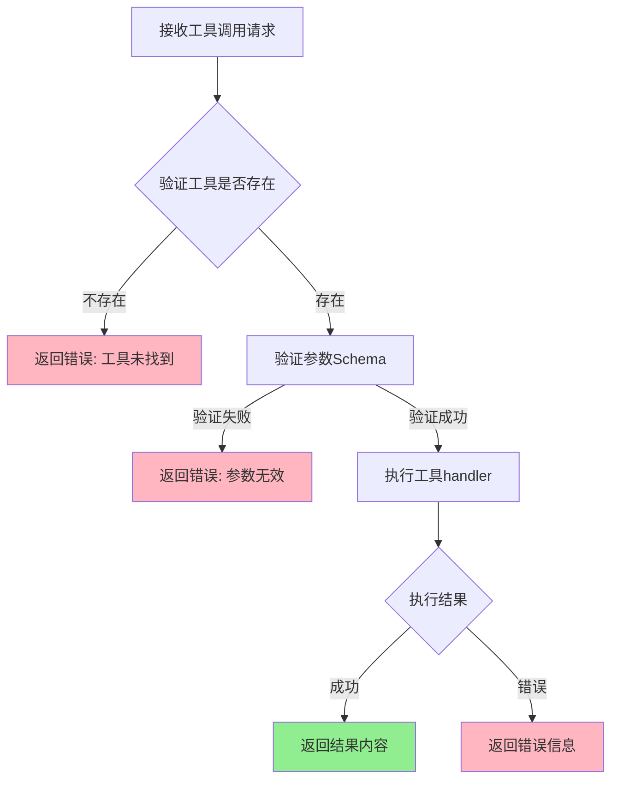
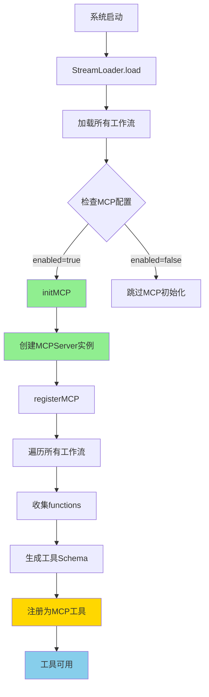
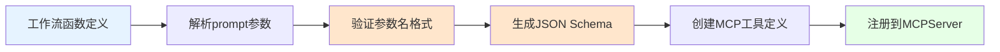
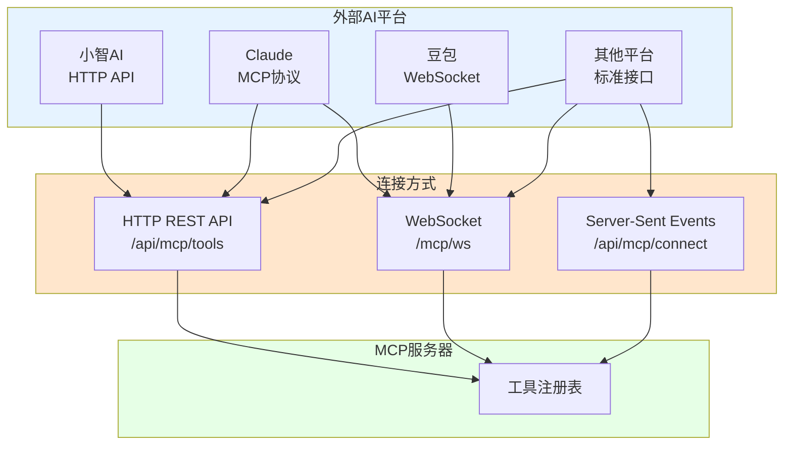

# MCP (Model Context Protocol) 完整指南

## 📚 目录导航

- [MCP概述](#mcp概述)
- [MCP架构图](#mcp架构图)
- [MCP服务器](#mcp服务器)
- [MCP HTTP API](#mcp-http-api)
- [工具注册机制](#工具注册机制)
- [外部平台连接](#外部平台连接)
- [核心工具](#核心工具)
- [开发指南](#开发指南)
- [Cursor配置](#cursor配置)
- [配置说明](#配置说明)

---

## MCP概述

**Model Context Protocol (MCP)** 是XRK-AGT提供的标准化工具调用协议，允许外部AI平台（如小智AI、Claude、豆包）通过HTTP/WebSocket连接并调用系统工具。

### 核心作用

- ✅ **统一工具管理**：所有工作流的函数自动注册为MCP工具
- ✅ **标准化接口**：提供HTTP REST API和WebSocket接口
- ✅ **多平台支持**：支持小智AI、Claude、豆包等外部平台连接
- ✅ **自动注册**：系统启动时自动收集并注册所有工作流工具

### 应用场景

1. **外部AI平台调用**：小智AI、Claude等平台可以调用XRK-AGT的工具
2. **工具聚合**：将多个工作流的函数统一暴露为MCP工具
3. **跨平台协作**：不同AI平台可以共享同一套工具集

---

## MCP架构图



### 数据流图



---

## MCP服务器

### MCPServer类

**位置**: `src/utils/mcp-server.js`

**核心功能**：
- 工具注册与管理
- 工具调用处理
- 错误处理与日志记录



```javascript
// src/infrastructure/aistream/loader.js
async initMCP() {
  const mcpConfig = cfg.aistream?.mcp || {};
  if (mcpConfig.enabled === false) {
    return; // MCP服务已禁用
  }

  // 创建MCP服务器实例
  this.mcpServer = new MCPServer();
  
  // 注册所有工作流的工具
  this.registerMCP(this.mcpServer);
}
```

### 初始化流程图



### 工具注册

```javascript
// 注册MCP工具
mcpServer.registerTool('tool_name', {
  description: '工具描述',
  inputSchema: {
    type: 'object',
    properties: {
      param1: { type: 'string', description: '参数1' }
    },
    required: ['param1']
  },
  handler: async (args) => {
    // 工具处理逻辑
    return result;
  }
});
```

### 工具调用



**代码示例**：

```javascript
// 处理工具调用请求
const result = await mcpServer.handleToolCall({
  name: 'tool_name',
  arguments: { param1: 'value1' }
});

// 返回格式
{
  content: [{ type: 'text', text: '结果文本或JSON' }],
  isError: false
}
```

---

## MCP HTTP API

### API端点

| 端点 | 方法 | 说明 | 请求格式 | 响应格式 |
|------|------|------|----------|----------|
| `/api/mcp/tools` | GET | 获取所有可用工具列表 | - | `{success: true, tools: [...], count: N}` |
| `/api/mcp/tools/call` | POST | 调用MCP工具 | `{name: "tool_name", arguments: {...}}` | `{success: true, content: [...], isError: false}` |
| `/api/mcp/connect` | GET | SSE连接（Server-Sent Events） | - | `text/event-stream` |
| `/mcp/ws` | WS | WebSocket连接 | JSON消息 | JSON响应 |

### 工具列表查询

**请求**：
```http
GET /api/mcp/tools HTTP/1.1
Host: your-server:port
```

**响应**：
```json
{
  "success": true,
  "tools": [
    {
      "name": "system.info",
      "description": "获取系统信息（操作系统、CPU、内存、平台等）",
      "inputSchema": {
        "type": "object",
        "properties": {
          "detail": {
            "type": "boolean",
            "description": "是否返回详细信息（默认false）"
          }
        },
        "required": []
      }
    },
    {
      "name": "chat.send_message",
      "description": "发送消息",
      "inputSchema": {...}
    }
  ],
  "count": 10
}
```

### 工具调用

**请求**：
```http
POST /api/mcp/tools/call HTTP/1.1
Host: your-server:port
Content-Type: application/json

{
  "jsonrpc": "2.0",
  "id": 1,
  "method": "tools/call",
  "params": {
    "name": "system.info",
    "arguments": {}
  }
}
```

**成功响应**：
```json
{
  "success": true,
  "content": [
    {
      "type": "text",
      "text": "{\"platform\":\"win32\",\"arch\":\"x64\",...}"
    }
  ],
  "isError": false
}
```

**错误响应**：
```json
{
  "success": false,
  "error": {
    "code": "TOOL_NOT_FOUND",
    "message": "工具未找到: invalid_tool"
  },
  "isError": true
}
```

### SSE连接

**请求**：
```http
GET /api/mcp/connect HTTP/1.1
Host: your-server:port
```

**响应**（Server-Sent Events）：
```
Content-Type: text/event-stream
Cache-Control: no-cache
Connection: keep-alive

data: {"type":"connected","message":"MCP连接已建立"}

data: {"type":"ping","timestamp":1703123456789}

...
```

### WebSocket连接

**连接**：
```javascript
const ws = new WebSocket('ws://your-server:port/mcp/ws');
```

**消息格式**：

1. **调用工具**（标准JSON-RPC格式）：
```json
{
  "jsonrpc": "2.0",
  "id": 1,
  "method": "tools/call",
  "params": {
    "name": "system.info",
    "arguments": {}
  }
}
```

或使用兼容旧版格式：
```json
{
  "type": "call_tool",
  "requestId": "req_123",
  "name": "system.info",
  "arguments": {}
}
```

2. **获取工具列表**（标准JSON-RPC格式）：
```json
{
  "jsonrpc": "2.0",
  "id": 2,
  "method": "tools/list"
}
```

或使用兼容旧版格式：
```json
{
  "type": "list_tools"
}
```

**响应格式**：

1. **工具调用结果**（标准JSON-RPC格式）：
```json
{
  "jsonrpc": "2.0",
  "id": 1,
  "result": {
    "content": [{"type": "text", "text": "..."}],
    "isError": false
  }
}
```

或使用兼容旧版格式：
```json
{
  "type": "tool_result",
  "requestId": "req_123",
  "result": {
    "content": [{"type": "text", "text": "..."}],
    "isError": false
  }
}
```

2. **工具列表**（标准JSON-RPC格式）：
```json
{
  "jsonrpc": "2.0",
  "id": 2,
  "result": {
    "tools": [...]
  }
}
```

或使用兼容旧版格式：
```json
{
  "type": "tools_list",
  "tools": [...]
}
```

---

## 工具注册机制

### 自动注册流程



### 工具命名规则

- **工作流工具**：`{streamName}.{functionName}`
  - 例如：`chat.send_message`、`desktop.open_application`
- **核心工具**：直接使用工具名
  - 例如：`system.info`、`time.now`、`util.uuid`、`util.hash`

### 工具Schema生成

系统自动从工作流函数的`prompt`中提取参数信息，生成JSON Schema：



**标准格式**：

```javascript
// 工作流函数定义（参数名必须使用英文）
this.registerFunction('read', {
  prompt: '[读取:filePath] - 读取文件内容，例如：[读取:易忘信息.txt]',
  handler: async (params, context) => {
    const { filePath } = params;
    // 直接使用英文参数名
  }
});

// 自动生成的MCP工具
{
  name: 'tools.read',
  description: '读取文件内容',
  inputSchema: {
    type: 'object',
    properties: {
      filePath: {
        type: 'string',
        description: 'filePath'
      }
    },
    required: ['filePath']
  }
}
```

**参数命名规范**：
- ✅ 使用英文：`filePath`, `keyword`, `command`
- ❌ 禁止中文：`文件路径`, `关键词`, `命令`

### 工具注册标准

#### 核心原则

1. **参数名必须使用英文**：符合 JSON Schema 规范，只能包含字母、数字、下划线
2. **直接映射**：MCP 参数名直接传递给内部 handler，无需转换
3. **标准化格式**：prompt 格式统一为 `[操作:paramName]`

#### Prompt 格式标准

**基本格式**：
```
[操作:paramName] - 描述，例如：[操作:example]
```

**多参数格式**：
```
[操作:param1:param2] - 描述，例如：[操作:value1:value2]
```

#### 工具注册示例

**示例1：单参数工具**
```javascript
this.registerFunction('read', {
  description: '读取文件内容',
  prompt: `[读取:filePath] - 读取文件内容，例如：[读取:易忘信息.txt]`,
  handler: async (params, context) => {
    const { filePath } = params || {};
    // filePath 直接来自 MCP 调用
  },
  enabled: true
});
```

**示例2：多参数工具**
```javascript
this.registerFunction('write', {
  description: '写入文件',
  prompt: `[写入:filePath:content] - 写入文件，例如：[写入:test.txt:这是内容]`,
  handler: async (params, context) => {
    const { filePath, content } = params || {};
  },
  enabled: true
});
```

#### 常见参数名参考

| 用途 | 推荐参数名 | 说明 |
|------|-----------|------|
| 文件路径 | `filePath` | 文件或目录路径 |
| 关键词 | `keyword` | 搜索关键词 |
| 命令 | `command` | 执行的命令 |
| 内容 | `content` | 文本内容 |
| URL | `url` | 网址 |
| 应用名 | `appName` | 应用程序名称 |
| 股票代码 | `stockCode` | 股票代码 |
| 知识库名 | `knowledgeBase` | 知识库名称 |

#### Schema 自动生成

`buildMCPInputSchema()` 方法会自动从 prompt 中提取参数名：

1. 匹配所有 `[操作:param]` 格式
2. 提取冒号后的参数名
3. 验证参数名格式（必须是英文标识符）
4. 生成 JSON Schema

**参数名提取规则**：
- ✅ 提取：`filePath`, `keyword`, `command`
- ❌ 忽略：`易忘信息.txt`, `ls -la`, `错误`（示例值）

#### 注意事项

1. **参数名一致性**：prompt 中的参数名必须与 handler 中使用的参数名一致
2. **示例值位置**：示例值放在描述中，不要放在参数位置
3. **参数顺序**：多参数时，顺序要明确
4. **可选参数**：在 handler 中使用默认值处理可选参数

---

## 外部平台连接

XRK-AGT的MCP服务支持多种连接方式，方便不同平台的AI系统接入：



### 小智AI连接

小智AI支持通过HTTP API调用MCP工具：

```python
import requests

# 获取工具列表
response = requests.get('http://your-server:port/api/mcp/tools')
tools = response.json()['tools']

# 调用工具
result = requests.post('http://your-server:port/api/mcp/tools/call', json={
    'name': 'system.info',
    'arguments': {}
})
print(result.json())
```

### Claude连接

Claude支持MCP协议，可以通过配置文件连接：

```json
{
  "mcpServers": {
    "xrk-agt": {
      "command": "node",
      "args": ["path/to/mcp-client.js"],
      "env": {
        "MCP_SERVER_URL": "http://your-server:port/api/mcp"
      }
    }
  }
}
```

### 豆包连接

豆包可以通过WebSocket连接：

```python
import websocket
import json

def on_message(ws, message):
    data = json.loads(message)
    if data['type'] == 'tools_list':
        print('工具列表:', data['tools'])

ws = websocket.WebSocketApp(
    'ws://your-server:port/mcp/ws',
    on_message=on_message
)

# 获取工具列表
ws.send(json.dumps({'type': 'list_tools'}))

# 调用工具（标准JSON-RPC格式）
ws.send(json.dumps({
    'jsonrpc': '2.0',
    'id': 1,
    'method': 'tools/call',
    'params': {
        'name': 'system.info',
        'arguments': {}
    }
}))

# 或使用兼容旧版格式
ws.send(json.dumps({
    'type': 'call_tool',
    'requestId': 'req_1',
    'name': 'system.info',
    'arguments': {}
}))

ws.run_forever()
```

---

## 核心工具

MCP服务器内置了4个核心工具，符合MCP 1.0标准：

### 1. system.info

获取系统信息（操作系统、CPU、内存、平台等）

**参数**：
```json
{
  "detail": false  // 可选，是否返回详细信息
}
```

**示例**（JSON-RPC）：
```json
{
  "jsonrpc": "2.0",
  "id": 1,
  "method": "tools/call",
  "params": {
    "name": "system.info",
    "arguments": {
      "detail": true
    }
  }
}
```

**返回**：
```json
{
  "jsonrpc": "2.0",
  "id": 1,
  "result": {
    "content": [
      {
        "type": "text",
        "text": "{\"platform\":\"win32\",\"arch\":\"x64\",\"nodeVersion\":\"v24.12.0\",\"hostname\":\"DESKTOP-XXX\",\"cpu\":{\"cores\":8,\"model\":\"...\"},\"memory\":{\"total\":\"16GB\",\"free\":\"8GB\",\"used\":\"8GB\",\"usage\":50},\"uptime\":{\"seconds\":86400,\"hours\":24,\"days\":1}}"
      }
    ],
    "isError": false
  }
}
```

### 2. time.now

获取当前时间信息（支持多种格式和时区）

**参数**：
```json
{
  "format": "locale",  // iso, locale, timestamp, unix
  "timezone": "Asia/Shanghai"  // 可选
}
```

**示例**：
```json
{
  "jsonrpc": "2.0",
  "id": 2,
  "method": "tools/call",
  "params": {
    "name": "time.now",
    "arguments": {
      "format": "iso"
    }
  }
}
```

### 3. util.uuid

生成UUID（通用唯一标识符）

**参数**：
```json
{
  "version": "v4",  // UUID版本
  "count": 1  // 生成数量（1-100）
}
```

**示例**：
```json
{
  "jsonrpc": "2.0",
  "id": 3,
  "method": "tools/call",
  "params": {
    "name": "util.uuid",
    "arguments": {
      "version": "v4",
      "count": 5
    }
  }
}
```

### 4. util.hash

计算字符串或数据的哈希值（支持多种算法）

**参数**：
```json
{
  "data": "Hello World",
  "algorithm": "sha256"  // md5, sha1, sha256, sha512
}
```

**示例**：
```json
{
  "jsonrpc": "2.0",
  "id": 4,
  "method": "tools/call",
  "params": {
    "name": "util.hash",
    "arguments": {
      "data": "Hello World",
      "algorithm": "sha256"
    }
  }
}
```

---

## 开发指南

### 1. 开发自定义MCP工具

#### 方式1：在工作流中注册（推荐）

```javascript
// core/stream/my-stream.js
export default class MyStream extends AIStream {
  async init() {
    await super.init();
    
    // 注册函数（自动注册为MCP工具）
    this.registerFunction('my_tool', {
      description: '我的自定义工具',
      prompt: '[我的工具:参数1:参数2]',
      handler: async (params, context) => {
        // 工具逻辑
        return { result: 'success' };
      }
    });
  }
}
```

工具会自动注册为：`my-stream.my_tool`

#### 方式2：直接注册到MCPServer

```javascript
// 在系统初始化时
const mcpServer = StreamLoader.mcpServer;
mcpServer.registerTool('custom_tool', {
  description: '自定义工具',
  inputSchema: {
    type: 'object',
    properties: {
      param1: { type: 'string' }
    },
    required: ['param1']
  },
  handler: async (args) => {
    return { result: 'success' };
  }
});
```

### 2. 工具设计原则

- **标准化**：遵循MCP协议规范
- **安全性**：验证输入参数，防止注入攻击
- **错误处理**：提供清晰的错误信息
- **文档化**：提供详细的工具描述和参数说明

### 3. 工具测试

```bash
# 获取工具列表
curl http://localhost:2537/api/mcp/tools

# 调用工具（JSON-RPC标准）
curl -X POST http://localhost:2537/api/mcp/jsonrpc \
  -H "Content-Type: application/json" \
  -d '{
    "jsonrpc": "2.0",
    "id": 1,
    "method": "tools/call",
    "params": {
      "name": "system.info",
      "arguments": {}
    }
  }'

# 调用工具（兼容旧版RESTful API）
curl -X POST http://localhost:2537/api/mcp/tools/call \
  -H "Content-Type: application/json" \
  -d '{"name": "system.info", "arguments": {}}'
```

---

## 配置说明

### MCP配置

在 `core/commonconfig/system.js` 中配置：

```javascript
aistream: {
  mcp: {
    enabled: true,        // 启用MCP服务
    port: 2537,          // HTTP服务端口（使用主服务器端口）
    autoRegister: true   // 自动注册所有工作流工具
  }
}
```

### 配置项说明

| 配置项 | 类型 | 默认值 | 说明 |
|--------|------|--------|------|
| `enabled` | boolean | `true` | 是否启用MCP服务 |
| `port` | number | `2537` | HTTP服务端口（使用主服务器端口） |
| `autoRegister` | boolean | `true` | 是否自动注册所有工作流工具 |

---

## Cursor配置

### 配置方式

Cursor 支持三种传输方式连接 MCP 服务器：

**1. HTTP 传输（推荐）**

适用于远程或本地部署，支持多用户。

**配置位置**: `~/.cursor/mcp.json` 或项目根目录的 `.cursor/mcp.json`

```json
{
  "mcpServers": {
    "xrk-agt": {
      "url": "http://localhost:2537/api/mcp/jsonrpc",
      "transport": "http",
      "description": "XRK-AGT MCP服务器 - 提供工作流工具和系统功能"
    }
  }
}
```

**2. SSE 传输**

适用于需要实时更新的场景。

```json
{
  "mcpServers": {
    "xrk-agt": {
      "url": "http://localhost:2537/api/mcp/connect",
      "transport": "sse",
      "description": "XRK-AGT MCP服务器 - SSE连接"
    }
  }
}
```

**3. WebSocket 传输**

适用于需要双向通信的场景。

```json
{
  "mcpServers": {
    "xrk-agt": {
      "url": "ws://localhost:2537/mcp/ws",
      "transport": "websocket",
      "description": "XRK-AGT MCP服务器 - WebSocket连接"
    }
  }
}
```

详细请求/响应格式请参考本文档的 [MCP HTTP API](#mcp-http-api) 章节。

### 测试连接

```bash
# 健康检查
curl http://localhost:2537/api/mcp/health

# 获取工具列表（RESTful）
curl http://localhost:2537/api/mcp/tools

# 调用工具（JSON-RPC）
curl -X POST http://localhost:2537/api/mcp/jsonrpc \
  -H "Content-Type: application/json" \
  -d '{
    "jsonrpc": "2.0",
    "id": 1,
    "method": "tools/list"
  }'
```

### 故障排除

**连接失败**：
1. 检查 XRK-AGT 服务器是否正在运行
2. 确认端口号是否正确（默认2537）
3. 检查防火墙设置

**工具调用失败**：
1. 查看服务器日志
2. 验证工具名称是否正确
3. 检查参数格式是否符合 JSON Schema

**Cursor 无法识别 MCP 服务器**：
1. 确认配置文件路径正确
2. 重启 Cursor
3. 检查 JSON 格式是否正确

## 协议版本

- **MCP协议版本**: 2024-11-05（MCP 1.0标准）
- **JSON-RPC版本**: 2.0
- **服务器版本**: 1.0.0

---

## 总结

XRK-AGT的MCP系统提供了：

- ✅ **标准化工具接口**：遵循MCP协议，支持外部AI平台连接
- ✅ **自动工具注册**：所有工作流函数自动注册为MCP工具
- ✅ **多协议支持**：HTTP REST API、SSE、WebSocket
- ✅ **核心工具**：内置4个核心工具，便于测试和演示
- ✅ **易于扩展**：支持自定义工具开发

通过MCP协议，XRK-AGT可以轻松与Cursor、Claude、小智AI等外部AI平台集成，实现工具共享和跨平台协作。
