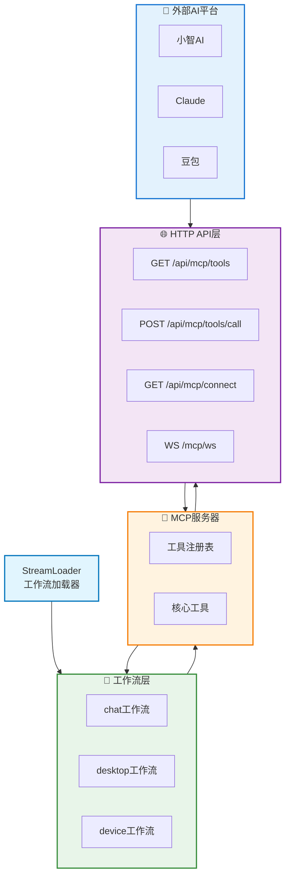
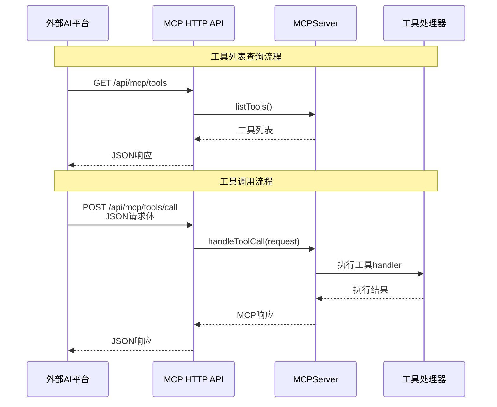
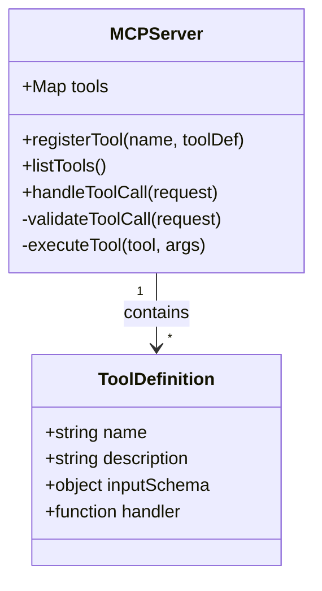
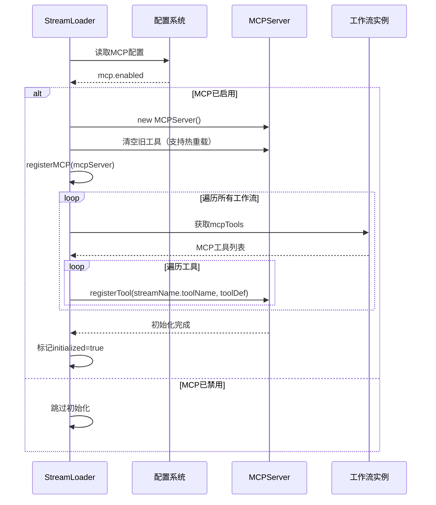
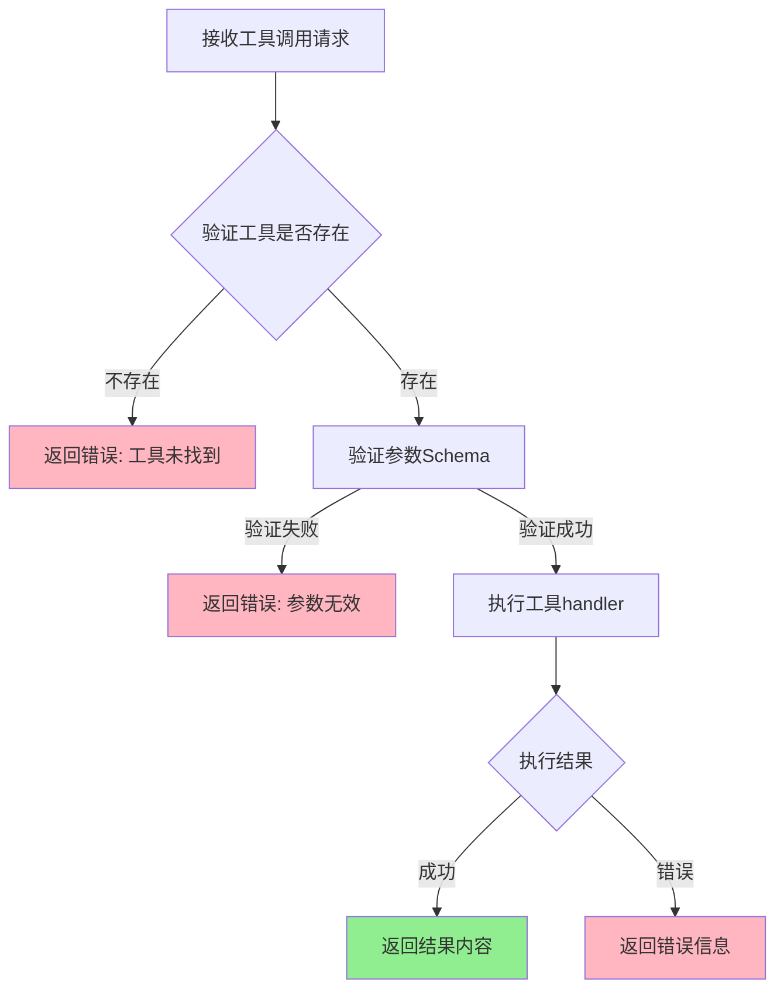
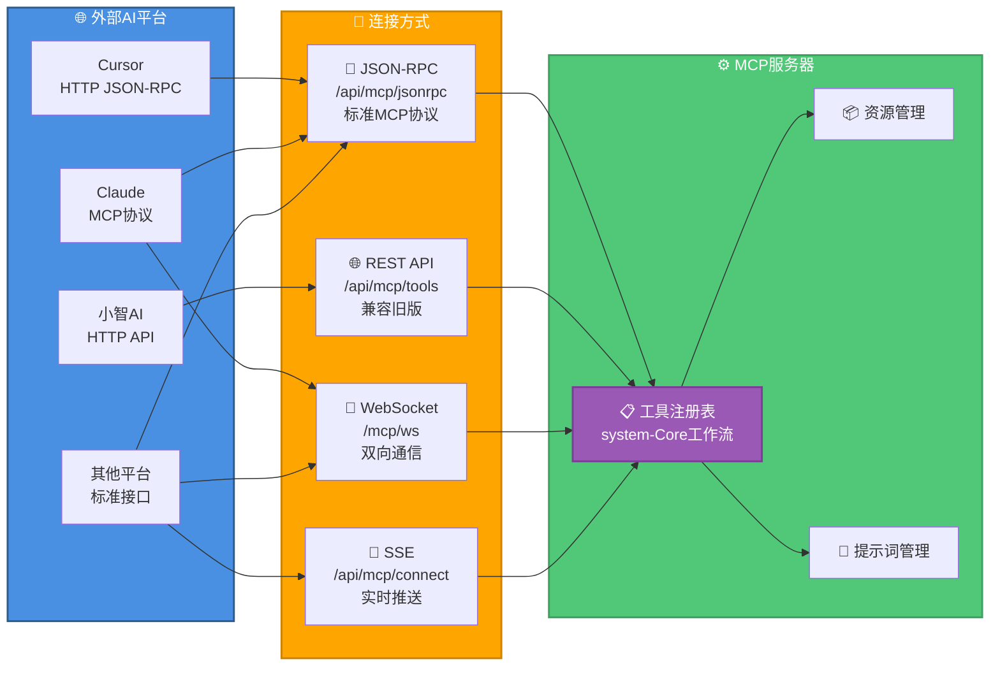

# MCP (Model Context Protocol) 完整指南

## 📚 目录导航

- [MCP概述](#mcp概述)
- [MCP架构图](#mcp架构图)
- [MCP服务器](#mcp服务器)
- [MCP HTTP API](#mcp-http-api)
- [工具注册机制](#工具注册机制)
- [外部平台连接](#外部平台连接)
- [核心工具](#核心工具)
- [开发指南](#开发指南)
- [Cursor配置](#cursor配置)
- [配置说明](#配置说明)

---

## MCP概述

**Model Context Protocol (MCP)** 是XRK-AGT提供的标准化工具调用协议，允许外部AI平台（如小智AI、Claude、豆包）通过HTTP/WebSocket连接并调用系统工具。

### 核心作用

- ✅ **统一工具管理**：所有工作流的函数自动注册为MCP工具
- ✅ **标准化接口**：提供HTTP REST API和WebSocket接口
- ✅ **多平台支持**：支持小智AI、Claude、豆包等外部平台连接
- ✅ **自动注册**：系统启动时自动收集并注册所有工作流工具

### 应用场景

1. **外部AI平台调用**：小智AI、Claude等平台可以调用XRK-AGT的工具
2. **工具聚合**：将多个工作流的函数统一暴露为MCP工具
3. **跨平台协作**：不同AI平台可以共享同一套工具集

---

## MCP架构图



### 数据流图



---

## MCP服务器

### MCPServer类

**位置**: `src/utils/mcp-server.js`

**核心功能**：
- 工具注册与管理
- 工具调用处理
- 错误处理与日志记录



```javascript
// src/infrastructure/aistream/loader.js
async initMCP() {
  const mcpConfig = cfg.aistream?.mcp || {};
  if (mcpConfig.enabled === false) {
    return; // MCP服务已禁用
  }

  // 创建MCP服务器实例
  this.mcpServer = new MCPServer();
  
  // 注册所有工作流的工具
  this.registerMCP(this.mcpServer);
}
```

### 初始化流程图



**重要说明**：
- MCP服务在系统启动时自动初始化
- 支持热重载：工作流变更时自动重新注册工具
- 工具按工作流分组：`{streamName}.{toolName}` 格式

### 工具注册

```javascript
// 注册MCP工具
mcpServer.registerTool('tool_name', {
  description: '工具描述',
  inputSchema: {
    type: 'object',
    properties: {
      param1: { type: 'string', description: '参数1' }
    },
    required: ['param1']
  },
  handler: async (args) => {
    // 工具处理逻辑
    return result;
  }
});
```

### 工具调用



**代码示例**：

```javascript
// 处理工具调用请求
const result = await mcpServer.handleToolCall({
  name: 'tool_name',
  arguments: { param1: 'value1' }
});

// 返回格式
{
  content: [{ type: 'text', text: '结果文本或JSON' }],
  isError: false
}
```

---

## MCP HTTP API

### API端点

**标准 JSON-RPC 接口（推荐）**：

| 端点 | 方法 | 说明 | 请求格式 | 响应格式 |
|------|------|------|----------|----------|
| `/api/mcp/jsonrpc` | POST | JSON-RPC标准接口 | `{jsonrpc: "2.0", id: 1, method: "...", params: {...}}` | `{jsonrpc: "2.0", id: 1, result: {...}}` |
| `/api/mcp/jsonrpc/:stream` | POST | 按工作流过滤的JSON-RPC | 同上，路径参数指定工作流 | 同上 |

**RESTful API（兼容旧版）**：

| 端点 | 方法 | 说明 | 请求格式 | 响应格式 |
|------|------|------|----------|----------|
| `/api/mcp/tools` | GET | 获取所有可用工具列表 | `?stream=desktop`（可选） | `{success: true, tools: [...], count: N}` |
| `/api/mcp/tools/streams` | GET | 获取工作流分组 | - | `{success: true, streams: [...], groups: {...}, count: N}` |
| `/api/mcp/tools/stream/:streamName` | GET | 获取指定工作流的工具 | - | `{success: true, stream: "...", tools: [...], count: N}` |
| `/api/mcp/tools/:name` | GET | 获取单个工具详情 | - | `{success: true, tool: {...}}` |
| `/api/mcp/tools/call` | POST | 调用MCP工具（兼容旧版） | `{name: "tool_name", arguments: {...}}` | `{success: true, content: [...], isError: false}` |
| `/api/mcp/resources` | GET | 获取资源列表 | - | `{success: true, resources: [...], count: N}` |
| `/api/mcp/resources/:uri` | GET | 获取资源内容 | - | `{success: true, resource: {...}}` |
| `/api/mcp/prompts` | GET | 获取提示词列表 | - | `{success: true, prompts: [...], count: N}` |
| `/api/mcp/prompts/:name` | POST | 获取提示词内容 | `{arguments: {...}}` | `{success: true, prompt: {...}}` |
| `/api/mcp/connect` | GET | SSE连接（Server-Sent Events） | - | `text/event-stream` |
| `/api/mcp/health` | GET | 健康检查 | - | `{success: true, status: "healthy", toolsCount: N, ...}` |
| `/mcp/ws` | WS | WebSocket连接 | JSON消息 | JSON响应 |

### 工具列表查询

**请求**：
```http
GET /api/mcp/tools HTTP/1.1
Host: your-server:port
```

**响应**：
```json
{
  "success": true,
  "tools": [
    {
      "name": "system.info",
      "description": "获取系统信息（操作系统、CPU、内存、平台等）",
      "inputSchema": {
        "type": "object",
        "properties": {
          "detail": {
            "type": "boolean",
            "description": "是否返回详细信息（默认false）"
          }
        },
        "required": []
      }
    },
    {
      "name": "chat.send_message",
      "description": "发送消息",
      "inputSchema": {...}
    }
  ],
  "count": 10
}
```

### 工具调用

**方式1：JSON-RPC标准（推荐）**

**请求**：
```http
POST /api/mcp/jsonrpc HTTP/1.1
Host: your-server:port
Content-Type: application/json

{
  "jsonrpc": "2.0",
  "id": 1,
  "method": "tools/call",
  "params": {
    "name": "system.info",
    "arguments": {}
  }
}
```

**成功响应**：
```json
{
  "jsonrpc": "2.0",
  "id": 1,
  "result": {
    "content": [
      {
        "type": "text",
        "text": "{\"platform\":\"win32\",\"arch\":\"x64\",\"nodeVersion\":\"v24.12.0\",...}"
      }
    ],
    "isError": false
  }
}
```

**错误响应**：
```json
{
  "jsonrpc": "2.0",
  "id": 1,
  "error": {
    "code": -32601,
    "message": "工具未找到: invalid_tool"
  }
}
```

**方式2：RESTful API（兼容旧版）**

**请求**：
```http
POST /api/mcp/tools/call HTTP/1.1
Host: your-server:port
Content-Type: application/json

{
  "name": "system.info",
  "arguments": {}
}
```

**成功响应**：
```json
{
  "success": true,
  "content": [
    {
      "type": "text",
      "text": "{\"platform\":\"win32\",\"arch\":\"x64\",...}"
    }
  ],
  "isError": false,
  "metadata": {
    "tool": "system.info",
    "duration": "15ms",
    "timestamp": 1703123456789
  }
}
```

**错误响应**：
```json
{
  "success": false,
  "error": {
    "code": "TOOL_NOT_FOUND",
    "message": "工具未找到: invalid_tool"
  },
  "isError": true
}
```

### SSE连接

**请求**：
```http
GET /api/mcp/connect HTTP/1.1
Host: your-server:port
```

**响应**（Server-Sent Events）：
```
Content-Type: text/event-stream
Cache-Control: no-cache
Connection: keep-alive

data: {"type":"connected","message":"MCP连接已建立"}

data: {"type":"ping","timestamp":1703123456789}

...
```

### WebSocket连接

**连接**：
```javascript
const ws = new WebSocket('ws://your-server:port/mcp/ws');
```

**消息格式**：

1. **调用工具**（标准JSON-RPC格式）：
```json
{
  "jsonrpc": "2.0",
  "id": 1,
  "method": "tools/call",
  "params": {
    "name": "system.info",
    "arguments": {}
  }
}
```

或使用兼容旧版格式：
```json
{
  "type": "call_tool",
  "requestId": "req_123",
  "name": "system.info",
  "arguments": {}
}
```

2. **获取工具列表**（标准JSON-RPC格式）：
```json
{
  "jsonrpc": "2.0",
  "id": 2,
  "method": "tools/list"
}
```

或使用兼容旧版格式：
```json
{
  "type": "list_tools"
}
```

**响应格式**：

1. **工具调用结果**（标准JSON-RPC格式）：
```json
{
  "jsonrpc": "2.0",
  "id": 1,
  "result": {
    "content": [{"type": "text", "text": "..."}],
    "isError": false
  }
}
```

或使用兼容旧版格式：
```json
{
  "type": "tool_result",
  "requestId": "req_123",
  "result": {
    "content": [{"type": "text", "text": "..."}],
    "isError": false
  }
}
```

2. **工具列表**（标准JSON-RPC格式）：
```json
{
  "jsonrpc": "2.0",
  "id": 2,
  "result": {
    "tools": [...]
  }
}
```

或使用兼容旧版格式：
```json
{
  "type": "tools_list",
  "tools": [...]
}
```

---

## 工具注册机制

### 自动注册流程

```mermaid
flowchart LR
    Start([🚀 系统启动]) --> Load["📚 StreamLoader.load<br/>加载所有工作流"]
    Load --> Check{"🔍 检查MCP配置<br/>aistream.mcp.enabled"}
    
    Check -->|"✅ enabled=true"| Init["⚙️ initMCP<br/>初始化MCP服务"]
    Check -->|"❌ enabled=false"| Skip["⏭️ 跳过MCP初始化"]
    
    Init --> Create["📦 创建MCPServer实例<br/>new MCPServer()"]
    Create --> Register["📝 registerMCP<br/>注册所有工作流工具"]
    
    Register --> Loop["🔄 遍历所有工作流<br/>core/system-Core/stream/*"]
    Loop --> Collect["📋 收集mcpTools<br/>registerMCPTool注册的工具"]
    Collect --> Schema["✅ 使用inputSchema<br/>JSON Schema格式"]
    Schema --> RegisterTool["📝 注册为MCP工具<br/>streamName.toolName"]
    RegisterTool --> Available([✅ 工具可用<br/>可通过API调用])
    
    style Start fill:#4A90E2,stroke:#2E5C8A,stroke-width:3px,color:#fff
    style Init fill:#50C878,stroke:#3FA060,stroke-width:2px,color:#fff
    style Create fill:#50C878,stroke:#3FA060,stroke-width:2px,color:#fff
    style Collect fill:#FFD700,stroke:#CCAA00,stroke-width:2px,color:#000
    style RegisterTool fill:#FFD700,stroke:#CCAA00,stroke-width:2px,color:#000
    style Available fill:#2ECC71,stroke:#27AE60,stroke-width:3px,color:#fff
```



**重要说明**：
- 所有工具都通过 `registerMCPTool` 注册为 MCP 工具
- MCP 工具必须定义 `inputSchema`（JSON Schema 格式）
- 所有工具都返回标准 JSON 格式：`{ success: true/false, data: {...}, error: {...} }`
- 工具命名格式：`{streamName}.{toolName}`（如 `desktop.show_desktop`）
- 支持热重载：工作流变更时自动重新注册工具

### 工具命名规则

- **工作流工具**：`{streamName}.{toolName}`
  - 例如：`desktop.show_desktop`、`desktop.open_system_tool`、`desktop.open_browser`
  - 工具名称格式统一为 `工作流名.工具名`，便于分组管理

### 工具分组

MCP工具按工作流自动分组，支持按工作流调用：

**获取所有工具**：
```bash
GET /api/mcp/tools
```

**获取指定工作流的工具**：
```bash
GET /api/mcp/tools?stream=desktop
# 或
GET /api/mcp/tools/stream/desktop
```

**获取所有工作流分组**：
```bash
GET /api/mcp/tools/streams
```

**JSON-RPC方式（支持按工作流过滤）**：
```bash
# 获取所有工具
POST /api/mcp/jsonrpc
{
  "jsonrpc": "2.0",
  "id": 1,
  "method": "tools/list"
}

# 获取指定工作流的工具（通过查询参数）
POST /api/mcp/jsonrpc?stream=desktop
{
  "jsonrpc": "2.0",
  "id": 1,
  "method": "tools/list"
}

# 或使用路径参数
POST /api/mcp/jsonrpc/desktop
{
  "jsonrpc": "2.0",
  "id": 1,
  "method": "tools/list"
}
```

**MCP配置示例（只使用desktop工作流）**：
```json
{
  "mcpServers": {
    "xrk-agt-desktop": {
      "url": "http://localhost:11451/api/mcp/jsonrpc/desktop",
      "transport": "http",
      "description": "XRK-AGT 桌面工作流 - 仅提供桌面操作工具"
    }
  }
}
```

**MCP配置示例（使用所有工作流）**：
```json
{
  "mcpServers": {
    "xrk-agt": {
      "url": "http://localhost:11451/api/mcp/jsonrpc",
      "transport": "http",
      "description": "XRK-AGT 智能助手服务器 - 提供所有工作流工具"
    }
  }
}
```

响应格式：
```json
{
  "success": true,
  "data": {
    "streams": ["desktop", "tools", "chat"],
    "groups": {
      "desktop": [
        { "name": "desktop.show_desktop", "description": "...", "inputSchema": {...} },
        { "name": "desktop.open_browser", "description": "...", "inputSchema": {...} }
      ],
      "tools": [
        { "name": "tools.read", "description": "...", "inputSchema": {...} }
      ]
    },
    "count": 3
  }
}
```

### MCP 工具注册方式

所有工具都使用 `registerMCPTool` 注册：

```javascript
// 注册 MCP 工具
this.registerMCPTool('show_desktop', {
  description: '回到桌面 - 最小化所有窗口显示桌面（仅限Windows系统）',
  inputSchema: {
    type: 'object',
    properties: {},
    required: []
  },
  handler: async (args = {}, context = {}) => {
    try {
      await execAsync('powershell -Command "(New-Object -ComObject shell.application).MinimizeAll()"', { timeout: 5000 });
      return this.successResponse({ message: '已回到桌面' });
    } catch (err) {
      return this.errorResponse('SHOW_DESKTOP_FAILED', err.message);
    }
  },
  enabled: true
});
```

### 工具注册标准

#### 核心原则

1. **统一使用 MCP 工具**：所有功能都通过 `registerMCPTool` 注册
2. **必须定义 inputSchema**：使用 JSON Schema 格式定义参数
3. **标准返回格式**：使用 `successResponse` 和 `errorResponse` 方法返回结果

#### MCP 工具注册示例

**示例1：单参数 MCP 工具**
```javascript
this.registerMCPTool('read', {
  description: '读取文件内容，返回文件路径和内容',
  inputSchema: {
    type: 'object',
    properties: {
      filePath: {
        type: 'string',
        description: '文件路径，例如：易忘信息.txt'
      }
    },
    required: ['filePath']
  },
  handler: async (args = {}, context = {}) => {
    const { filePath } = args;
    // 返回 JSON 格式结果
    return {
      success: true,
      data: {
        filePath: result.path,
        content: result.content
      }
    };
  },
  enabled: true
});
```

**示例2：多参数 MCP 工具**
```javascript
this.registerMCPTool('grep', {
  description: '在文件中搜索文本，返回匹配结果',
  inputSchema: {
    type: 'object',
    properties: {
      pattern: {
        type: 'string',
        description: '搜索关键词'
      },
      filePath: {
        type: 'string',
        description: '文件路径（可选），如果不指定则搜索所有文件'
      }
    },
    required: ['pattern']
  },
  handler: async (args = {}, context = {}) => {
    const { pattern, filePath } = args;
    // 返回 JSON 格式结果
    return {
      success: true,
      data: {
        pattern,
        filePath: filePath || null,
        matches: result.matches,
        count: result.matches.length
      }
    };
  },
  enabled: true
});
```

#### 常见参数名参考

| 用途 | 推荐参数名 | 说明 |
|------|-----------|------|
| 文件路径 | `filePath` | 文件或目录路径 |
| 关键词 | `keyword` | 搜索关键词 |
| 命令 | `command` | 执行的命令 |
| 内容 | `content` | 文本内容 |
| URL | `url` | 网址 |
| 应用名 | `appName` | 应用程序名称 |
| 股票代码 | `code` | 股票代码 |
| 知识库名 | `db` | 知识库名称 |

#### 注意事项

1. **统一使用 MCP 工具**：
   - 所有功能都通过 `registerMCPTool` 注册
   - 必须定义 `inputSchema`（JSON Schema 格式）
   - 必须返回标准 JSON 格式：`{success: true, data: {...}}` 或 `{success: false, error: '...'}`
   - 通过 MCP 协议调用，支持按工作流分组

---

## 外部平台连接

XRK-AGT的MCP服务支持多种连接方式，方便不同平台的AI系统接入：



### Cursor连接（推荐）

Cursor支持HTTP JSON-RPC传输，配置简单：

**配置位置**：`~/.cursor/mcp.json` 或项目根目录的 `.cursor/mcp.json`

```json
{
  "mcpServers": {
    "xrk-agt": {
      "url": "http://localhost:8080/api/mcp/jsonrpc",
      "transport": "http",
      "description": "XRK-AGT 智能助手服务器 - 提供所有工作流工具"
    }
  }
}
```

**按工作流配置**（仅使用桌面工具）：
```json
{
  "mcpServers": {
    "xrk-agt-desktop": {
      "url": "http://localhost:8080/api/mcp/jsonrpc/desktop",
      "transport": "http",
      "description": "XRK-AGT 桌面工作流 - 仅提供桌面操作工具"
    }
  }
}
```

### Claude连接

Claude支持MCP协议，可以通过配置文件连接：

```json
{
  "mcpServers": {
    "xrk-agt": {
      "url": "http://your-server:port/api/mcp/jsonrpc",
      "transport": "http",
      "description": "XRK-AGT MCP服务器"
    }
  }
}
```

### 其他平台连接示例

**Python客户端（使用JSON-RPC）**：
```python
import requests

# 获取工具列表
response = requests.post('http://your-server:port/api/mcp/jsonrpc', json={
    "jsonrpc": "2.0",
    "id": 1,
    "method": "tools/list"
})
tools = response.json()['result']['tools']

# 调用工具
result = requests.post('http://your-server:port/api/mcp/jsonrpc', json={
    "jsonrpc": "2.0",
    "id": 2,
    "method": "tools/call",
    "params": {
        "name": "system.info",
        "arguments": {}
    }
})
print(result.json())
```

**WebSocket连接示例**：
```python
import websocket
import json

def on_message(ws, message):
    data = json.loads(message)
    if data.get('jsonrpc') == '2.0':
        print('JSON-RPC响应:', data)
    elif data.get('type') == 'tools_list':
        print('工具列表:', data['tools'])

ws = websocket.WebSocketApp(
    'ws://your-server:port/mcp/ws',
    on_message=on_message
)

# 获取工具列表（JSON-RPC格式）
ws.send(json.dumps({
    'jsonrpc': '2.0',
    'id': 1,
    'method': 'tools/list'
}))

# 调用工具（JSON-RPC格式）
ws.send(json.dumps({
    'jsonrpc': '2.0',
    'id': 2,
    'method': 'tools/call',
    'params': {
        'name': 'system.info',
        'arguments': {}
    }
}))

ws.run_forever()
```

---

## 核心工具

MCP服务器内置了4个跨平台核心工具，符合MCP 1.0标准：

### 1. system.info

获取系统信息（操作系统、CPU、内存、平台等）

**工具名称**：`system.info`

**参数**：
```json
{
  "detail": false  // 可选，是否返回详细信息（默认false）
}
```

**返回示例**：
```json
{
  "platform": "win32",
  "arch": "x64",
  "nodeVersion": "v24.12.0",
  "hostname": "DESKTOP-XXX",
  "cpu": {
    "cores": 8,
    "model": "Intel Core i7-9700K"
  },
  "memory": {
    "total": "16GB",
    "free": "8GB",
    "used": "8GB",
    "usage": 50
  },
  "uptime": {
    "seconds": 86400,
    "hours": 24,
    "days": 1
  }
}
```

### 2. time.now

获取当前时间信息（支持多种格式和时区）

**工具名称**：`time.now`

**参数**：
```json
{
  "format": "locale",  // iso, locale, timestamp, unix（默认locale）
  "timezone": "Asia/Shanghai"  // 可选，时区名称
}
```

**返回示例**（format: "locale"）：
```json
{
  "format": "locale",
  "time": "2024/1/24 14:30:00",
  "date": "2024/1/24",
  "timeOnly": "14:30:00",
  "timestamp": 1706082600000,
  "unix": 1706082600,
  "iso": "2024-01-24T06:30:00.000Z"
}
```

### 3. util.uuid

生成UUID（通用唯一标识符）

**工具名称**：`util.uuid`

**参数**：
```json
{
  "version": "v4",  // UUID版本（仅支持v4）
  "count": 1  // 生成数量（1-100，默认1）
}
```

**返回示例**：
```json
{
  "version": "v4",
  "count": 1,
  "uuids": "550e8400-e29b-41d4-a716-446655440000"
}
```

**批量生成示例**（count: 5）：
```json
{
  "version": "v4",
  "count": 5,
  "uuids": [
    "550e8400-e29b-41d4-a716-446655440000",
    "6ba7b810-9dad-11d1-80b4-00c04fd430c8",
    ...
  ]
}
```

### 4. util.hash

计算字符串或数据的哈希值（支持多种算法）

**工具名称**：`util.hash`

**参数**：
```json
{
  "data": "Hello World",  // 必需，要计算哈希的数据
  "algorithm": "sha256"  // md5, sha1, sha256, sha512（默认sha256）
}
```

**返回示例**：
```json
{
  "algorithm": "sha256",
  "hash": "a591a6d40bf420404a011733cfb7b190d62c65bf0bcda32b57b277d9ad9f146e",
  "length": 64
}
```

---

## 开发指南

### 1. 开发自定义MCP工具

#### 方式1：在工作流中使用 registerMCPTool（推荐）

```javascript
// core/my-core/stream/my-stream.js
export default class MyStream extends AIStream {
  async init() {
    await super.init();
    
    // 注册 MCP 工具（返回 JSON，不出现在 prompt 中）
    this.registerMCPTool('my_tool', {
      description: '我的自定义工具',
      inputSchema: {
        type: 'object',
        properties: {
          param1: {
            type: 'string',
            description: '参数1'
          },
          param2: {
            type: 'string',
            description: '参数2（可选）'
          }
        },
        required: ['param1']
      },
      handler: async (args = {}, context = {}) => {
        const { param1, param2 } = args;
        // 返回 JSON 格式结果
        return {
          success: true,
          data: {
            result: 'success',
            param1,
            param2: param2 || null
          }
        };
      },
      enabled: true
    });
  }
}
```

工具会自动注册为：`my-stream.my_tool`

#### 方式2：直接注册到MCPServer

```javascript
// 在系统初始化时
const mcpServer = StreamLoader.mcpServer;
mcpServer.registerTool('custom_tool', {
  description: '自定义工具',
  inputSchema: {
    type: 'object',
    properties: {
      param1: { type: 'string' }
    },
    required: ['param1']
  },
  handler: async (args) => {
    return { result: 'success' };
  }
});
```

### 2. 工具设计原则

- **标准化**：遵循MCP协议规范
- **安全性**：验证输入参数，防止注入攻击
- **错误处理**：提供清晰的错误信息
- **文档化**：提供详细的工具描述和参数说明

### 3. 工具测试

```bash
# 获取工具列表
curl http://localhost:{端口}/api/mcp/tools  # 端口由启动配置决定

# 调用工具（JSON-RPC标准，端口由启动配置决定）
curl -X POST http://localhost:{端口}/api/mcp/jsonrpc \
  -H "Content-Type: application/json" \
  -d '{
    "jsonrpc": "2.0",
    "id": 1,
    "method": "tools/call",
    "params": {
      "name": "system.info",
      "arguments": {}
    }
  }'

# 调用工具（兼容旧版RESTful API）
curl -X POST http://localhost:{端口}/api/mcp/tools/call \  # 端口由启动配置决定
  -H "Content-Type: application/json" \
  -d '{"name": "system.info", "arguments": {}}'
```

---

## 配置说明

### MCP服务配置

**配置文件位置**：`data/server_bots/aistream.yaml` 或通过Web控制台配置

**配置示例**：
```yaml
aistream:
  mcp:
    enabled: true        # 是否启用MCP服务（默认true）
    autoRegister: true   # 是否自动注册所有工作流工具（默认true）
    # port: 可选，默认使用HTTP API端口（由启动配置决定）
```

**配置项说明**：

| 配置项 | 类型 | 默认值 | 说明 |
|--------|------|--------|------|
| `enabled` | boolean | `true` | 是否启用MCP服务 |
| `autoRegister` | boolean | `true` | 是否自动注册所有工作流工具 |
| `port` | number | 由启动配置决定 | HTTP服务端口（可选，默认使用主服务器端口） |

**重要说明**：
- MCP服务使用主HTTP服务器的端口，无需单独配置端口
- 端口由启动时的 `bot.run({ port: 端口号 })` 决定
- 可通过Web控制台的"AI Stream"配置页面修改MCP设置

---

## Cursor配置

### 配置方式

Cursor 支持三种传输方式连接 MCP 服务器：

**1. HTTP 传输（推荐）**

适用于远程或本地部署，支持多用户。

**配置位置**: `~/.cursor/mcp.json` 或项目根目录的 `.cursor/mcp.json`

```json
{
  "mcpServers": {
    "xrk-agt": {
      "url": "http://localhost:{端口}/api/mcp/jsonrpc",  // 端口由启动配置决定
      "transport": "http",
      "description": "XRK-AGT MCP服务器 - 提供工作流工具和系统功能"
    }
  }
}
```

**2. SSE 传输**

适用于需要实时更新的场景。

```json
{
  "mcpServers": {
    "xrk-agt": {
      "url": "http://localhost:{端口}/api/mcp/connect",  // 端口由启动配置决定
      "transport": "sse",
      "description": "XRK-AGT MCP服务器 - SSE连接"
    }
  }
}
```

**3. WebSocket 传输**

适用于需要双向通信的场景。

```json
{
  "mcpServers": {
    "xrk-agt": {
      "url": "ws://localhost:{端口}/mcp/ws",  // 端口由启动配置决定
      "transport": "websocket",
      "description": "XRK-AGT MCP服务器 - WebSocket连接"
    }
  }
}
```

详细请求/响应格式请参考本文档的 [MCP HTTP API](#mcp-http-api) 章节。

### 测试连接

**健康检查**：
```bash
curl http://localhost:8080/api/mcp/health
```

**获取工具列表**：
```bash
# RESTful API
curl http://localhost:8080/api/mcp/tools

# JSON-RPC标准
curl -X POST http://localhost:8080/api/mcp/jsonrpc \
  -H "Content-Type: application/json" \
  -d '{
    "jsonrpc": "2.0",
    "id": 1,
    "method": "tools/list"
  }'
```

> **注意**：端口号（8080）由启动配置决定，请替换为实际使用的端口。

### 故障排除

**连接失败**：
1. 检查 XRK-AGT 服务器是否正在运行（查看启动日志）
2. 确认端口号是否正确（端口由启动配置决定）
3. 检查防火墙设置
4. 验证MCP服务是否启用（`aistream.mcp.enabled: true`）

**工具调用失败**：
1. 查看服务器日志（`logs/app.log`）
2. 验证工具名称是否正确（格式：`{streamName}.{toolName}`）
3. 检查参数格式是否符合 JSON Schema
4. 使用 `/api/mcp/tools/:name` 查看工具详情

**Cursor 无法识别 MCP 服务器**：
1. 确认配置文件路径正确（`~/.cursor/mcp.json` 或项目根目录 `.cursor/mcp.json`）
2. 重启 Cursor
3. 检查 JSON 格式是否正确
4. 验证URL是否可访问（浏览器打开 `http://localhost:8080/api/mcp/health`）

## 协议版本

- **MCP协议版本**: 2024-11-05（MCP 1.0标准）
- **JSON-RPC版本**: 2.0
- **服务器版本**: 1.0.0

---

## 总结

XRK-AGT的MCP系统提供了：

- ✅ **标准化工具接口**：遵循MCP协议，支持外部AI平台连接
- ✅ **自动工具注册**：所有工作流函数自动注册为MCP工具
- ✅ **多协议支持**：HTTP REST API、SSE、WebSocket
- ✅ **核心工具**：内置4个核心工具，便于测试和演示
- ✅ **易于扩展**：支持自定义工具开发

通过MCP协议，XRK-AGT可以轻松与Cursor、Claude、小智AI等外部AI平台集成，实现工具共享和跨平台协作。

---

## 相关文档

- **[system-Core 特性](system-core.md)** - system-Core 内置模块完整说明，包含7个工作流和50+个MCP工具的实际实现 ⭐
- **[AI Stream](aistream.md)** - AIStream 基类技术文档
- **[工厂系统](factory.md)** - LLM/Vision/ASR/TTS 工厂系统
- **[框架可扩展性指南](框架可扩展性指南.md)** - 扩展开发完整指南

---

*最后更新：2026-02-06*
