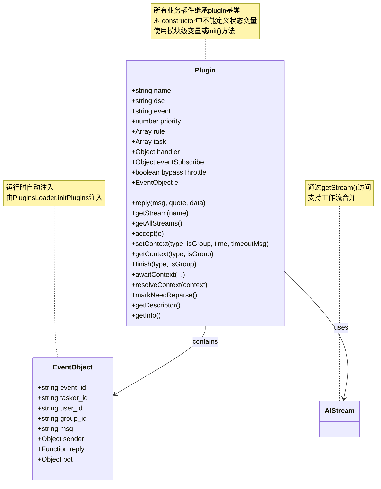
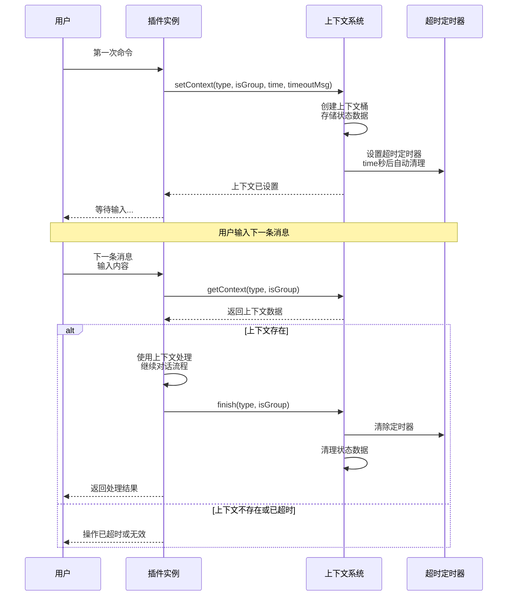

# 插件基类文档

> **文件位置**：`src/infrastructure/plugins/plugin.js`  
> **可扩展性**：插件系统是XRK-AGT的核心扩展点之一。通过继承`plugin`基类，开发者可以快速创建自定义插件，无需修改底层代码。详见 **[框架可扩展性指南](框架可扩展性指南.md)** ⭐

插件基类 `plugin` 定义了 XRK-AGT 插件系统的统一接口，所有业务插件都应继承此类。  
它提供 **规则匹配、定时任务、事件订阅、上下文管理、工作流集成与统一回复接口** 等能力。

### 核心特性

- ✅ **零配置扩展**：放置到任意 `core/*/plugin/` 目录即可自动加载
- ✅ **标准化接口**：统一的基类和接口规范
- ✅ **灵活规则匹配**：支持多种规则格式和优先级
- ✅ **跨平台事件**：支持通用事件和特定事件监听
- ✅ **工作流集成**：无缝调用AI工作流
- ✅ **热重载支持**：修改代码后自动重载

---

## 📚 目录

- [架构与业务层位置](#架构与业务层位置)
- [核心概念](#核心概念)
- [规则配置](#规则配置)
- [上下文管理](#上下文管理)
- [与 AI 工作流集成](#与-ai-工作流集成)
- [accept 方法（前置检查）](#accept-方法前置检查)
- [其他方法](#其他方法)
- [最佳实践](#最佳实践)
- [与其他系统的集成](#与其他系统的集成)
- [相关文档](#相关文档)

---

## 架构与业务层位置

在 XRK-AGT 的整体架构中，插件基类 `plugin` 是**插件业务层的最小单元**，与 `PluginsLoader` 一起构成了 system-Core 的主要业务承载层：

- **事件链路**（自下而上）：
  1. **Tasker 层**：不同协议的 Tasker（如 OneBotv11、Device、stdin）将平台消息转换成统一事件对象
  2. **事件监听层**：`core/*/events/*.js` 监听 `Bot.em`，去重并调用 `PluginsLoader.deal(e)`
  3. **插件业务层**：
     - `PluginsLoader` 扫描 `core/*/plugin/` 目录，批量加载所有插件类
     - 每个插件类继承 `plugin` 基类，通过 `rule/accept/task/eventSubscribe` 等定义业务行为
  4. **AI 工作流层**：插件通过 `getStream()` 调用 `AIStream` 工作流，实现 LLM + 工具调用
  5. **HTTP / Web 控制台**：仅作为业务入口和管理界面（不直接写业务逻辑）

- **职责边界**：
  - `plugin` 基类：定义**单个插件**的结构与能力（规则、上下文、工作流、统一回复）
  - `PluginsLoader`：负责**整体编排**（加载/排序/事件分发/定时任务/限流与统计）
  - 业务代码应优先写成「**插件 + 工作流**」，再由 HTTP/API / Web 控制台作为入口调用

> 更完整的业务层说明可参考：`docs/system-core.md` 中的“业务层与插件架构”章节。

---

## 核心概念

### 插件实例结构



### 标准化事件系统（与事件文档解耦）

插件通过 `event` 属性与**标准化事件系统**对接，不再在本篇重复描述事件命名/匹配的所有细节：

- **通用事件**：`event: 'message'/'notice'/'request'/'device'`，跨 Tasker 匹配所有来源
- **特定事件**：`event: 'onebot.message'`、`'device.message'` 等，仅匹配指定 Tasker
- **通配/前缀**：如 `onebot.message.*`、`onebot.*`，用于更精细或更宽泛的订阅（需谨慎）

> 标准命名规范、匹配优先级和字段责任边界请统一参考：`docs/事件系统标准化文档.md`。  
> 本文只聚焦**插件侧如何使用这些事件**，避免与事件系统文档产生冗余。

**运行时上下文**
  - `this.e`：当前事件对象，由 `PluginsLoader.initPlugins` 在运行时注入。
  - `this.reply(msg, quote?, data?)`：统一回复接口（支持所有tasker）。
  - `this.getStream(name)` / `this.getAllStreams()`：访问 AI 工作流。
  
**注意**：
- `this.e` 在插件方法执行时自动注入，无需手动设置
- `this.reply()` 优先使用 `e.reply`，如果没有则回退到 `bot.sendMsg`
- 工作流内部已经处理了回复发送，插件调用工作流后不需要再次调用 `reply()`

---

## 规则配置

**规则结构**：
- `reg` - 用于匹配 `e.msg` 的正则表达式（支持字符串、RegExp或对象）
- `fnc` - 当规则匹配时调用的插件方法名
- `event` - 可选的事件过滤配置（如 `message.group.normal`）
- `log` - 是否记录日志（默认 `true`）
- `permission` - 权限要求（如 `master/owner/admin`）

**规则格式支持**：
- 字符串：`'^#测试$'` → `{ reg: '^#测试$' }`
- RegExp：`/^#测试$/` → `{ reg: /^#测试$/ }`
- 对象：`{ reg: '^#测试$', fnc: 'test', permission: 'master' }`

**插件方法返回值**：
- `false` - 未处理，继续后续插件
- 其他值/无返回 - 已处理，阻止同优先级后续规则

---

## 上下文管理

`plugin` 内置轻量级上下文管理机制，适合多轮对话场景。



**核心方法**：

| 方法 | 说明 |
|------|------|
| `setContext(type, isGroup, time, timeoutMsg)` | 写入上下文，支持超时自动处理 |
| `getContext(type?, isGroup)` | 获取上下文，不传type时返回所有键值对 |
| `finish(type, isGroup)` | 主动结束上下文，清理定时器和状态 |
| `awaitContext(...args)` | Promise风格的等待 |
| `resolveContext(context)` | 解析上下文并执行resolve |

**典型用法**：
```javascript
async firstCommand(e) {
  // 设置上下文，等待下一条消息
  this.setContext('waitingInput', false, 120, '操作超时已取消');
  await this.reply('请输入内容：');
}

async secondCommand(e) {
  // 获取上下文，继续处理
  const context = this.getContext('waitingInput');
  if (context) {
    // 使用上下文处理
    await this.reply(`收到：${e.msg}`);
    this.finish('waitingInput'); // 清理上下文
  }
}
```

---

## 与 AI 工作流集成

**核心方法**：
- `getStream(name)` - 获取指定名称的工作流实例（返回 `AIStream` 或 `null`）
- `getAllStreams()` - 获取所有已加载的工作流（返回 `AIStream[]`）

**使用示例**：
```javascript
async test(e) {
  const chatStream = this.getStream('chat');
  if (!chatStream) {
    await this.reply('工作流未加载');
    return;
  }
  
  try {
    // 调用工作流（推荐使用 process 方法）
    await chatStream.process(e, e.msg, {
      enableMemory: true,      // 整合记忆工具工作流
      enableDatabase: true,    // 整合知识库工具工作流
      enableTools: true        // 整合文件操作工具工作流
    });
    // 注意：工作流内部已经发送了回复，不需要再次调用 reply()
  } catch (error) {
    await this.reply(`工作流执行失败: ${error.message}`);
  }
}

// 合并主工作流 + 整合工具工作流
async complexTask(e) {
  const chatStream = this.getStream('chat');
  if (!chatStream) return;
  
  await chatStream.process(e, e.msg, {
    mergeStreams: ['desktop'],  // 合并主工作流（chat + desktop）
    enableMemory: true,          // 整合记忆工具工作流
    enableDatabase: true,        // 整合知识库工具工作流
    enableTools: true           // 整合文件操作工具工作流
  });
  
  // 复杂多步任务请使用 Python 子服务端（LangChain/LangGraph）
}
```

> **注意**：工作流内部已处理回复发送，插件不需要再次调用 `reply()`。

---

## accept 方法（前置检查）

插件可以通过重写 `accept` 方法实现自定义前置检查逻辑。

**返回值**：
- `true` - 通过检查，继续处理
- `false` - 拒绝处理，跳过当前插件
- `'return'` - 停止处理，不再执行后续插件

**Tasker增强插件示例**：
```javascript
export default class OneBotEnhancer extends plugin {
  constructor() {
    super({
      name: 'OneBot事件增强',
      event: 'onebot.*',
      priority: 1,  // 最高优先级，确保最先执行
      rule: []
    });
  }

  async accept(e) {
    // 跳过非OneBot事件
    if (e.isDevice || e.isStdin) return true;
    if (!(e.isOneBot || e.tasker === 'onebot')) return true;

    // 挂载OneBot特定属性
    e.isOneBot = true;
    e.isPrivate = e.message_type === 'private';
    e.isGroup = e.message_type === 'group';
    
    // 挂载对象（使用getter延迟加载）
    if (e.user_id && e.bot.pickFriend) {
      Object.defineProperty(e, "friend", {
        get() { return e.bot.pickFriend(e.user_id) },
        configurable: true
      });
    }

    return true;  // 继续处理后续插件
  }
}
```

**自定义前置检查示例**：
```javascript
export default class MyPlugin extends plugin {
  async accept(e) {
    // 只允许特定用户
    const allowedUsers = [123456, 789012];
    if (!allowedUsers.includes(e.user_id)) {
      return false;  // 拒绝处理
    }
    return true;  // 通过检查
  }
}
```

---

## 其他方法

- `getDescriptor()` / `getInfo()` - 返回插件结构化描述（用于加载器统计和管理）
- `markNeedReparse()` - 标记需要重新解析消息

---

## 最佳实践

### 1. 状态变量管理（重要）

**⚠️ 重要**：插件的 `constructor` 会在每次热重载时重新执行，因此**不能在 constructor 中定义状态变量**。

**正确做法**：

```javascript
// ✅ 正确方式1：使用模块级变量（推荐用于配置类变量）
let config = {
  path: './data/my-data.json',
  maxRetries: 3
};

export default class MyPlugin extends plugin {
  constructor() {
    super({
      name: 'my-plugin',
      rule: [{ reg: '^#测试$', fnc: 'test' }]
    });
    // 不要在这里定义 this.state = {}
  }

  async test(e) {
    // 使用模块级变量
    const data = await readFile(config.path);
  }
}

// ✅ 正确方式2：在 init() 方法中初始化状态
export default class MyPlugin extends plugin {
  constructor() {
    super({
      name: 'my-plugin',
      rule: [{ reg: '^#测试$', fnc: 'test' }]
    });
    // 不要在这里定义 this.state = {}
  }

  async init() {
    // 在 init() 中初始化状态变量
    this.state = {
      counter: 0,
      lastUpdate: Date.now()
    };
  }

  async test(e) {
    this.state.counter++;
    await this.reply(`计数: ${this.state.counter}`);
  }
}

// ✅ 正确方式3：使用方法内局部变量（适合临时状态）
export default class MyPlugin extends plugin {
  async test(e) {
    // 使用局部变量
    const localState = {
      startTime: Date.now(),
      processed: false
    };
    
    // 处理逻辑...
  }
}

// ❌ 错误：在 constructor 中定义状态变量
export default class MyPlugin extends plugin {
  constructor() {
    super({...});
    this.state = {};        // ❌ 会被热重载刷新
    this.counter = 0;       // ❌ 会被热重载刷新
    this.path = './data';   // ❌ 会被热重载刷新
  }
}
```

**原因**：插件热重载时会重新执行 `constructor`，导致状态丢失。使用模块级变量或 `init()` 方法可以避免这个问题。

### 2. 命名与日志

- 设置有意义的 `name` 与 `dsc`，便于调试和管理
- 高频触发的规则可将 `log` 设为 `false`，减少日志输出

### 3. 优先级设置

- Tasker增强插件使用 `priority: 1`，确保最先执行
- 核心插件使用 `5000` 以上
- 普通插件使用默认优先级 `5000`

### 4. accept方法

- Tasker增强插件在 `accept` 中挂载属性，使用 getter 延迟加载
- 尽早返回，减少无效规则遍历

### 5. 上下文管理

- 多轮对话时务必调用 `finish` 清理上下文，避免长期占用
- 设置合理的超时时间，避免上下文泄漏

### 6. 错误处理

- 调用工作流时使用 try-catch，提供友好错误提示
- 异步操作都要有错误处理

### 7. 依赖管理

- 使用 `#` 别名导入，避免相对路径混乱
- 删除未使用的导入，减少依赖体积
- 优先使用原生方法，减少第三方依赖

---

## 与其他系统的集成

- **事件对象 `e`**：插件通过 `e` 与系统交互
  - `e.bot` - 当前子 Bot 实例
  - `e.tasker` - 事件来源（`onebot/device/stdin`）
  - `e.reply` - 统一回复接口
- **访问其他能力**：
  - 全局 `Bot` - 访问子 Bot、调用 HTTP API、使用渲染器
  - 全局 `redis` - 存储跨会话状态和统计信息
  - `ConfigBase` - 通过 HTTP API 间接读写配置（不建议直接 import）

> **总结**：插件站在「事件中心」，向下通过 `e.bot/Bot` 访问Tasker、HTTP、渲染与 Redis，向上只暴露规则和行为。业务层优先实现为插件 + 工作流，HTTP 仅作为「入口和管理界面」。

---

## 相关文档

- **[插件加载器](plugins-loader.md)** - 插件自动加载和热重载机制
- **[AIStream 文档](aistream.md)** - Node 侧单次对话 + MCP 工具调用（复杂多步在 Python 子服务端）
- **[框架可扩展性指南](框架可扩展性指南.md)** - 扩展开发完整指南

---

*最后更新：2026-02-12*
