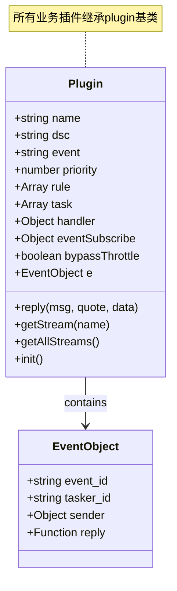
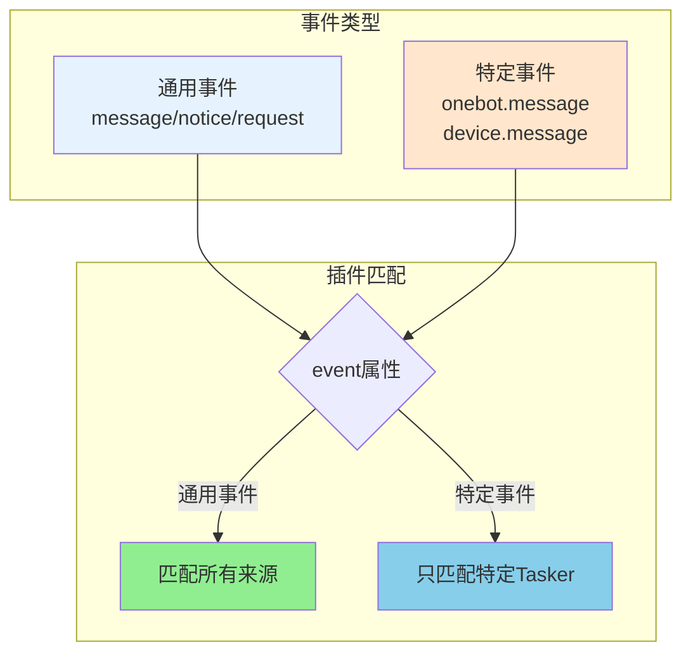
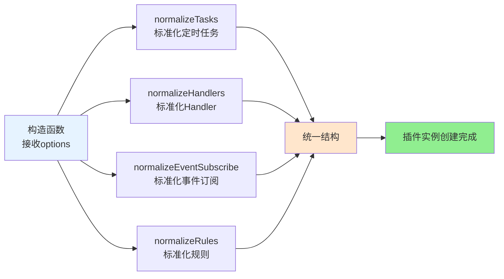
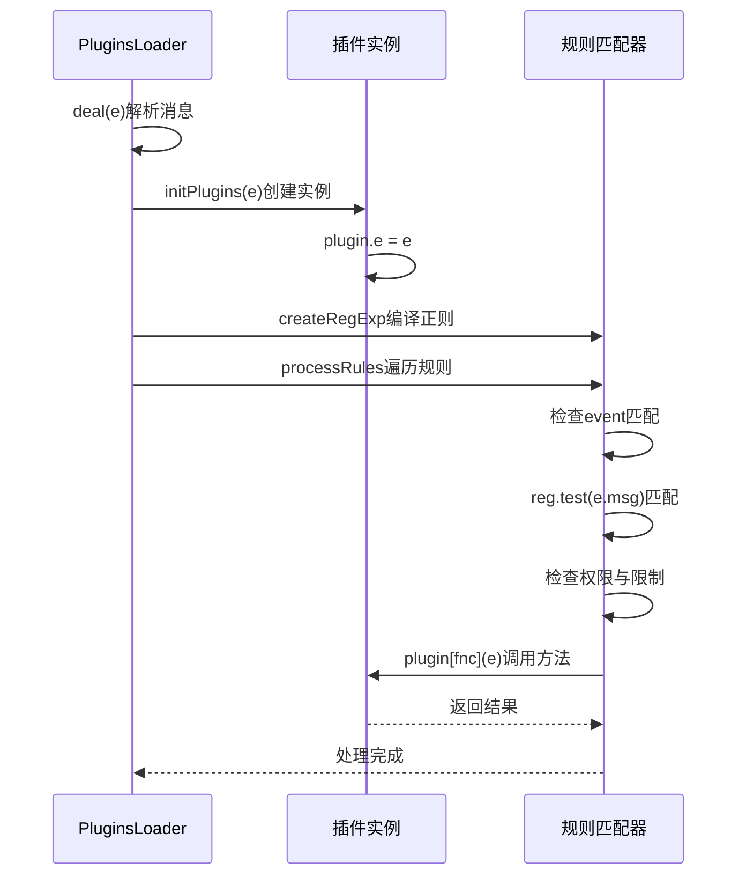
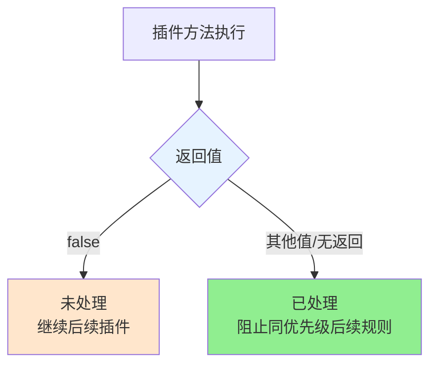
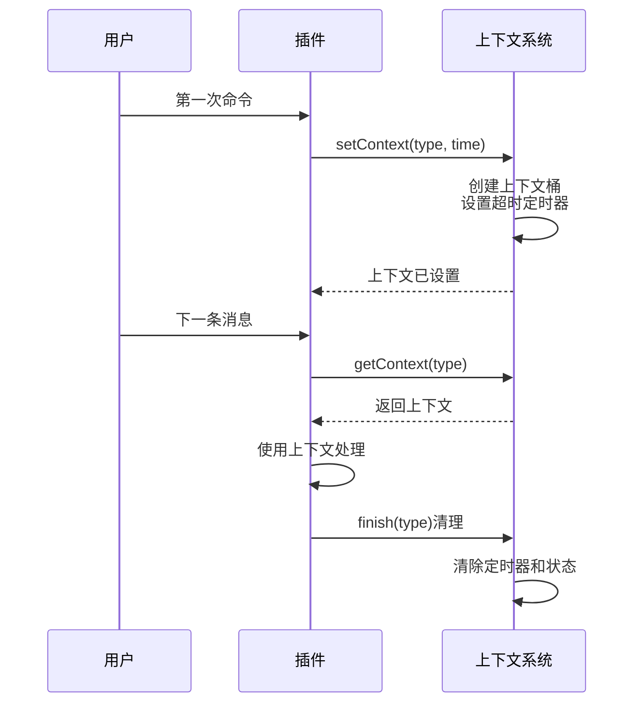
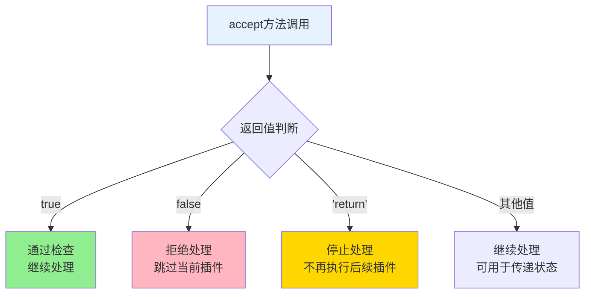
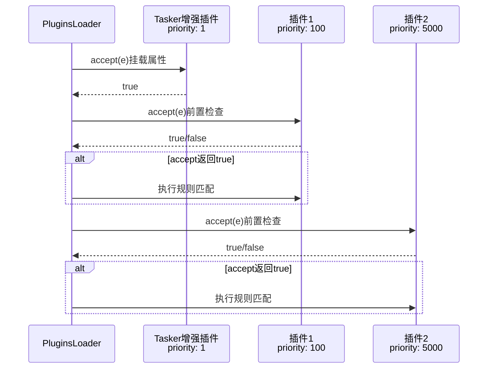

## 插件基类文档（src/infrastructure/plugins/plugin.js）

> **可扩展性**：插件系统是XRK-AGT的核心扩展点之一。通过继承`plugin`基类，开发者可以快速创建自定义插件，无需修改底层代码。详见 **[框架可扩展性指南](框架可扩展性指南.md)** ⭐

插件基类 `plugin` 定义了 XRK-AGT 插件系统的统一接口，所有业务插件都应继承此类。  
它提供 **规则匹配、定时任务、事件订阅、上下文管理、工作流集成与统一回复接口** 等能力。

### 扩展特性

- ✅ **零配置扩展**：放置到任意 `core/*/plugin/` 目录即可自动加载
- ✅ **标准化接口**：统一的基类和接口规范
- ✅ **灵活规则匹配**：支持多种规则格式和优先级
- ✅ **跨平台事件**：支持通用事件和特定事件监听
- ✅ **工作流集成**：无缝调用AI工作流
- ✅ **热重载支持**：修改代码后自动重载

---

## 核心概念

### 插件实例结构



### 标准化事件系统

插件可以通过 `event` 属性监听不同类型的事件：



**通用事件监听（匹配所有来源）：**
- `event: 'message'` - 匹配所有来源的 message 事件（OneBot、设备等）
- `event: 'notice'` - 匹配所有来源的 notice 事件
- `event: 'request'` - 匹配所有来源的 request 事件
- `event: 'device'` - 匹配所有设备事件

**特定事件监听（只匹配特定来源）：**
- `event: 'onebot.message'` - 只匹配 OneBot Tasker 的 message 事件
- `event: 'device.message'` - 只匹配设备的 message 事件
- `event: 'onebot.notice.group_increase'` - 只匹配 OneBot 的群成员增加通知

**示例：**

```javascript
// 监听所有来源的消息
export default class MyPlugin extends plugin {
  constructor() {
    super({
      name: 'my-plugin',
      event: 'message',  // 匹配所有 message 事件
      rule: [{ reg: '^#测试$', fnc: 'test' }]
    });
  }
}

// 只监听 OneBot 的消息
export default class OneBotPlugin extends plugin {
  constructor() {
    super({
      name: 'onebot-plugin',
      event: 'onebot.message',  // 只匹配 OneBot 的 message 事件
      rule: [{ reg: '^#onebot$', fnc: 'handle' }]
    });
  }
}

// 只监听设备的消息
export default class DevicePlugin extends plugin {
  constructor() {
    super({
      name: 'device-plugin',
      event: 'device.message',  // 只匹配设备的 message 事件
      rule: [{ reg: '.*', fnc: 'handle' }]
    });
  }
}
```

- **运行时上下文**
  - `this.e`：当前事件对象，由 `PluginsLoader.initPlugins` 在运行时注入。
  - `this.reply(msg, quote?, data?)`：统一回复接口（支持所有tasker）。
  - `this.getStream(name)` / `this.getAllStreams()`：访问 AI 工作流。
  
**注意**：
- `this.e` 在插件方法执行时自动注入，无需手动设置
- `this.reply()` 优先使用 `e.reply`，如果没有则回退到 `bot.sendMsg`
- 工作流内部已经处理了回复发送，插件调用工作流后不需要再次调用 `reply()`

---

## 构造函数与标准化

构造函数接收一个 `options` 对象，并通过一系列标准化函数处理：



**标准化函数说明**：

- `normalizeTasks(options.task)`  
  - 支持单个对象或数组。
  - 统一为 `{ name, cron, fnc, log, timezone, immediate }` 结构。
  - 仅保留 `cron` 与 `fnc` 均存在的任务。

- `normalizeHandlers(options.handler)`  
  - 支持字符串、函数或对象三种形式：
    - 字符串：视为 `key` 与 `fnc` 同名。
    - 函数：使用函数名作为 `key` 与 `fnc`。
    - 对象：支持 `{ key, fnc, priority, once }`。

- `normalizeEventSubscribe(options.eventSubscribe)`  
  - 支持数组或映射：
    - 数组形式：`{ eventType, handler | fnc }`。
    - 键值映射：`{ 'message.group.normal': handler }`。

- `normalizeRules(options.rule)`  
  - 支持字符串 / RegExp / 对象：
    - 字符串或正则：自动转换为 `{ reg }`。
    - 对象：统一为 `{ reg, fnc, ... }`，其中 `reg` 可从 `pattern/source/match` 派生。

> 插件开发者只需要提供「语义友好」的配置，基类会负责转换为加载器可以理解的标准形态。

---

## 规则与事件处理

**规则处理流程**:



**规则结构（标准化后）**：
- `reg`：用于匹配 `e.msg` 的正则表达式
- `fnc`：当规则匹配时调用的插件方法名
- `event`：可选的事件过滤配置（如 `message.group.normal`）
- `log`：是否记录日志（默认 `true`）
- `permission`：权限要求（如 `master/owner/admin`）

**插件方法返回值约定**：



---

## 上下文管理（多轮对话与状态）

`plugin` 内置一套轻量级上下文管理机制，适合做「等待下一条消息继续操作」这种交互。

**上下文管理流程**:



**核心方法**：

- `conKey(isGroup = false)` - 根据 `插件名 + self_id + user_id/group_id` 生成上下文桶的 key
- `setContext(type, isGroup, time, timeoutMsg)` - 写入上下文，支持超时自动处理
- `getContext(type?, isGroup)` - 获取上下文，不传type时返回所有键值对
- `finish(type, isGroup)` - 主动结束上下文，清理定时器与resolve
- `awaitContext(...args)` - Promise风格的等待，内部使用setContext("resolveContext")
- `resolveContext(context)` - 读取resolveContext，执行resolve并调用finish

> **典型用法**：第一次命令设置上下文，下一条消息自动进入对应处理函数，实现多轮输入

---

## 与 AI 工作流集成

插件可以通过 `getStream(name)` 和 `getAllStreams()` 方法访问工作流系统：

### 核心方法

- `getStream(name)` - 获取指定名称的工作流实例
  - 通过 `StreamLoader.getStream(name)` 获取
  - 返回 `AIStream` 实例或 `null`
  
- `getAllStreams()` - 获取所有已加载的工作流
  - 通过 `StreamLoader.getAllStreams()` 获取
  - 返回 `AIStream[]` 数组

### 使用示例

```javascript
// 在插件方法中调用工作流
async test(e) {
  // 获取工作流
  const chatStream = this.getStream('chat');
  if (!chatStream) {
    await this.reply('工作流未加载');
    return;
  }
  
  // 调用工作流（推荐使用 process 方法）
  try {
    const response = await chatStream.process(e, e.msg, {
      enableMemory: true,      // 启用记忆系统
      enableDatabase: true,   // 启用知识库
      enableTodo: false       // 是否启用TODO工作流
    });
    
    // 注意：工作流内部已经发送了回复，这里不需要再次发送
    // response 是AI的回复文本，可用于日志记录等
  } catch (error) {
    await this.reply(`工作流执行失败: ${error.message}`);
  }
}

// 合并多个工作流
async complexTask(e) {
  const desktopStream = this.getStream('desktop');
  if (!desktopStream) return;
  
  await desktopStream.process(e, e.msg, {
    mergeStreams: ['tools'],  // 合并tools工作流
    enableTodo: true,         // 启用TODO智能决策
    enableMemory: true,       // 启用记忆系统
    enableDatabase: true      // 启用知识库
  });
}
```

### 最佳实践

1. **错误处理**：始终使用 try-catch 包裹工作流调用，提供友好错误提示
2. **工作流选择**：根据业务需求选择合适的工作流（chat、desktop、device等）
3. **参数配置**：合理使用 `enableMemory`、`enableDatabase`、`enableTodo` 等选项
4. **回复机制**：工作流内部已经发送了回复，插件不需要再次调用 `reply()`
5. **异步处理**：工作流调用是异步的，确保使用 `await` 等待完成

> **注意**：工作流内部已经处理了回复发送，插件不需要再次调用 `reply()`。如果工作流返回了结果，可以用于日志记录、状态更新等用途。

---

## 插件描述导出：`getDescriptor()`

`getDescriptor()` 用于向加载器暴露插件「结构化描述」，包括：

- 基本信息：`name/dsc/event/priority/namespace/bypassThrottle`。
- 规则：`normalizeRules(this.rule)`。
- 任务：`normalizeTasks(this.task)`。
- Handler：`normalizeHandlers(this.handler)`。
- 事件订阅：`normalizeEventSubscribe(this.eventSubscribe)`。

`PluginsLoader` 在加载与调试时可以使用这些描述做统计、可视化或管理控制台展示。

---

## accept 方法（前置检查）

插件可以通过重写 `accept` 方法来实现自定义的前置检查逻辑。这是插件系统的核心机制之一。

### 默认实现

插件基类提供了默认的 `accept` 方法，默认返回 `true`（所有事件都通过）。

### Tasker增强插件模式

Tasker增强插件使用 `accept` 方法来处理Tasker特定的属性挂载：

```javascript
// OneBotEnhancer 示例
export default class OneBotEnhancer extends plugin {
  constructor() {
    super({
      name: 'OneBot事件增强',
      event: 'onebot.*',  // 监听所有OneBot事件
      priority: 1,       // 最高优先级，确保最先执行
      rule: []
    })
  }

  async accept(e) {
    // 跳过非OneBot事件
    if (e.isDevice || e.isStdin) return true
    if (!(e.isOneBot || e.tasker === 'onebot')) return true

    // 挂载OneBot特定属性
    e.isOneBot = true
    e.isPrivate = e.message_type === 'private'
    e.isGroup = e.message_type === 'group'
    
    // 挂载对象（使用getter延迟加载）
    if (e.user_id && e.bot.pickFriend) {
      Object.defineProperty(e, "friend", {
        get() { return e.bot.pickFriend(e.user_id) },
        configurable: true
      })
    }
    
    // 处理@相关属性
    this.processAtProperties(e)

    return true  // 继续处理后续插件
  }
}
```

### 自定义前置检查

插件也可以使用 `accept` 方法实现黑白名单、权限检查等：

```javascript
export default class MyPlugin extends plugin {
  async accept(e) {
    // 自定义检查：只允许特定用户
    const allowedUsers = [123456, 789012]
    if (!allowedUsers.includes(e.user_id)) {
      return false  // 拒绝处理
    }

    return true  // 通过检查
  }
}
```

### accept 方法返回值



### 执行顺序



## 开发建议与最佳实践

- **命名与日志**
  - 为插件设置有意义的 `name` 与 `dsc`，便于在日志与管理界面中识别。
  - 对于高频触发的规则，可将 `rule.log` 设为 `false`，避免刷屏。

- **优先级与节流**
  - Tasker增强插件应使用 `priority: 1`，确保最先执行。
  - 与核心系统插件（如别名处理、调度插件）共存时，建议使用较大的 `priority`（例如 `5000` 以上）。
  - 对需要绕过全局冷却与只对少数命令生效的插件，可以将 `bypassThrottle` 设为 `true`，并结合严格的 `reg` 与 `permission`。

- **accept 方法使用**
  - Tasker增强插件应在 `accept` 中挂载Tasker特定属性，而不是在规则方法中。
  - 使用 `accept` 进行前置检查时，应尽早返回，避免不必要的处理。
  - Tasker特定属性（如 `friend`、`group`、`member`）应使用 getter 延迟加载。

- **上下文使用**
  - 多轮对话时，请务必在流程结束或异常时调用 `finish` 清理上下文，避免长期占用。
  - 对超时提示文案可自定义，以符合具体业务交互风格。

- **AI 与外部接口**
  - 调用 `AIStream` 时注意捕获异常，对用户展示友好错误信息。
  - 避免在规则方法中做长时间阻塞操作（可拆分为异步步骤与回调事件）。
  
---

## 与 Bot / HTTP / 辅助层的有机联系

- **事件入口**：插件永远通过事件对象 `e` 与系统交互：
  - `e.bot`：当前账号/设备/STDIN 对应的子 Bot（由监听器 + Tasker增强插件挂载）。
  - `e.tasker`：事件来源（`onebot/device/stdin/...`）。
  - `e.reply`：统一回复接口，内部基于 `e.bot` 与对应Tasker的 `sendMsg` 实现。
- **访问 HTTP/配置/渲染等业务能力**：
  - 通过全局 `Bot`：
    - 访问子 Bot：`Bot[e.self_id]` / `Bot[e.device_id]`。
    - 调用 HTTP API：`await Bot.callRoute('/api/xxx', {...})`，让插件与 HTTP 复用相同业务能力。
    - 使用渲染器：`Bot.renderer?.puppeteer` 生成图片后通过 `e.reply` 发送。
  - 通过全局 `redis`：
    - 存储跨会话状态、统计信息或长生命周期数据。
  - 通过 `ConfigBase` 子类暴露的 HTTP 接口，插件也可以间接读写配置（不建议直接 import 配置类，优先复用 HTTP API）。

> 总结：插件站在「事件中心」，向下通过 `e.bot/Bot` 访问Tasker、HTTP、渲染与 Redis，向上只暴露规则和行为。业务层优先实现为插件 + 工作流，HTTP 仅作为「入口和管理界面」，保持一套逻辑可复用在不同入口（群聊、设备、Web 控制台、STDIN）。
