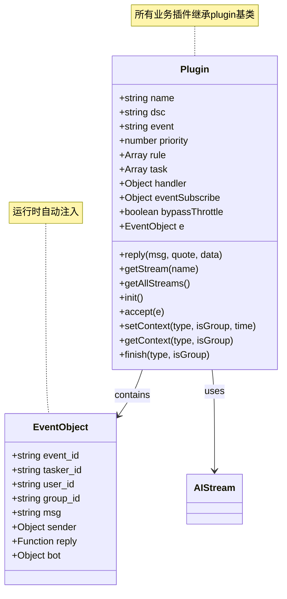
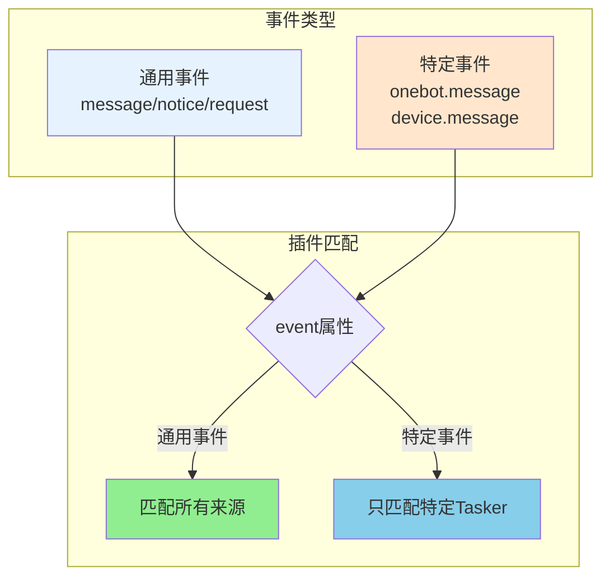
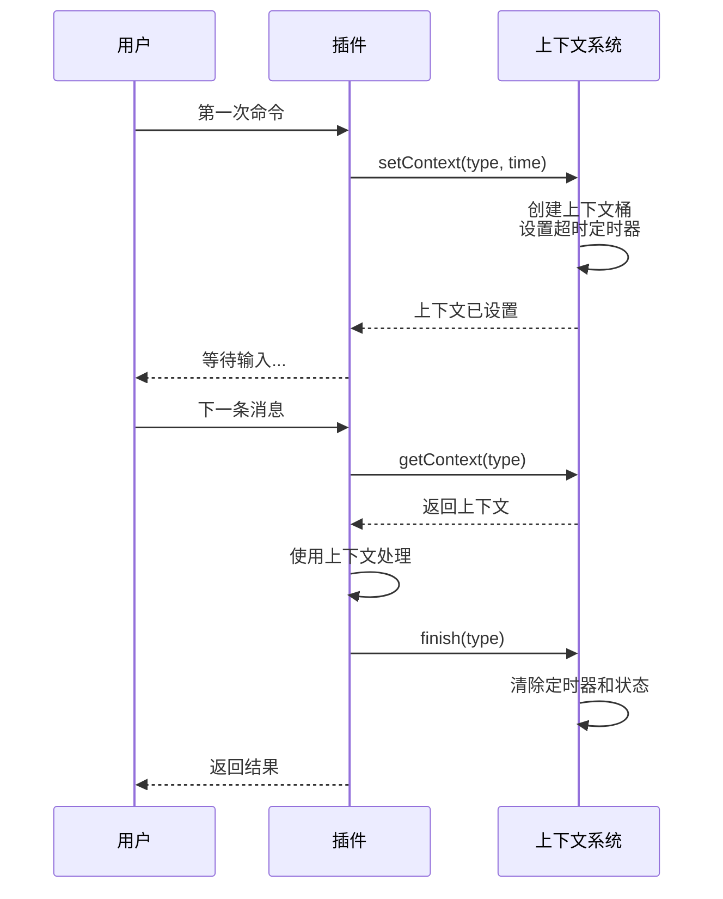

## 插件基类文档（src/infrastructure/plugins/plugin.js）

> **可扩展性**：插件系统是XRK-AGT的核心扩展点之一。通过继承`plugin`基类，开发者可以快速创建自定义插件，无需修改底层代码。详见 **[框架可扩展性指南](框架可扩展性指南.md)** ⭐

插件基类 `plugin` 定义了 XRK-AGT 插件系统的统一接口，所有业务插件都应继承此类。  
它提供 **规则匹配、定时任务、事件订阅、上下文管理、工作流集成与统一回复接口** 等能力。

### 扩展特性

- ✅ **零配置扩展**：放置到任意 `core/*/plugin/` 目录即可自动加载
- ✅ **标准化接口**：统一的基类和接口规范
- ✅ **灵活规则匹配**：支持多种规则格式和优先级
- ✅ **跨平台事件**：支持通用事件和特定事件监听
- ✅ **工作流集成**：无缝调用AI工作流
- ✅ **热重载支持**：修改代码后自动重载

---

## 核心概念

### 插件实例结构



### 标准化事件系统

插件可以通过 `event` 属性监听不同类型的事件：



**通用事件监听（匹配所有来源）：**
- `event: 'message'` - 匹配所有来源的 message 事件（OneBot、设备等）
- `event: 'notice'` - 匹配所有来源的 notice 事件
- `event: 'request'` - 匹配所有来源的 request 事件
- `event: 'device'` - 匹配所有设备事件

**特定事件监听（只匹配特定来源）：**
- `event: 'onebot.message'` - 只匹配 OneBot Tasker 的 message 事件
- `event: 'device.message'` - 只匹配设备的 message 事件
- `event: 'onebot.notice.group_increase'` - 只匹配 OneBot 的群成员增加通知

**示例：**

```javascript
// 监听所有来源的消息
export default class MyPlugin extends plugin {
  constructor() {
    super({
      name: 'my-plugin',
      event: 'message',  // 匹配所有 message 事件
      rule: [{ reg: '^#测试$', fnc: 'test' }]
    });
  }
}

// 只监听 OneBot 的消息
export default class OneBotPlugin extends plugin {
  constructor() {
    super({
      name: 'onebot-plugin',
      event: 'onebot.message',  // 只匹配 OneBot 的 message 事件
      rule: [{ reg: '^#onebot$', fnc: 'handle' }]
    });
  }
}

// 只监听设备的消息
export default class DevicePlugin extends plugin {
  constructor() {
    super({
      name: 'device-plugin',
      event: 'device.message',  // 只匹配设备的 message 事件
      rule: [{ reg: '.*', fnc: 'handle' }]
    });
  }
}
```

- **运行时上下文**
  - `this.e`：当前事件对象，由 `PluginsLoader.initPlugins` 在运行时注入。
  - `this.reply(msg, quote?, data?)`：统一回复接口（支持所有tasker）。
  - `this.getStream(name)` / `this.getAllStreams()`：访问 AI 工作流。
  
**注意**：
- `this.e` 在插件方法执行时自动注入，无需手动设置
- `this.reply()` 优先使用 `e.reply`，如果没有则回退到 `bot.sendMsg`
- 工作流内部已经处理了回复发送，插件调用工作流后不需要再次调用 `reply()`

---

## 规则配置

**规则结构**：
- `reg` - 用于匹配 `e.msg` 的正则表达式（支持字符串、RegExp或对象）
- `fnc` - 当规则匹配时调用的插件方法名
- `event` - 可选的事件过滤配置（如 `message.group.normal`）
- `log` - 是否记录日志（默认 `true`）
- `permission` - 权限要求（如 `master/owner/admin`）

**规则格式支持**：
- 字符串：`'^#测试$'` → `{ reg: '^#测试$' }`
- RegExp：`/^#测试$/` → `{ reg: /^#测试$/ }`
- 对象：`{ reg: '^#测试$', fnc: 'test', permission: 'master' }`

**插件方法返回值**：
- `false` - 未处理，继续后续插件
- 其他值/无返回 - 已处理，阻止同优先级后续规则

---

## 上下文管理

`plugin` 内置轻量级上下文管理机制，适合多轮对话场景。



**核心方法**：

| 方法 | 说明 |
|------|------|
| `setContext(type, isGroup, time, timeoutMsg)` | 写入上下文，支持超时自动处理 |
| `getContext(type?, isGroup)` | 获取上下文，不传type时返回所有键值对 |
| `finish(type, isGroup)` | 主动结束上下文，清理定时器和状态 |
| `awaitContext(...args)` | Promise风格的等待 |
| `resolveContext(context)` | 解析上下文并执行resolve |

**典型用法**：
```javascript
async firstCommand(e) {
  // 设置上下文，等待下一条消息
  this.setContext('waitingInput', false, 120, '操作超时已取消');
  await this.reply('请输入内容：');
}

async secondCommand(e) {
  // 获取上下文，继续处理
  const context = this.getContext('waitingInput');
  if (context) {
    // 使用上下文处理
    await this.reply(`收到：${e.msg}`);
    this.finish('waitingInput'); // 清理上下文
  }
}
```

---

## 与 AI 工作流集成

**核心方法**：
- `getStream(name)` - 获取指定名称的工作流实例（返回 `AIStream` 或 `null`）
- `getAllStreams()` - 获取所有已加载的工作流（返回 `AIStream[]`）

**使用示例**：
```javascript
async test(e) {
  const chatStream = this.getStream('chat');
  if (!chatStream) {
    await this.reply('工作流未加载');
    return;
  }
  
  try {
    // 调用工作流（推荐使用 process 方法）
    await chatStream.process(e, e.msg, {
      enableMemory: true,      // 启用记忆系统
      enableDatabase: true,   // 启用知识库
      enableTodo: false       // 是否启用TODO工作流
    });
    // 注意：工作流内部已经发送了回复，不需要再次调用 reply()
  } catch (error) {
    await this.reply(`工作流执行失败: ${error.message}`);
  }
}

// 合并多个工作流
async complexTask(e) {
  const desktopStream = this.getStream('desktop');
  if (!desktopStream) return;
  
  await desktopStream.process(e, e.msg, {
    mergeStreams: ['tools'],  // 合并tools工作流
    enableTodo: true,         // 启用TODO智能决策
    enableMemory: true,       // 启用记忆系统
    enableDatabase: true      // 启用知识库
  });
}
```

> **注意**：工作流内部已处理回复发送，插件不需要再次调用 `reply()`。

---

## accept 方法（前置检查）

插件可以通过重写 `accept` 方法实现自定义前置检查逻辑。

**返回值**：
- `true` - 通过检查，继续处理
- `false` - 拒绝处理，跳过当前插件
- `'return'` - 停止处理，不再执行后续插件

**Tasker增强插件示例**：
```javascript
export default class OneBotEnhancer extends plugin {
  constructor() {
    super({
      name: 'OneBot事件增强',
      event: 'onebot.*',
      priority: 1,  // 最高优先级，确保最先执行
      rule: []
    });
  }

  async accept(e) {
    // 跳过非OneBot事件
    if (e.isDevice || e.isStdin) return true;
    if (!(e.isOneBot || e.tasker === 'onebot')) return true;

    // 挂载OneBot特定属性
    e.isOneBot = true;
    e.isPrivate = e.message_type === 'private';
    e.isGroup = e.message_type === 'group';
    
    // 挂载对象（使用getter延迟加载）
    if (e.user_id && e.bot.pickFriend) {
      Object.defineProperty(e, "friend", {
        get() { return e.bot.pickFriend(e.user_id) },
        configurable: true
      });
    }

    return true;  // 继续处理后续插件
  }
}
```

**自定义前置检查示例**：
```javascript
export default class MyPlugin extends plugin {
  async accept(e) {
    // 只允许特定用户
    const allowedUsers = [123456, 789012];
    if (!allowedUsers.includes(e.user_id)) {
      return false;  // 拒绝处理
    }
    return true;  // 通过检查
  }
}
```

---

## 其他方法

- `getDescriptor()` / `getInfo()` - 返回插件结构化描述（用于加载器统计和管理）
- `markNeedReparse()` - 标记需要重新解析消息

---

## 最佳实践

1. **命名与日志**：设置有意义的 `name` 与 `dsc`，高频触发的规则可将 `log` 设为 `false`
2. **优先级**：Tasker增强插件使用 `priority: 1`，核心插件使用 `5000` 以上
3. **accept方法**：Tasker增强插件在 `accept` 中挂载属性，使用 getter 延迟加载
4. **上下文管理**：多轮对话时务必调用 `finish` 清理上下文，避免长期占用
5. **错误处理**：调用工作流时使用 try-catch，提供友好错误提示

---

## 与其他系统的集成

- **事件对象 `e`**：插件通过 `e` 与系统交互
  - `e.bot` - 当前子 Bot 实例
  - `e.tasker` - 事件来源（`onebot/device/stdin`）
  - `e.reply` - 统一回复接口
- **访问其他能力**：
  - 全局 `Bot` - 访问子 Bot、调用 HTTP API、使用渲染器
  - 全局 `redis` - 存储跨会话状态和统计信息
  - `ConfigBase` - 通过 HTTP API 间接读写配置（不建议直接 import）

> **总结**：插件站在「事件中心」，向下通过 `e.bot/Bot` 访问Tasker、HTTP、渲染与 Redis，向上只暴露规则和行为。业务层优先实现为插件 + 工作流，HTTP 仅作为「入口和管理界面」。

---

## 相关文档

- **[插件加载器](plugins-loader.md)** - 插件自动加载和热重载机制
- **[工作流系统完整文档](工作流系统完整文档.md)** - AI工作流详细文档
- **[框架可扩展性指南](框架可扩展性指南.md)** - 扩展开发完整指南
