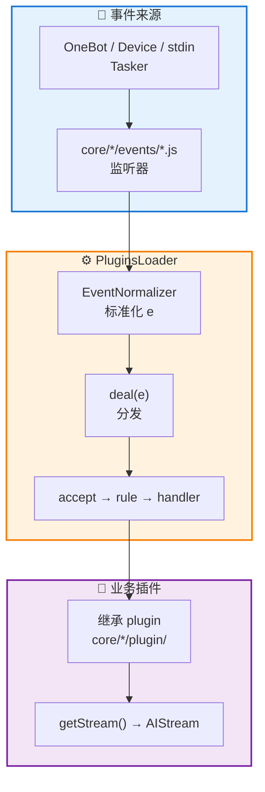
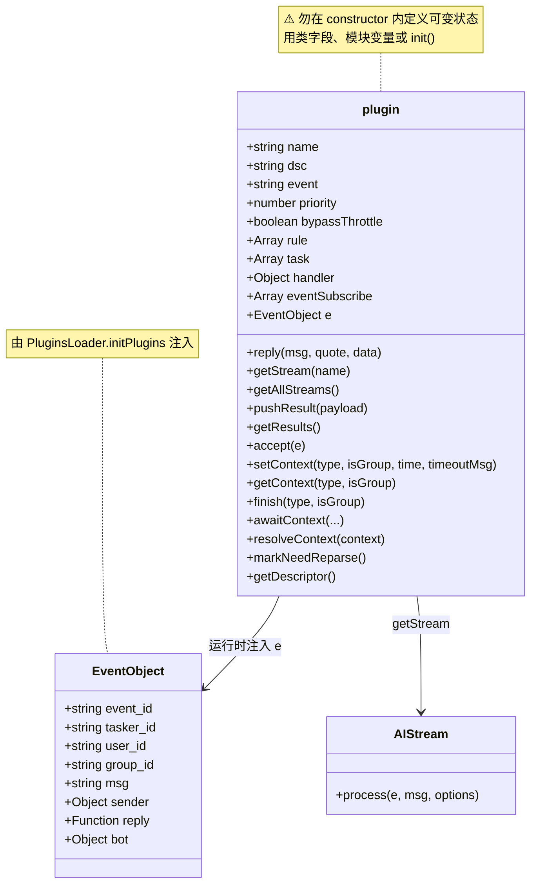
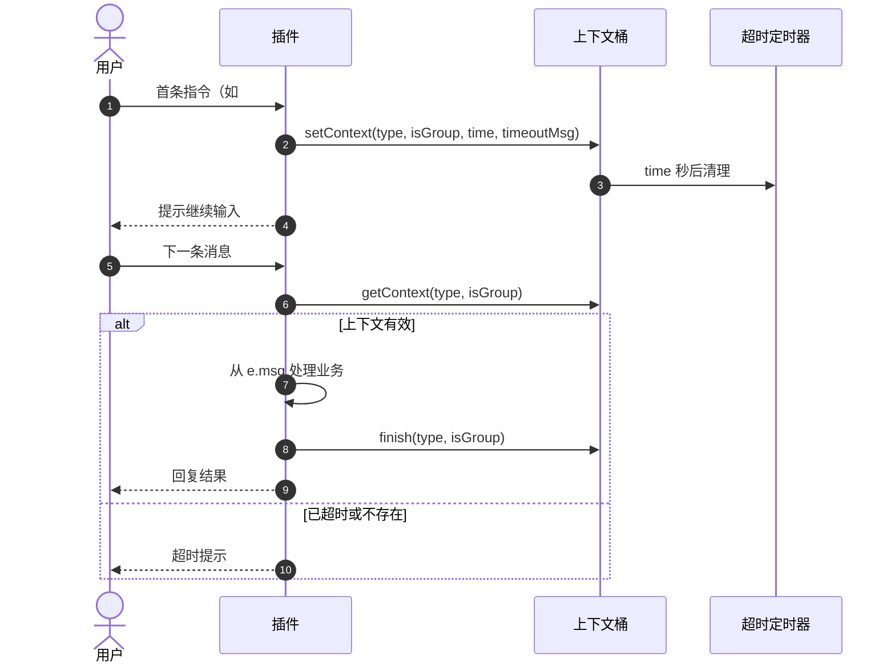

# 插件基类文档

| 项 | 说明 |
|----|------|
| **源码** | `src/infrastructure/plugins/plugin.js` |
| **加载器** | `src/infrastructure/plugins/loader.js` → [plugins-loader.md](plugins-loader.md) |
| **放置位置** | `core/<core名>/plugin/*.js`（自动扫描，零配置） |
| **扩展总览** | [框架可扩展性指南](框架可扩展性指南.md) |

`plugin` 是 XRK-AGT 插件系统的统一基类：规则匹配、定时任务、事件订阅、多轮上下文、工作流调用与统一回复。业务逻辑只写在继承类中，**不要改** `src/infrastructure/plugins/` 底层。

---

## 目录

- [事件链路](#事件链路)
- [类结构与构造参数](#类结构与构造参数)
- [规则配置](#规则配置)
- [上下文管理](#上下文管理)
- [AI 工作流](#ai-工作流)
- [accept 前置检查](#accept-前置检查)
- [其他 API](#其他-api)
- [最佳实践](#最佳实践)
- [相关文档](#相关文档)

---

## 事件链路

插件处于「事件中心」：Tasker 产出事件 → 监听器去重 → `PluginsLoader.deal(e)` → 各插件 `accept` / `rule` / 工作流。


```mermaid
flowchart TB
    subgraph Sources["📡 事件来源"]
        T1["OneBot / Device / stdin<br/>Tasker"]
        T2["core/*/events/*.js<br/>监听器"]
    end

    subgraph Loader["⚙️ PluginsLoader"]
        N["EventNormalizer<br/>标准化 e"]
        D["deal(e)<br/>分发"]
        A["accept → rule → handler"]
    end

    subgraph Plugin["🔌 业务插件"]
        P["继承 plugin<br/>core/*/plugin/"]
        S["getStream() → AIStream"]
    end

    T1 --> T2
    T2 --> N
    N --> D
    D --> A
    A --> P
    P --> S

    style Sources fill:#E3F2FD,stroke:#1976D2,stroke-width:2px
    style Loader fill:#FFF3E0,stroke:#F57C00,stroke-width:2px
    style Plugin fill:#F3E5F5,stroke:#7B1FA2,stroke-width:2px
```

**职责边界**

| 组件 | 职责 |
|------|------|
| `plugin` | 单个插件的结构与行为（规则、上下文、回复、工作流） |
| `PluginsLoader` | 加载、排序、冷却/节流、定时任务、事件历史 |
| HTTP / Web 控制台 | 入口与管理界面，**不承载**消息业务逻辑 |

业务层优先「**插件 + 工作流**」；详见 [system-core.md](system-core.md) 业务层章节。

---

## 类结构与构造参数

### 类图


```mermaid
classDiagram
    class plugin {
        +string name
        +string dsc
        +string event
        +number priority
        +boolean bypassThrottle
        +Array rule
        +Array task
        +Object handler
        +Array eventSubscribe
        +EventObject e
        +reply(msg, quote, data)
        +getStream(name)
        +getAllStreams()
        +pushResult(payload)
        +getResults()
        +accept(e)
        +setContext(type, isGroup, time, timeoutMsg)
        +getContext(type, isGroup)
        +finish(type, isGroup)
        +awaitContext(...)
        +resolveContext(context)
        +markNeedReparse()
        +getDescriptor()
    }

    class EventObject {
        +string event_id
        +string tasker_id
        +string user_id
        +string group_id
        +string msg
        +Object sender
        +Function reply
        +Object bot
    }

    class AIStream {
        +process(e, msg, options)
    }

    plugin --> EventObject : 运行时注入 e
    plugin --> AIStream : getStream

    note for plugin "⚠️ 勿在 constructor 内定义可变状态<br/>用类字段、模块变量或 init()"
    note for EventObject "由 PluginsLoader.initPlugins 注入"
```

### `super({ ... })` 字段

| 字段 | 类型 | 默认 | 说明 |
|------|------|------|------|
| `name` | string | `"your-plugin"` | 插件标识 |
| `dsc` | string | `"无"` | 描述 |
| `event` | string | `"message"` | 监听事件（见 [事件系统标准化文档](事件系统标准化文档.md)） |
| `priority` | number \| `'extended'` | `5000` | **数字越小越先**；设为 `'extended'` 时进入扩展插件队列（`deal` 中先于普通插件执行） |
| `rule` | array | `[]` | 消息规则（见下节） |
| `task` | array | — | Cron 定时任务 `{ cron, fnc, ... }` |
| `handler` | array/object | — | 默认消息处理器 |
| `eventSubscribe` | array/object | — | 自定义事件订阅 |
| `bypassThrottle` | boolean | `false` | 是否绕过节流 |
| `namespace` | string | `""` | 与 `handler` 配合的命名空间 |

### 运行时注入

| 成员 | 说明 |
|------|------|
| `this.e` | 当前事件；方法执行时由加载器注入 |
| `this.reply()` | 优先 `e.reply`，否则 `bot.sendMsg` / tasker |
| `this.getStream()` | 访问已加载的 `AIStream` 工作流 |

工作流 `process()` 内部通常已发送回复，插件侧**一般无需再 `reply()`**。

### 事件订阅约定（摘要）

- **通用**：`message` / `notice` / `request` / `device`（跨 Tasker）
- **特定**：`onebot.message`、`device.message` 等
- **通配**：`onebot.message.*`、`onebot.*`（慎用，易误匹配）

命名与优先级以 [事件系统标准化文档](事件系统标准化文档.md) 为准；本文只写插件侧用法。

---

## 规则配置

### 规则字段

| 字段 | 说明 |
|------|------|
| `reg` | 匹配 `e.msg`（字符串 / RegExp / 含 `pattern` 的对象） |
| `fnc` | 匹配后调用的**方法名**（非字符串回调） |
| `event` | 可选，进一步过滤子事件 |
| `log` | 是否打日志，默认 `true` |
| `permission` | 如 `master` / `owner` / `admin` |

执行 `fnc` 时框架传入 **`e`**（`async myHandler(e)`）。上下文用 `this.getContext()`，不是函数参数。

### 规则写法

```javascript
// 字符串
{ reg: '^#测试$', fnc: 'test' }

// RegExp
{ reg: /^#测试$/, fnc: 'test' }

// 完整对象
{ reg: '^#测试$', fnc: 'test', permission: 'master', log: false }
```

### 返回值语义

| 返回值 | 行为 |
|--------|------|
| `false` | 未处理，同优先级后续规则继续 |
| 其他 / 无返回 | 视为已处理，阻止同优先级后续规则 |

---

## 上下文管理

多轮对话用模块级 `contextStore`（按 `name.self_id.(user|group)_id` 分桶）。


```mermaid
sequenceDiagram
    autonumber
    actor U as 用户
    participant P as 插件
    participant C as 上下文桶
    participant T as 超时定时器

    U->>P: 首条指令（如 #开始）
    P->>C: setContext(type, isGroup, time, timeoutMsg)
    C->>T: time 秒后清理
    P-->>U: 提示继续输入

    U->>P: 下一条消息
    P->>C: getContext(type, isGroup)
    alt 上下文有效
        P->>P: 从 e.msg 处理业务
        P->>C: finish(type, isGroup)
        P-->>U: 回复结果
    else 已超时或不存在
        P-->>U: 超时提示
    end
```

| 方法 | 说明 |
|------|------|
| `setContext(type, isGroup, time, timeoutMsg)` | 写入并启动超时（秒） |
| `getContext(type?, isGroup)` | 不传 `type` 时返回桶内全部键值 |
| `finish(type, isGroup)` | 主动结束并清定时器 |
| `awaitContext(...)` | Promise 风格等待 |
| `resolveContext(context)` | 解析并触发 resolve |

```javascript
async start(e) {
  this.setContext('waitingInput', false, 120, '操作超时已取消');
  await this.reply('请输入内容：');
}

async onMessage(e) {
  const ctx = this.getContext('waitingInput');
  if (!ctx) return;
  await this.reply(`收到：${e.msg}`);
  this.finish('waitingInput');
}
```

---

## AI 工作流

```javascript
async chat(e) {
  const stream = this.getStream('chat');
  if (!stream) {
    await this.reply('工作流未加载');
    return;
  }
  try {
    await stream.process(e, e.msg, {
      enableMemory: true,
      enableDatabase: true,
      enableTools: true,
    });
  } catch (err) {
    await this.reply(`执行失败: ${err.message}`);
  }
}
```

| 方法 | 说明 |
|------|------|
| `getStream(name)` | 单个工作流实例或 `null` |
| `getAllStreams()` | 全部已加载工作流 |
| `pushResult(payload)` | 向 `e._pluginResults` 追加结构化结果 |
| `getResults()` | 读取当前事件上的插件结果列表 |

合并多工作流、MCP 工具等见 [aistream.md](aistream.md)。

---

## accept 前置检查

重写 `async accept(e)` 可在规则匹配前过滤或增强事件对象。

| 返回值 | 含义 |
|--------|------|
| `true` | 继续本插件后续逻辑 |
| `false` | 跳过本插件 |
| `'return'` | 停止整条插件链 |

```javascript
export default class OneBotEnhancer extends plugin {
  constructor() {
    super({ name: 'OneBot增强', event: 'onebot.*', priority: 1, rule: [] });
  }

  async accept(e) {
    if (e.isDevice || e.isStdin) return true;
    if (!(e.isOneBot || e.tasker === 'onebot')) return true;

    e.isOneBot = true;
    e.isPrivate = e.message_type === 'private';
    e.isGroup = e.message_type === 'group';
    return true;
  }
}
```

增强器应**尽早 return**，属性挂载优先用 getter 延迟加载（见 [system-Core 增强插件](../core/system-Core/plugin/)）。

---

## 其他 API

| 方法 | 说明 |
|------|------|
| `getDescriptor()` | 结构化描述（名称、规则、任务等），供加载器统计 |
| `markNeedReparse()` | 设置 `e._needReparse`，触发消息重解析 |

---

## 最佳实践

### 状态与热重载

```javascript
// ✅ 模块级配置
const cfg = { path: './data/x.json' };

// ✅ 类字段（勿在 constructor 里 new Map/{}）
export default class MyPlugin extends plugin {
  counter = 0;

  async init() {
    this.session = { started: Date.now() };
  }
}

// ❌ constructor 内 this.state = {} — 热重载会丢
```

### 优先级参考

| 类型 | `priority` 建议 |
|------|-----------------|
| Tasker 增强器（普通队列） | `1`（数字越小越先） |
| 扩展插件队列 | `'extended'`（在 `deal` 中先于普通插件） |
| 普通业务插件 | `5000`（默认） |
| 低优先级兜底 | `> 5000` |

### 检查清单

- [ ] `name` / `dsc` 可读，高频规则设 `log: false`
- [ ] 多轮对话结束后调用 `finish`
- [ ] 工作流调用包 `try/catch`，避免吞错
- [ ] 使用 `#` 别名导入，勿 `import { segment } from '#oicq'`（用全局 `segment`）
- [ ] 业务只放 `core/`，勿写入 `src/`

### 系统集成

| 能力 | 访问方式 |
|------|----------|
| 子 Bot | `e.bot`、`Bot[self_id]` |
| 全局 Bot | 全局 `Bot` |
| Redis | 全局 `redis` |
| 配置 | 经 HTTP / `ConfigBase`，勿在插件内直接写 YAML 路径 |

---

## 相关文档

- [plugins-loader.md](plugins-loader.md) — 加载、分发、冷却与热重载
- [事件系统标准化文档](事件系统标准化文档.md) — 事件命名与字段
- [aistream.md](aistream.md) — 工作流与 MCP
- [框架可扩展性指南](框架可扩展性指南.md) — 七大扩展点
- [底层架构设计.md](底层架构设计.md) — 分层与工具模块

---

*最后更新：2026-05-31*
