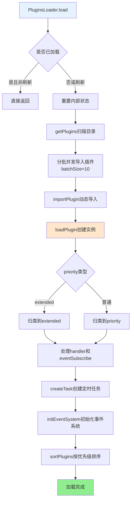
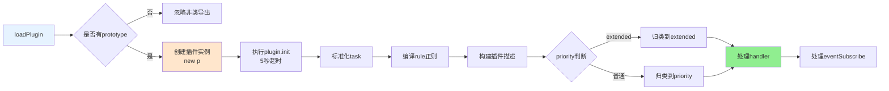
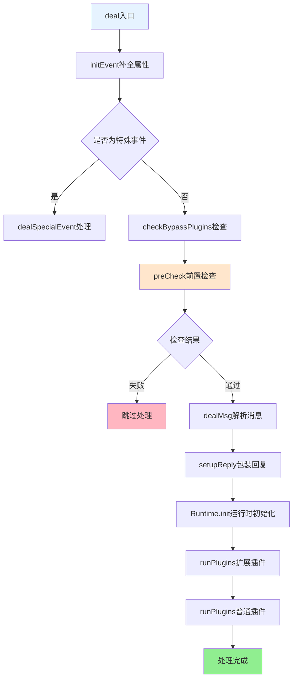

## PluginsLoader 文档（src/infrastructure/plugins/loader.js）

> **可扩展性**：PluginsLoader是插件系统的核心加载器，自动发现和加载所有插件。插件开发者只需将插件放置到对应目录，无需任何配置。详见 **[框架可扩展性指南](框架可扩展性指南.md)** ⭐

`PluginsLoader` 是 XRK-AGT 的 **插件调度核心**，负责：

- 扫描并加载 `core/plugin` 目录中的插件。
- 管理插件规则匹配、权限检查、上下文处理、冷却与节流。
- 处理多种事件源（普通消息、设备事件、STDIN/API 事件）。
- 维护定时任务、事件订阅与全局事件历史。

### 扩展特性

- ✅ **自动发现**：自动扫描 `core/plugin/` 目录
- ✅ **批量加载**：支持批量并发加载（batchSize=10）
- ✅ **热重载**：支持文件监听和自动重载
- ✅ **错误隔离**：单个插件加载失败不影响其他插件
- ✅ **加载统计**：提供详细的加载统计信息

---

## 核心职责概览

- **插件生命周期**
  - 扫描插件目录并动态 `import` 插件模块。
  - 实例化插件、执行 `init()` 钩子。
  - 构建 `priority/extended/task/defaultMsgHandlers` 等内部结构。
  - 支持热更新、文件新增/删除监听。

- **事件分发与规则匹配**
  - 对 `Bot.em` 派发的事件进行预处理（消息解析、权限、黑白名单）。
  - 匹配插件规则并调用对应方法。
  - 支持「扩展插件 extended」与「普通插件」分组执行。

- **定时任务与统计**
  - 基于 `node-schedule` 创建 Cron 定时任务。
  - 统计截图与发送消息次数，并写入 Redis 计数键。

- **事件系统扩展**
  - 提供自定义事件 `emit(eventType, eventData)` 能力，统一走 `Bot.em`。
  - 维护事件历史 `eventHistory`，支持按条件查询。
  - 允许插件订阅任意事件（包括自定义事件）。

---

## 加载流程

**插件加载完整流程**:

### 1. `load(isRefresh = false)`

- 若不是刷新且已经加载过插件，则直接返回
- 记录加载开始时间，重置内部状态（priority/extended/task）
- 调用 `getPlugins()` 扫描 `core/plugin` 目录
- 分批（batchSize = 10）并发导入插件
- 调用后续处理函数完成初始化

> 插件开发者只需要在 `core/plugin` 下新建目录与 JS 文件，即可被自动发现和加载

### 2. `importPlugin(file, packageErr)`

- `await import(file.path)` 动态导入模块
- 支持导出对象 `apps`（多插件聚合）或单一导出
- 对每个导出的插件类调用 `loadPlugin(file, p)`

### 3. `loadPlugin(file, p)`

---

## 事件处理主流程

### 1. 入口：`deal(e)`

**事件处理完整流程**:

**步骤说明**：

1. `initEvent(e)` - 补全 `self_id/bot/event_id`，统计接收计数
2. 若为特殊事件（STDIN/API 或设备），交给 `dealSpecialEvent(e)`
3. `checkBypassPlugins(e)` - 检查是否有带 `bypassThrottle` 且规则匹配的插件
4. `preCheck(e, hasBypassPlugin)` - 前置检查：
   - 忽略自身消息
   - 检查关机状态
   - 检查频道消息、黑名单
   - 检查消息冷却与节流
5. `dealMsg(e)` - 解析消息内容、构建日志文本、注入工具方法
6. `setupReply(e)` - 包装 `e.reply`，统一处理引用、@、撤回等逻辑
7. `Runtime.init(e)` - 插件运行时初始化
8. `runPlugins(e, true)` - 先执行扩展插件
9. `runPlugins(e, false)` - 再执行普通插件规则

### 2. `dealMsg(e)`

- `initMsgProps(e)`：初始化通用消息属性（`e.img/e.video/e.audio/e.msg`）。Tasker特定的属性（如`atList`、`atBot`）由Tasker增强插件处理。
- `parseMessage(e)`：遍历 `e.message`，只处理通用消息类型（`text/image/video/audio/file`）。Tasker特定的消息类型（如`at`、`reply`、`face`）由Tasker增强插件处理。
- `setupEventProps(e)`：
  - 标记通用事件类型（`isDevice/isStdin`）。
  - 设置基础 `sender` 信息。
  - Tasker特定的属性（`isPrivate/isGroup/isGuild`、`group_name`、`friend/group/member`等）由Tasker增强插件处理。
- `checkPermissions(e)`：识别主人（master）与 STDIN 默认主人权限。
- `processAlias(e)`：群聊场景下处理 Bot 别名（如「葵子」）。
- `addUtilMethods(e)`：注入 `getSendableMedia/throttle/getEventHistory` 等工具。

### 3. `runPlugins(e, isExtended)`

- `initPlugins(e, isExtended)`：
  - 遍历 `this.priority` 或 `this.extended`。
  - 实例化插件并设置 `plugin.e = e`。
  - 编译规则 `rule.reg`。
  - 按 `checkDisable` 与 `filtEvent` 过滤禁用或事件不匹配的插件。
- 若为扩展插件：
  - 直接调用 `processRules(plugins, e)`。
- 若为普通插件：
  - 先执行各插件的 `accept(e)`（包括Tasker增强插件与响应控制逻辑）：
    - Tasker增强插件（如`OneBotEnhancer`、`StdinEnhancer`、`DeviceEnhancer`）会在此阶段挂载Tasker特定属性或标准化日志。
    - `OneBotEnhancer` 内置别名与 `onlyReplyAt` 策略，用于决定是否继续向下游插件传递事件。
    - 若返回 `'return'`，则视为已完全处理。
    - 若返回 `false`，跳过当前插件。
    - 若返回 `true`，继续处理。
  - 对非设备/STDIN 事件：
    - `handleContext(plugins, e)`：先处理上下文回调。
    - 若插件不带 `bypassThrottle`，调用 `setLimit(e)` 设置冷却。
  - 最后执行 `processRules(plugins, e, false)` 并根据优先级分组执行。
  - 若仍未处理，调用 `processDefaultHandlers(e)`。

---

## 冷却、节流与黑白名单

- **冷却（CD）**
  - 使用 Map 维护：
    - `this.cooldowns.group`：群级别冷却。
    - `this.cooldowns.single`：群内单人冷却。
    - `this.cooldowns.device`：设备事件冷却。
  - `checkLimit(e)`：在前置检查中判断是否处于冷却期。
  - `setLimit(e)`：在确定要处理消息时写入冷却 Map。

- **节流**
  - `this.msgThrottle`：基于 `user_id:message_id` 的消息去重。
  - `this.eventThrottle`：按 (`user/device` + key) 的事件节流。

- **黑白名单 / 响应策略**
  - `checkBlack(e)`：从配置 `other` 中读取：
    - `blackQQ/whiteQQ/blackGroup/whiteGroup/blackDevice` 等。
  - `OneBotEnhancer`：根据群配置 `onlyReplyAt` 与 `botAlias` 判断是否仅在有 @ 或前缀时响应，并在 `accept` 阶段直接拦截不需要继续处理的事件。

---

## 事件系统与订阅

### 标准化事件系统

XRK-AGT 采用标准化事件命名系统，确保不同来源的事件可以区分，同时支持通用事件监听。

**事件字段责任（Tasker/监听器 vs 加载器）**
- 需由 Tasker/监听器提供：`tasker`、`post_type`、细分类型（`message_type/notice_type/request_type/detail_type`）、可选 `sub_type`、`user_id`/`group_id`/`device_id`、`message` 或 `raw_message`、`time`
- `PluginsLoader` 自动补全：`self_id`、`bot`、缺省 `event_id`、`isDevice`/`isStdin`、基础 `sender`、`logText`、通用 `reply` 兜底、工具方法（`getSendableMedia`/`throttle`/`getEventHistory`）
- Tasker增强插件只补充特有字段（如 `atBot`、`friend`/`group`/`member`、`isPrivate`/`isGroup`），不要覆写 `reply/bot`

**事件命名规则：**

- **OneBot Tasker事件**：
  - 格式：`onebot.{post_type}.{message_type/notice_type/request_type}.{sub_type}`
  - 示例：`onebot.message.group.normal`、`onebot.notice.group_increase`
  - 同时也会触发通用事件：`message.group.normal`、`notice.group_increase`

- **设备事件**：
  - 格式：`device.{event_type}`
  - 示例：`device.message`、`device.online`、`device.offline`
  - 如果 `event_type` 是 `message/notice/request`，同时也会触发通用事件

**插件事件监听：**

插件可以通过 `event` 属性监听不同类型的事件：

- **通用事件监听**：
  - `event: 'message'` - 匹配所有来源的 message 事件（OneBot、设备等）
  - `event: 'notice'` - 匹配所有来源的 notice 事件
  - `event: 'request'` - 匹配所有来源的 request 事件
  - `event: 'device'` - 匹配所有设备事件

- **特定事件监听**：
  - `event: 'onebot.message'` - 只匹配 OneBot Tasker 的 message 事件
  - `event: 'device.message'` - 只匹配设备的 message 事件
  - `event: 'onebot.notice.group_increase'` - 只匹配 OneBot 的群成员增加通知

**事件过滤逻辑：`filtEvent(e, v)`**

加载器会检查插件监听的事件是否匹配实际触发的事件：

1. 完全匹配：插件事件名称与实际事件名称完全一致
2. 通用事件匹配：插件监听 `message` 时，匹配所有 `message.*`、`onebot.message.*`、`device.message`
3. 前缀匹配：插件监听 `onebot.*` 时，匹配所有 `onebot.*` 事件
4. 通配符匹配：支持 `*` 通配符，如 `onebot.message.*`

- **全局监听注册：`initEventSystem()`**
  - 定时清理：
    - `eventHistory` 超出上限。
    - 过期 `eventThrottle` 与 `msgThrottle` 记录。
    - 冷却 Map 中超时条目。
  - 在 `Bot` 上注册事件监听：
    - 对 `message/notice/request/device` 四类事件记录历史并分发订阅。

- **事件历史：`recordEventHistory(eventType, eventData)`**
  - 将事件以 `{ event_id, event_type, event_data, timestamp, source }` 形式追加到 `eventHistory`。

- **订阅与分发**
  - `subscribeEvent(eventType, callback)`：
    - 注册自定义事件回调。
    - 返回一个取消订阅函数。
  - `distributeToSubscribers(eventType, eventData)`：
    - 遍历订阅列表并安全执行回调。

- **自定义事件：`emit(eventType, eventData)`**
  - 构造 `post_type: 'custom'` 的事件对象。
  - 通过 `Bot.em(eventType, event)` 派发。
  - 同时记录历史并调用订阅者。

---

## 定时任务系统

- 插件可在 `plugin.task` 中定义任务，例如：
  - `{ name: 'heartbeat', cron: '0 */5 * * * *', fnc: 'heartbeat' }`。
- `createTask()`：
  - 使用 `schedule.scheduleJob` 创建 Cron 任务。
  - 支持重复检测与日志标记。
  - 执行函数 `task.fnc()` 时自动统计执行耗时并输出日志。

---

## 开发与调试建议

- **编写插件时**
  - 尽量让插件逻辑与 `PluginsLoader` 解耦，只依赖 `plugin` 基类与事件对象 `e`。
  - 使用明确的 `name` 与 `priority`，避免与系统插件产生抢占冲突。

- **排查问题时**
  - 查看插件是否被 `checkDisable` 或黑白名单过滤。
- 检查是否被 `OneBotEnhancer` 的别名/onlyReplyAt 策略或冷却限制挡掉。
  - 通过 Redis（键前缀 `Yz:count:`、`Yz:shutdown:`）确认运行状态。

- **性能优化**
  - 对于高频事件，注意规则设计与日志级别，避免过多无效正则测试与日志输出。
  - 合理使用 `bypassThrottle`，只为少数必要命令开启。

