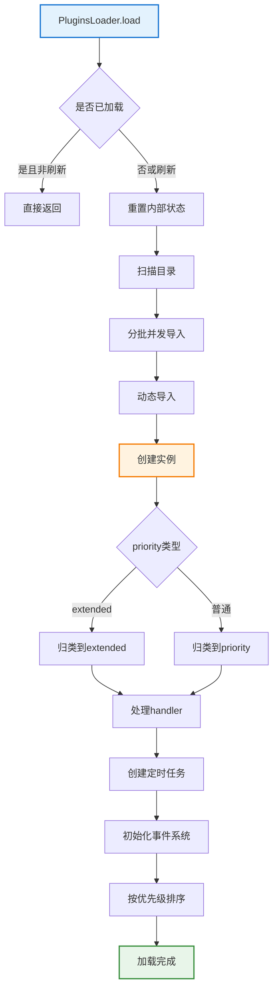
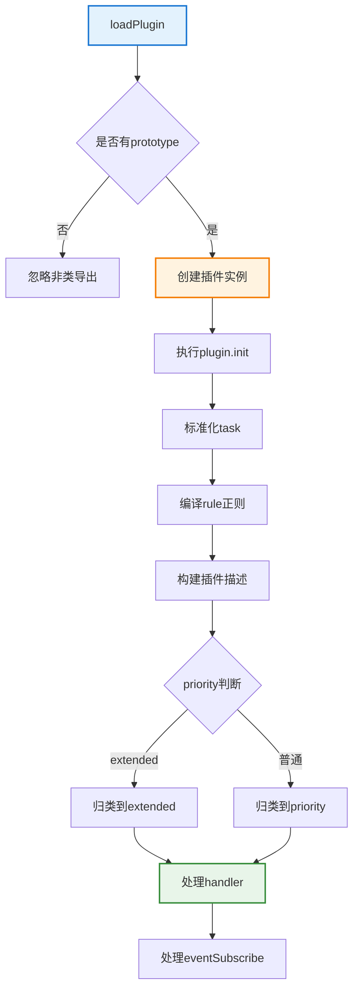
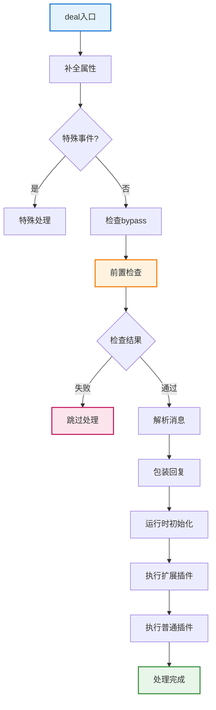

# PluginsLoader 文档

> **文件位置**: `src/infrastructure/plugins/loader.js`  
> **可扩展性**：PluginsLoader是插件系统的核心加载器，自动发现和加载所有插件。插件开发者只需将插件放置到对应目录，无需任何配置。详见 **[框架可扩展性指南](框架可扩展性指南.md)** ⭐

`PluginsLoader` 是 XRK-AGT 的 **插件调度核心**，负责：

- 扫描并加载所有 `core/*/plugin` 目录中的插件
- 管理插件规则匹配、权限检查、上下文处理、冷却与节流
- 处理多种事件源（普通消息、设备事件、STDIN/API 事件）
- 维护定时任务、事件订阅与全局事件历史

> **注意**：框架支持多 core 模块架构。`PluginsLoader` 会自动扫描所有 `core/*/plugin` 目录，加载其中的所有插件。

## 📋 目录

- [扩展特性](#扩展特性)
- [架构与业务层位置](#架构与业务层位置)
- [核心职责概览](#核心职责概览)
- [加载流程](#加载流程)
- [事件处理主流程](#事件处理主流程)
- [冷却、节流与黑白名单](#冷却节流与黑白名单)
- [事件系统与订阅](#事件系统与订阅聚焦-loader-角色)
- [定时任务系统](#定时任务系统)
- [与工作流系统集成](#与工作流系统集成)
- [热加载系统](#热加载系统)
- [开发与调试建议](#开发与调试建议)
- [相关文档](#相关文档)

---

## 扩展特性

- ✅ **自动发现**：自动扫描所有 `core/*/plugin/` 目录
- ✅ **批量加载**：支持批量并发加载（batchSize=10）
- ✅ **热重载**：支持文件监听和自动重载
- ✅ **错误隔离**：单个插件加载失败不影响其他插件
- ✅ **加载统计**：提供详细的加载统计信息

---

## 📚 目录

- [架构与业务层位置](#架构与业务层位置)
- [核心职责概览](#核心职责概览)
- [加载流程](#加载流程)
- [事件处理主流程](#事件处理主流程)
- [冷却、节流与黑白名单](#冷却节流与黑白名单)
- [事件系统与订阅（聚焦 Loader 角色）](#事件系统与订阅聚焦-loader-角色)
- [定时任务系统](#定时任务系统)
- [与工作流系统集成](#与工作流系统集成)
- [热加载系统](#热加载系统)
- [开发与调试建议](#开发与调试建议)

---

## 架构与业务层位置

PluginsLoader 位于「事件系统 → 业务插件 → AI 工作流」链路的中间，负责把标准化事件分发给各业务插件：

- **事件入口**：来自 Tasker / 事件监听器的标准化事件，通过 `PluginsLoader.deal(e)` 进入插件系统
- **业务插件编排**：
  - 按 `priority` 将插件划分为「扩展插件（enhancer）」与「普通插件」
  - 统一执行 `accept` → 规则匹配 → 上下文处理 → 默认处理器
- **与基类协作关系**：
  - 面向插件基类 `plugin`：只依赖基类约定的字段和方法（`rule/task/eventSubscribe/accept` 等）
  - 面向事件系统：依赖 `EventNormalizer` 输出的标准事件对象，不关心具体协议细节

> 关于单个插件本身的结构与能力，请结合 `docs/plugin-base.md` 一起阅读，本篇只聚焦「业务层调度器」的角色。

---

## 核心职责概览

- **插件生命周期**
  - 扫描插件目录并动态 `import` 插件模块。
  - 实例化插件、执行 `init()` 钩子。
  - 构建 `priority/extended/task/defaultMsgHandlers` 等内部结构。
  - 支持热更新、文件新增/删除监听

- **事件分发与规则匹配**
  - 使用 `EventNormalizer` 统一标准化事件对象（`normalizeEventPayload`）
  - 对 `Bot.em` 派发的事件进行预处理（消息解析、权限、黑白名单）
  - 插件匹配和执行流程优化，减少冗余判断
  - 支持「扩展插件 extended」与「普通插件」分组执行

- **定时任务与统计**
  - 基于 `node-schedule` 创建 Cron 定时任务。
  - 统计截图与发送消息次数，并写入 Redis 计数键。

- **事件系统扩展**
  - 提供自定义事件 `emit(eventType, eventData)` 能力，统一走 `Bot.em`。
  - 维护事件历史 `eventHistory`，支持按条件查询。
  - 允许插件订阅任意事件（包括自定义事件）。

---

## 加载流程

**插件加载完整流程**:



### 1. `load(isRefresh = false)`

- 若不是刷新且已经加载过插件，则直接返回
- 记录加载开始时间，重置内部状态（priority/extended/task）
- 调用 `getPlugins()` 扫描所有 `core/*/plugin` 目录
- 分批（batchSize = 10）并发导入插件
- 调用后续处理函数完成初始化

> 插件开发者只需要在任意 core 目录的 `plugin` 子目录下新建 JS 文件（如 `core/my-core/plugin/my-plugin.js`），即可被自动发现和加载

### 2. `importPlugin(file, packageErr, skipInit)`

- `importPluginModule(file, packageErr)` 动态导入模块
- 支持导出对象 `apps`（多插件聚合）或单一导出
- 对每个导出的插件类调用 `loadPlugin(file, PluginClass, skipInit)`
- `skipInit` 参数用于热加载时跳过重复初始化

### 3. `loadPlugin(file, PluginClass, skipInit)`

**核心优化**：
- 提取了 `initializePlugin`、`registerPluginTasks`、`buildPluginMetadata`、`registerPluginHandlers` 等独立方法
- 支持 `skipInit` 参数，热加载时可跳过重复初始化
- 初始化超时从 5 秒优化为 3 秒



---

## 事件处理主流程

### 1. 入口：`deal(e)`

**事件处理完整流程**:



**步骤说明**：

1. `initEvent(e)` - 补全 `self_id/bot/event_id`，统计接收计数
2. 若为特殊事件（STDIN/API 或设备），交给 `dealSpecialEvent(e)`
3. `checkBypassPlugins(e)` - 检查是否有带 `bypassThrottle` 且规则匹配的插件
4. `preCheck(e, hasBypassPlugin)` - 前置检查：
   - 忽略自身消息
   - 检查关机状态
   - 检查频道消息、黑名单
   - 检查消息冷却与节流
5. `dealMsg(e)` - 解析消息内容、构建日志文本、注入工具方法
6. `setupReply(e)` - 包装 `e.reply`，统一处理引用、@、撤回等逻辑
7. `Runtime.init(e)` - 插件运行时初始化
8. `runPlugins(e, true)` - 先执行扩展插件
9. `runPlugins(e, false)` - 再执行普通插件规则

### 2. `dealMsg(e)`

- `initMsgProps(e)`：初始化通用消息属性（`e.img/e.video/e.audio/e.msg`）。Tasker特定的属性（如`atList`、`atBot`）由Tasker增强插件处理。
- `parseMessage(e)`：遍历 `e.message`，只处理通用消息类型（`text/image/video/audio/file`）。Tasker特定的消息类型（如`at`、`reply`、`face`）由Tasker增强插件处理。
- `setupEventProps(e)`：
  - 标记通用事件类型（`isDevice/isStdin`）。
  - 设置基础 `sender` 信息。
  - Tasker特定的属性（`isPrivate/isGroup/isGuild`、`group_name`、`friend/group/member`等）由Tasker增强插件处理。
- `checkPermissions(e)`：识别主人（master）与 STDIN 默认主人权限。
- `processAlias(e)`：群聊场景下处理 Bot 别名（如「葵子」）。
- `addUtilMethods(e)`：注入 `getSendableMedia/throttle/getEventHistory` 等工具。

### 3. `runPlugins(e, isExtended)`

- `initPlugins(e, isExtended)`：
  - 遍历 `this.priority` 或 `this.extended`。
  - 实例化插件并设置 `plugin.e = e`。
  - 编译规则 `rule.reg`。
  - 按 `checkDisable` 与 `filtEvent` 过滤禁用或事件不匹配的插件。
- 若为扩展插件：
  - 直接调用 `processRules(plugins, e)`。
- 若为普通插件：
  - 先执行各插件的 `accept(e)`（包括Tasker增强插件与响应控制逻辑）：
    - Tasker增强插件（如`OneBotEnhancer`、`StdinEnhancer`、`DeviceEnhancer`）会在此阶段挂载Tasker特定属性或标准化日志。
    - `OneBotEnhancer` 内置别名与 `onlyReplyAt` 策略，用于决定是否继续向下游插件传递事件。
    - 若返回 `'return'`，则视为已完全处理。
    - 若返回 `false`，跳过当前插件。
    - 若返回 `true`，继续处理。
  - 对非设备/STDIN 事件：
    - `handleContext(plugins, e)`：先处理上下文回调。
    - 若插件不带 `bypassThrottle`，调用 `setLimit(e)` 设置冷却。
  - 最后执行 `processRules(plugins, e, false)` 并根据优先级分组执行。
  - 若仍未处理，调用 `processDefaultHandlers(e)`。

---

## 冷却、节流与黑白名单

- **冷却（CD）**
  - 使用 Map 维护：
    - `this.cooldowns.group`：群级别冷却。
    - `this.cooldowns.single`：群内单人冷却。
    - `this.cooldowns.device`：设备事件冷却。
  - `checkLimit(e)`：在前置检查中判断是否处于冷却期。
  - `setLimit(e)`：在确定要处理消息时写入冷却 Map。

- **节流**
  - `this.msgThrottle`：基于 `user_id:message_id` 的消息去重。
  - `this.eventThrottle`：按 (`user/device` + key) 的事件节流。

- **黑白名单 / 响应策略**
  - `checkBlack(e)`：从配置 `other` 中读取：
    - `blackQQ/whiteQQ/blackGroup/whiteGroup/blackDevice` 等。
  - `OneBotEnhancer`：根据群配置 `onlyReplyAt` 与 `botAlias` 判断是否仅在有 @ 或前缀时响应，并在 `accept` 阶段直接拦截不需要继续处理的事件。

---

## 事件系统与订阅（聚焦 Loader 角色）

PluginsLoader 与标准化事件系统紧密集成，但**不再在本篇重复事件命名与字段责任的全部细节**，这些内容已集中在 `docs/事件系统标准化文档.md` 中。

在整体事件链路中，PluginsLoader 的职责主要包括：

- **消费标准化事件对象**：
  - 依赖 Tasker / 事件监听器 提供的基础字段（`tasker/post_type/message_type/...`）
  - 使用 `EventNormalizer` 做统一标准化（`normalizeEventPayload`）
  - 补全插件业务层需要的通用字段与工具方法（`bot/sender/reply/getSendableMedia/throttle/getEventHistory` 等）
- **负责插件侧过滤与分发**：
  - 通过 `filtEvent(e, v)` 根据插件 `event` 属性与事件名进行匹配（完全匹配 / 通用事件 / 前缀 / 通配）
  - 维护 `eventHistory`、节流与冷却 Map，并在 `initEventSystem()` 中定期清理
  - 在 `Bot` 上注册通用事件监听（`message/notice/request/device`），统一分发给订阅者和业务插件

> 事件命名规则、匹配优先级以及 Tasker / 监听器 / Loader 之间的字段责任边界，请统一参考：  
> `docs/事件系统标准化文档.md`（避免与本篇产生冗余说明）。

- **事件历史：`recordEventHistory(eventType, eventData)`**
  - 将事件以 `{ event_id, event_type, event_data, timestamp, source }` 形式追加到 `eventHistory`。

- **订阅与分发**
  - `subscribeEvent(eventType, callback)`：
    - 注册自定义事件回调。
    - 返回一个取消订阅函数。
  - `distributeToSubscribers(eventType, eventData)`：
    - 遍历订阅列表并安全执行回调。

- **自定义事件：`emit(eventType, eventData)`**
  - 构造 `post_type: 'custom'` 的事件对象。
  - 通过 `Bot.em(eventType, event)` 派发。
  - 同时记录历史并调用订阅者。

---

## 定时任务系统

- 插件可在 `plugin.task` 中定义任务，例如：
  - `{ name: 'heartbeat', cron: '0 */5 * * * *', fnc: 'heartbeat' }`。
- `createTask()`：
  - 使用 `schedule.scheduleJob` 创建 Cron 任务。
  - 支持重复检测与日志标记。
  - 执行函数 `task.fnc()` 时自动统计执行耗时并输出日志。

---

## 与工作流系统集成

PluginsLoader 与工作流系统无缝集成，插件可以通过 `getStream()` 访问工作流：

```javascript
// 插件中调用工作流
async handleMessage(e) {
  const stream = this.getStream('chat');
  if (stream) {
    await stream.process(e, e.msg, {
      enableMemory: true,
      enableDatabase: true
    });
  }
}
```

**集成流程**：
1. 插件通过 `this.getStream(name)` 获取工作流实例
2. 调用 `stream.process(e, question, options)` 执行工作流
3. 工作流内部自动处理回复发送，插件不需要再次调用 `reply()`

---

## 热加载系统

PluginsLoader 支持完整的插件热加载功能，包括新增、修改和删除插件的自动处理。

### 启用热加载

```javascript
// 在 Bot.run() 中自动启用
await PluginsLoader.watch(true);
```

### 热加载流程

**新增插件** (`onAdd`)：
1. 检测到新文件时，自动加载插件
2. 创建定时任务
3. 重新排序和识别默认消息处理器
4. 输出加载日志

**修改插件** (`onChange`)：
1. 先卸载旧插件（清理定时任务、Handler、事件订阅等）
2. 使用时间戳强制重新加载模块
3. 重新初始化插件（确保状态正确）
4. 重新创建定时任务
5. 重新排序和识别

**删除插件** (`onUnlink`)：
1. 清理定时任务（精确匹配插件键名）
2. 清理插件数组（priority/extended）
3. 清理 Handler（使用插件命名空间）
4. 清理事件订阅（遍历所有订阅者）
5. 重新识别默认消息处理器

### 热加载优化

- **资源清理**：卸载时完整清理所有相关资源，避免内存泄漏
- **精确匹配**：使用插件键名（文件名）精确匹配，避免误删
- **状态同步**：修改时重新初始化，确保插件状态正确
- **错误隔离**：单个插件热加载失败不影响其他插件

---

## 开发与调试建议

### 编写插件时

- **解耦设计**：尽量让插件逻辑与 `PluginsLoader` 解耦，只依赖 `plugin` 基类与事件对象 `e`
- **命名规范**：使用明确的 `name` 与 `priority`，避免与系统插件产生抢占冲突
- **工作流集成**：通过 `getStream()` 访问工作流，使用 `process()` 方法执行
- **错误处理**：始终使用 try-catch 包裹工作流调用，提供友好错误提示

### 排查问题时

1. **插件加载检查**：
   - 查看插件是否被 `checkDisable` 或黑白名单过滤
   - 检查插件文件是否正确放置在 `core/*/plugin/` 目录
   - 查看加载日志，确认插件是否成功加载

2. **事件处理检查**：
   - 检查是否被 `OneBotEnhancer` 的别名/onlyReplyAt 策略拦截
   - 检查是否被冷却限制挡掉
   - 检查事件类型是否匹配（`event` 属性）

3. **工作流调用检查**：
   - 确认工作流是否已加载（`StreamLoader.getStream(name)`）
   - 检查工作流配置是否正确（`embedding`、`config` 等）
   - 查看工作流执行日志

4. **系统状态检查**：
   - 通过 Redis（键前缀 `Yz:count:`、`Yz:shutdown:`）确认运行状态
   - 查看 Bot 运行日志
   - 检查 HTTP API 是否正常

### 性能优化

- **规则设计**：对于高频事件，注意规则设计与日志级别，避免过多无效正则测试与日志输出
- **节流使用**：合理使用 `bypassThrottle`，只为少数必要命令开启
- **工作流优化**：合理使用 `enableMemory`、`enableDatabase` 等选项，避免过度检索
- **上下文管理**：及时清理上下文，避免长期占用内存

---

## 相关文档

- **[插件基类文档](plugin-base.md)** - 插件开发详细说明
- **[事件系统标准化文档](事件系统标准化文档.md)** - 事件命名与字段责任说明
- **[框架可扩展性指南](框架可扩展性指南.md)** - 扩展开发完整指南

---*最后更新：2026-02-06*
