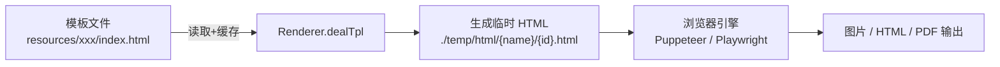
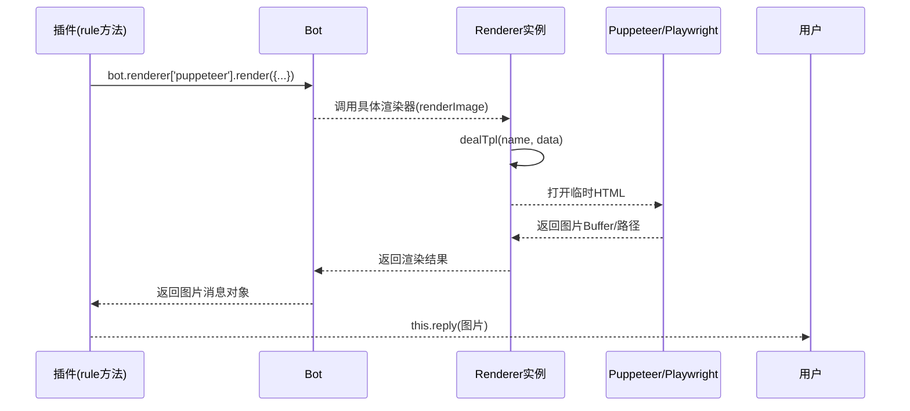

## Renderer 文档（src/infrastructure/renderer/Renderer.js）

> **可扩展性**：Renderer是渲染系统的核心基类。通过继承Renderer，开发者可以快速创建自定义渲染器，支持HTML模板、图片生成等功能。详见 **[框架可扩展性指南](框架可扩展性指南.md)** ⭐

`Renderer` 是 XRK-AGT 中的 **渲染器基类**，用于统一：

- HTML 模板渲染。
- 静态资源路径处理。
- 模板文件监听与自动重载。

具体渲染实现（如 Puppeteer/Playwright 渲染图片）会基于此类封装生成 HTML，再交给浏览器引擎截图。

### 扩展特性

- ✅ **模板系统**：支持art-template模板引擎
- ✅ **文件监听**：自动监听模板文件变更
- ✅ **缓存机制**：模板内容自动缓存
- ✅ **灵活渲染**：支持多种渲染方式（image/html/pdf）

---

## 总览：核心属性与方法



| 分类 | 名称 | 说明 |
|------|------|------|
| **构造参数** | `id` | 渲染器唯一标识（如 `puppeteer`、`playwright` 等） |
| | `type` | 渲染类型（如 `'image'`、`'html'`） |
| | `render` | 渲染入口方法名（默认 `'render'`，会被挂到实例的 `this.render` 上） |
| **实例属性** | `this.id` | 渲染器 ID，用于日志与选择器 |
| | `this.type` | 渲染输出类型（`image/html/...`） |
| | `this.render` | 渲染入口函数引用（指向 `this[renderName]`） |
| | `this.dir` | 临时 HTML 目录，默认 `./temp/html` |
| | `this.html` | 模板内容缓存 `{ tplFile: string }` |
| | `this.watcher` | 文件监听器缓存 `{ tplFile: FSWatcher }` |
| **核心方法** | `dealTpl(name, data)` | 将模板 + 数据渲染为 HTML 文件并返回路径 |
| | `createDir(dirname)` | 递归创建目录 |
| | `watch(tplFile)` | 监听模板文件变动，自动清理缓存 |

构造函数内部会调用 `createDir(this.dir)` 确保基础目录存在。

---

## 模板处理：`dealTpl(name, data)`

用于从模板文件生成具体 HTML 文件，典型流程：

1. 从 `data` 中解构：
   - `tplFile`：模板文件路径（通常位于 `resources/` 下）。
   - `saveId`：保存文件名标识，默认为 `name`。
2. 计算输出路径：
   - `savePath = ./temp/html/${name}/${saveId}.html`。
3. 若 `this.html[tplFile]` 尚未缓存：
   - 调用 `createDir(./temp/html/${name})` 确保子目录存在。
   - 使用 `fs.readFileSync(tplFile, 'utf8')` 读取模板内容并缓存。
   - 调用 `watch(tplFile)` 监听模板变动。
4. 设置资源路径：
   - `data.resPath = ./resources/`，便于模板中引用静态资源。
5. 使用 `art-template` 渲染：
   - `template.render(this.html[tplFile], data)` 得到 HTML 字符串。
6. 将渲染结果写入 `savePath`，并返回该路径。

> 上层渲染器（如 Puppeteer 渲染器）通常会：
> - 调用 `dealTpl` 生成 HTML 文件。
> - 再用浏览器引擎打开该文件并截图，返回图片路径或 Buffer。

---

## 目录与文件监控

- `createDir(dirname)`：
  - 递归创建目录，类似 `mkdir -p` 的效果。
  - 若已存在则立即返回。

- `watch(tplFile)`：
  - 若已存在 watcher，直接返回。
  - 使用 `chokidar.watch(tplFile)` 监听模板文件。
  - 在 `change` 事件中：
    - 删除 `this.html[tplFile]` 缓存。
    - 打印日志 `[修改html模板] tplFile`。

> 当模板文件被修改后，下一次调用 `dealTpl` 会重新从磁盘读取最新模板并渲染，无需重启服务。

---

## 如何在插件中直接使用渲染器

**调用链示意：**



**典型插件代码片段：**

```js
// 假设在插件方法中 (this.e 为当前事件，Bot 为全局实例)
const renderer = Bot.renderer?.puppeteer; // 或 playwright
if (!renderer) {
  await this.reply('渲染器未启用或未配置');
  return;
}

const htmlPath = await renderer.dealTpl('status', {
  tplFile: 'resources/html/status.html',
  saveId: `status-${this.e.user_id}`,
  data: { title: '系统状态', items: [...] }
});

// 具体渲染器会提供更高级封装，例如：renderImage / renderCard 等
const img = await renderer.renderImage({
  htmlPath,
  viewport: { width: 800, height: 600 }
});

await this.reply(img);
```

> 建议：把模板文件与业务插件放在同一子目录里，路径使用 `paths.resources` 或相对路径组合，避免硬编码。

---

## 与具体渲染实现的关系

- `src/renderers/puppeteer` 与 `src/renderers/playwright` 中的渲染器会：
  - 继承 `Renderer`。
  - 在构造函数中调用 `super({ id, type, render: 'renderImage' })` 等。
  - 实现 `renderImage(data)`：
    - 使用 `dealTpl` 生成 HTML 文件。
    - 调用 Puppeteer/Playwright 打开该 HTML，并按需要截图。
    - 返回图片路径或 Buffer。
  - 通过各自的 `index.js` 暴露工厂函数，在系统初始化时由 `cfg.renderer` + `Bot` 组合创建实例并挂到 `Bot.renderer`。

---

## 开发自定义渲染器（实战指南）

1. **创建自定义渲染器类**

```js
// src/renderers/myrenderer/index.js
// Renderer 是全局对象，无需 import
import someEngine from 'some-render-engine';

class MyRenderer extends Renderer {
  constructor(config) {
    super({ id: 'myrenderer', type: 'image', render: 'renderImage' });
    this.config = config;
  }

  async renderImage({ tplFile, saveId = 'default', data = {} }) {
    const htmlPath = await this.dealTpl('myrenderer', { tplFile, saveId, ...data });
    // 使用第三方引擎打开 htmlPath 并渲染为图片
    const buffer = await someEngine.renderToBuffer(htmlPath, this.config.options);
    return buffer;
  }
}

export default function (config) {
  return new MyRenderer(config);
}
```

2. **配置与启用**
   - 在 `config/default_config/renderers/myrenderer.yaml` 中添加默认配置。
   - 在 `server.yaml` 中开启对应渲染器或在前端配置页面中勾选。
   - 重启服务后，`Bot.renderer.myrenderer` 即可使用。

3. **在插件中调用**
   - 参考上文「如何在插件中直接使用渲染器」中的示例。

---

## 模板组织与前端协作建议

- **模板存放建议**
  - 推荐统一放在 `resources/html/xxx/` 下，并使用有语义的目录名，如 `status/`, `dashboard/`, `report/`。
  - 同一功能的 JS/CSS 资源可放在相邻目录，模板中通过 `resPath` 引用。

- **前后端协作**
  - 前端同学可以只关注模板与样式；后端通过 `dealTpl` 传入数据对象。
  - 如有复杂交互（图表、动画），尽量在前端 JS 文件中完成，渲染器仅负责「首屏渲染 + 截图」。

