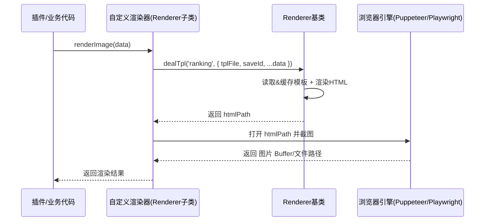

## Renderer 文档（src/infrastructure/renderer/Renderer.js）

`Renderer` 是 XRK-AGT 中的 **渲染器基类**，用于统一：

- HTML 模板渲染。
- 静态资源路径处理。
- 模板文件监听与自动重载。

具体渲染实现（如 Puppeteer/Playwright 渲染图片）会基于此类封装生成 HTML，再交给浏览器引擎截图。

---

## 构造参数与属性

- 构造函数参数 `data`：
  - `id`：渲染器唯一标识（如 `puppeteer`、`playwright` 等）。
  - `type`：渲染类型（如 `'image'`、`'html'`）。
  - `render`：渲染入口方法名（默认 `'render'`）。

- 实例属性：
  - `this.id`：渲染器 ID。
  - `this.type`：渲染输出类型。
  - `this.render`：引用 `this[data.render || 'render']`，作为统一入口。
  - `this.dir = './temp/html'`：保存生成 HTML 的临时目录。
  - `this.html = {}`：模板内容缓存。
  - `this.watcher = {}`：文件监听器缓存。

构造函数会调用 `createDir(this.dir)` 确保基础目录存在。

---

## 模板处理：`dealTpl(name, data)`

用于从模板文件生成具体 HTML 文件，典型流程：

1. 从 `data` 中解构：
   - `tplFile`：模板文件路径（通常位于 `resources/` 下）。
   - `saveId`：保存文件名标识，默认为 `name`。
2. 计算输出路径：
   - `savePath = ./temp/html/${name}/${saveId}.html`。
3. 若 `this.html[tplFile]` 尚未缓存：
   - 调用 `createDir(./temp/html/${name})` 确保子目录存在。
   - 使用 `fs.readFileSync(tplFile, 'utf8')` 读取模板内容并缓存。
   - 调用 `watch(tplFile)` 监听模板变动。
4. 设置资源路径：
   - `data.resPath = ./resources/`，便于模板中引用静态资源。
5. 使用 `art-template` 渲染：
   - `template.render(this.html[tplFile], data)` 得到 HTML 字符串。
6. 将渲染结果写入 `savePath`，并返回该路径。



> 上层渲染器（如 Puppeteer 渲染器）通常会：  
> - 调用 `dealTpl` 生成 HTML 文件。  
> - 再用浏览器引擎打开该文件并截图，返回图片路径或 Buffer。  

---

## 目录与文件监控

- `createDir(dirname)`：
  - 递归创建目录，类似 `mkdir -p` 的效果。
  - 若已存在则立即返回。

- `watch(tplFile)`：
  - 若已存在 watcher，直接返回。
  - 使用 `chokidar.watch(tplFile)` 监听模板文件。
  - 在 `change` 事件中：
    - 删除 `this.html[tplFile]` 缓存。
    - 打印日志 `[修改html模板] tplFile`。

> 当模板文件被修改后，下一次调用 `dealTpl` 会重新从磁盘读取最新模板并渲染，无需重启服务。

---

## 与具体渲染实现的关系

- `src/renderers/puppeteer` 与 `src/renderers/playwright` 中的渲染器会：  
  - 继承 `Renderer`。  
  - 在构造函数中调用 `super({ id, type, render: 'renderImage' })` 等。  
  - 实现 `renderImage(data)`：  
    - 使用 `dealTpl` 生成 HTML 文件。  
    - 调用 Puppeteer/Playwright 打开该 HTML，并按需要截图。  
    - 返回图片路径或 Buffer。  

> 简单理解：`Renderer` 负责「把数据+模板变成 HTML 文件」，具体渲染器负责「把 HTML 变成图片/视频/PDF 等」。  

---

## 在插件/后端中直接使用渲染器

**1. 获取渲染器实例**

```js
// 在插件、API 或其它后端模块中
import rendererLoader from '#infrastructure/renderer/loader.js';

// 使用配置中的默认渲染器（通常是 puppeteer）
const renderer = rendererLoader.getRenderer();
// 或者按名称获取
// const renderer = rendererLoader.getRenderer('puppeteer');
```

**2. 调用渲染方法（示例：生成排行榜图片）**

```js
// data 会透传给模板，模板中可直接使用这些字段
const result = await renderer.render({
  name: 'ranking', // 业务内部名称，用于区分不同模板子目录
  tplFile: './resources/html/ranking.html',
  saveId: `user-${e.user_id}`, // 生成的 html 文件名
  list: topPlayers,            // 模板中循环渲染的数据
  title: '本周活跃度排行榜'
});

// 约定：render 通常返回 Buffer 或 图片文件路径
await e.reply(result);
```

**3. 前端/模板中的资源引用**

- 模板中通过 `{{resPath}}` 作为静态资源前缀，如：  
  - `<link rel="stylesheet" href="{{resPath}}/css/ranking.css" />`  
  - ``  

---

## 开发建议：如何自定义一个渲染器

### 目录结构示例

```text
renderers/
  myrenderer/
    index.js       # 渲染器工厂函数
    config.yaml    # 渲染器专用配置（如浏览器路径、超时等）
resources/
  html/
    ranking.html   # 模板文件
```

### 渲染器实现示例

```js
// renderers/myrenderer/index.js
import Renderer from '#infrastructure/renderer/Renderer.js';
import puppeteer from 'puppeteer';

export default function createRenderer(cfg = {}) {
  class MyRenderer extends Renderer {
    constructor() {
      super({ id: 'myrenderer', type: 'image', render: 'renderImage' });
    }

    async renderImage(data) {
      // 1. 生成 HTML 文件
      const htmlPath = await this.dealTpl('ranking', data);

      // 2. 使用 puppeteer 截图
      const browser = await puppeteer.launch(cfg.launchOptions || {});
      const page = await browser.newPage();
      await page.goto(`file://${htmlPath}`, { waitUntil: 'networkidle0' });
      const buffer = await page.screenshot({ fullPage: true });
      await browser.close();

      return buffer; // 供 e.reply(buffer) 使用
    }
  }

  return new MyRenderer();
}
```

### Loader 如何加载你的渲染器

- `src/infrastructure/renderer/loader.js` 会：  
  - 遍历 `paths.renderers` 目录下的每一个子目录。  
  - 动态导入 `index.js`，调用其 `default` 导出函数拿到渲染器实例。  
  - 读取 `config.yaml` 并在创建时注入配置。  
  - 校验 `id/type/render` 字段，并注册到 `renderers` Map 中。  

> 因此，你只需要保证渲染器工厂函数返回一个 **继承自 `Renderer` 且包含 `id/type/render` 字段** 的实例，即可被整个系统自动发现和使用。  

---

## 模板组织与前端协作

- **模板放在 `resources/html` 或类似目录**，方便版本管理与备份。  
- **样式与脚本**：
  - 推荐统一放在 `resources/css` / `resources/js` 下，通过 `resPath` 引用。  
  - 避免在渲染 HTML 中拼接过多内联样式，便于前后端协作。  
- **联动前端页面**：
  - 若有 Web 面板（如 `www/xrk`），可以共用一套 CSS/组件设计，让渲染出的图片与 Web 页面风格统一。  
  - 变更 UI 时，只需要同步更新模板与 CSS，而不必改动插件逻辑。  
