# 渲染器基类文档

> **文件位置**：`src/infrastructure/renderer/Renderer.js`  
> **可扩展性**：Renderer是渲染系统的核心基类。通过继承Renderer，开发者可以快速创建自定义渲染器，支持HTML模板、图片生成等功能。详见 **[框架可扩展性指南](框架可扩展性指南.md)** ⭐

`Renderer` 是 XRK-AGT 中的 **渲染器基类**，用于统一 HTML 模板渲染、静态资源路径处理、模板文件监听等功能。

具体渲染实现（如 Puppeteer/Playwright 渲染图片）会基于此类封装生成 HTML，再交给浏览器引擎截图。

## 📚 目录

- [扩展特性](#扩展特性)
- [架构概览](#架构概览)
- [构造参数](#构造参数)
- [核心方法](#核心方法)
- [使用示例](#使用示例)
- [最佳实践](#最佳实践)
- [常见问题](#常见问题)
- [相关文档](#相关文档)

---

## 扩展特性

- ✅ **模板系统**：支持art-template模板引擎
- ✅ **文件监听**：自动监听模板文件变更
- ✅ **缓存机制**：模板内容自动缓存
- ✅ **灵活渲染**：支持多种渲染方式（image/html/pdf）

---

## 架构概览

```mermaid
flowchart TB
    subgraph Plugin["插件"]
        Call["调用渲染器"]
    end
    
    subgraph Renderer["Renderer基类"]
        DealTpl["渲染模板"]
        Cache["模板缓存"]
        Watch["文件监听"]
    end
    
    subgraph Template["模板系统"]
        HTML["HTML模板"]
        ArtTemplate["art-template"]
    end
    
    subgraph Engine["浏览器引擎"]
        Puppeteer["Puppeteer"]
        Playwright["Playwright"]
    end
    
    Plugin --> Renderer
    Renderer --> Template
    Renderer --> Engine
    Engine --> Output["图片/HTML/PDF"]
    
    style Plugin fill:#E3F2FD,stroke:#1976D2,stroke-width:2px
    style Renderer fill:#E8F5E9,stroke:#388E3C,stroke-width:2px
    style Template fill:#FFF3E0,stroke:#F57C00,stroke-width:2px
    style Engine fill:#E1F5FE,stroke:#0277BD,stroke-width:2px
```



---

## 配置与加载

- **渲染后端选择**：全局配置 `agt.browser.renderer`（`puppeteer` | `playwright`），决定 `getRenderer()` 使用的实现。
- **按端口配置**：`data/server_bots/{port}/renderers/{type}/config.yaml`，缺省从 `src/renderers/{type}/config_default.yaml` 合并。
- **加载方式**：`RendererLoader` 扫描 `src/renderers/` 下每个子目录，加载 `index.js` 并调用 `default(config)` 得到实例；配置来自 `cfg.getRendererConfig(type)`。

---

## 构造参数

```javascript
constructor(data = {})
```

**参数说明**：

| 参数 | 类型 | 说明 | 默认值 |
|------|------|------|--------|
| `id` | `string` | 渲染器唯一标识（如 `puppeteer`、`playwright`） | `'renderer'` |
| `type` | `string` | 渲染类型（如 `'image'`、`'html'`） | `'image'` |
| `render` | `string` | 渲染入口方法名（会被挂到 `this.render`） | `'render'` |

**实例属性**：
- `this.id` - 渲染器 ID
- `this.type` - 渲染输出类型
- `this.render` - 渲染入口函数引用
- `this.dir` - 临时 HTML 目录（默认 `./trash/html`）
- `this.html` - 模板内容缓存 `{ tplFile: string }`
- `this.watcher` - 文件监听器缓存 `{ tplFile: FSWatcher }`

---

## 核心方法

### `dealTpl(name, data)`

将模板 + 数据渲染为 HTML 文件并返回路径。

```mermaid
flowchart TB
    A["dealTpl(name, data)"] --> B["计算输出路径"]
    B --> C{"模板已缓存?"}
    C -->|否| D["读取模板文件"]
    C -->|是| E["使用缓存"]
    D --> F["缓存模板内容"]
    F --> G["监听文件变动"]
    G --> E
    E --> H["设置resPath"]
    H --> I["art-template渲染"]
    I --> J["写入HTML文件"]
    J --> K["返回文件路径"]
    
    style A fill:#E3F2FD,stroke:#1976D2,stroke-width:2px
    style I fill:#E8F5E9,stroke:#388E3C,stroke-width:2px
    style K fill:#FFF3E0,stroke:#F57C00,stroke-width:2px
```



**参数**：
- `name` - 模板名称（用于生成目录）
- `data.tplFile` - 模板文件路径（通常位于 `resources/` 下）
- `data.saveId` - 保存文件名标识（默认为 `name`）
- `data.*` - 其他数据（会传递给模板）

**流程**：
1. 计算输出路径：`./trash/html/${name}/${saveId}.html`
2. 若模板未缓存，读取并缓存模板内容，监听文件变动
3. 设置 `data.resPath = ./resources/`（便于模板引用静态资源）
4. 使用 `art-template` 渲染模板
5. 写入 HTML 文件并返回路径

**返回值**：`string` - HTML 文件路径

### `createDir(dirname)` / `watch(tplFile)`

- `createDir` - 递归创建目录（类似 `mkdir -p`）
- `watch` - 监听模板文件变动，自动清理缓存（使用 `chokidar`）

> 当模板文件被修改后，下一次调用 `dealTpl` 会重新从磁盘读取最新模板并渲染，无需重启服务。

---

## 使用示例

### 在插件中使用渲染器

```javascript
import RendererLoader from '#infrastructure/renderer/loader.js';

// 获取渲染器实例
const renderer = RendererLoader.getRenderer('puppeteer');
if (!renderer) {
  await this.reply('渲染器未启用');
  return;
}

// 渲染模板
const htmlPath = renderer.dealTpl('status', {
  tplFile: 'resources/html/status.html',
  saveId: `status-${this.e.user_id}`,
  title: '系统状态',
  items: [...]
});

// 具体渲染器会提供更高级封装（如 renderImage）
const img = await renderer.renderImage({
  htmlPath,
  viewport: { width: 800, height: 600 }
});

await this.reply(img);
```

### 开发自定义渲染器

```javascript
// src/renderers/myrenderer/index.js
import Renderer from '#infrastructure/renderer/Renderer.js';
import someEngine from 'some-render-engine';

class MyRenderer extends Renderer {
  constructor(config) {
    super({ id: 'myrenderer', type: 'image', render: 'renderImage' });
    this.config = config;
  }

  async renderImage({ tplFile, saveId = 'default', data = {} }) {
    const htmlPath = this.dealTpl('myrenderer', { tplFile, saveId, ...data });
    const buffer = await someEngine.renderToBuffer(htmlPath, this.config.options);
    return buffer;
  }
}

export default function (config) {
  return new MyRenderer(config);
}
```

---

## 最佳实践

1. **模板组织**：统一放在 `resources/html/xxx/` 下，使用有语义的目录名
2. **静态资源**：通过 `resPath` 引用静态资源（JS/CSS 放在相邻目录）
3. **前后端协作**：前端关注模板与样式，后端通过 `dealTpl` 传入数据对象
4. **复杂交互**：图表、动画等在前端 JS 中完成，渲染器负责首屏渲染和截图
5. **性能优化**：模板文件监听自动清理缓存，修改后立即生效
6. **错误处理**：渲染失败时返回错误信息，便于调试

## 常见问题

### Q: 模板文件修改后不生效？

A: 检查文件监听是否正常工作，或手动调用 `renderer.clearCache()` 清理缓存。

### Q: 如何引用静态资源？

A: 在模板中使用 `{{resPath}}` 变量，会自动设置为 `./resources/` 路径。

### Q: 支持哪些模板引擎？

A: 目前使用 `art-template`，支持标准模板语法和自定义函数。

---

---

## 相关文档

- **[框架可扩展性指南](框架可扩展性指南.md)** - 扩展开发完整指南

---

*最后更新：2026-02-12*