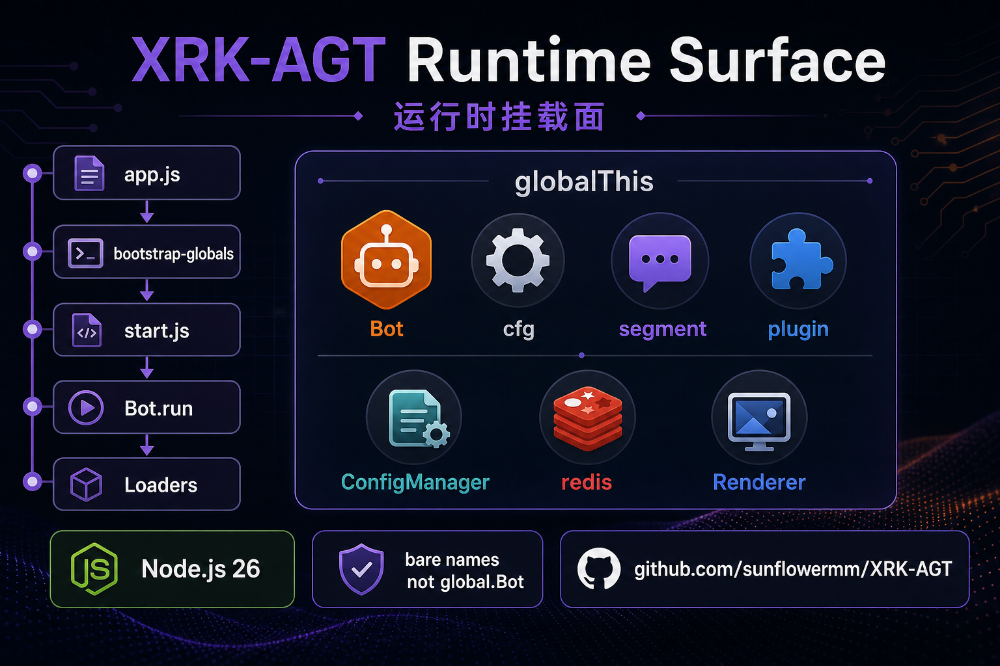
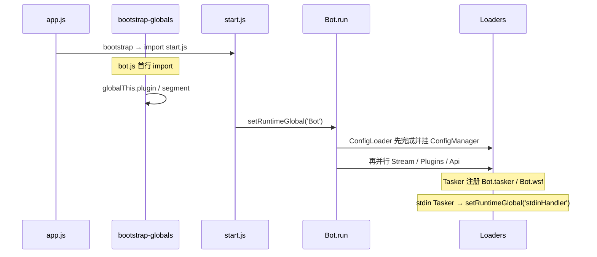

# 运行时挂载面（开发者速查）

> **读者**：在 `core/` 写插件、API、工作流、Tasker 的开发者  
> **源码**：`src/bot.js`、`src/bootstrap-globals.js`、各 `src/infrastructure/*/loader.js`  
> **基类契约**：[base-classes.md](base-classes.md) · **Loader 模式**：[infrastructure-shared.md](infrastructure-shared.md)

本篇透明列出：**何时挂载、挂在哪里、业务代码怎么用**。不重复架构图（见 [底层架构设计.md](底层架构设计.md)）。



---

## 全局标识符写法（必读）

运行时对象挂在 **`globalThis`**（Node 里与 `global` 同一对象）。业务模块里**直接写裸名**即可，ESLint 已声明 `Bot`、`segment`、`logger`、`plugin`、`Renderer`（见根目录 `eslint.config.js`）。

| 场景 | 正确写法 | 不要写 |
|------|----------|--------|
| 插件 / Tasker / 事件 | `Bot`、`segment`、`Bot.makeLog()` | `global.Bot`、`import Bot`、`new Bot()` |
| HTTP handler | `req.bot` 或 handler 第三参 `Bot` | `global.Bot`（除非无注入时的兜底，优先 `req.bot ?? Bot`） |
| 配置 | `import cfg from '#infrastructure/config/config.js'` | 无必要不写 `global.cfg`（与 import 同一单例） |
| 插件基类 | `import plugin from '#infrastructure/plugins/plugin.js'` | 新代码勿依赖 `global.plugin` |
| oicq 消息段 | `segment.image(url)` | `import { segment } from '#oicq'` |
| **仅** `src/` 挂载点 | `setRuntimeGlobal(name, value)`（`#utils/runtime-globals.js`） | 手写 `global.x = …; globalThis.x = …` 双份 |

**为何文档/源码里仍出现 `global.`？** 历史写法；与裸名等价。框架在 `src/` 用 `setRuntimeGlobal` 统一写入；**`core/` 业务一律裸名或 import，不必加 `global.` 前缀。**

配置在 `Bot.run` 完成 `ConfigLoader.load()` **之前**不可用；此前请用 ConfigBase / 默认模板，勿假设 `cfg` 已就绪。

### 框架单测 / 集成测

`tests/helpers/bootstrap.mjs` 在 `describe(..., { before: bootstrapTestEnv })` 中：

1. 设置 `process.env.XRK_TEST = '1'`
2. **import `src/bootstrap-globals.js`**（与生产 `bot.js` 一致，挂载 `plugin` / `segment`）
3. stub 最小 `Bot`（EventEmitter + `makeLog` / `tasker` / `em`）

未执行 bootstrap-globals 时，system-Core 插件（`extends plugin` 裸名）会在 PluginsLoader 导入阶段报 `plugin is not defined`。ApiLoader 集成断言的 key 见 [api-loader.md](api-loader.md)（`resolveCoreModuleKey`，如 `ai-workspace`）。

---

## 挂载时间线



| 阶段 | 挂载 | 源码 | 业务写法 |
|------|------|------|----------|
| `bot.js` 模块加载 | `plugin`、`segment` | `src/bootstrap-globals.js` | 裸名 `segment`；基类 `import plugin from '…'` |
| `bot.js` constructor | HTTP 业务层方法、`callSubserver` 等 | `Bot._mountHttpBusinessMethods()`、`_initSubServer()` | `Bot.handleRedirect(req,res)` 等 |
| `start.js` / `TaskerLoader` | `Bot` | `start.js`、`tasker/loader.js` | 裸名 `Bot`，勿 `new Bot()` |
| `Bot.run` 配置阶段 | `cfg`、`ConfigManager` | **先** `ConfigLoader.load()` 再其它 Loader | `import cfg` 或裸 `cfg`（配置阶段完成后） |
| 模块 side-effect | `Renderer`（基类） | `renderer/loader.js` 顶层 | 继承 `Renderer`；实例 `getRenderer()` |
| stdin Tasker 初始化 | `stdinHandler` | `core/system-Core/tasker/stdin.js` | 一般业务不直接碰 |
| `ApiLoader.register` | `req.bot`、`req.apiLoader` | `http/loader.js` 中间件 | handler 第三参或 `req.bot` |

---

## 全局对象

| 名称 | 类型 | 挂载时机 | 业务写法 |
|------|------|----------|----------|
| `Bot` | `Bot` 实例（Proxy） | 启动后 | 裸名 `Bot` |
| `cfg` | `Cfg` 实例 | `ConfigLoader.load` 成功后 | `import cfg from '#infrastructure/config/config.js'` |
| `ConfigManager` | `ConfigLoader` 单例 | 同上 | 一般 `import ConfigLoader`；热路径可用裸名 |
| `segment` | oicq segment 工厂 | `bootstrap-globals` | 裸名 `segment.image()` |
| `plugin` | 插件基类 | `bootstrap-globals` | 新代码 **import 基类**，勿靠 `global.plugin` |
| `Renderer` | 渲染器基类 | `renderer/loader.js` | 实现放 `src/renderers/<名>/` |
| `stdinHandler` | stdin Tasker 实例 | stdin Tasker `init` | 框架内部 |

---

## `Bot` 实例面

`Bot` 是 **`Proxy(Bot)`**（`Bot._createProxy()`），解析顺序：

1. `Bot` 自身属性 / 方法  
2. `Bot.bots[self_id]` 子 Bot（Tasker 注册，如 `Bot['123456']`）  
3. **`BotUtil` 静态成员**（如 `Bot.makeLog` → 实际 `BotUtil.makeLog`）

### 常用属性

| 属性 | 说明 |
|------|------|
| `Bot.tasker` | Tasker 实例数组 |
| `Bot.wsf` | WebSocket 路径 → 处理函数 |
| `Bot.uin` | 已连接 QQ 号列表（带 `toJSON()` 随机选取） |
| `Bot.bots` / `Bot[self_id]` | 各平台子 Bot 对象 |
| `Bot.express` | Express 应用 |
| `Bot.httpBusiness` | `HTTPBusinessLayer` 实例 |
| `Bot.ApiLoader` | ApiLoader 类引用 |

### 常用方法（Bot 本体）

| 方法 | 说明 |
|------|------|
| `Bot.em(name, data, asJson?, options?)` | 触发事件总线；Tasker / 监听器 / 插件链路入口 |
| `Bot.e(...)` | `em` 别名 |
| `Bot.callStdin(command, options?)` | 经 stdin Tasker 执行命令 |
| `Bot.getServerUrl()` | 当前 HTTP 基址（含 127.0.0.1 回落） |
| `Bot.getPublicServerUrl(override?)` | 对外直链基址（代理/`server.url`/override；无公网配置时返回 `''`） |
| `Bot.callRoute(path, options?)` | 内部调用已注册 API 路由 |
| `Bot.checkApiAuthorization(req)` | `/api/*` 鉴权（HttpApi 自动调用） |
| `Bot.makeError(msg, type?, details?)` | 标准化错误对象 |
| `Bot.run(options?)` | 启动入口（仅 `start.js` 调用） |

### 挂载自 HTTP 业务层（`_mountHttpBusinessMethods`）

配置加载后 `_reinitHttpBusiness()` 会重建并重新挂载：

| Bot 上的方法 | 委托自 |
|--------------|--------|
| `selectProxyUpstream(domain, algorithm, clientIP?)` | `httpBusiness.proxyManager` |
| `getProxyStats()` | `httpBusiness.proxyManager` |
| `isCDNRequest(req)` | `httpBusiness.cdnManager` |
| `setCDNHeaders(res, filePath, req)` | `httpBusiness.cdnManager` |
| `handleRedirect(req, res)` | `httpBusiness.redirectManager` |

### 挂载自子服务端（`_initSubServer`）

| 方法 | 说明 |
|------|------|
| `callSubserver(path, options?)` | 调 Python 子服务 `apis/` |
| `fetchSubserverToPath(path, options?)` | 拉取子服务文件到本地路径 |

### 经 Proxy 透传的 `BotUtil`

业务里写 `Bot.makeLog(level, msg, tag)`、`Bot.sleep(ms)` 等与 `#utils/botutil.js` 静态方法等价。完整列表见 [botutil.md](botutil.md)。

---

## Loader 单例（import 即用）

| 单例 | import 路径 | 常用 API |
|------|-------------|----------|
| StreamLoader | `#infrastructure/aistream/loader.js` | `getStream(name)`、`getStreamClass(name)` |
| PluginsLoader | `#infrastructure/plugins/loader.js` | `deal(e)`（框架内）；插件通过基类间接使用 |
| ApiLoader | `#infrastructure/http/loader.js` | `getApiList()`、`apis` Map（key = `resolveCoreModuleKey`，如 `ai-workspace`） |
| ConfigLoader | `#infrastructure/commonconfig/loader.js` | `get(name)`、`getList()` |
| RendererLoader | `#infrastructure/renderer/loader.js` | `getRenderer(name?)`、`ensureLoaded()` |
| TaskerLoader | `#infrastructure/tasker/loader.js` | `load(bot)`（框架内） |
| ListenerLoader | `#infrastructure/listener/loader.js` | `load(bot)`（框架内） |
| `cfg` | `#infrastructure/config/config.js` | `cfg.server`、`getGlobalConfig`、`getServerConfig` |

插件基类已封装：`this.getStream(name)` → `StreamLoader.getStream(name)`（见 `plugin.js`）。

---

## 按场景的写法

### 插件（`core/*/plugin/` · `subserver/*/apis/*/core/plugin/`）

主服 `PluginsLoader` 与 `ConfigLoader` 等会同时扫描仓库根 `core/<Core>/` 与子服业务插件下的 `apis/<group>/core/`（见 `subserver/CONTRACT.md`）。

```javascript
import plugin from '#infrastructure/plugins/plugin.js';

export default class Demo extends plugin {
  constructor() {
    super({ name: 'demo', event: 'message', rule: [{ reg: /^#hi$/ }], handler: 'hi' });
  }
  async hi(e) {
    Bot.makeLog('info', 'hi', this.name);           // Proxy → BotUtil
    const stream = this.getStream('chat');          // → StreamLoader
    return this.reply('pong');                      // → e.reply / 事件回复链
  }
}
```

可用：`segment`、`Bot`、`Bot[self_id]`；**不要** `new Bot()`、`import #oicq`。

### HTTP API（`core/*/http/`）

```javascript
import { HttpResponse } from '#utils/http-utils.js';

export default {
  name: 'demo-api',
  routes: [{
    method: 'GET',
    path: '/api/demo/ping',
    systemAuth: false,
    handler: async (req, res, Bot) => {
      return HttpResponse.success(res, { url: Bot.getServerUrl() });
    }
  }]
};
```

`req.bot` 与 handler 第三参 `Bot` 相同；`/api/*` 默认鉴权，公开路由设 `systemAuth: false`。

### AI 工作流（`core/*/stream/`）

```javascript
import AIStream from '#infrastructure/aistream/aistream.js';

export default class MyStream extends AIStream {
  constructor() {
    super({ name: 'my-stream', description: '...' });
  }
  async init() {
    await super.init();
    this.registerMCPTool('my_tool', { description: '...', inputSchema: {}, handler: async () => ({}) });
  }
}
```

### Tasker（`core/*/tasker/`）

模块加载时在顶层向 `Bot.tasker` 注册；可写 `Bot.wsf['/path'] = handler`。规范见 [tasker-base-spec.md](tasker-base-spec.md)。

### 事件监听（`core/*/events/`）

继承 `EventListenerBase`，实现 `async init()`；Loader 注入 `this.bot`。见 [base-classes.md](base-classes.md#eventlistenerbaselistenerbasejs)。

---

## 勿做

- 在 `core/` 业务里 `new Bot()` 或改 `src/infrastructure/` 加载逻辑  
- 重复实现鉴权、`util.promisify(exec)`、`node-fetch`（见 [node-26-runtime.md](node-26-runtime.md)）  
- 在 constructor 里 `new Map()` 做插件/Loader 级缓存（用热重载安全的**类字段**）  
- 在 `core/` 写 `global.Bot` / `global.segment` / `global.cfg`（用裸名或 import）  
- 在 `Bot.run` 配置加载完成前使用 `cfg`（此前用 ConfigBase / 默认模板）

---

## 相关文档

- [coding-style.md](coding-style.md) — 写法与性能速查  
- [base-classes.md](base-classes.md) — 各基类 export 形状  
- [bot.md](bot.md) — Bot 生命周期、HTTP/WS、关闭流程  
- [startup.md](startup.md) — 启动链  
- [config-base.md](config-base.md) — `cfg` 与 ConfigBase  

---

*最后更新：2026-06-14*
