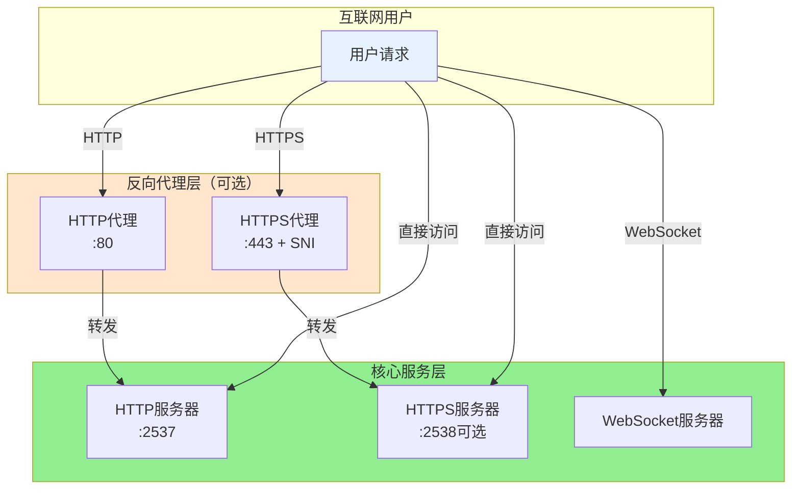
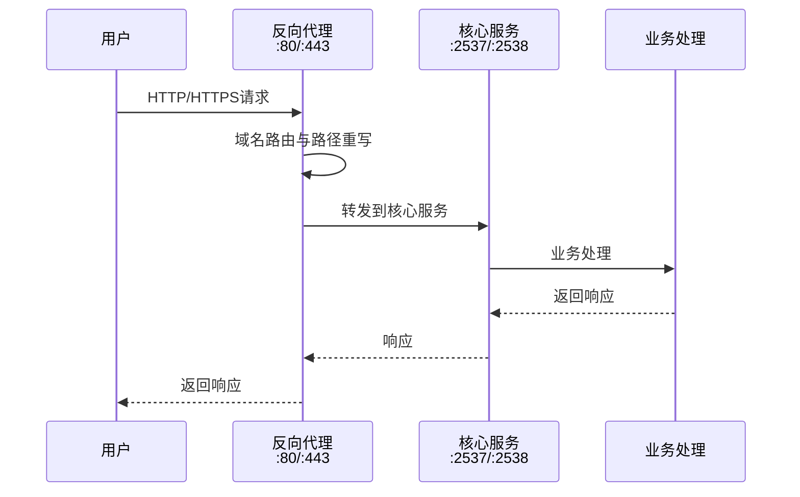
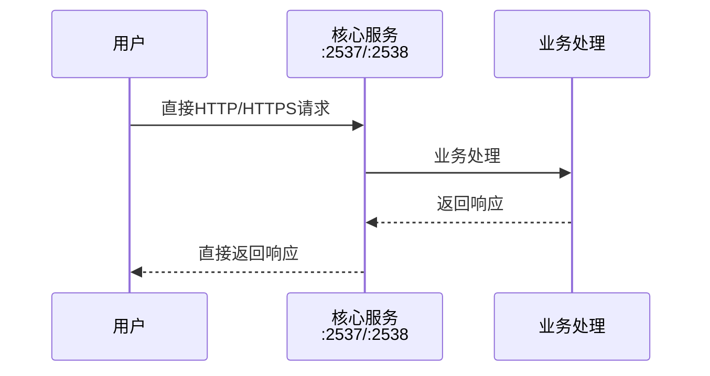
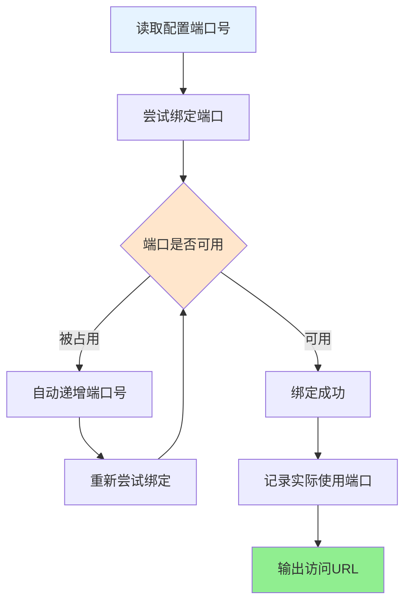

# Server 服务器架构文档

> XRK-AGT 的 Server 层是系统的核心业务层，提供统一的 HTTP/HTTPS/WebSocket 服务、反向代理、静态文件服务、安全中间件等能力，支持快速搭建各种通讯协议的客户端或服务端。

## 📋 快速导航

- [返回文档首页](../完整文档.md)
- [Bot主类文档](bot.md)
- [HTTP API框架文档](../src/infrastructure/http/README.md)
- [项目总览](../PROJECT_OVERVIEW.md)

## 📑 目录

- [架构总览](#架构总览)
- [核心特性](#核心特性)
- [端口运行逻辑](#端口运行逻辑)
- [HTTP/HTTPS 服务](#httphttps-服务)
- [反向代理系统](#反向代理系统)
- [WebSocket 支持](#websocket-支持)
- [静态文件服务](#静态文件服务)
- [安全与中间件](#安全与中间件)
- [平台 SDK 适配度](#平台-sdk-适配度)
- [快速搭建指南](#快速搭建指南)
- [配置参考](#配置参考)
- [架构优越性](#架构优越性)
- [最佳实践](#最佳实践)
- [常见问题](#常见问题)

---

## 架构总览

### 系统架构层次

```mermaid
flowchart TB
    subgraph Clients["客户端层"]
        Browser[浏览器/Web前端]
        Mobile[移动端应用]
        ThirdAPI[第三方API调用]
        WSClient[WebSocket客户端]
        SDK[平台SDK<br/>OneBot/ComWeChat等]
    end
    
    subgraph Proxy["反向代理层（可选）"]
        HTTPProxy[HTTP代理服务器<br/>:80]
        HTTPSProxy[HTTPS代理服务器<br/>:443 + SNI]
        DomainRoute[域名路由与路径重写]
    end
    
    subgraph Core["核心服务层<br/>src/bot.js"]
        Express[Express应用<br/>中间件容器]
        HTTPServer[HTTP服务器<br/>:2537]
        HTTPSServer[HTTPS服务器<br/>:2538可选]
        WSServer[WebSocket服务器<br/>协议升级]
    end
    
    subgraph Middleware["中间件层（按顺序）"]
        CORS[CORS跨域处理]
        Helmet[Helmet安全头]
        Compression[响应压缩]
        RateLimit[速率限制]
        BodyParser[请求体解析]
        Auth[API认证]
    end
    
    subgraph Routes["路由层（按优先级）"]
        SystemRoute[系统路由<br/>/status /health]
        FileRoute[文件服务路由<br/>/File]
        APIRoute[API路由<br/>/api/*]
        MediaRoute[数据静态服务<br/>/media /uploads]
        StaticRoute[静态文件服务<br/>/www/*]
    end
    
    subgraph Business["业务层"]
        Plugins[插件系统<br/>PluginsLoader]
        Streams[工作流系统<br/>StreamLoader]
        Taskers[Tasker层<br/>TaskerLoader]
    end
    
    Clients --> Proxy
    Proxy --> Core
    Core --> Middleware
    Middleware --> Routes
    Routes --> Business
    
    style Clients fill:#E6F3FF
    style Core fill:#FFE6CC
    style Business fill:#90EE90
```



### 数据流向

```mermaid
sequenceDiagram
    participant Client as 客户端
    participant Proxy as 反向代理（可选）
    participant Server as 核心服务
    participant Middleware as 中间件层
    participant Route as 路由层
    participant Business as 业务层
    
    Note over Client,Business: HTTP请求流程
    Client->>Proxy: HTTP/HTTPS请求
    Proxy->>Server: 转发请求
    Server->>Middleware: 中间件处理
    Middleware->>Route: 路由匹配
    Route->>Business: 业务处理
    Business-->>Route: 返回响应
    Route-->>Middleware: 响应
    Middleware-->>Server: 响应
    Server-->>Proxy: 响应
    Proxy-->>Client: 响应
    
    Note over Client,Business: WebSocket流程
    Client->>Server: HTTP升级请求
    Server->>Server: WebSocket协议升级
    Server->>Route: 路径路由
    Route->>Business: Tasker处理
    Business<-->Business: 双向通信
```

---

## 核心特性

### 1. 统一的服务器架构

- **单一入口**：所有HTTP/HTTPS/WebSocket请求统一由 `Bot` 类管理
- **分层设计**：清晰的中间件层、路由层、业务层分离
- **事件驱动**：基于 EventEmitter，支持生命周期事件

### 2. 灵活的端口管理

- **自动端口检测**：启动时自动检测可用端口
- **多端口支持**：同时支持HTTP和HTTPS端口
- **端口冲突处理**：智能处理端口占用情况

### 3. 强大的反向代理

- **多域名支持**：一个服务器支持多个域名
- **SNI支持**：每个域名可以有自己的SSL证书
- **路径重写**：灵活的路径重写规则
- **HTTP/2支持**：提升HTTPS性能

### 4. 完善的WebSocket支持

- **协议升级**：自动处理HTTP到WebSocket的升级
- **路径路由**：支持多个WebSocket路径
- **认证集成**：与HTTP认证系统统一

### 5. 开箱即用的静态文件服务

- **零配置**：`www/` 目录自动提供静态文件服务
- **智能索引**：自动查找 index.html
- **缓存优化**：合理的缓存策略

---

## 端口运行逻辑

### 端口架构



**端口说明**：

- **HTTP端口**（默认2537）：核心HTTP服务
- **HTTPS端口**（默认2538，可选）：HTTPS服务
- **反向代理端口**（80/443，可选）：多域名代理服务
  ├─ HTTP代理 :80 → 转发到核心服务 :2537
  └─ HTTPS代理 :443 → 转发到核心服务 :2538
    ↓
核心服务层
  ├─ HTTP服务器 :2537（实际端口，自动检测）
  └─ HTTPS服务器 :2538（实际端口，自动检测）
    ↓
业务处理
```

### 端口运行流程

**启用反向代理时**:



**直接访问时**:



### 端口配置关系表

| 配置项 | 默认值 | 说明 |
|--------|--------|------|
| 核心HTTP端口 | 2537 | 内部服务端口，可配置 |
| 核心HTTPS端口 | 2538 | 内部服务端口，可配置 |
| 代理HTTP端口 | 80 | 反向代理端口，需要root权限 |
| 代理HTTPS端口 | 443 | 反向代理端口，需要root权限 |
| 实际HTTP端口 | 自动检测 | 如果配置端口被占用，自动递增 |
| 实际HTTPS端口 | 自动检测 | 如果配置端口被占用，自动递增 |

### 端口配置说明

#### 1. 核心服务端口

- **HTTP端口**：默认 `2537`，可通过配置修改
- **HTTPS端口**：默认 `2538`，需要启用HTTPS
- **实际端口**：系统会自动检测并选择可用端口

#### 2. 反向代理端口

- **HTTP代理端口**：默认 `80`，需要root权限
- **HTTPS代理端口**：默认 `443`，需要root权限
- **SNI支持**：每个域名可以有不同的SSL证书

#### 3. 端口检测逻辑



**检测步骤**：

1. 读取配置中的端口号
2. 尝试绑定端口
3. 如果端口被占用：自动递增端口号，重新尝试绑定
4. 记录实际使用的端口
5. 启动成功后输出访问URL

---

## HTTP/HTTPS 服务

### HTTP 服务器

```javascript
// 核心HTTP服务器初始化
_initHttpServer() {
  this.server = http.createServer(this.express)
    .on("error", err => this._handleServerError(err, false))
    .on("upgrade", this.wsConnect.bind(this));
}
```

**特性**：
- 基于 Express 应用
- 自动处理 WebSocket 升级
- 完善的错误处理

### HTTPS 服务器

```javascript
// HTTPS服务器支持
- 支持自定义SSL证书
- 支持HTTP/2协议
- 支持HSTS（HTTP严格传输安全）
- 可配置TLS版本
```

**配置示例**：
```yaml
https:
  enabled: true
  certificate:
    key: "/path/to/privkey.pem"
    cert: "/path/to/fullchain.pem"
    ca: "/path/to/chain.pem"  # 可选
  tls:
    minVersion: "TLSv1.2"
    http2: true
  hsts:
    enabled: true
    maxAge: 31536000
```

### 中间件执行顺序

```
请求进入
  ↓
1. CORS跨域处理
  ↓
2. Helmet安全头
  ↓
3. 响应压缩（Compression）
  ↓
4. 速率限制（Rate Limiting）
  ↓
5. 请求体解析（Body Parser）
  ↓
6. API认证检查（如果需要）
  ↓
7. 路由匹配
  ↓
返回响应
```

---

## 反向代理系统

### 反向代理架构

```
互联网用户
  ├─ 用户1访问 xrkk.cc
  └─ 用户2访问 api.example.com
        ↓
反向代理服务器
  ├─ 域名路由器（根据Host头判断）
  ├─ SNI证书选择器（HTTPS时选择对应证书）
  └─ 路径重写器（可选）
        ↓
后端服务
  ├─ 本地服务 :2537（默认）
  ├─ 远程服务1 :3000（可选）
  └─ 远程服务2 :3001（可选）
```

### 反向代理工作流程

```
1. 用户请求到达反向代理（:80/:443）
2. 解析请求的Host头，确定目标域名
3. 查找域名配置，选择对应的SSL证书（HTTPS）
4. 应用路径重写规则（如果配置）
5. 转发请求到目标服务（本地:2537或外部服务）
6. 返回响应给用户
```

### 反向代理特性

#### 1. 多域名支持

```yaml
proxy:
  enabled: true
  domains:
    - domain: "xrkk.cc"
      ssl:
        enabled: true
        certificate:
          key: "/path/to/xrkk.cc.key"
          cert: "/path/to/xrkk.cc.cert"
      target: "http://localhost:2537"
    
    - domain: "api.example.com"
      ssl:
        enabled: true
        certificate:
          key: "/path/to/api.example.com.key"
          cert: "/path/to/api.example.com.cert"
      target: "http://localhost:3000"
      rewritePath:
        from: "/api"
        to: "/"
```

#### 2. SNI（Server Name Indication）

- **多证书支持**：每个域名可以有自己的SSL证书
- **自动选择**：根据请求的域名自动选择对应证书
- **HTTP/2支持**：提升HTTPS性能

#### 3. 路径重写

```yaml
rewritePath:
  from: "/old-path"
  to: "/new-path"
```

**示例**：
- 请求：`https://api.example.com/api/users`
- 重写后：`http://localhost:3000/users`

#### 4. WebSocket 代理

```yaml
# 默认启用WebSocket代理
ws: true  # 或 false 禁用
```

---

## WebSocket 支持

### WebSocket 架构

```
WebSocket客户端
  ↓ HTTP Upgrade请求
HTTP服务器
  ↓ 协议升级
WebSocket服务器
  ↓ 路径路由
  ├─ /OneBotv11 → OneBotv11 Handler
  ├─ /device → Device Handler
  └─ /custom → 自定义 Handler
```

### WebSocket 连接流程

```
1. 客户端发送HTTP Upgrade请求
2. 服务器检查路径是否注册（Bot.wsf[path]）
3. 执行认证检查（如果需要）
4. 升级为WebSocket连接
5. 调用对应的Handler处理消息
6. 建立双向通信
```

### WebSocket 注册

```javascript
// Tasker注册WebSocket路径
Bot.wsf['OneBotv11'].push((ws, ...args) => {
  ws.on('message', data => {
    // 处理消息
  });
});
```

### WebSocket 认证

- **统一认证**：使用与HTTP相同的认证机制
- **白名单支持**：某些路径可以免认证
- **API Key支持**：支持通过API Key认证

---

## 静态文件服务

### 静态文件架构

```
HTTP请求
  ↓
路径匹配判断
  ├─ /api/* → API路由（跳过静态服务）
  ├─ /media/* → 数据目录（data/media）
  ├─ /uploads/* → 数据目录（data/uploads）
  ├─ /www/* → 静态文件（www/）
  └─ / → 自动查找index.html
```

### 静态文件服务优先级

```
1. API路由（/api/*）- 最高优先级，跳过静态服务
2. 数据目录（/media, /uploads）- 映射到data目录
3. 静态文件（/www/*）- 映射到www目录
4. 根路径（/）- 自动查找index.html
```

### 静态文件配置

```yaml
static:
  index:
    - "index.html"
    - "index.htm"
    - "default.html"
  extensions: false
  cache:
    static: 86400    # CSS/JS文件缓存1天
    images: 604800   # 图片文件缓存7天
  cacheTime: "1d"
```

### 开箱即用的Web控制台

- **零配置**：`www/xrk/` 目录自动提供Web控制台
- **访问路径**：`http://localhost:2537/xrk/`
- **功能完整**：API测试、配置管理、插件管理、设备管理等

---

## 安全与中间件

### 安全中间件栈

```
请求
  ↓
1. Helmet安全头（X-Content-Type-Options, X-Frame-Options等）
  ↓
2. CORS跨域（Access-Control-Allow-Origin等）
  ↓
3. 速率限制（防止恶意请求）
  ↓
4. API认证（API Key检查）
  ↓
5. 请求体解析（JSON/URL-encoded/Multipart）
  ↓
路由处理
```

### 1. Helmet 安全头

```javascript
// 自动添加安全相关的HTTP头部
- X-Content-Type-Options: nosniff
- X-Frame-Options: SAMEORIGIN
- X-XSS-Protection: 1; mode=block
- Strict-Transport-Security: max-age=31536000
```

### 2. CORS 跨域

```yaml
cors:
  enabled: true
  origins: ["*"]  # 或具体域名列表
  methods: ["GET", "POST", "PUT", "DELETE", "OPTIONS"]
  headers: ["Content-Type", "Authorization", "X-API-Key"]
  credentials: false
  maxAge: 86400
```

### 3. 速率限制

```yaml
rateLimit:
  enabled: true
  global:
    windowMs: 900000  # 15分钟
    max: 1000         # 最大1000次请求
  api:
    windowMs: 60000   # 1分钟
    max: 60           # 最大60次请求
```

### 4. API 认证

```yaml
auth:
  apiKey:
    enabled: true
    file: "config/server_config/api_key.json"
    length: 64
  whitelist:
    - "/"
    - "/health"
    - "/status"
    - "/xrk"
```

---

## 平台 SDK 适配度

### Node.js 平台 SDK 适配度表

| 平台/协议 | SDK名称 | 适配度 | 说明 | 推荐使用场景 |
|----------|---------|--------|------|------------|
| **OneBot v11** | `oicq` / `icqq` | ⭐⭐⭐⭐⭐ | 完全支持，官方推荐 | QQ机器人开发 |
| **OneBot v11** | `go-cqhttp` | ⭐⭐⭐⭐⭐ | 通过WebSocket连接 | 稳定生产环境 |
| **ComWeChat** | 自定义SDK | ⭐⭐⭐⭐ | 支持，需要配置 | 微信机器人 |
| **WebSocket** | `ws` | ⭐⭐⭐⭐⭐ | 原生支持 | 实时通讯 |
| **HTTP/HTTPS** | `express` | ⭐⭐⭐⭐⭐ | 核心框架 | REST API |
| **gRPC** | `@grpc/grpc-js` | ⭐⭐⭐ | 需要额外配置 | 微服务架构 |
| **MQTT** | `mqtt` | ⭐⭐⭐⭐ | 需要Tasker实现 | IoT设备 |
| **TCP/UDP** | `net` / `dgram` | ⭐⭐⭐⭐ | Node.js原生 | 自定义协议 |

### SDK 集成示例

#### 1. OneBot v11 (oicq/icqq)

```javascript
// core/tasker/OneBotv11.js
import { createClient } from 'oicq';

class OneBotv11Tasker {
  load() {
    const client = createClient(this.qq);
    client.on('message', (e) => {
      Bot.em('onebot.message', {
        event_id: `onebot_${Date.now()}`,
        // ... 事件数据
      });
    });
  }
}
```

#### 2. WebSocket 客户端

```javascript
// 客户端连接示例
const ws = new WebSocket('ws://localhost:2537/OneBotv11');
ws.on('open', () => {
  console.log('WebSocket连接成功');
});
```

#### 3. HTTP API 调用

```javascript
// 使用fetch调用API
const response = await fetch('http://localhost:2537/api/status', {
  headers: {
    'X-API-Key': 'your-api-key'
  }
});
const data = await response.json();
```

---

## 快速搭建指南

### 1. 基础HTTP服务（5分钟）

```yaml
# config/default_config/server.yaml
server:
  name: "XRK Server"
  host: "0.0.0.0"
  url: ""

# 启动
node app
# 访问: http://localhost:2537
# Web控制台: http://localhost:2537/xrk/
```

### 2. 启用HTTPS（10分钟）

```yaml
https:
  enabled: true
  certificate:
    key: "/path/to/privkey.pem"
    cert: "/path/to/fullchain.pem"
  tls:
    minVersion: "TLSv1.2"
    http2: true
```

### 3. 配置反向代理（15分钟）

```yaml
proxy:
  enabled: true
  httpPort: 80
  httpsPort: 443
  domains:
    - domain: "xrkk.cc"
      ssl:
        enabled: true
        certificate:
          key: "/path/to/xrkk.cc.key"
          cert: "/path/to/xrkk.cc.cert"
      target: "http://localhost:2537"
```

### 4. 搭建WebSocket服务端

```javascript
// core/tasker/MyWebSocketTasker.js
export default class MyWebSocketTasker {
  id = 'myws'
  name = 'MyWebSocket'
  path = 'myws'

  load() {
    Bot.wsf[this.path].push((ws, req) => {
      ws.on('message', (data) => {
        // 处理消息
        const message = JSON.parse(data);
        Bot.em('myws.message', {
          event_id: `myws_${Date.now()}`,
          message: message
        });
      });
    });
  }
}
```

**访问**：`ws://localhost:2537/myws`

### 5. 搭建HTTP API服务端

```javascript
// core/http/myapi.js
export default {
  name: 'my-api',
  priority: 100,
  routes: [
    {
      method: 'GET',
      path: '/api/my-endpoint',
      handler: async (req, res) => {
        res.json({ success: true, data: 'Hello World' });
      }
    }
  ]
};
```

**访问**：`http://localhost:2537/api/my-endpoint`

### 6. 搭建TCP/UDP服务端

```javascript
// core/tasker/MyTCPTasker.js
import net from 'net';

export default class MyTCPTasker {
  load() {
    const server = net.createServer((socket) => {
      socket.on('data', (data) => {
        // 处理TCP数据
        Bot.em('tcp.message', {
          event_id: `tcp_${Date.now()}`,
          data: data.toString()
        });
      });
    });
    
    server.listen(3000, () => {
      console.log('TCP服务器启动在端口3000');
    });
  }
}
```

---

## 配置参考

### 完整配置示例

```yaml
# config/default_config/server.yaml

# 基础配置
server:
  name: "XRK Server"
  host: "0.0.0.0"
  url: "https://xrkk.cc"

# 反向代理（可选）
proxy:
  enabled: true
  httpPort: 80
  httpsPort: 443
  domains:
    - domain: "xrkk.cc"
      ssl:
        enabled: true
        certificate:
          key: "/path/to/xrkk.cc.key"
          cert: "/path/to/xrkk.cc.cert"
      target: "http://localhost:2537"
      rewritePath:
        from: "/api"
        to: "/"

# HTTPS配置
https:
  enabled: true
  certificate:
    key: "/path/to/privkey.pem"
    cert: "/path/to/fullchain.pem"
  tls:
    minVersion: "TLSv1.2"
    http2: true
  hsts:
    enabled: true
    maxAge: 31536000

# 静态文件
static:
  index: ["index.html", "index.htm"]
  cache:
    static: 86400
    images: 604800

# 安全配置
security:
  helmet:
    enabled: true
  hiddenFiles:
    - "^\\..*"
    - "node_modules"

# CORS
cors:
  enabled: true
  origins: ["*"]
  methods: ["GET", "POST", "PUT", "DELETE", "OPTIONS"]
  headers: ["Content-Type", "Authorization", "X-API-Key"]

# 认证
auth:
  apiKey:
    enabled: true
    file: "config/server_config/api_key.json"
  whitelist:
    - "/"
    - "/health"
    - "/xrk"

# 速率限制
rateLimit:
  enabled: true
  global:
    windowMs: 900000
    max: 1000
  api:
    windowMs: 60000
    max: 60
```

---

## 架构优越性

### 1. 统一的服务入口

**优势**：
- 所有HTTP/HTTPS/WebSocket请求统一管理
- 统一的认证、日志、监控
- 便于扩展和维护

**对比传统方案**：
```
传统方案：
- Nginx（反向代理）
- Node.js应用（业务逻辑）
- 需要配置多个服务

XRK-AGT方案：
- 一个Bot实例
- 内置反向代理
- 统一配置管理
```

### 2. 灵活的端口管理

**优势**：
- 自动端口检测和冲突处理
- 支持多端口同时运行
- 智能端口分配

### 3. 强大的反向代理

**优势**：
- 多域名支持（SNI）
- 路径重写
- WebSocket代理
- 无需额外Nginx配置

### 4. 开箱即用的Web控制台

**优势**：
- 零配置启动
- 完整的API测试界面
- 实时监控和日志

### 5. 完善的中间件系统

**优势**：
- 安全头自动添加
- CORS跨域支持
- 速率限制
- API认证

### 6. 快速搭建能力

**优势**：
- 5分钟搭建HTTP服务
- 10分钟启用HTTPS
- 15分钟配置反向代理
- 支持多种协议（HTTP/WebSocket/TCP/UDP）

---

## 最佳实践

### 1. 生产环境配置

```yaml
# 启用HTTPS
https:
  enabled: true
  tls:
    minVersion: "TLSv1.2"
    http2: true

# 启用反向代理
proxy:
  enabled: true
  httpsPort: 443

# 严格的安全配置
security:
  helmet:
    enabled: true
cors:
  origins: ["https://yourdomain.com"]
rateLimit:
  enabled: true
```

### 2. 开发环境配置

```yaml
# 简化配置
https:
  enabled: false
proxy:
  enabled: false
cors:
  origins: ["*"]
rateLimit:
  enabled: false
```

### 3. 多服务部署

```yaml
# 使用反向代理分发到不同服务
proxy:
  domains:
    - domain: "api.example.com"
      target: "http://localhost:3000"
    - domain: "web.example.com"
      target: "http://localhost:3001"
    - domain: "ws.example.com"
      target: "ws://localhost:3002"
```

---

## 常见问题

### Q: 如何修改默认端口？

A: 在 `config/default_config/server.yaml` 中配置，或通过环境变量设置。

### Q: 反向代理和直接访问有什么区别？

A: 反向代理可以：
- 支持多域名
- 提供SSL终止
- 路径重写
- 负载均衡

直接访问更简单，适合单服务场景。

### Q: 如何添加自定义中间件？

A: 在 `Bot` 类的 `_setupMiddleware` 方法中添加，或通过插件系统扩展。

### Q: WebSocket连接失败怎么办？

A: 检查：
1. WebSocket路径是否正确注册
2. 认证是否通过
3. 防火墙是否开放端口

### Q: 如何实现负载均衡？

A: 使用反向代理的 `target` 配置，可以指向多个后端服务（需要额外的负载均衡器）。

---

## 总结

XRK-AGT 的 Server 层提供了：

✅ **统一的服务器架构** - 一个入口管理所有服务  
✅ **灵活的端口管理** - 自动检测和冲突处理  
✅ **强大的反向代理** - 多域名、SNI、路径重写  
✅ **完善的WebSocket支持** - 协议升级、路径路由  
✅ **开箱即用的静态服务** - 零配置Web控制台  
✅ **完善的安全中间件** - 安全头、CORS、速率限制  
✅ **快速搭建能力** - 5-15分钟搭建各种服务  

这使得 XRK-AGT 能够快速搭建各种通讯协议的客户端或服务端，是系统架构的核心优势之一。

