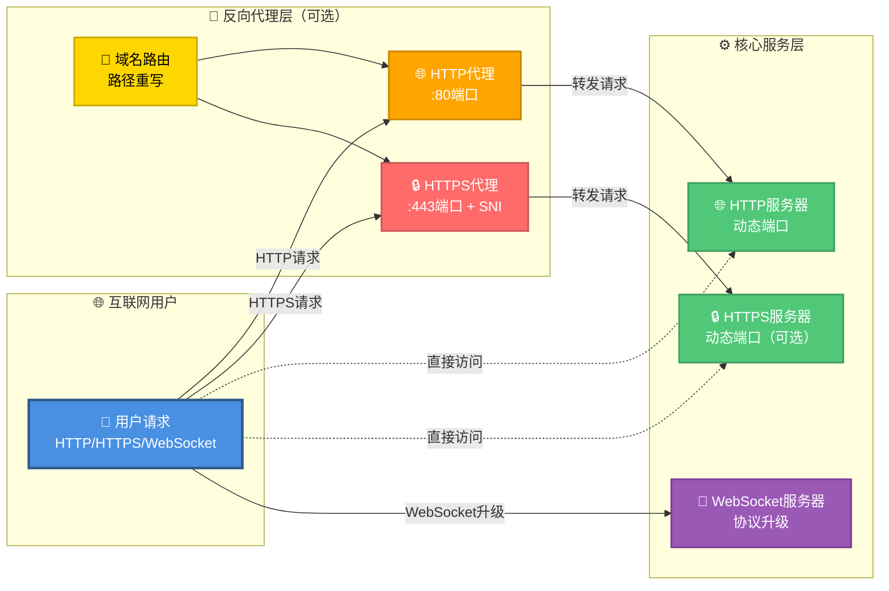
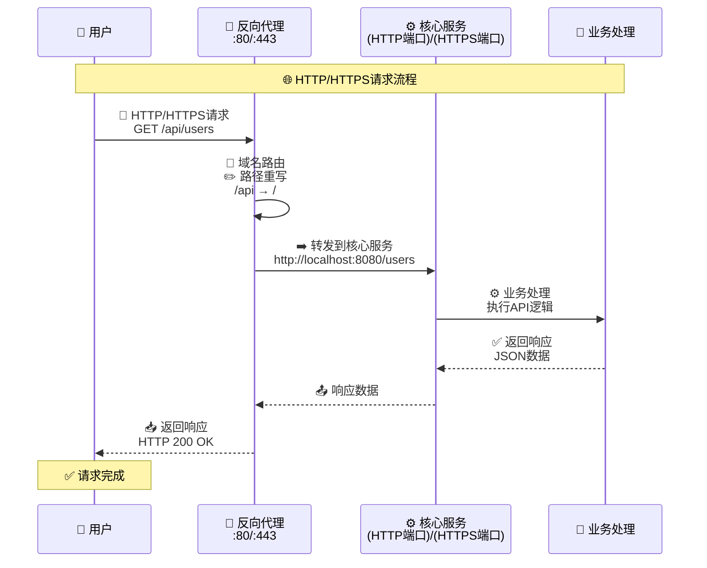
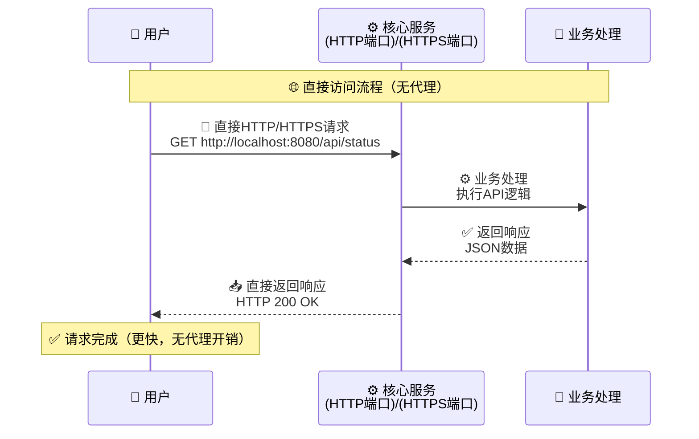
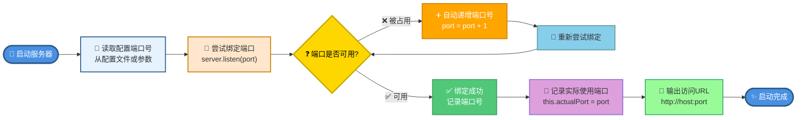
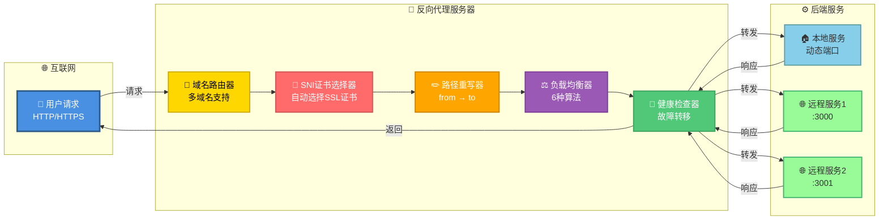
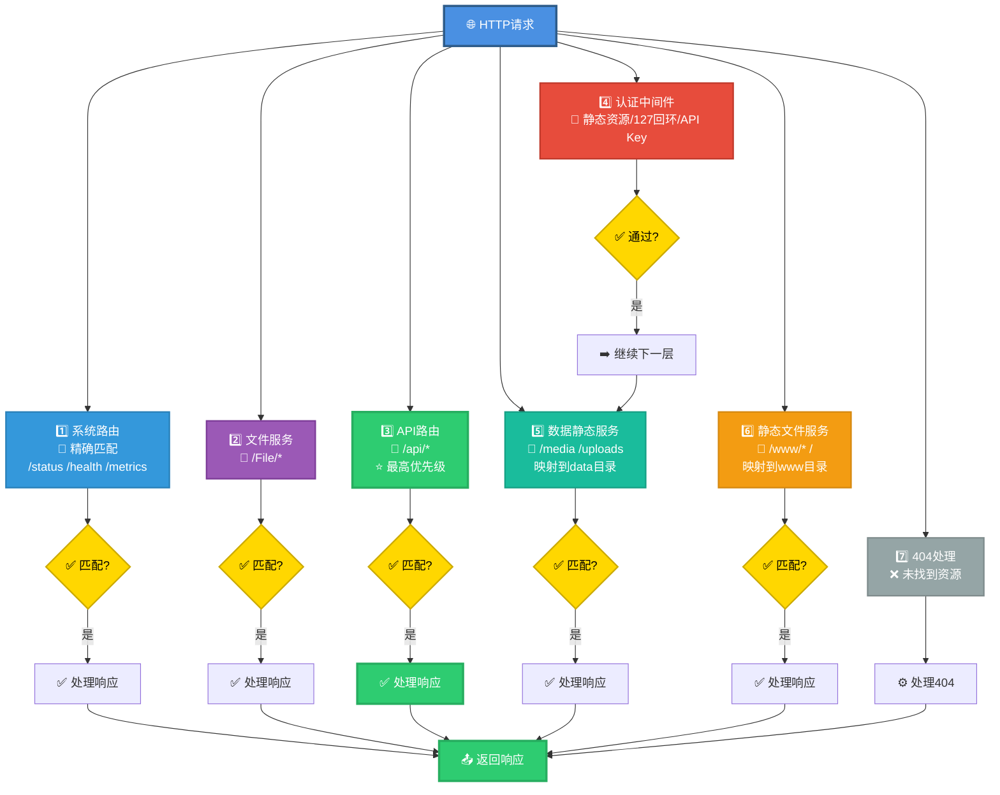

# Server 服务器架构文档

> **文件位置**：`src/agent-runtime.js`  
> **说明**：XRK-AGT 的 Server 层是系统的核心服务层，提供统一的 HTTP/HTTPS/WebSocket 服务、反向代理、静态文件服务、安全中间件等能力，支持快速搭建各种通讯协议的客户端或服务端。  
> **注意**：本文档中所有 `{端口}` 或 `localhost:{端口}` 的占位符表示实际端口号，由启动配置决定（通过 `bot.run({ port: 端口号 })` 指定）。HTTP 端口由启动时指定；**HTTPS 端口默认使用 `HTTP端口 + https.portOffset`（默认 1）**，也可通过 `https.port` 显式指定。

## 📚 目录

- [架构总览](#架构总览)
- [核心特性](#核心特性)
- [端口运行逻辑](#端口运行逻辑)
- [HTTP/HTTPS 服务](#httphttps-服务)
- [反向代理系统](#反向代理系统)
- [WebSocket 支持](#websocket-支持)
- [静态文件服务](#静态文件服务)
- [www 挂载（普通静态 / 前端工程）](#www-挂载普通静态--前端工程)
- [安全与中间件](#安全与中间件)
- [平台 SDK 适配度](#平台-sdk-适配度)
- [快速搭建指南](#快速搭建指南)
- [配置参考](#配置参考)
- [架构说明](#架构说明)
- [最佳实践](#最佳实践)
- [常见问题](#常见问题)

---

## 架构总览

`AgentRuntime`（`src/agent-runtime.js`）统一承载 HTTP/HTTPS/WebSocket、中间件、路由与可选反向代理。Runtime 与 Core 分层见 **[底层架构设计](底层架构设计.md)**；启动见 **[startup.md](startup.md)**。本文只讲 **Server 层**。

**请求路径**：客户端 →（可选反向代理）→ Express → 中间件 → 路由（系统 / API / 静态）→ `core/*/` 业务。

**WebSocket**：`Upgrade` 后由 `AgentRuntime.wsf[path]` 路由到 Tasker 处理器。

---

## 核心特性

### 1. 统一的服务器架构

- **单一入口**：所有HTTP/HTTPS/WebSocket请求统一由 `AgentRuntime` 类管理
- **分层设计**：清晰的中间件层、路由层、业务层分离
- **事件驱动**：基于 EventEmitter，支持生命周期事件

### 2. 灵活的端口管理

- **自动端口检测**：启动时自动检测可用端口
- **多端口支持**：同时支持HTTP和HTTPS端口
- **端口冲突处理**：智能处理端口占用情况

### 3. 强大的反向代理

- **多域名支持**：一个服务器支持多个域名
- **SNI支持**：每个域名可以有自己的SSL证书
- **路径重写**：灵活的路径重写规则
- **HTTP/2支持**：提升HTTPS性能

### 4. 完善的WebSocket支持

- **协议升级**：自动处理HTTP到WebSocket的升级
- **路径路由**：支持多个WebSocket路径
- **认证集成**：与HTTP认证系统统一

### 5. 开箱即用的静态文件服务

- **零配置**：`www/` 目录自动提供静态文件服务
- **智能索引**：自动查找 index.html
- **缓存优化**：合理的缓存策略

---

## 端口运行逻辑

### 端口架构


```mermaid
flowchart LR
    subgraph Internet["🌐 互联网用户"]
        User["👤 用户请求<br/>HTTP/HTTPS/WebSocket"]
    end
    
    subgraph Proxy["🔄 反向代理层（可选）"]
        direction TB
        HTTP80["🌐 HTTP代理<br/>:80端口"]
        HTTPS443["🔒 HTTPS代理<br/>:443端口 + SNI"]
        DomainRoute["📍 域名路由<br/>路径重写"]
    end
    
    subgraph Core["⚙️ 核心服务层"]
        direction TB
        HTTPPort["🌐 HTTP服务器<br/>动态端口"]
        HTTPSPort["🔒 HTTPS服务器<br/>动态端口（可选）"]
        WS["🔌 WebSocket服务器<br/>协议升级"]
    end
    
    User -->|"HTTP请求"| HTTP80
    User -->|"HTTPS请求"| HTTPS443
    User -.->|"直接访问"| HTTPPort
    User -.->|"直接访问"| HTTPSPort
    User -->|"WebSocket升级"| WS
    
    HTTP80 -->|"转发请求"| HTTPPort
    HTTPS443 -->|"转发请求"| HTTPSPort
    DomainRoute --> HTTP80
    DomainRoute --> HTTPS443
    
    style User fill:#4A90E2,stroke:#2E5C8A,stroke-width:3px,color:#fff
    style HTTP80 fill:#FFA500,stroke:#CC8400,stroke-width:2px,color:#fff
    style HTTPS443 fill:#FF6B6B,stroke:#CC5555,stroke-width:2px,color:#fff
    style HTTPPort fill:#50C878,stroke:#3FA060,stroke-width:2px,color:#fff
    style HTTPSPort fill:#50C878,stroke:#3FA060,stroke-width:2px,color:#fff
    style WS fill:#9B59B6,stroke:#7D3C98,stroke-width:2px,color:#fff
    style DomainRoute fill:#FFD700,stroke:#CCAA00,stroke-width:2px,color:#000
```

**端口说明**：

- **HTTP端口**：核心HTTP服务（端口由启动配置决定）
- **HTTPS端口**（可选）：HTTPS服务（默认 `HTTP端口 + https.portOffset`，`https.portOffset` 默认 1；也可用 `https.port` 显式指定）
- **反向代理端口**（80/443，可选）：多域名代理服务
  - HTTP代理 :80 → 转发到核心服务（端口由配置决定）
  - HTTPS代理 :443 → 转发到核心服务（端口由配置决定）

**端口架构流程**：
```
互联网用户
  ↓
反向代理层（可选）
  ├─ HTTP代理 :80 → 转发到核心服务（端口由配置决定）
  └─ HTTPS代理 :443 → 转发到核心服务（端口由配置决定）
  ↓
核心服务层
  ├─ HTTP服务器（实际端口由配置决定，自动检测）
  └─ HTTPS服务器（实际端口由配置决定，自动检测）
  ↓
业务处理
```

### 端口运行流程

**启用反向代理时**:


```mermaid
sequenceDiagram
    participant User as 👤 用户
    participant Proxy as 🔄 反向代理<br/>:80/:443
    participant Core as ⚙️ 核心服务<br/>(HTTP端口)/(HTTPS端口)
    participant Business as 💼 业务处理
    
    Note over User,Business: 🌐 HTTP/HTTPS请求流程
    
    User->>Proxy: 📨 HTTP/HTTPS请求<br/>GET /api/users
    Proxy->>Proxy: 📍 域名路由<br/>✏️ 路径重写<br/>/api → /
    Proxy->>Core: ➡️ 转发到核心服务<br/>http://localhost:8080/users
    Core->>Business: ⚙️ 业务处理<br/>执行API逻辑
    Business-->>Core: ✅ 返回响应<br/>JSON数据
    Core-->>Proxy: 📤 响应数据
    Proxy-->>User: 📥 返回响应<br/>HTTP 200 OK
    
    Note over User: ✅ 请求完成
```

**直接访问时**:


```mermaid
sequenceDiagram
    participant User as 👤 用户
    participant Core as ⚙️ 核心服务<br/>(HTTP端口)/(HTTPS端口)
    participant Business as 💼 业务处理
    
    Note over User,Business: 🌐 直接访问流程（无代理）
    
    User->>Core: 📨 直接HTTP/HTTPS请求<br/>GET http://localhost:8080/api/status
    Core->>Business: ⚙️ 业务处理<br/>执行API逻辑
    Business-->>Core: ✅ 返回响应<br/>JSON数据
    Core-->>User: 📥 直接返回响应<br/>HTTP 200 OK
    
    Note over User: ✅ 请求完成（更快，无代理开销）
```

### 端口配置关系表

| 配置项 | 默认值 | 说明 |
|--------|--------|------|
| 核心HTTP端口 | 由启动配置决定 | 内部服务端口，通过 `bot.run({ port: 端口号 })` 指定 |
| 核心HTTPS端口 | HTTP端口 + 1 | 内部服务端口，可通过 `https.portOffset` 或 `https.port` 配置 |
| 代理HTTP端口 | 80 | 反向代理端口，需要root权限 |
| 代理HTTPS端口 | 443 | 反向代理端口，需要root权限 |
| 实际HTTP端口 | 自动检测 | 如果配置端口被占用，自动递增 |
| 实际HTTPS端口 | 自动检测 | 如果配置端口被占用，自动递增 |

### 端口配置说明

#### 1. 核心服务端口

- **HTTP端口**：由启动配置决定，可通过 `bot.run({ port: 端口号 })` 指定
- **HTTPS端口**：默认 `HTTP端口 + 1`（`https.portOffset` 默认 1），需要启用 HTTPS
- **实际端口**：系统会自动检测并选择可用端口

#### 2. 反向代理端口

- **HTTP代理端口**：默认 `80`，需要root权限
- **HTTPS代理端口**：默认 `443`，需要root权限
- **SNI支持**：每个域名可以有不同的SSL证书

#### 3. 端口检测逻辑


```mermaid
flowchart LR
    Start([🚀 启动服务器]) --> Read["📖 读取配置端口号<br/>从配置文件或参数"]
    Read --> Try["🔌 尝试绑定端口<br/>server.listen(port)"]
    Try --> Check{"❓ 端口是否可用?"}
    
    Check -->|✅ 可用| Success["✅ 绑定成功<br/>记录端口号"]
    Check -->|❌ 被占用| Increment["➕ 自动递增端口号<br/>port = port + 1"]
    
    Increment --> Retry["🔄 重新尝试绑定"]
    Retry --> Check
    
    Success --> Record["📝 记录实际使用端口<br/>this.actualPort = port"]
    Record --> Output["📢 输出访问URL<br/>http://host:port"]
    Output --> End([✨ 启动完成])
    
    style Start fill:#4A90E2,stroke:#2E5C8A,stroke-width:3px,color:#fff
    style Read fill:#E6F3FF,stroke:#2E5C8A,stroke-width:2px
    style Try fill:#FFE6CC,stroke:#CC8400,stroke-width:2px
    style Check fill:#FFD700,stroke:#CCAA00,stroke-width:3px,color:#000
    style Success fill:#50C878,stroke:#3FA060,stroke-width:2px,color:#fff
    style Increment fill:#FFA500,stroke:#CC8400,stroke-width:2px,color:#fff
    style Retry fill:#87CEEB,stroke:#5F9EA0,stroke-width:2px
    style Record fill:#DDA0DD,stroke:#9370DB,stroke-width:2px
    style Output fill:#98FB98,stroke:#3CB371,stroke-width:2px
    style End fill:#4A90E2,stroke:#2E5C8A,stroke-width:3px,color:#fff
```

**检测步骤**：

1. 读取配置中的端口号
2. 尝试绑定端口
3. 如果端口被占用：自动递增端口号，重新尝试绑定
4. 记录实际使用的端口
5. 启动成功后输出访问URL

---

## HTTP/HTTPS 服务

### HTTP 服务器

```javascript
// 核心HTTP服务器初始化
_initHttpServer() {
  this.server = http.createServer(this.express)
    .on("error", err => this._handleServerError(err, false))
    .on("upgrade", this.wsConnect.bind(this));
}
```

**特性**：
- 基于 Express 应用
- 自动处理 WebSocket 升级
- 完善的错误处理

### HTTPS 服务器

```javascript
// HTTPS服务器支持
- 支持自定义SSL证书
- 支持HTTP/2协议
- 支持HSTS（HTTP严格传输安全）
- 可配置TLS版本
```

**配置示例**：
```yaml
https:
  enabled: true
  certificate:
    key: "/path/to/privkey.pem"
    cert: "/path/to/fullchain.pem"
    ca: "/path/to/chain.pem"  # 可选
  tls:
    minVersion: "TLSv1.2"
    http2: true
  hsts:
    enabled: true
    maxAge: 31536000
```

### 中间件执行顺序


```mermaid
flowchart LR
    Request["🌐 HTTP请求<br/>进入服务器"] --> Track["1️⃣ 请求追踪<br/>📝 requestId<br/>⏱️ startTime"]
    Track --> Compress["2️⃣ 响应压缩<br/>🗜️ Compression<br/>✨ 支持brotli"]
    Compress --> Helmet["3️⃣ 安全头<br/>🛡️ Helmet<br/>🔒 X-Content-Type-Options"]
    Helmet --> CORS["4️⃣ CORS处理<br/>🌍 跨域<br/>✅ 预检请求"]
    CORS --> Logging["5️⃣ 请求日志<br/>📊 记录请求<br/>⏱️ 响应时间"]
    Logging --> RateLimit["6️⃣ 速率限制<br/>🚦 全局限流<br/>⚡ API限流"]
    RateLimit --> BodyParser["7️⃣ 请求体解析<br/>📦 JSON<br/>📋 URL-Encoded"]
    BodyParser --> Redirect["8️⃣ 重定向检查<br/>🔄 HTTP业务层<br/>📍 路径匹配"]
    Redirect --> Routes["9️⃣ 路由匹配<br/>🔍 系统路由<br/>📡 API路由"]
    Routes --> Auth["🔟 认证中间件<br/>📄 静态资源放行<br/>🔑 API Key 校验链路"]
    Auth --> Handler["⚙️ 业务处理<br/>处理请求逻辑"]
    Handler --> Response["✅ 返回响应<br/>HTTP状态码<br/>响应数据"]
    
    style Request fill:#4A90E2,stroke:#2E5C8A,stroke-width:3px,color:#fff
    style Track fill:#E6F3FF,stroke:#2E5C8A,stroke-width:2px
    style Compress fill:#FFE6CC,stroke:#CC8400,stroke-width:2px
    style Helmet fill:#FFD700,stroke:#CCAA00,stroke-width:2px,color:#000
    style CORS fill:#87CEEB,stroke:#5F9EA0,stroke-width:2px
    style Logging fill:#DDA0DD,stroke:#9370DB,stroke-width:2px
    style RateLimit fill:#FF6B6B,stroke:#CC5555,stroke-width:2px,color:#fff
    style BodyParser fill:#98FB98,stroke:#3CB371,stroke-width:2px
    style Redirect fill:#FFA500,stroke:#CC8400,stroke-width:2px,color:#fff
    style Routes fill:#50C878,stroke:#3FA060,stroke-width:2px,color:#fff
    style Auth fill:#9B59B6,stroke:#7D3C98,stroke-width:2px,color:#fff
    style Handler fill:#3498DB,stroke:#2980B9,stroke-width:2px,color:#fff
    style Response fill:#2ECC71,stroke:#27AE60,stroke-width:3px,color:#fff
```

---

## 反向代理系统

### 反向代理架构


```mermaid
flowchart LR
    subgraph Internet["🌐 互联网"]
        User["👤 用户请求<br/>HTTP/HTTPS"]
    end
    
    subgraph Proxy["🔄 反向代理服务器"]
        direction TB
        DomainRoute["📍 域名路由器<br/>多域名支持"]
        SNI["🔐 SNI证书选择器<br/>自动选择SSL证书"]
        PathRewrite["✏️ 路径重写器<br/>from → to"]
        LoadBalance["⚖️ 负载均衡器<br/>6种算法"]
        HealthCheck["🏥 健康检查器<br/>故障转移"]
    end
    
    subgraph Backend["⚙️ 后端服务"]
        direction TB
        Local["🏠 本地服务<br/>动态端口"]
        Remote1["🌐 远程服务1<br/>:3000"]
        Remote2["🌐 远程服务2<br/>:3001"]
    end
    
    User -->|"请求"| DomainRoute
    DomainRoute --> SNI
    SNI --> PathRewrite
    PathRewrite --> LoadBalance
    LoadBalance --> HealthCheck
    HealthCheck -->|"转发"| Local
    HealthCheck -->|"转发"| Remote1
    HealthCheck -->|"转发"| Remote2
    
    Local -->|"响应"| HealthCheck
    Remote1 -->|"响应"| HealthCheck
    Remote2 -->|"响应"| HealthCheck
    HealthCheck -->|"返回"| User
    
    style User fill:#4A90E2,stroke:#2E5C8A,stroke-width:3px,color:#fff
    style DomainRoute fill:#FFD700,stroke:#CCAA00,stroke-width:2px,color:#000
    style SNI fill:#FF6B6B,stroke:#CC5555,stroke-width:2px,color:#fff
    style PathRewrite fill:#FFA500,stroke:#CC8400,stroke-width:2px,color:#fff
    style LoadBalance fill:#9B59B6,stroke:#7D3C98,stroke-width:2px,color:#fff
    style HealthCheck fill:#50C878,stroke:#3FA060,stroke-width:2px,color:#fff
    style Local fill:#87CEEB,stroke:#5F9EA0,stroke-width:2px
    style Remote1 fill:#98FB98,stroke:#3CB371,stroke-width:2px
    style Remote2 fill:#98FB98,stroke:#3CB371,stroke-width:2px
```

**说明**：请求经过域名路由、SSL证书选择、路径重写、负载均衡和健康检查后，转发到后端服务。

### 反向代理特性

#### 1. 多域名支持

```yaml
proxy:
  enabled: true
  domains:
    - domain: "xrkk.cc"
      ssl:
        enabled: true
        certificate:
          key: "/path/to/xrkk.cc.key"
          cert: "/path/to/xrkk.cc.cert"
      target: "http://localhost:{端口}"
```

#### 2. SNI（Server Name Indication）

- **多证书支持**：每个域名可以有自己的SSL证书
- **自动选择**：根据请求的域名自动选择对应证书
- **HTTP/2支持**：提升HTTPS性能

#### 3. 路径重写

```yaml
rewritePath:
  from: "/api"
  to: "/"
```

**示例**：`https://api.example.com/api/users` → `http://localhost:3000/users`

#### 4. 负载均衡（新增）

支持轮询、加权、最少连接三种算法，详见 [HTTP业务层文档](http-business-layer.md#反向代理增强)

#### 5. 健康检查（新增）

自动检测上游服务器健康状态，实现故障转移，详见 [HTTP业务层文档](http-business-layer.md#反向代理增强)

#### 6. WebSocket 代理

默认启用WebSocket代理，支持协议升级

---

## WebSocket 支持

### WebSocket 架构


```mermaid
flowchart LR
    Client["💻 WebSocket客户端<br/>浏览器/应用"] --> Upgrade["🔄 HTTP Upgrade请求<br/>GET /path HTTP/1.1<br/>Upgrade: websocket<br/>Connection: Upgrade"]
    Upgrade --> Server("🌐 HTTP服务器<br/>监听upgrade事件<br/>server.on('upgrade')")
    Server --> Auth["🔐 认证检查<br/>✅ 同HTTP认证机制<br/>🔑 API Key验证"]
    Auth -->|"认证通过"| PathCheck("📍 路径检查<br/>查找AgentRuntime.wsf[path]<br/>匹配处理器")
    PathCheck -->|"找到处理器"| Handler["⚙️ 路径处理器<br/>/OneBotv11 → OneBot Handler<br/>/device → Device Handler<br/>/custom → 自定义 Handler"]
    Handler --> WS["🔌 WebSocket连接建立<br/>双向通信<br/>实时数据交换"]
    
    WS -.->|"持续通信"| Client
    
    style Client fill:#4A90E2,stroke:#2E5C8A,stroke-width:3px,color:#fff
    style Upgrade fill:#FFA500,stroke:#CC8400,stroke-width:2px,color:#fff
    style Server fill:#50C878,stroke:#3FA060,stroke-width:2px,color:#fff
    style Auth fill:#FF6B6B,stroke:#CC5555,stroke-width:2px,color:#fff
    style PathCheck fill:#9B59B6,stroke:#7D3C98,stroke-width:2px,color:#fff
    style Handler fill:#3498DB,stroke:#2980B9,stroke-width:2px,color:#fff
    style WS fill:#2ECC71,stroke:#27AE60,stroke-width:3px,color:#fff
```

### WebSocket 连接流程

```mermaid
sequenceDiagram
    participant Client as 💻 WebSocket客户端
    participant Server as 🌐 HTTP服务器
    participant Auth as 🔐 认证检查
    participant Path as 📍 路径路由
    participant Handler as ⚙️ 路径处理器
    
    Note over Client,Handler: 🔌 WebSocket连接建立流程
    
    Client->>Server: 📨 HTTP Upgrade请求<br/>GET /ws HTTP/1.1<br/>Upgrade: websocket<br/>Connection: Upgrade
    Server->>Auth: 🔍 检查认证<br/>同HTTP认证机制<br/>API Key验证
    Auth->>Server: ✅ 认证通过<br/>允许连接
    Server->>Path: 🔎 查找路径处理器<br/>AgentRuntime.wsf['/ws']
    Path->>Handler: ⚙️ 调用处理器<br/>注册的WebSocket处理函数
    Handler->>Client: 🔌 WebSocket连接建立<br/>101 Switching Protocols
    
    Note over Client,Handler: 🔄 双向通信开始
    
    Client<->Handler: 💬 双向通信持续<br/>实时消息交换<br/>心跳保持连接
```

### WebSocket 配置（server.yaml）

WebSocket 相关参数全部可通过 `data/server_bots/{端口}/server.yaml` 配置（默认值来自 `config/default_config/server.yaml`）：

```yaml
websocket:
  heartbeatInterval: 30000  # ping 间隔（毫秒）
  heartbeatTimeout: 60000   # 超时（毫秒）
  maxPayload: 104857600     # 单条消息最大字节数（默认 100MB）
  perMessageDeflate:
    enabled: true
    threshold: 1024
    zlibDeflateOptions:
      chunkSize: 1024
      memLevel: 7
      level: 3
    zlibInflateOptions:
      chunkSize: 10240
```

### WebSocket 注册

```javascript
// Tasker注册WebSocket路径
AgentRuntime.wsf['OneBotv11'].push((ws, ...args) => {
  ws.on('message', data => {
    // 处理消息
  });
});
```

### WebSocket 认证

- **统一认证链路**：WebSocket 升级阶段复用 `AgentRuntime.checkApiAuthorization(req)` 逻辑
- **127 回环免鉴权**：仅 `127.*` / `::ffff:127.*` 自动放行
- **路径级例外**：`AgentRuntime.wsf[path]` 中声明 `skipAuth: true` 时可跳过系统级 API Key

---

## 静态文件服务

### 静态文件服务架构


```mermaid
flowchart LR
    Request["🌐 HTTP请求<br/>进入服务器"] --> CheckAPI{"❓ 是否为<br/>/api/*?"}
    
    CheckAPI -->|"✅ 是"| APIRoute["📡 API路由处理<br/>跳过静态服务<br/>直接处理API"]
    
    CheckAPI -->|"❌ 否"| SystemRoute["🔧 系统路由<br/>/status 状态<br/>/health 健康检查<br/>/metrics 指标<br/>/robots.txt<br/>/favicon.ico"]
    
    SystemRoute --> FileRoute["📁 文件服务路由<br/>/File/*<br/>文件下载/上传"]
    
    FileRoute --> Auth["🔐 认证中间件<br/>静态资源规则<br/>API Key 校验链路"]
    
    Auth -->|"认证通过"| DataStatic["💾 数据静态服务<br/>/media → data/media<br/>/uploads → data/uploads<br/>用户上传文件"]
    
    DataStatic --> Static["📄 静态文件服务<br/>/www/* → www目录<br/>/ → index.html<br/>自动查找首页"]
    
    Static --> NotFound["❌ 404处理<br/>未找到资源<br/>返回错误页面"]
    
    APIRoute --> Response["✅ 返回响应"]
    NotFound --> Response
    
    style Request fill:#4A90E2,stroke:#2E5C8A,stroke-width:3px,color:#fff
    style CheckAPI fill:#FFD700,stroke:#CCAA00,stroke-width:3px,color:#000
    style APIRoute fill:#2ECC71,stroke:#27AE60,stroke-width:2px,color:#fff
    style SystemRoute fill:#3498DB,stroke:#2980B9,stroke-width:2px,color:#fff
    style FileRoute fill:#9B59B6,stroke:#7D3C98,stroke-width:2px,color:#fff
    style Auth fill:#E74C3C,stroke:#C0392B,stroke-width:2px,color:#fff
    style DataStatic fill:#1ABC9C,stroke:#16A085,stroke-width:2px,color:#fff
    style Static fill:#F39C12,stroke:#D68910,stroke-width:2px,color:#fff
    style NotFound fill:#E74C3C,stroke:#C0392B,stroke-width:2px,color:#fff
    style Response fill:#2ECC71,stroke:#27AE60,stroke-width:3px,color:#fff
```

### 静态文件服务优先级


```mermaid
flowchart TB
    Request["🌐 HTTP请求"] --> Priority1["1️⃣ 系统路由<br/>🔧 精确匹配<br/>/status /health /metrics"]
    Request --> Priority2["2️⃣ 文件服务<br/>📁 /File/*"]
    Request --> Priority3["3️⃣ API路由<br/>📡 /api/*<br/>⭐ 最高优先级"]
    Request --> Priority4["4️⃣ 认证中间件<br/>🔐 静态资源/127回环/API Key"]
    Request --> Priority5["5️⃣ 数据静态服务<br/>💾 /media /uploads<br/>映射到data目录"]
    Request --> Priority6["6️⃣ 静态文件服务<br/>📄 /www/* /<br/>映射到www目录"]
    Request --> Priority7["7️⃣ 404处理<br/>❌ 未找到资源"]
    
    Priority1 --> Match1{"✅ 匹配?"}
    Priority2 --> Match2{"✅ 匹配?"}
    Priority3 --> Match3{"✅ 匹配?"}
    Priority4 --> Match4{"✅ 通过?"}
    Priority5 --> Match5{"✅ 匹配?"}
    Priority6 --> Match6{"✅ 匹配?"}
    Priority7 --> Match7["⚙️ 处理404"]
    
    Match1 -->|"是"| Handler1["✅ 处理响应"]
    Match2 -->|"是"| Handler2["✅ 处理响应"]
    Match3 -->|"是"| Handler3["✅ 处理响应"]
    Match4 -->|"是"| Handler4["➡️ 继续下一层"]
    Match5 -->|"是"| Handler5["✅ 处理响应"]
    Match6 -->|"是"| Handler6["✅ 处理响应"]
    
    Handler1 --> Response["📤 返回响应"]
    Handler2 --> Response
    Handler3 --> Response
    Handler4 --> Priority5
    Handler5 --> Response
    Handler6 --> Response
    Match7 --> Response
    
    style Request fill:#4A90E2,stroke:#2E5C8A,stroke-width:3px,color:#fff
    style Priority1 fill:#3498DB,stroke:#2980B9,stroke-width:2px,color:#fff
    style Priority2 fill:#9B59B6,stroke:#7D3C98,stroke-width:2px,color:#fff
    style Priority3 fill:#2ECC71,stroke:#27AE60,stroke-width:3px,color:#fff
    style Priority4 fill:#E74C3C,stroke:#C0392B,stroke-width:2px,color:#fff
    style Priority5 fill:#1ABC9C,stroke:#16A085,stroke-width:2px,color:#fff
    style Priority6 fill:#F39C12,stroke:#D68910,stroke-width:2px,color:#fff
    style Priority7 fill:#95A5A6,stroke:#7F8C8D,stroke-width:2px,color:#fff
    style Match1 fill:#FFD700,stroke:#CCAA00,stroke-width:2px,color:#000
    style Match2 fill:#FFD700,stroke:#CCAA00,stroke-width:2px,color:#000
    style Match3 fill:#FFD700,stroke:#CCAA00,stroke-width:2px,color:#000
    style Match4 fill:#FFD700,stroke:#CCAA00,stroke-width:2px,color:#000
    style Match5 fill:#FFD700,stroke:#CCAA00,stroke-width:2px,color:#000
    style Match6 fill:#FFD700,stroke:#CCAA00,stroke-width:2px,color:#000
    style Handler3 fill:#2ECC71,stroke:#27AE60,stroke-width:3px,color:#fff
    style Response fill:#2ECC71,stroke:#27AE60,stroke-width:3px,color:#fff
```

### 静态文件配置

```yaml
static:
  index:
    - "index.html"
    - "index.htm"
    - "default.html"
  extensions: false
  cache:
    static: 86400    # CSS/JS文件缓存1天
    images: 604800   # 图片文件缓存7天
  cacheTime: "1d"
```

### 开箱即用的Web控制台

- **零配置**：`core/system-Core/www/xrk/`（**普通静态**，无 `sign.json`）
- **访问路径**：`/xrk/`（等于文件夹名）
- **功能完整**：API测试、配置管理、插件管理、设备管理等

---

## www 挂载（普通静态 / 前端工程）

`core/*/www/<子目录>/` 分两类，**规则不同**。完整说明、对照表与推荐 `sign.json`：**[www-mount.md](www-mount.md)**。

| 类型 | 判定 | URL | 磁盘 |
|------|------|-----|------|
| **普通静态** | 无有效 `sign.json` | 固定 `/${文件夹名}` | 目录本体 |
| **前端工程** | 有有效 `sign.json` | `proxy.mount` → `mount` → `/${id}` | `dist/` 等，或 Launcher 反代 |

代码：`www-app-resolve.js`（决策）· `mount-core-www.js`（挂静态）· `frontend/launcher.js`（只拉反代工程）。

### 前端工程字段速查

| 字段 | 作用 |
|------|------|
| `proxy.mount` | 对外路径（静态与反代共用；Vite `base` 须一致） |
| `serve` | `static` 挂产物；`proxy` 拉进程反代 |
| `enabled` | `false` 时不反代（配合 `serve=static`） |
| `staticRoot` / `outDir` | 产物相对目录 |
| `command` / `args` / `port` | 仅反代需要 |
| `build` / `prod` / `mode` / `devOnly` / `modes` | 可选；进程模式生产启动 |

规范示例：`Example-Core/www/frontend-example/`（URL `/example`）、`vibe-learn-Core/www/vibe-learn/`。

### 生产注意

- SPA：**优先** `serve=static` + CI/`pnpm build`，不要用 `pnpm dev` 接用户流量。
- SSR：用 `serve=proxy` + 生产 `start`/`serve`；可选 `build`+`prod`（build 后台执行，失败则不启 prod）。

### 框架适配（简表）

| 框架 | 开发反代 | 静态产物 | 备注 |
|------|----------|----------|------|
| React/Vue/Svelte（Vite） | ✅ | ✅ | 注意 `base` / router basename |
| CRA / webpack | 🟡 | ✅ | 子路径资源前缀 |
| Next / Nuxt（SSR） | 🟠 | 🟡 | `basePath` / `baseURL`；HMR WS 可能直连端口 |
| 纯静态（无 sign） | — | ✅ | URL=文件夹名 |

### 子路径与 HMR

- React Router：`basename="/example"`；Vue：`createWebHistory('/example/')`。
- Vite HMR 若出现 Direct websocket fallback，多为 WS 未走主服反代，一般不影响首屏；也可在 `vite.config` 里写死 `server.hmr` 端口直连。


## 安全与中间件

**鉴权总览**：Server 层不做 HTTP 路由的统一鉴权拦截；system-Core HTTP 在模块内调用 `AgentRuntime.checkApiAuthorization(req)`，其他 Core 按需自行实现；WebSocket 升级阶段默认走统一 API Key 校验链路。详见 **[鉴权与认证（AUTH）](AUTH.md)**。

### 安全中间件栈


```mermaid
flowchart LR
    Request["🌐 HTTP请求<br/>进入服务器"] --> Track["📝 请求追踪<br/>生成requestId<br/>记录startTime"]
    Track --> Compress["🗜️ 响应压缩<br/>减少传输带宽<br/>支持brotli/gzip"]
    Compress --> Helmet["🛡️ Helmet安全头<br/>X-Content-Type-Options<br/>X-Frame-Options<br/>HSTS等"]
    Helmet --> CORS["🌍 CORS跨域<br/>Access-Control-Allow-Origin<br/>预检请求处理<br/>OPTIONS方法"]
    CORS --> Logging["📊 请求日志<br/>X-Request-Id追踪<br/>X-Response-Time统计"]
    Logging --> RateLimit["🚦 速率限制<br/>防止恶意请求<br/>全局/API限流<br/>IP级别控制"]
    RateLimit --> BodyParser["📦 请求体解析<br/>JSON/URL-encoded/Raw<br/>大小限制保护"]
    BodyParser --> Redirect["🔄 重定向检查<br/>HTTP业务层<br/>301/302/307/308"]
    Redirect --> Routes["🔍 路由匹配<br/>系统/API/静态文件<br/>优先级排序"]
    Routes --> Auth["🔐 认证说明<br/>静态资源规则<br/>HTTP：不做统一鉴权拦截（由业务模块决定是否调用 API Key 校验）<br/>WS：升级阶段默认校验 API Key（127 回环例外）"]
    Auth --> Handler["⚙️ 业务处理<br/>执行具体逻辑<br/>返回业务数据"]
    
    style Request fill:#4A90E2,stroke:#2E5C8A,stroke-width:3px,color:#fff
    style Track fill:#E6F3FF,stroke:#2E5C8A,stroke-width:2px
    style Compress fill:#FFE6CC,stroke:#CC8400,stroke-width:2px
    style Helmet fill:#FFD700,stroke:#CCAA00,stroke-width:2px,color:#000
    style CORS fill:#87CEEB,stroke:#5F9EA0,stroke-width:2px
    style Logging fill:#DDA0DD,stroke:#9370DB,stroke-width:2px
    style RateLimit fill:#FF6B6B,stroke:#CC5555,stroke-width:2px,color:#fff
    style BodyParser fill:#98FB98,stroke:#3CB371,stroke-width:2px
    style Redirect fill:#FFA500,stroke:#CC8400,stroke-width:2px,color:#fff
    style Routes fill:#50C878,stroke:#3FA060,stroke-width:2px,color:#fff
    style Auth fill:#9B59B6,stroke:#7D3C98,stroke-width:2px,color:#fff
    style Handler fill:#2ECC71,stroke:#27AE60,stroke-width:3px,color:#fff
```

### 1. Helmet 安全头

```javascript
// 自动添加安全相关的HTTP头部
- X-Content-Type-Options: nosniff
- X-Frame-Options: SAMEORIGIN
- X-XSS-Protection: 1; mode=block
- Strict-Transport-Security: max-age=31536000
```

### 2. CORS 跨域

```yaml
cors:
  enabled: true
  origins: ["*"]  # 或具体域名列表
  methods: ["GET", "POST", "PUT", "DELETE", "OPTIONS"]
  headers: ["Content-Type", "Authorization", "X-API-Key"]
  credentials: false
  maxAge: 86400
```

### 3. 速率限制

```yaml
rateLimit:
  enabled: true
  global:
    windowMs: 900000  # 15分钟
    max: 1000         # 最大1000次请求
  api:
    windowMs: 60000   # 1分钟
    max: 60           # 最大60次请求
```

### 4. API 认证

系统级 API Key 的生成与校验见 **[AUTH.md](AUTH.md)**。

```yaml
auth:
  apiKey:
    enabled: true
    file: "config/server_config/api_key.json"
    length: 64
```

---

## 平台 SDK 适配度

### Node.js 平台 SDK 适配度表

| 平台/协议 | SDK名称 | 适配度 | 说明 | 推荐使用场景 |
|----------|---------|--------|------|------------|
| **OneBot v11** | Tasker（`OneBotv11` 等） | ⭐⭐⭐⭐⭐ | 协议适配，无捆绑 oicq/icqq | QQ / 兼容实现 |
| **OneBot v11** | `go-cqhttp` | ⭐⭐⭐⭐⭐ | 通过WebSocket连接 | 稳定生产环境 |
| **WebSocket** | `ws` | ⭐⭐⭐⭐⭐ | 原生支持 | 实时通讯 |
| **HTTP/HTTPS** | `express` | ⭐⭐⭐⭐⭐ | 核心框架 | REST API |
| **gRPC** | `@grpc/grpc-js` | ⭐⭐⭐ | 需要额外配置 | 微服务架构 |
| **MQTT** | `mqtt` | ⭐⭐⭐⭐ | 需要Tasker实现 | IoT设备 |
| **TCP/UDP** | `net` / `dgram` | ⭐⭐⭐⭐ | Node.js原生 | 自定义协议 |

### SDK 集成示例

#### 1. OneBot v11

通过 core/*/tasker/ 适配（如 system-Core/tasker/OneBotv11.js），向 AgentRuntime.em 派发标准化事件；**不依赖** oicq/icqq npm 包。消息段用全局 msgSegment。

#### 2. WebSocket 客户端

```javascript
// 客户端连接示例
const ws = new WebSocket('ws://localhost:{端口}/OneBotv11');
ws.on('open', () => {
  console.log('WebSocket连接成功');
});
```

#### 3. HTTP API 调用

```javascript
// 使用fetch调用API
const response = await fetch('http://localhost:{端口}/api/status', {
  headers: {
    'X-API-Key': 'your-api-key'
  }
});
const data = await response.json();
```

---

## 快速搭建指南

### 1. 基础HTTP服务（5分钟）

```yaml
# config/default_config/server.yaml
server:
  name: "XRK Server"
  host: "0.0.0.0"
  url: ""

# 启动
node app
# 访问: http://localhost:{端口}
# Web控制台: http://localhost:{端口}/xrk
```

### 2. 启用HTTPS（10分钟）

```yaml
https:
  enabled: true
  certificate:
    key: "/path/to/privkey.pem"
    cert: "/path/to/fullchain.pem"
  tls:
    minVersion: "TLSv1.2"
    http2: true
```

### 3. 配置反向代理（15分钟）

```yaml
proxy:
  enabled: true
  httpPort: 80
  httpsPort: 443
  domains:
    - domain: "xrkk.cc"
      ssl:
        enabled: true
        certificate:
          key: "/path/to/xrkk.cc.key"
          cert: "/path/to/xrkk.cc.cert"
      target: "http://localhost:{端口}"
```

### 4. 搭建WebSocket服务端

```javascript
// core/my-core/tasker/MyWebSocketTasker.js
export default class MyWebSocketTasker {
  id = 'myws'
  name = 'MyWebSocket'
  path = 'myws'

  load() {
    AgentRuntime.wsf[this.path].push((ws, req) => {
      ws.on('message', (data) => {
        // 处理消息
        const message = JSON.parse(data);
        AgentRuntime.em('myws.message', {
          event_id: `myws_${Date.now()}`,
          message: message
        });
      });
    });
  }
}
```

**访问**：`ws://localhost:{端口}/myws`

### 5. 搭建HTTP API服务端

```javascript
// core/my-core/http/myapi.js
export default {
  name: 'my-api',
  priority: 100,
  routes: [
    {
      method: 'GET',
      path: '/api/my-endpoint',
      handler: async (req, res) => {
        res.json({ success: true, data: 'Hello World' });
      }
    }
  ]
};
```

**访问**：`http://localhost:{端口}/api/my-endpoint`

### 6. 搭建TCP/UDP服务端

```javascript
// core/my-core/tasker/MyTCPTasker.js
import net from 'net';

export default class MyTCPTasker {
  load() {
    const server = net.createServer((socket) => {
      socket.on('data', (data) => {
        // 处理TCP数据
        AgentRuntime.em('tcp.message', {
          event_id: `tcp_${Date.now()}`,
          data: data.toString()
        });
      });
    });
    
    server.listen(3000, () => {
      console.log('TCP服务器启动在端口3000');
    });
  }
}
```

---

## 配置参考

### 完整配置示例

```yaml
# config/default_config/server.yaml

# 基础配置
server:
  name: "XRK Server"
  host: "0.0.0.0"
  url: "https://xrkk.cc"

# 反向代理（可选）
proxy:
  enabled: true
  httpPort: 80
  httpsPort: 443
  healthCheck:
    enabled: true
    interval: 30000      # 检查间隔（毫秒）
    maxFailures: 3       # 最大失败次数
    timeout: 5000        # 健康检查超时（毫秒）
    cacheTime: 5000      # 结果缓存时间（毫秒）
  domains:
    - domain: "xrkk.cc"
      ssl:
        enabled: true
        certificate:
          key: "/path/to/xrkk.cc.key"
          cert: "/path/to/xrkk.cc.cert"
      # 单个目标服务器
      target: "http://localhost:{端口}"
      # 或多个服务器（启用负载均衡）
      # target:
      #   - url: "http://localhost:3001"
      #     weight: 3
      #     healthUrl: "http://localhost:3001/health"
      #   - url: "http://localhost:3002"
      #     weight: 1
      # loadBalance: "weighted"  # 负载均衡算法
      rewritePath:
        from: "/api"
        to: "/"

# HTTPS配置
https:
  enabled: true
  certificate:
    key: "/path/to/privkey.pem"
    cert: "/path/to/fullchain.pem"
  tls:
    minVersion: "TLSv1.2"
    http2: true
  hsts:
    enabled: true
    maxAge: 31536000

# 静态文件
static:
  index: ["index.html", "index.htm"]
  cache:
    static: 86400
    images: 604800

# 安全配置
security:
  helmet:
    enabled: true
  hiddenFiles:
    - "^\\..*"
    - "node_modules"

# hiddenFiles 规则说明：
# - 以 ^ 开头 / 以 $ 结尾 / 包含 \\ 等“正则特征”的字符串，会按正则表达式匹配
# - 其他普通字符串按“字面包含”匹配（例如 ".env" 会按字面匹配，不会被当作正则）

# CORS
cors:
  enabled: true
  origins: ["*"]
  methods: ["GET", "POST", "PUT", "DELETE", "OPTIONS"]
  headers: ["Content-Type", "Authorization", "X-API-Key"]

# 认证
auth:
  apiKey:
    enabled: true
    file: "config/server_config/api_key.json"

# 速率限制
rateLimit:
  enabled: true
  global:
    windowMs: 900000
    max: 1000
  api:
    windowMs: 60000
    max: 60

# CDN配置
cdn:
  enabled: true
  domain: "cdn.example.com"
  type: "cloudflare"  # CDN类型：general, cloudflare, aliyun, tencent, aws等
  staticPrefix: "/static"
  https: true
  cacheControl:
    static: 31536000    # CSS/JS/字体文件：1年
    images: 604800      # 图片文件：7天
    default: 3600        # 其他文件：1小时

# 性能优化配置
performance:
  keepAlive:
    enabled: true
    initialDelay: 1000
    timeout: 120000
  http2Push:
    enabled: false
    criticalAssets:
      - "/static/css/main.css"
      - "/static/js/main.js"
  connectionPool:
    maxSockets: 50
    maxFreeSockets: 10
    timeout: 30000
```

---

## 架构说明

AgentRuntime 作为单一 HTTP/WS 入口，可选内置反向代理与 [HTTP 业务层](http-business-layer.md)（重定向、CDN、负载均衡）。HTTP 业务层方法已挂载到运行时 `AgentRuntime` 实例，例如 `bot.handleRedirect(req, res)`、`bot.getProxyStats()`。

---

## 最佳实践

### 1. 生产环境配置

```yaml
# 启用HTTPS
https:
  enabled: true
  tls:
    minVersion: "TLSv1.2"
    http2: true

# 启用反向代理
proxy:
  enabled: true
  httpsPort: 443

# 严格的安全配置
security:
  helmet:
    enabled: true
cors:
  origins: ["https://yourdomain.com"]
rateLimit:
  enabled: true
```

### 2. 开发环境配置

```yaml
# 简化配置
https:
  enabled: false
proxy:
  enabled: false
cors:
  origins: ["*"]
rateLimit:
  enabled: false
```

### 3. 多服务部署

```yaml
# 使用反向代理分发到不同服务
proxy:
  domains:
    - domain: "api.example.com"
      target: "http://localhost:3000"
    - domain: "web.example.com"
      target: "http://localhost:3001"
    - domain: "ws.example.com"
      target: "ws://localhost:3002"
```

---

## 常见问题

### Q: 如何修改默认端口？

A: 在 `config/default_config/server.yaml` 中配置，或通过环境变量设置。

### Q: 反向代理和直接访问有什么区别？

A: 反向代理可以：
- 支持多域名
- 提供SSL终止
- 路径重写
- 负载均衡

直接访问更简单，适合单服务场景。

### Q: 如何添加自定义中间件？

A: 在 `AgentRuntime` 类的 `_setupMiddleware` 方法中添加，或通过插件系统扩展。

### Q: WebSocket连接失败怎么办？

A: 检查：
1. WebSocket路径是否正确注册
2. 认证是否通过
3. 防火墙是否开放端口

### Q: 如何实现负载均衡？

A: 使用反向代理的 `target` 配置，支持数组形式配置多个后端服务，系统内置负载均衡算法。详见 [HTTP业务层文档](http-business-layer.md#反向代理增强)。

---

## 总结

XRK-AGT 的 Server 层提供了：

✅ **统一的服务器架构** - 一个入口管理所有服务  
✅ **灵活的端口管理** - 自动检测和冲突处理  
✅ **强大的反向代理** - 多域名、SNI、路径重写、负载均衡、健康检查  
✅ **完善的WebSocket支持** - 协议升级、路径路由  
✅ **开箱即用的静态服务** - 零配置Web控制台  
✅ **完善的安全中间件** - 安全头、CORS、速率限制  
✅ **HTTP业务层功能** - 重定向、CDN支持、反向代理增强  
✅ **快速搭建能力** - 5-15分钟搭建各种服务  

这使得 XRK-AGT 能够快速搭建各种通讯协议的客户端或服务端，是系统架构的核心优势之一。

---

## 相关文档

- **[HTTP业务层文档](http-business-layer.md)** - 重定向、CDN、负载均衡详细说明
- **[AgentRuntime 主类文档](agent-runtime.md)** - AgentRuntime 生命周期、中间件与认证
- **[HTTP API 基类文档](http-api.md)** - HTTP API 基类说明
- **[system-Core 特性](system-core.md)** - system-Core 内置模块完整说明 ⭐
- **[框架可扩展性指南](框架可扩展性指南.md)** - 扩展开发完整指南

---

*最后更新：2026-06-14*
