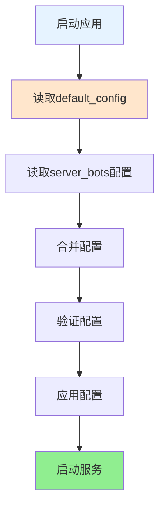

# 子服务端API文档

## 概述

XRK-AGT Python子服务端提供AI生态相关的服务，包括：
- **LangChain集成**：通过主服务v3接口实现，支持MCP工具调用
- **向量服务**：文本向量化、向量检索、向量数据库管理
- **（规划中）更多 Python AI 生态能力**：仅在实现后再写入文档，避免文档与代码脱节

## 架构设计

```
主服务端 (Node.js)
    ↓ HTTP调用
子服务端 (Python FastAPI)
    ├─ LangChain服务 → 调用主服务端 /api/v3/chat/completions
    ├─ 向量服务 → ChromaDB + SentenceTransformers
    └─ （规划中）更多 Python AI 生态能力
```

## LangChain服务

### POST /api/langchain/chat

LangChain聊天接口，使用主服务v3接口作为LLM provider，支持MCP工具调用。

#### 子服务端的职责（为什么需要它）

子服务端存在的目的不是“再包一层转发”，而是承接 **Python AI 生态** 能力，并与主服务端建立清晰分工：

- **主服务端（Node.js）负责**
  - **统一 LLM Provider 入口**：`POST /api/v3/chat/completions`（伪造 OpenAI Chat 协议，供 LangChain/外部生态调用）
  - **厂商直连 & 工厂选择**：根据 `model(=provider)` 选择运营商；无需传真实模型名
  - **MCP 工具注入/执行**：把工作流注册的 MCP tools 注入到厂商 tool calling 协议，并执行多轮 tool_calls，最终返回 `assistant.content`

- **子服务端（Python FastAPI）负责**
  - **LangChain/LangGraph Agent 编排**：多步规划、工具选择策略、状态机等（`/api/langchain/chat`）
  - **向量/RAG 能力**：embedding、向量库、检索与入库（`/api/vector/*`）
  - **承接 Python 生态**：后续可扩展更多 AI 生态能力（数据管道、评估等），但 LLM 统一调用仍通过主服务 v3

#### 与主服务端的连接方式

- 子服务端调用主服务端：`POST /api/v3/chat/completions`
- **必填字段**：
  - `messages`: OpenAI messages
  - `model`: 运营商/provider（`gptgod` / `volcengine` / `xiaomimimo` / `openai` / `openai_compat` / `gemini` / `anthropic` / `azure_openai`）
  - `apiKey`（或 `api_key`）: 访问主服务端 v3 的鉴权 key（Bot 启动生成），**不是厂商 key**

- **说明**：
  - 外部调用只需要填 `model=provider`，不需要填写“真实模型名”（会使用 `{provider}_llm.yaml` 的默认模型配置）

> 约定说明：主服务端 v3 是“伪 OpenAI 入口”，为了让 LangChain/社区生态能直接对接。
> 但它**只保证** `assistant.content`（或 SSE chunk 的 `delta.content`）输出；工具调用细节由主服务端内部处理，不向外暴露。

**请求参数**：
```json
{
  "messages": [
    {"role": "user", "content": "你好"}
  ],
  "model": "gptgod",
  "apiKey": "主服务端Bot启动生成的访问鉴权key（非厂商key）",
  "temperature": 0.8,
  "max_tokens": 2000,
  "stream": false,
  "enableTools": true
}
```

**参数别名兼容（同义字段）**：
- `apiKey` ↔ `api_key`
- `max_tokens` ↔ `maxTokens` ↔ `max_completion_tokens`（不同 OpenAI-like 生态常见写法）
- `top_p` ↔ `topP`
- `presence_penalty` ↔ `presencePenalty`
- `frequency_penalty` ↔ `frequencyPenalty`
- `tool_choice` ↔ `toolChoice`
- `parallel_tool_calls` ↔ `parallelToolCalls`
- `extraBody`：可选扩展字段（对象或 JSON 字符串），会下发给底层厂商客户端（是否生效取决于具体 provider）

**响应格式**（非流式）：
```json
{
  "id": "chatcmpl_xxx",
  "object": "chat.completion",
  "created": 1700000000,
  "choices": [
    {
      "message": {
        "role": "assistant",
        "content": "你好！"
      }
    }
  ],
  "usage": null,
  "model": "gptgod"
}
```

**流式响应**：SSE（每行一个 `data: {...}`，最后以 `data: [DONE]` 结束）。

### GET /api/langchain/models

获取可用模型列表，从主服务获取。

### GET /api/langchain/tools

获取MCP工具列表。

### POST /api/langchain/tools/call

调用MCP工具。

**请求参数**：
```json
{
  "name": "tool.name",
  "arguments": {}
}
```

## 向量服务

**重要说明**：
- 向量服务统一由子服务端提供，主服务端通过 `Bot.callSubserver('/api/vector/*')` 调用
- 向量模型、维度等配置在子服务端配置文件（`data/subserver/config.yaml`）中设置
- 主服务端无需配置向量模型相关参数

### POST /api/vector/embed

文本向量化接口。

**请求参数**：
```json
{
  "texts": ["文本1", "文本2"]
}
```

**响应格式**：
```json
{
  "success": true,
  "embeddings": [
    {
      "text": "文本1",
      "embedding": [0.1, 0.2, ...],
      "dimension": 384
    }
  ],
  "count": 2
}
```

**技术实现**：
- 使用 `sentence-transformers` 库进行文本向量化
- 默认模型：`paraphrase-multilingual-MiniLM-L12-v2`（384维）
- 支持多语言文本向量化
- 内置缓存机制，提升重复文本处理性能

### POST /api/vector/search

向量检索接口。

**请求参数**：
```json
{
  "query": "查询文本",
  "collection": "memory_group123",
  "top_k": 5
}
```

**响应格式**：
```json
{
  "success": true,
  "results": [
    {
      "id": "doc_1",
      "text": "相关文本",
      "score": 0.95,
      "metadata": {}
    }
  ],
  "count": 1
}
```

**技术实现**：
- 使用 `ChromaDB` 作为持久化向量数据库
- 支持集合（collection）管理，可按业务场景隔离数据
- 返回相似度分数（0-1），分数越高表示越相似
- 支持元数据过滤和检索

### POST /api/vector/upsert

向量入库接口。

**请求参数**：
```json
{
  "collection": "memory_group123",
  "documents": [
    {
      "text": "文本内容",
      "id": "doc_1",
      "metadata": {}
    }
  ]
}
```

**响应格式**：
```json
{
  "success": true,
  "collection": "memory_group123",
  "inserted": 1
}
```

## 调用流程

### 主服务端调用子服务端

主服务端通过 `Bot.callSubserver(path, options)` 统一调用子服务端：

```javascript
// 向量化
const result = await Bot.callSubserver('/api/vector/embed', {
  body: { texts: [text] }
});

// LangChain聊天
const response = await Bot.callSubserver('/api/langchain/chat', {
  body: payload,
  rawResponse: true  // 流式响应
});

// 向量检索
const result = await Bot.callSubserver('/api/vector/search', {
  body: { query, collection, top_k: 5 }
});
```

### 子服务端调用主服务端

子服务端通过HTTP调用主服务端：

```python
# 调用主服务v3接口
v3_url = f"{main_server_url}/api/v3/chat/completions"
response = await client.post(v3_url, json=payload)

# 获取MCP工具
mcp_url = f"{main_server_url}/api/mcp/tools"
response = await client.get(mcp_url)
```

## 配置

子服务端配置系统参考主服务端设计，支持默认配置和用户配置分离：

### 配置文件位置

- **默认配置**：`subserver/pyserver/config/default_config.yaml`（模板文件，不应修改）
- **用户配置**：`data/subserver/config.yaml`（首次启动时自动从默认配置复制）

### 配置加载流程



**加载步骤**：
1. 优先从 `data/subserver/config.yaml` 读取（用户配置）
2. 如果不存在，从 `subserver/pyserver/config/default_config.yaml` 复制并创建
3. 如果默认配置也不存在，使用内置默认配置

### 配置示例

```yaml
# 服务器配置
server:
  host: "0.0.0.0"
  port: 8000
  reload: false
  log_level: "info"

# 主服务端连接配置
main_server:
  host: "127.0.0.1"
  port: 1234        # 主服务端端口
  timeout: 300      # 请求超时时间（秒）

# CORS 配置
cors:
  origins: ["*"]

# LangChain 服务配置
langchain:
  enabled: true
  max_steps: 6
  verbose: false

# 向量服务配置
vector:
  model: "paraphrase-multilingual-MiniLM-L12-v2"
  dimension: 384
  persist_dir: "data/subserver/vector_db"

# 日志配置
logging:
  level: "info"
  file: "logs/app.log"
  max_bytes: 10485760
  backup_count: 5
```

### 配置管理

配置类 `Config` 提供以下方法：

- `get(key, default)` - 获取配置值（支持点号分隔的嵌套键）
- `set(key, value, save=False)` - 设置配置值
- `to_dict()` - 获取完整配置字典
- `reset_to_default()` - 重置为默认配置

## 依赖安装与运行（推荐使用 uv）

> 子服务端已经使用 `pyproject.toml` + uv 管理依赖，推荐直接在 `subserver/pyserver` 目录下执行以下命令。

```bash
cd subserver/pyserver

# 第一次或依赖变更后：安装/更新依赖
uv sync

# 启动子服务端
uv run xrk

# 如需修改绑定地址/端口，可通过环境变量覆盖
HOST=0.0.0.0 PORT=8000 RELOAD=true uv run xrk
```

> 说明：`pyproject.toml` 中已定义了 `xrk = "main:main"` 的入口脚本，并启用了项目打包支持，
> 因此 **不再需要额外执行 `uv pip install -e .`**，`uv sync` 之后可以直接 `uv run xrk`。

## 错误处理

所有接口统一错误处理：
- `400`：请求参数错误
- `500`：服务器内部错误
- `502`：无法连接到主服务
- `503`：服务不可用（依赖未安装）
- `504`：调用主服务超时

## 性能优化

1. **模型单例**：嵌入模型和向量数据库客户端使用单例模式，避免重复加载
2. **延迟加载**：模型在首次使用时加载
3. **错误降级**：依赖未安装时返回友好错误信息
4. **流式响应**：支持SSE流式传输，降低延迟
