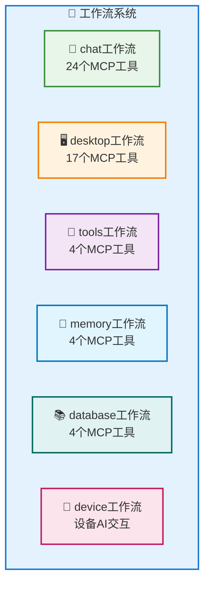
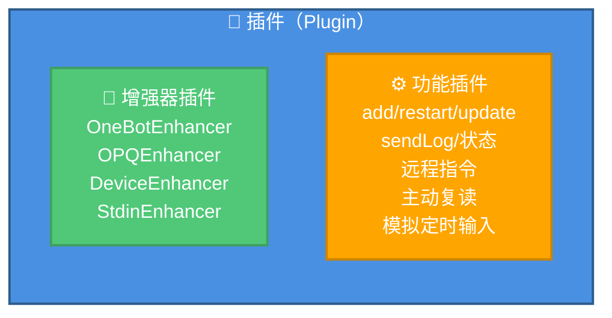
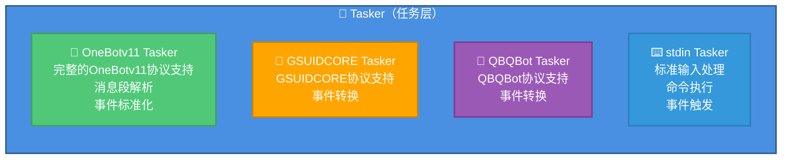
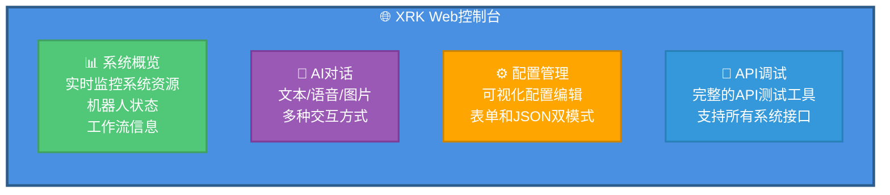

# system-Core 特性文档

> **文件位置**: `core/system-Core/`  
> **说明**：system-Core 是 XRK-AGT 的内置核心模块，提供了完整的系统功能、HTTP API、工作流、插件和 Web 控制台。

## 📖 概述

system-Core 是 XRK-AGT 的内置核心模块，提供了开箱即用的完整功能集，包括：

- ✅ **10个HTTP API模块**：核心系统、机器人管理、配置管理、文件管理、插件管理、AI服务、MCP服务、设备管理、标准输入、数据编辑
- ✅ **6个工作流**：聊天、桌面、工具、记忆、知识库、设备（共53个MCP工具）
- ✅ **4个Tasker**：OneBotv11、GSUIDCORE、QBQBot、stdin
- ✅ **Web控制台**：企业级管理界面，支持系统监控、API调试、配置管理

### 功能特点

- **零配置启动**：所有功能开箱即用，无需额外配置
- **自动加载**：所有模块通过加载器自动发现和注册
- **统一接口**：所有API遵循统一的接口规范
- **完整文档**：每个模块都有详细的API文档和使用说明

---

## 📚 目录

- [HTTP API 模块](#http-api-模块)
- [工作流（Stream）](#工作流stream)
- [插件（Plugin）](#插件plugin)
- [Tasker](#tasker)
- [Web控制台](#web控制台)
- [配置管理](#配置管理)

---

## HTTP API 模块

system-Core 提供了10个HTTP API模块，覆盖系统管理的各个方面：

### 1. 核心系统API (`core.js`)

**优先级**: 200

提供系统状态、概览、健康检查等基础功能。

| 端点 | 方法 | 说明 | 查询参数 |
|------|------|------|----------|
| `/api/system/status` | GET | 获取系统状态详细信息 | `hist` / `withHistory` - 包含24小时历史数据 |
| `/api/system/overview` | GET | 获取系统概览（仪表盘数据） | `hist` / `withHistory` - 包含历史网络数据 |
| `/api/status` | GET | 获取系统运行状态（简化版） | - |
| `/api/config` | GET | 获取系统配置信息 | - |
| `/api/health` | GET | 健康检查（检查各服务状态） | - |

**特性**：
- 实时系统监控（CPU、内存、网络流量）
- 24小时历史数据统计
- 网络流量采样（Windows/Linux/macOS 跨平台）
- 进程监控（Top 5 进程）
- 工作流和机器人状态统计

### 2. 机器人管理API (`bot.js`)

**优先级**: 100

提供机器人状态查询、消息发送、好友群组列表等功能。

| 端点 | 方法 | 说明 | 参数 |
|------|------|------|------|
| `/api/bots` | GET | 获取所有机器人列表 | `includeDevices` - 是否包含设备 |
| `/api/bot/:uin/friends` | GET | 获取指定机器人的好友列表 | `uin` - 机器人QQ号 |
| `/api/bot/:uin/groups` | GET | 获取指定机器人的群组列表 | `uin` - 机器人QQ号 |
| `/api/message/send` | POST | 发送消息（私聊/群聊） | `bot_id`, `type`, `target_id`, `message` |
| `/api/bot/:uin/control` | POST | 控制机器人（开机/关机） | `uin` - 机器人QQ号, `action` - 操作类型 |

**特性**：
- 支持多机器人管理
- 消息发送支持文本和消息段数组
- 机器人控制（通过Redis实现）

### 3. 配置管理API (`config.js`)

**优先级**: 85

提供统一的配置文件读写接口，支持表单和JSON双模式。

| 端点 | 方法 | 说明 | 参数 |
|------|------|------|------|
| `/api/config/list` | GET | 获取所有配置列表 | - |
| `/api/config/:name/structure` | GET | 获取配置结构（Schema） | `name` - 配置名称 |
| `/api/config/:name/flat-structure` | GET | 获取扁平化配置结构 | `name`, `path` - 子配置路径 |
| `/api/config/:name/flat` | GET | 获取扁平化配置数据 | `name`, `path` - 子配置路径 |
| `/api/config/:name/batch-set` | POST | 批量设置配置（扁平化） | `name`, `flat`, `path`, `backup`, `validate` |
| `/api/config/:name/read` | GET | 读取配置 | `name`, `path` - 子配置路径 |
| `/api/config/:name/write` | POST | 写入配置 | `name`, `data`, `path`, `backup`, `validate` |
| `/api/config/:name/validate` | POST | 验证配置 | `name`, `data`, `path` |
| `/api/config/:name/backup` | POST | 备份配置 | `name`, `path` |
| `/api/config/:name/reset` | POST | 重置配置 | `name`, `path` |
| `/api/config/clear-cache` | POST | 清除配置缓存 | - |

**特性**：
- 支持SystemConfig子配置（通过`path`参数）
- 扁平化结构（减少前端嵌套操作）
- 自动备份和验证
- 配置缓存管理

### 4. 文件管理API (`files.js`)

**优先级**: 95

提供文件上传、下载、预览等功能。

| 端点 | 方法 | 说明 | 参数 |
|------|------|------|------|
| `/api/file/upload` | POST | 上传文件 | `multipart/form-data` |
| `/api/file/:id` | GET | 获取文件（预览/下载） | `id` - 文件ID, `download` - 是否下载 |
| `/api/file/:id` | DELETE | 删除文件 | `id` - 文件ID |
| `/api/files` | GET | 获取文件列表 | - |

**特性**：
- 支持`multipart/form-data`格式上传
- 文件ID映射（ULID）
- 自动分类（uploads/media）
- 路径验证和安全检查

### 5. 插件管理API (`plugin.js`)

**优先级**: 80

提供插件列表查询、重载、任务管理等功能。

| 端点 | 方法 | 说明 | 参数 |
|------|------|------|------|
| `/api/plugins` | GET | 获取插件列表 | - |
| `/api/plugins/summary` | GET | 获取插件统计摘要 | - |
| `/api/plugin/:key/reload` | POST | 重载指定插件 | `key` - 插件key |
| `/api/plugins/tasks` | GET | 获取插件定时任务列表 | - |
| `/api/plugins/stats` | GET | 获取插件统计信息 | - |

**特性**：
- 插件热重载
- 定时任务管理
- 插件统计（加载时间、规则数量等）

### 6. AI服务API (`ai.js`)

**优先级**: 80

提供 AI 聊天接口和工作流调用，详见 [工厂系统文档](factory.md#ai-http-api-路由)。

| 端点 | 方法 | 说明 |
|------|------|------|
| `/api/v3/chat/completions` | POST | OpenAI 兼容的聊天接口（支持 JSON 与 multipart/form-data，多模态 + 工具调用） |
| `/api/v3/models` | GET | 获取模型列表（OpenAI 格式） |
| `/api/ai/models` | GET | 获取模型和工作流列表（仅暴露“带 MCP 工具”的基础工作流，供前端多选） |
| `/api/ai/stream` | GET | SSE 流式输出（使用工作流系统） |

> `/api/v3/chat/completions` 会把前端选择的「带 MCP 工具的工作流」整理为 `streams` 白名单，并透传给 LLM 工厂和 MCP 工具适配器，确保只有这些工作流下的 MCP 工具会被注入和调用，避免“未在接口中声明的工具”被意外使用。

### 7. MCP服务API (`mcp.js`)

**优先级**: 100

提供MCP工具调用接口，详见 [MCP完整指南](mcp-guide.md)。

| 端点 | 方法 | 说明 |
|------|------|------|
| `/api/mcp/jsonrpc` | POST | JSON-RPC标准接口 |
| `/api/mcp/jsonrpc/:stream` | POST | 按工作流过滤的JSON-RPC |
| `/api/mcp/tools` | GET | 获取工具列表 |
| `/api/mcp/tools/streams` | GET | 获取工作流分组 |
| `/api/mcp/tools/stream/:streamName` | GET | 获取指定工作流的工具 |
| `/api/mcp/tools/call` | POST | 调用MCP工具 |
| `/api/mcp/tools/:name` | GET | 获取单个工具详情 |
| `/api/mcp/resources` | GET | 获取资源列表 |
| `/api/mcp/resources/:uri` | GET | 获取资源内容 |
| `/api/mcp/prompts` | GET | 获取提示词列表 |
| `/api/mcp/prompts/:name` | POST | 获取提示词内容 |
| `/api/mcp/connect` | GET | SSE连接 |
| `/api/mcp/health` | GET | 健康检查 |

### 8. 设备管理API (`device.js`)

**优先级**: 90

提供设备注册、AI交互、ASR/TTS会话管理等功能。

| 端点 | 方法 | 说明 | 参数 |
|------|------|------|------|
| `/api/device/register` | POST | 注册设备 | `device_id`, `name`, `type`等 |
| `/api/device/:deviceId/ai` | POST | 设备AI交互 | `deviceId`, `text`, `workflow`, `persona`, `profile` |
| `/api/devices` | GET | 获取设备列表 | - |
| `/api/device/:deviceId` | GET | 获取设备详情 | `deviceId` |
| `/api/device/:deviceId/asr/sessions` | GET | 获取ASR会话列表 | `deviceId` |
| `/api/device/:deviceId/asr/recordings` | GET | 获取录音文件列表 | `deviceId` |
| `/api/device/file/:fileId` | GET | 获取设备文件 | `fileId` - base64url编码的文件路径 |
| `/api/trash/*` | GET | 获取回收站文件 | 文件路径 |

**特性**：
- 设备注册和管理
- 连续对话支持
- ASR/TTS会话管理
- 音频文件管理

### 9. 标准输入API (`stdin.js`)

**优先级**: 85

提供命令执行和事件触发功能。

| 端点 | 方法 | 说明 | 参数 |
|------|------|------|------|
| `/api/stdin/status` | GET | 获取stdin状态 | - |
| `/api/stdin/command` | POST | 发送命令 | `command`, `user_info`, `json`, `timeout` |
| `/api/stdin/event` | POST | 触发事件 | `event_type`, `content`, `user_info`, `json`, `timeout` |

**WebSocket**: `/stdin` - 监听stdin命令和输出

**特性**：
- 命令执行（支持 JSON 结构化响应）
- 事件触发（可直接向 `PluginsLoader` 及各 Tasker 派发标准事件）
- WebSocket 实时通信（订阅 stdin 命令与输出）

#### stdin 用户与会话模型

stdin 体系由 **Tasker + HTTP API + 增强插件** 共同组成：

- **虚拟 Bot 注册**（`core/system-Core/tasker/stdin.js`）  
  - 启动时构造一个内置 Bot：`Bot.stdin` / `Bot['stdin']`，账号固定为 `uin = 'stdin'`，昵称默认为 `StdinBot`。  
  - 该 Bot 提供 `sendMsg/runCommand/pickFriend/pickGroup/fileToUrl` 等方法，使控制台/HTTP 请求与普通 QQ/设备消息在插件层表现一致。
- **用户身份与注册方式**：  
  - 控制台输入：`StdinHandler.createEvent()` 默认使用 `user_id = 'stdin'`、`nickname = 'stdin'`，并将 `role` 设为 `master`，等价于「本机超级管理员」。  
  - HTTP 接口：  
    - `/api/stdin/command` 与 `/api/stdin/event` 接收 `user_info` 参数（`user_id/nickname/group_id/role/avatar` 等），由后端传入 `createEvent()`，动态注册/模拟一个用户或群成员。  
    - 若不传 `user_info`，则同样默认视为 `master` 身份，方便脚本调用。  
  - 事件增强：`StdinEnhancer` 插件基于 `EventNormalizer` 统一补齐 `isStdin/tasker/logText` 等字段，使所有 stdin/API 事件在插件业务层表现为标准化事件对象。

> 通过上述设计，**stdin 用户不需要在数据库单独注册**：  
> 控制台与 HTTP 请求会在 Tasker 层即时构造事件和虚拟用户，并在插件层以统一方式处理。

### 10. 数据编辑API (`write.js`)

**优先级**: 75

支持JSON和YAML文件的读写操作。

| 端点 | 方法 | 说明 | 参数 |
|------|------|------|------|
| `/api/data/read` | GET | 读取文件 | `filePath`, `encoding` |
| `/api/data/write` | POST | 写入文件 | `filePath`, `data`, `format`, `backup` |

**特性**：
- 支持JSON和YAML格式
- 自动备份
- 路径验证和安全检查

---

## 工作流（Stream）

system-Core 提供了6个工作流，共53个MCP工具：



### 1. chat 工作流

**文件**: `core/system-Core/stream/chat.js`  
**优先级**: 10  
**MCP工具数**: 24个

**功能分类**：
- **互动功能**：`at`、`poke`、`reply`、`emojiReaction`、`thumbUp`、`sign`
- **群管理**：`mute`/`unmute`、`muteAll`/`unmuteAll`、`setCard`、`setGroupName`
- **权限管理**：`setAdmin`/`unsetAdmin`、`setTitle`、`kick`
- **消息管理**：`setEssence`/`removeEssence`、`announce`、`recall`、`setGroupTodo`
- **信息查询**：`getGroupInfoEx`、`getAtAllRemain`、`getBanList`

**特性**：
- ✅ 支持表情包和表情回应
- ✅ 完整的群管理功能
- ✅ 消息历史缓存（5分钟自动清理）

**使用示例**：
```javascript
// 在插件中调用 chat 工作流的 MCP 工具
const stream = await this.getStream('chat');
// 通过 MCP 工具调用群管理功能
// 例如：at、mute、setAdmin 等
```

### 2. desktop 工作流

**文件**: `core/system-Core/stream/desktop.js`  
**优先级**: 100  
**MCP工具数**: 17个

**功能分类**：
- **系统操作**：`show_desktop`、`open_system_tool`、`lock_screen`、`power_control`
- **文件操作**：`create_folder`、`open_explorer`、`open_application`
- **网络操作**：`open_browser`
- **命令执行**：`execute_powershell`、`cleanup_processes`
- **信息读取**：`screenshot`、`system_info`、`disk_space`、`list_desktop_files`
- **文档生成**：`create_word_document`、`create_excel_document`
- **数据查询**：`stock_quote`

**特性**：
- Windows系统优化
- 自动进程清理（每30秒）
- 工作区：桌面目录

**使用示例**：
```javascript
// 在插件中调用 desktop 工作流
const stream = await this.getStream('desktop');
// 通过 MCP 工具调用桌面操作
// 例如：screenshot、open_browser、execute_powershell 等
```

### 3. tools 工作流

**文件**: `core/system-Core/stream/tools.js`  
**优先级**: 200  
**MCP工具数**: 4个

**工具**：
- `read` - 读取文件
- `grep` - 搜索文本
- `write` - 写入文件
- `run` - 执行命令

**特性**：
- 基础工具集
- 工作区：桌面目录
- 文件搜索和自动匹配

### 4. memory 工作流

**文件**: `core/system-Core/stream/memory.js`  
**优先级**: 1  
**MCP工具数**: 4个

**工具**：
- `query_memory` - 查询记忆
- `save_memory` - 保存记忆
- `list_memories` - 列出记忆
- `delete_memory` - 删除记忆

**特性**：
- 长期记忆存储
- 向量检索支持
- 记忆目录：`~/.xrk/memory`

**使用场景**：
- 保存用户偏好和习惯
- 记录重要对话内容
- 跨会话信息持久化

**使用示例**：
```javascript
// 在插件中调用 memory 工作流
const stream = await this.getStream('memory');
// 通过 MCP 工具管理长期记忆
// query_memory、save_memory、list_memories、delete_memory
```

### 5. database 工作流

**文件**: `core/system-Core/stream/database.js`  
**MCP工具数**: 4个

**工具**：
- `query_knowledge` - 查询知识
- `save_knowledge` - 保存知识
- `list_knowledge` - 列出知识库
- `delete_knowledge` - 删除知识

**特性**：
- 知识库管理
- 关键词搜索
- 向量检索支持

**使用场景**：
- 企业知识库管理
- 文档检索和问答
- 专业知识存储

**使用示例**：
```javascript
// 在插件中调用 database 工作流
const stream = await this.getStream('database');
// 通过 MCP 工具管理知识库
// query_knowledge、save_knowledge、list_knowledge、delete_knowledge
```

### 6. device 工作流

**文件**: `core/system-Core/stream/device.js`  
**优先级**: 50

**特性**：
- 设备AI交互
- ASR/TTS集成
- 连续对话支持

---

## 插件（Plugin）

system-Core 提供了一组内置插件，分别承担「协议增强」与「运维/管理/示例业务」等职责：



### 增强器插件（协议/事件增强）

- **OneBotEnhancer**  
  - OneBotv11 事件增强插件（位于 `core/system-Core/plugin/OneBotEnhancer.js`）  
  - 负责为 OneBot 事件挂载 `isOneBot/isPrivate/isGroup/friend/group/member` 等属性，并统一日志格式、别名与 onlyReplyAt 策略。
- **OPQEnhancer**  
  - OPQ 协议增强插件，补齐 OPQ 事件的 Tasker 特定字段与日志文本。
- **DeviceEnhancer**  
  - 设备事件增强插件（`DeviceEnhancer.js`），使用 `EventNormalizer.normalizeDevice` 标准化设备事件字段，并统一 `isDevice/tasker/logText` 等属性。
- **StdinEnhancer**  
  - STDIN/API 事件增强插件（`StdinEnhancer.js`），使用 `EventNormalizer.normalizeStdin` 标准化从控制台或 `/api/stdin/*` 进入的事件，统一 `isStdin/tasker` 标记和日志。

> 增强器插件本身**不直接实现业务命令**，而是为后续所有业务插件提供「更干净、一致的事件对象」。

### 功能插件（运维与示例业务）

- **add** (`add.js`)  
  - 消息模板与违禁词管理插件：支持 `#添加/#删除` 消息、`#违禁词` 增删查、全局/群级精确与模糊违禁词、图片违禁词，以及违禁词开关、禁言策略等。
- **restart** (`restart.js`)  
  - 进程级重启与启停插件：提供 `#重启/#关机/#开机` 命令，通过 Redis 记录重启上下文与关机标记，并在需要时调用 `process.exit(1)` 触发守护进程重启。
- **update** (`update.js`)  
  - 项目与 Core 更新插件：支持 `#更新/#强制更新` 指定 Core 或整仓库，`#全部更新/#静默全部更新` 批量更新 `core/*` 与项目根目录，自动拉取 Git 日志并在更新后联动 `restart` 插件重启。
- **sendLog** (`sendLog.js`)  
  - 运行日志发送插件：通过 `#日志/#错误日志/#追踪日志/#debug日志` 等命令，按级别/关键词筛选最近日志文件，分批生成转发消息发到群/私聊，支持通过配置调整每批行数、总行数与单行最大长度。
- **状态**（`状态.js`，类名 `stattools`）  
  - 系统状态查询插件：`#状态` 查看 CPU/内存/磁盘、进程、网络信息，以及 Bot 运行时长、插件/定时任务数量、日志配置等（内部使用 `systeminformation` 库收集数据）。
- **远程指令** (`远程指令.js`)  
  - 远程命令与调试终端插件：基于 `config/cmd/tools.yaml` 权限配置，提供安全包裹的命令执行、JS 调试、输出截断与落盘等能力，属于高权限「远程运维工具」。
- **主动复读** (`主动复读.js`)  
  - 复读示例插件：`#复读` 后进入上下文，下一条消息会被完整复读并在指定时间后自动撤回，演示 `setContext/finish` 的典型用法。
- **模拟定时输入** (`模拟定时输入.js`)  
  - 定时 STDIN 模拟插件：每天固定时间（如 12:00）构造模拟 `stdin` 事件，通过 `PluginsLoader.deal()` 触发插件系统执行预设命令（例如 `#你是谁`），用于演示和测试定时任务 + 业务链路。

> 以上功能插件均构建在 `plugin` 基类与 `PluginsLoader` 之上，**不修改底层基础设施代码**；你可以在 `core/system-Core/plugin/` 中参考这些实现，编写自己的业务插件。

---

## 业务层与插件架构

在 `system-Core` 中，**绝大部分业务逻辑都通过插件业务层实现**，而不是写在底层基础设施里：

- **业务承载位置**：
  - `core/system-Core/plugin/*.js`：具体业务插件（命令、管理功能、日志、状态查询等）
  - `src/infrastructure/plugins/plugin.js`：插件基类，定义统一的业务接口（规则、任务、事件订阅、上下文、工作流集成等）
  - `src/infrastructure/plugins/loader.js`：`PluginsLoader`，作为插件业务层的调度核心
- **分层关系（自下而上）**：
  1. **Tasker 层**（如 `core/system-Core/tasker/OneBotv11.js`）将平台消息转换为统一事件
  2. **事件监听层**（`core/system-Core/events/*.js`）去重并分发到插件系统
  3. **插件业务层**（`PluginsLoader` + 各业务插件）完成规则匹配、权限控制、上下文与工作流调用
  4. **HTTP / Web 控制台** 只作为入口和管理界面，不直接承载业务

### 插件业务层职责总览

- **统一事件入口**：所有来自 OneBot、设备、STDIN/API 的事件，都会最终进入 `PluginsLoader.deal(e)`，在这里完成标准化、预检查与限流。
- **业务规则执行**：
  - 通过插件 `rule` 配置实现命令/关键词/正则匹配
  - 使用 `accept(e)` 做前置过滤（如别名、权限、来源筛选）
  - 支持按优先级分组执行、默认处理器与上下文回调
- **跨模块协作**：
  - 插件通过 `getStream()` 调用 AI 工作流（chat/desktop/tools/memory/database/device）
  - 通过事件订阅机制与其他插件/Tasker 协同（详见 `plugins-loader.md` 与 `事件系统标准化文档`）
- **运行时能力**：
  - 冷却 / 节流（按用户、群、设备维度）
  - 黑白名单与响应策略（如仅在被 @ 或带前缀时响应）
  - 定时任务（基于 `node-schedule`）与执行统计

> **结论**：在 `system-Core` 中，**“业务层 = 插件业务层 + AI 工作流”**。  
> 优先将业务写成插件 + 工作流，HTTP 仅作为暴露能力与管理入口。

更多插件业务层细节请参考：

- `docs/plugin-base.md` - 插件基类与业务插件开发
- `docs/plugins-loader.md` - 插件加载、匹配与执行流程
- `docs/事件系统标准化文档.md` - 事件命名规范与字段责任边界

---

## Tasker

system-Core 提供了4个Tasker：



### 1. OneBotv11 Tasker

**文件**: `core/system-Core/tasker/OneBotv11.js`

**特性**：
- ✅ 完整的OneBotv11协议支持
- ✅ 消息段解析
- ✅ 事件标准化

### 2. GSUIDCORE Tasker

**文件**: `core/system-Core/tasker/GSUIDCORE.js`

**特性**：
- ✅ GSUIDCORE协议支持
- ✅ 事件转换
- ✅ 与GSUIDCORE框架无缝集成
- ✅ 支持多种消息类型

**配置示例**：
```yaml
# config/server_config/gsuidcore.yaml
bots:
  - uin: "123456789"
    name: "GSUIDCORE机器人"
    api_url: "http://127.0.0.1:5700"
```

### 3. QBQBot Tasker

**文件**: `core/system-Core/tasker/QBQBot.js`

**特性**：
- ✅ QBQBot协议支持
- ✅ 事件转换
- ✅ 与QBQBot框架集成
- ✅ 支持HTTP API调用

**配置示例**：
```yaml
# config/server_config/qbqbot.yaml
bots:
  - uin: "123456789"
    name: "QBQBot机器人"
    api_url: "http://127.0.0.1:5700"
```

### 4. stdin Tasker

**文件**: `core/system-Core/tasker/stdin.js`

**特性**：
- ✅ 标准输入处理
- ✅ 命令执行
- ✅ 事件触发
- ✅ 虚拟Bot支持
- ✅ HTTP API集成

**使用场景**：
- 控制台命令执行
- 脚本自动化
- 测试和调试
- 远程控制

**使用示例**：
```bash
# 通过HTTP API发送命令
curl -X POST http://localhost:8080/api/stdin/command \
  -H "Content-Type: application/json" \
  -d '{
    "command": "#状态",
    "user_info": {
      "user_id": "admin",
      "nickname": "管理员",
      "role": "master"
    }
  }'
```

---

## Web控制台

**位置**: `core/system-Core/www/xrk/`  
**访问路径**: `/xrk/`

### 功能模块



**核心功能模块与后端能力映射**：

1. **系统概览**  
   - 实时监控系统资源（CPU、内存、网络流量）、Bot 在线状态和运行时长。  
   - 展示工作流加载情况、插件数量与定时任务统计（对应 `core.js` 和 `plugin.js` 的统计接口）。  
   - 支持查看最近 24 小时的系统指标曲线（通过 `/api/system/status` 与 `/api/system/overview`）。

2. **AI对话**  
   - 提供统一的聊天界面，支持文本输入、ASR 语音输入与图片上传识别。  
   - 底层通过 `/api/v3/chat/completions` 与 `/api/ai/stream` 调用工作流（chat/desktop/tools/...），支持在前端切换不同工作流与人格预设。  
   - 支持查看原始请求/响应与 token 消耗，便于调试工作流与 LLM 配置。

3. **配置管理**  
   - 基于 `config.js` HTTP 模块的 `/api/config/*` 路由，提供「表单模式（Schema 驱动）」与「JSON 模式」双视图。  
   - 支持一键备份/恢复、子配置路径编辑（如只编辑某个 core 的配置子树）、Schema 校验与缓存清理。  
   - 典型配置包括：system 配置、各 LLM 提供商配置、ASR/TTS、工具与 aistream 配置等。

4. **API调试**  
   - 内置简易 API Client，可以直接选择 system-Core 暴露的所有 HTTP 路由进行调用（包括插件管理、设备管理、stdin 接口等）。  
   - 支持填写请求体、Header、鉴权参数，查看响应 JSON / 原始文本，以及 WebSocket 调试（如 `/stdin` 频道）。  
   - 适合调试自定义 Core 的 HTTP 接口、验证配置与工作流集成是否正确。

**前端特性**：
- 响应式布局：适配桌面与移动端浏览器，侧边导航 + 顶部状态栏结构。  
- 实时性：通过 WebSocket 与轮询结合，实时刷新系统状态面板与 stdin 输出等信息。  
- 性能与体验：路由级懒加载、错误边界与统一 Toast 提示，尽量减少页面阻塞。

**访问方式**：
- 本地访问：`http://localhost:8080/xrk/`
- 远程访问：`http://your-server-ip:8080/xrk/`
- 需要认证：首次访问需要登录，或使用 API Key 认证

**功能模块详解**：

1. **系统概览**
   - 实时监控：CPU、内存、磁盘、网络流量
   - 历史数据：24小时系统指标曲线图
   - Bot状态：在线机器人列表、运行时长
   - 工作流统计：已加载工作流数量、MCP工具数量
   - 插件统计：已加载插件数量、定时任务数量

2. **AI对话**
   - 多工作流支持：可切换不同的工作流（chat/desktop/tools等）
   - 多模态输入：支持文本、图片、语音输入
   - 流式输出：实时显示AI回复内容
   - 调试模式：查看原始请求/响应、token消耗

3. **配置管理**
   - 表单模式：基于Schema的可视化表单编辑
   - JSON模式：直接编辑JSON配置
   - 配置验证：实时验证配置格式和内容
   - 一键备份：配置修改前自动备份
   - 子配置编辑：支持编辑SystemConfig的子配置

4. **API调试**
   - 接口列表：自动发现所有HTTP API接口
   - 请求构建：可视化构建HTTP请求
   - 响应查看：格式化显示JSON响应
   - WebSocket调试：支持WebSocket连接测试
   - 历史记录：保存最近调用的API请求

---

## 配置管理

system-Core 提供了完整的配置管理功能：

### 配置类型

1. **系统配置** (`system.js`)
   - 服务器配置
   - AI Stream配置（LLM/ASR/TTS）
   - MCP配置
   - 反向代理配置
   - 安全配置

2. **LLM提供商配置**
   - `gptgod_llm.js`
   - `volcengine_llm.js`
   - `xiaomimimo_llm.js`
   - `openai_llm.js`
   - `openai_compat_llm.js`
   - `gemini_llm.js`
   - `anthropic_llm.js`
   - `azure_openai_llm.js`

3. **ASR/TTS配置**
   - `volcengine_asr.js`
   - `volcengine_tts.js`

4. **工具配置**
   - `tools.js`

### 配置特性

- ✅ **Schema验证**：基于JSON Schema的配置验证
- ✅ **扁平化结构**：减少前端嵌套操作
- ✅ **自动备份**：配置修改前自动备份
- ✅ **子配置支持**：SystemConfig支持子配置（通过`path`参数）
- ✅ **Web界面**：可视化配置编辑

---

## 总结

system-Core 是 XRK-AGT 的核心模块，提供了：

- ✅ **10个HTTP API模块**：覆盖系统管理、机器人管理、配置管理、文件管理、插件管理、AI服务、MCP服务、设备管理、标准输入、数据编辑
- ✅ **6个工作流**：53个MCP工具，覆盖聊天、桌面、工具、记忆、知识库、设备
- ✅ **4个Tasker**：支持OneBotv11、GSUIDCORE、QBQBot、stdin
- ✅ **Web控制台**：企业级管理界面，支持系统监控、API调试、配置管理
- ✅ **完整配置系统**：支持多种配置类型，Schema验证，可视化编辑

所有功能开箱即用，无需额外配置即可使用。

---

## 相关文档

- **[HTTP API 基类](http-api.md)** - 了解如何开发自定义API
- **[API 加载器](api-loader.md)** - 了解API自动加载机制
- **[AI Stream](aistream.md)** - 了解工作流开发
- **[MCP 指南](mcp-guide.md)** - 了解MCP工具注册
- **[工厂系统](factory.md)** - 了解AI服务提供商配置
- **[应用开发指南](app-dev.md)** - 了解Web控制台开发

---

*最后更新：2026-02-06*
