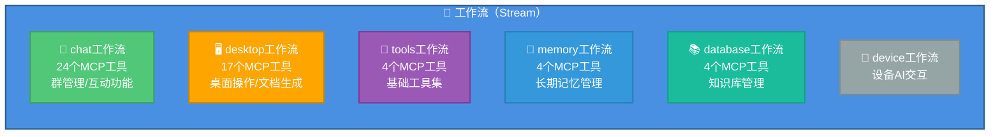
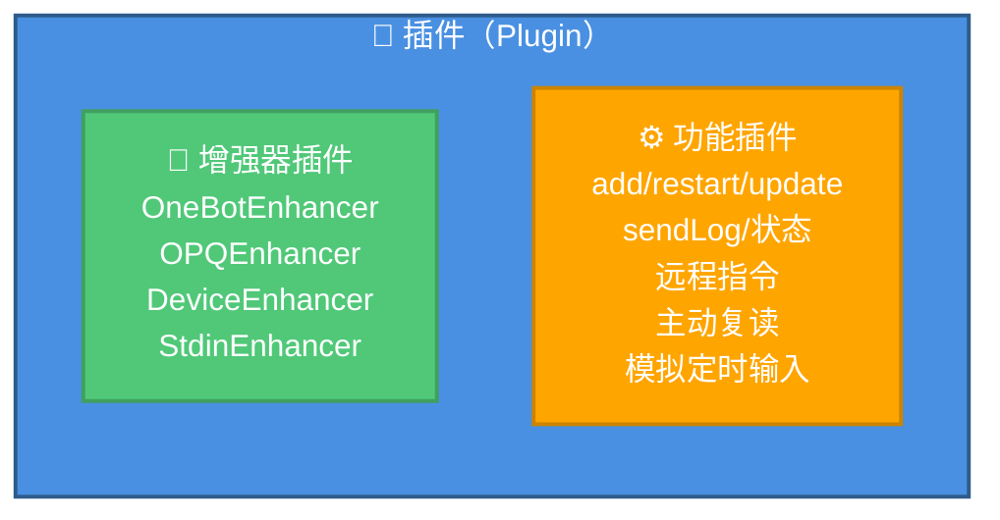
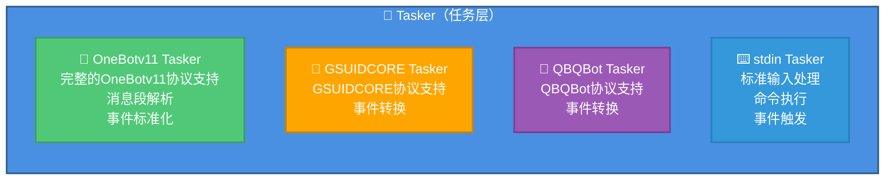
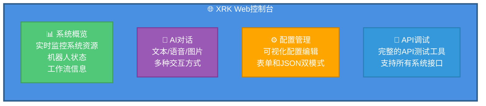

# system-Core 特性文档

> **文件位置**: `core/system-Core/`  
> **说明**：system-Core 是 XRK-AGT 的内置核心模块，提供了完整的系统功能、HTTP API、工作流、插件和 Web 控制台。

system-Core 是 XRK-AGT 的内置核心模块，提供了开箱即用的完整功能集，包括：

- ✅ **10个HTTP API模块**：核心系统、机器人管理、配置管理、文件管理、插件管理、AI服务、MCP服务、设备管理、标准输入、数据编辑
- ✅ **6个工作流**：聊天、桌面、工具、记忆、知识库、设备
- ✅ **4个Tasker**：OneBotv11、GSUIDCORE、QBQBot、stdin
- ✅ **Web控制台**：企业级管理界面，支持系统监控、API调试、配置管理

---

## 📋 目录

- [HTTP API 模块](#http-api-模块)
- [工作流（Stream）](#工作流stream)
- [插件（Plugin）](#插件plugin)
- [Tasker](#tasker)
- [Web控制台](#web控制台)
- [配置管理](#配置管理)

---

## HTTP API 模块

system-Core 提供了10个HTTP API模块，覆盖系统管理的各个方面：

### 1. 核心系统API (`core.js`)

**优先级**: 200

提供系统状态、概览、健康检查等基础功能。

| 端点 | 方法 | 说明 | 查询参数 |
|------|------|------|----------|
| `/api/system/status` | GET | 获取系统状态详细信息 | `hist` / `withHistory` - 包含24小时历史数据 |
| `/api/system/overview` | GET | 获取系统概览（仪表盘数据） | `hist` / `withHistory` - 包含历史网络数据 |
| `/api/status` | GET | 获取系统运行状态（简化版） | - |
| `/api/config` | GET | 获取系统配置信息 | - |
| `/api/health` | GET | 健康检查（检查各服务状态） | - |

**特性**：
- 实时系统监控（CPU、内存、网络流量）
- 24小时历史数据统计
- 网络流量采样（Windows/Linux/macOS 跨平台）
- 进程监控（Top 5 进程）
- 工作流和机器人状态统计

### 2. 机器人管理API (`bot.js`)

**优先级**: 100

提供机器人状态查询、消息发送、好友群组列表等功能。

| 端点 | 方法 | 说明 | 参数 |
|------|------|------|------|
| `/api/bots` | GET | 获取所有机器人列表 | `includeDevices` - 是否包含设备 |
| `/api/bot/:uin/friends` | GET | 获取指定机器人的好友列表 | `uin` - 机器人QQ号 |
| `/api/bot/:uin/groups` | GET | 获取指定机器人的群组列表 | `uin` - 机器人QQ号 |
| `/api/message/send` | POST | 发送消息（私聊/群聊） | `bot_id`, `type`, `target_id`, `message` |
| `/api/bot/:uin/control` | POST | 控制机器人（开机/关机） | `uin` - 机器人QQ号, `action` - 操作类型 |

**特性**：
- 支持多机器人管理
- 消息发送支持文本和消息段数组
- 机器人控制（通过Redis实现）

### 3. 配置管理API (`config.js`)

**优先级**: 85

提供统一的配置文件读写接口，支持表单和JSON双模式。

| 端点 | 方法 | 说明 | 参数 |
|------|------|------|------|
| `/api/config/list` | GET | 获取所有配置列表 | - |
| `/api/config/:name/structure` | GET | 获取配置结构（Schema） | `name` - 配置名称 |
| `/api/config/:name/flat-structure` | GET | 获取扁平化配置结构 | `name`, `path` - 子配置路径 |
| `/api/config/:name/flat` | GET | 获取扁平化配置数据 | `name`, `path` - 子配置路径 |
| `/api/config/:name/batch-set` | POST | 批量设置配置（扁平化） | `name`, `flat`, `path`, `backup`, `validate` |
| `/api/config/:name/read` | GET | 读取配置 | `name`, `path` - 子配置路径 |
| `/api/config/:name/write` | POST | 写入配置 | `name`, `data`, `path`, `backup`, `validate` |
| `/api/config/:name/validate` | POST | 验证配置 | `name`, `data`, `path` |
| `/api/config/:name/backup` | POST | 备份配置 | `name`, `path` |
| `/api/config/:name/reset` | POST | 重置配置 | `name`, `path` |
| `/api/config/clear-cache` | POST | 清除配置缓存 | - |

**特性**：
- 支持SystemConfig子配置（通过`path`参数）
- 扁平化结构（减少前端嵌套操作）
- 自动备份和验证
- 配置缓存管理

### 4. 文件管理API (`files.js`)

**优先级**: 95

提供文件上传、下载、预览等功能。

| 端点 | 方法 | 说明 | 参数 |
|------|------|------|------|
| `/api/file/upload` | POST | 上传文件 | `multipart/form-data` |
| `/api/file/:id` | GET | 获取文件（预览/下载） | `id` - 文件ID, `download` - 是否下载 |
| `/api/file/:id` | DELETE | 删除文件 | `id` - 文件ID |
| `/api/files` | GET | 获取文件列表 | - |

**特性**：
- 支持`multipart/form-data`格式上传
- 文件ID映射（ULID）
- 自动分类（uploads/media）
- 路径验证和安全检查

### 5. 插件管理API (`plugin.js`)

**优先级**: 80

提供插件列表查询、重载、任务管理等功能。

| 端点 | 方法 | 说明 | 参数 |
|------|------|------|------|
| `/api/plugins` | GET | 获取插件列表 | - |
| `/api/plugins/summary` | GET | 获取插件统计摘要 | - |
| `/api/plugin/:key/reload` | POST | 重载指定插件 | `key` - 插件key |
| `/api/plugins/tasks` | GET | 获取插件定时任务列表 | - |
| `/api/plugins/stats` | GET | 获取插件统计信息 | - |

**特性**：
- 插件热重载
- 定时任务管理
- 插件统计（加载时间、规则数量等）

### 6. AI服务API (`ai.js`)

**优先级**: 80

提供AI聊天接口和工作流调用，详见 [工厂系统文档](factory.md#ai-http-api-路由)。

| 端点 | 方法 | 说明 |
|------|------|------|
| `/api/v3/chat/completions` | POST | OpenAI兼容的聊天接口 |
| `/api/v3/models` | GET | 获取模型列表（OpenAI格式） |
| `/api/ai/models` | GET | 获取模型和工作流列表 |
| `/api/ai/stream` | GET | SSE流式输出（使用工作流） |

### 7. MCP服务API (`mcp.js`)

**优先级**: 100

提供MCP工具调用接口，详见 [MCP完整指南](mcp-guide.md)。

| 端点 | 方法 | 说明 |
|------|------|------|
| `/api/mcp/jsonrpc` | POST | JSON-RPC标准接口 |
| `/api/mcp/jsonrpc/:stream` | POST | 按工作流过滤的JSON-RPC |
| `/api/mcp/tools` | GET | 获取工具列表 |
| `/api/mcp/tools/streams` | GET | 获取工作流分组 |
| `/api/mcp/tools/stream/:streamName` | GET | 获取指定工作流的工具 |
| `/api/mcp/tools/call` | POST | 调用MCP工具 |
| `/api/mcp/tools/:name` | GET | 获取单个工具详情 |
| `/api/mcp/resources` | GET | 获取资源列表 |
| `/api/mcp/resources/:uri` | GET | 获取资源内容 |
| `/api/mcp/prompts` | GET | 获取提示词列表 |
| `/api/mcp/prompts/:name` | POST | 获取提示词内容 |
| `/api/mcp/connect` | GET | SSE连接 |
| `/api/mcp/health` | GET | 健康检查 |

### 8. 设备管理API (`device.js`)

**优先级**: 90

提供设备注册、AI交互、ASR/TTS会话管理等功能。

| 端点 | 方法 | 说明 | 参数 |
|------|------|------|------|
| `/api/device/register` | POST | 注册设备 | `device_id`, `name`, `type`等 |
| `/api/device/:deviceId/ai` | POST | 设备AI交互 | `deviceId`, `text`, `workflow`, `persona`, `profile` |
| `/api/devices` | GET | 获取设备列表 | - |
| `/api/device/:deviceId` | GET | 获取设备详情 | `deviceId` |
| `/api/device/:deviceId/asr/sessions` | GET | 获取ASR会话列表 | `deviceId` |
| `/api/device/:deviceId/asr/recordings` | GET | 获取录音文件列表 | `deviceId` |
| `/api/device/file/:fileId` | GET | 获取设备文件 | `fileId` - base64url编码的文件路径 |
| `/api/trash/*` | GET | 获取回收站文件 | 文件路径 |

**特性**：
- 设备注册和管理
- 连续对话支持
- ASR/TTS会话管理
- 音频文件管理

### 9. 标准输入API (`stdin.js`)

**优先级**: 85

提供命令执行和事件触发功能。

| 端点 | 方法 | 说明 | 参数 |
|------|------|------|------|
| `/api/stdin/status` | GET | 获取stdin状态 | - |
| `/api/stdin/command` | POST | 发送命令 | `command`, `user_info`, `json`, `timeout` |
| `/api/stdin/event` | POST | 触发事件 | `event_type`, `content`, `user_info`, `json`, `timeout` |

**WebSocket**: `/stdin` - 监听stdin命令和输出

**特性**：
- 命令执行（支持JSON响应）
- 事件触发
- WebSocket实时通信

### 10. 数据编辑API (`write.js`)

**优先级**: 75

支持JSON和YAML文件的读写操作。

| 端点 | 方法 | 说明 | 参数 |
|------|------|------|------|
| `/api/data/read` | GET | 读取文件 | `filePath`, `encoding` |
| `/api/data/write` | POST | 写入文件 | `filePath`, `data`, `format`, `backup` |

**特性**：
- 支持JSON和YAML格式
- 自动备份
- 路径验证和安全检查

---

## 工作流（Stream）

system-Core 提供了6个工作流，共53个MCP工具：

### 1. chat 工作流

**文件**: `core/system-Core/stream/chat.js`  
**优先级**: 10  
**MCP工具数**: 24个

**功能分类**：
- **互动功能**：`at`、`poke`、`reply`、`emojiReaction`、`thumbUp`、`sign`
- **群管理**：`mute`/`unmute`、`muteAll`/`unmuteAll`、`setCard`、`setGroupName`
- **权限管理**：`setAdmin`/`unsetAdmin`、`setTitle`、`kick`
- **消息管理**：`setEssence`/`removeEssence`、`announce`、`recall`、`setGroupTodo`
- **信息查询**：`getGroupInfoEx`、`getAtAllRemain`、`getBanList`

**特性**：
- ✅ 支持表情包和表情回应
- ✅ 完整的群管理功能
- ✅ 消息历史缓存（5分钟自动清理）

### 2. desktop 工作流

**文件**: `core/system-Core/stream/desktop.js`  
**优先级**: 100  
**MCP工具数**: 17个

**功能分类**：
- **系统操作**：`show_desktop`、`open_system_tool`、`lock_screen`、`power_control`
- **文件操作**：`create_folder`、`open_explorer`、`open_application`
- **网络操作**：`open_browser`
- **命令执行**：`execute_powershell`、`cleanup_processes`
- **信息读取**：`screenshot`、`system_info`、`disk_space`、`list_desktop_files`
- **文档生成**：`create_word_document`、`create_excel_document`
- **数据查询**：`stock_quote`

**特性**：
- Windows系统优化
- 自动进程清理（每30秒）
- 工作区：桌面目录

### 3. tools 工作流

**文件**: `core/system-Core/stream/tools.js`  
**优先级**: 200  
**MCP工具数**: 4个

**工具**：
- `read` - 读取文件
- `grep` - 搜索文本
- `write` - 写入文件
- `run` - 执行命令

**特性**：
- 基础工具集
- 工作区：桌面目录
- 文件搜索和自动匹配

### 4. memory 工作流

**文件**: `core/system-Core/stream/memory.js`  
**优先级**: 1  
**MCP工具数**: 4个

**工具**：
- `query_memory` - 查询记忆
- `save_memory` - 保存记忆
- `list_memories` - 列出记忆
- `delete_memory` - 删除记忆

**特性**：
- 长期记忆存储
- 向量检索支持
- 记忆目录：`~/.xrk/memory`

### 5. database 工作流

**文件**: `core/system-Core/stream/database.js`  
**MCP工具数**: 4个

**工具**：
- `query_knowledge` - 查询知识
- `save_knowledge` - 保存知识
- `list_knowledge` - 列出知识库
- `delete_knowledge` - 删除知识

**特性**：
- 知识库管理
- 关键词搜索
- 向量检索支持

### 6. device 工作流

**文件**: `core/system-Core/stream/device.js`  
**优先级**: 50

**特性**：
- 设备AI交互
- ASR/TTS集成
- 连续对话支持

---

## 插件（Plugin）

system-Core 提供了多个内置插件：

### 增强器插件

- **OneBotEnhancer** - OneBotv11增强器
- **OPQEnhancer** - OPQ增强器
- **DeviceEnhancer** - 设备增强器
- **StdinEnhancer** - 标准输入增强器

### 功能插件

- **add** - 添加功能
- **restart** - 重启功能
- **update** - 更新功能
- **sendLog** - 发送日志
- **状态** - 状态查询
- **远程指令** - 远程命令执行
- **主动复读** - 主动复读功能
- **模拟定时输入** - 定时输入模拟

---

## Tasker

system-Core 提供了4个Tasker：

### 1. OneBotv11 Tasker

**文件**: `core/system-Core/tasker/OneBotv11.js`

**特性**：
- ✅ 完整的OneBotv11协议支持
- ✅ 消息段解析
- ✅ 事件标准化

### 2. GSUIDCORE Tasker

**文件**: `core/system-Core/tasker/GSUIDCORE.js`

**特性**：
- ✅ GSUIDCORE协议支持
- ✅ 事件转换

### 3. QBQBot Tasker

**文件**: `core/system-Core/tasker/QBQBot.js`

**特性**：
- ✅ QBQBot协议支持
- ✅ 事件转换

### 4. stdin Tasker

**文件**: `core/system-Core/tasker/stdin.js`

**特性**：
- ✅ 标准输入处理
- ✅ 命令执行
- ✅ 事件触发

---

## Web控制台

**位置**: `core/system-Core/www/xrk/`  
**访问路径**: `/xrk/`

### 功能模块

**核心功能**：

1. **系统概览**
   - 实时监控系统资源（CPU、内存、网络）
   - 机器人状态和统计
   - 工作流信息
   - 24小时历史数据

2. **AI对话**
   - 文本对话
   - 语音输入/输出（ASR/TTS）
   - 图片识别
   - 多工作流切换

3. **配置管理**
   - 可视化配置编辑
   - 表单模式（基于Schema）
   - JSON模式（直接编辑）
   - 配置验证和备份

4. **API调试**
   - 完整的API测试工具
   - 支持所有系统接口
   - 请求/响应查看
   - WebSocket测试

**技术特性**：
- 响应式设计（支持移动端和桌面端）
- 实时数据更新（WebSocket连接）
- 性能优化（懒加载和缓存机制）
- 错误处理完善

---

## 配置管理

system-Core 提供了完整的配置管理功能：

### 配置类型

1. **系统配置** (`system.js`)
   - 服务器配置
   - AI Stream配置（LLM/ASR/TTS）
   - MCP配置
   - 反向代理配置
   - 安全配置

2. **LLM提供商配置**
   - `gptgod_llm.js`
   - `volcengine_llm.js`
   - `xiaomimimo_llm.js`
   - `openai_llm.js`
   - `openai_compat_llm.js`
   - `gemini_llm.js`
   - `anthropic_llm.js`
   - `azure_openai_llm.js`

3. **ASR/TTS配置**
   - `volcengine_asr.js`
   - `volcengine_tts.js`

4. **工具配置**
   - `tools.js`

### 配置特性

- ✅ **Schema验证**：基于JSON Schema的配置验证
- ✅ **扁平化结构**：减少前端嵌套操作
- ✅ **自动备份**：配置修改前自动备份
- ✅ **子配置支持**：SystemConfig支持子配置（通过`path`参数）
- ✅ **Web界面**：可视化配置编辑

---

## 总结

system-Core 是 XRK-AGT 的核心模块，提供了：

- ✅ **10个HTTP API模块**：覆盖系统管理、机器人管理、配置管理、文件管理、插件管理、AI服务、MCP服务、设备管理、标准输入、数据编辑
- ✅ **6个工作流**：53个MCP工具，覆盖聊天、桌面、工具、记忆、知识库、设备
- ✅ **4个Tasker**：支持OneBotv11、GSUIDCORE、QBQBot、stdin
- ✅ **Web控制台**：企业级管理界面，支持系统监控、API调试、配置管理
- ✅ **完整配置系统**：支持多种配置类型，Schema验证，可视化编辑

所有功能开箱即用，无需额外配置即可使用。

---

## 相关文档

- **[HTTP API 基类](http-api.md)** - 了解如何开发自定义API
- **[API 加载器](api-loader.md)** - 了解API自动加载机制
- **[AI Stream](aistream.md)** - 了解工作流开发
- **[MCP 指南](mcp-guide.md)** - 了解MCP工具注册
- **[工厂系统](factory.md)** - 了解AI服务提供商配置
- **[应用开发指南](app-dev.md)** - 了解Web控制台开发

---

*最后更新：2026-02-06*
