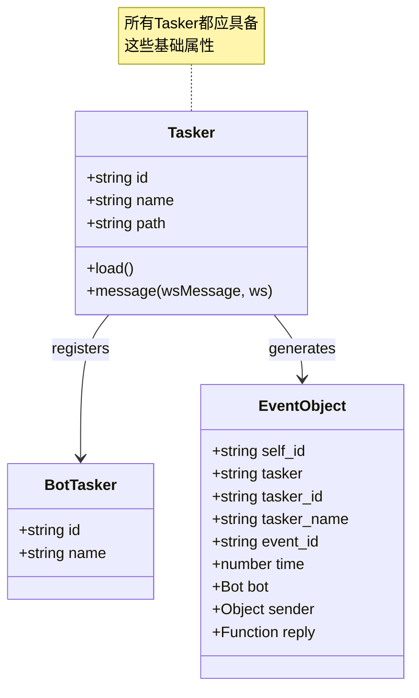
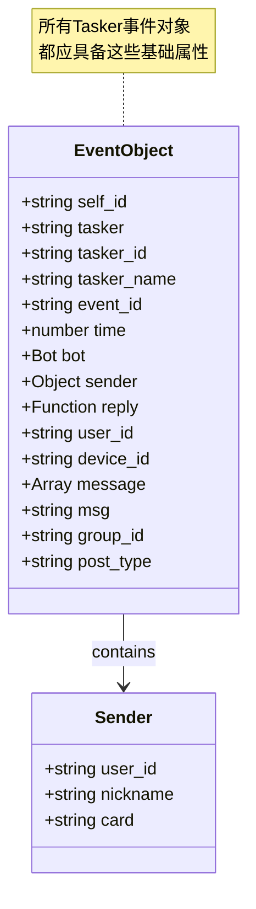

# Tasker 底层规范

> **文件位置**：本文档定义所有 Tasker（任务层 / 事件生成器）最底层应该具备的属性和函数  
> **可扩展性**：Tasker是协议适配层的核心扩展点。通过实现Tasker接口，开发者可以快速接入新平台，无需修改底层代码。详见 **[框架可扩展性指南](框架可扩展性指南.md)** ⭐

本文档定义了所有 Tasker（任务层 / 事件生成器）最底层应该具备的属性和函数，这些是 Tasker 的基础接口，不包含任何特定 Tasker（如 OneBot、stdin、device）的专有逻辑。

### 扩展特性

- ✅ **零配置扩展**：放置到任意 `core/*/tasker/` 目录即可自动加载
- ✅ **标准化事件**：统一的事件格式，便于处理
- ✅ **协议转换**：将平台消息转换为统一事件模型
- ✅ **自动注册**：通过 `Bot.tasker.push()` 自动注册
- ✅ **多Bot支持**：支持同一Tasker管理多个Bot实例
- ✅ **事件去重**：自动处理重复事件，避免重复处理

---

## 📚 目录

- [Tasker 基础属性](#tasker-基础属性)
- [事件对象基础属性](#事件对象基础属性)
- [Tasker 特定属性（由增强插件处理）](#tasker-特定属性由增强插件处理)
- [Bot实例基础方法](#bot实例基础方法)
- [事件处理流程](#事件处理流程)
- [Tasker Loader 规范](#tasker-loader-规范)
- [注意事项](#注意事项)
- [相关文档](#相关文档)

---

## Tasker 基础属性

**Tasker结构图**:



### Tasker 实例属性

每个 Tasker 实例应该具备以下属性：

- `id` - Tasker 唯一标识（如 'QQ', 'custom-im'）
- `name` - Tasker 名称（如 'OneBotv11', 'stdin'）
- `path` - Tasker 路径

### Bot 实例中的 Tasker 信息

- `bot.tasker.id` - Tasker ID
- `bot.tasker.name` - Tasker 名称
- 其他 Tasker 特定属性...

## 事件对象基础属性

所有 Tasker 的事件对象都应该具备以下基础属性：

**事件对象结构**:



### 必需属性

- **基础标识**：`self_id`、`tasker`、`tasker_id`、`tasker_name`
- **事件标识**：`event_id`、`time`
- **Bot对象**：`bot`（只读，不可修改）
- **发送者信息**：`user_id`、`sender` 对象
- **回复方法**：`reply` 通用回复方法

### 可选属性（根据事件类型）

```javascript
{
  // 设备相关（device Tasker）
  device_id?: string,           // 设备ID
  device_name?: string,         // 设备名称
  
  // 消息相关（message类型事件）
  message?: Array,              // 消息段数组
  raw_message?: string,        // 原始消息文本
  msg?: string,                // 处理后的消息文本
  message_id?: string|number,   // 消息ID
  
  // 群组相关（群消息事件）
  group_id?: string|number,     // 群组ID
  
  // 事件类型标识
  post_type?: string,          // 事件类型（'message', 'notice', 'request'等）
  event_type?: string,          // 事件类型（device Tasker）
  
  // Tasker 类型标识（由 Tasker 设置）
  isOneBot?: boolean,           // OneBot Tasker 标识
  isDevice?: boolean,           // Device Tasker 标识
  isStdin?: boolean,           // Stdin Tasker 标识
}
```

## Tasker 特定属性（由增强插件处理）

以下属性不应该在底层设置，而应该由对应的 Tasker 增强插件通过 `accept` 方法处理：

### OneBot 特定属性

```javascript
{
  // 对象引用（延迟加载）
  friend?: Friend,              // 好友对象（通过bot.pickFriend获取）
  group?: Group,               // 群组对象（通过bot.pickGroup获取）
  member?: Member,             // 群成员对象（通过bot.pickMember获取）
  
  // 类型标识
  isPrivate?: boolean,         // 是否为私聊
  isGroup?: boolean,           // 是否为群聊
  message_type?: string,       // 消息类型（'private', 'group', 'guild'）
  
  // @相关
  atList?: Array<string>,      // @列表
  at?: string,                 // 第一个@的用户ID（兼容）
  atBot?: boolean,            // 是否@了机器人
  
  // 群组信息
  group_name?: string,         // 群名称
  
  // 其他OneBot特定属性...
}
```

### Device 特定属性

```javascript
{
  device_id: string,           // 设备ID（必需）
  device_name?: string,       // 设备名称
  event_type?: string,        // 事件类型
  // 其他device特定属性...
}
```

### Stdin 特定属性

```javascript
{
  command?: string,            // 命令（如果适用）
  // 其他stdin特定属性...
}
```

## Bot实例基础方法

所有Bot实例都应该具备以下基础方法：

### 消息发送（通用接口）

```javascript
// 发送消息（Tasker 需要实现）
bot.sendMsg(msg, quote?, extraData?) => Promise<any>

// 通用辅助方法（由bot.js提供）
bot.makeForwardMsg(msg) => Object
bot.sendForwardMsg(sendFn, msg) => Promise<any>
bot.fileToUrl(file, opts?) => Promise<string>
```

### Bot 选择方法（Tasker 特定）

```javascript
// OneBot 特定（由 OneBot Tasker 内部直接提供）
bot.pickFriend(user_id, strict?) => Friend
bot.pickGroup(group_id, strict?) => Group
bot.pickMember(group_id, user_id) => Member

// 其他 Tasker 可能有不同的选择方法
```

## 事件处理流程

### 1. Tasker 发送事件

Tasker 在接收到外部上报后，应该：

1. 设置基础属性（self_id, tasker, tasker_id, tasker_name 等）
2. 调用 `Bot.em(eventName, data)` 发送事件
3. `Bot.em` 会自动调用 `Bot.prepareEvent(data)` 设置通用属性

### 2. Bot.prepareEvent（底层通用逻辑）

`Bot.prepareEvent` 只处理所有 Tasker 通用的属性：

- 确保 `bot` 对象存在
- 设置 `tasker_id` 和 `tasker_name`
- 初始化基础 `sender` 对象
- 调用 `_extendEventMethods` 添加通用方法

### 3. Tasker 增强插件（任务层特定逻辑）

Tasker 增强插件通过 `accept` 方法处理 Tasker 特定属性：

- OneBot 增强插件：处理 friend、group、member、atBot 等
- Device 增强插件：处理 device 特定属性
- Stdin 增强插件：处理 stdin 特定属性

### 4. 插件系统处理

插件系统会：

1. 调用Tasker增强插件的 `accept` 方法
2. 调用其他插件的 `accept` 方法
3. 执行匹配的插件规则

## Tasker Loader 规范

TaskerLoader 应该：

1. 扫描 Tasker 目录
2. 加载 Tasker 文件
3. Tasker 文件应该通过 `Bot.tasker.push()` 注册 Tasker 实例
4. Tasker 实例应该设置 `id` 和 `name` 属性

## 注意事项

1. **不要假设特定 Tasker**：底层代码不应该假设 OneBot、stdin 或 device 的存在
2. **使用 Tasker 标识**：通过 `e.tasker` 或 `e.tasker_name` 判断 Tasker 类型
3. **延迟加载对象**：friend、group、member 等对象应该使用 getter 延迟加载
4. **插件处理特定逻辑**：所有Tasker特定逻辑都应该在增强插件中处理
5. **保持底层通用**：底层代码应该对所有Tasker通用

---

## 相关文档

- **[Tasker 加载器](tasker-loader.md)** - TaskerLoader 如何扫描并加载 Tasker
- **[OneBotv11 Tasker](tasker-onebotv11.md)** - OneBotv11 Tasker 完整文档，包含全局对象说明和使用示例
- **[事件系统标准化文档](事件系统标准化文档.md)** - 事件命名规范、字段责任、处理流程
- **[Bot 主类文档](bot.md)** - Bot 主类说明，包含事件派发和 Bot 实例管理
- **[框架可扩展性指南](框架可扩展性指南.md)** - 扩展开发完整指南

---

*最后更新：2026-02-06*