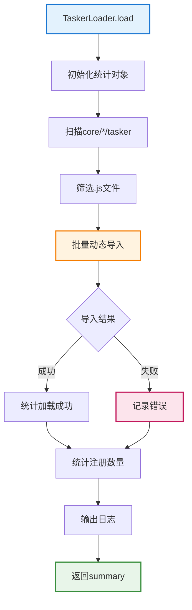
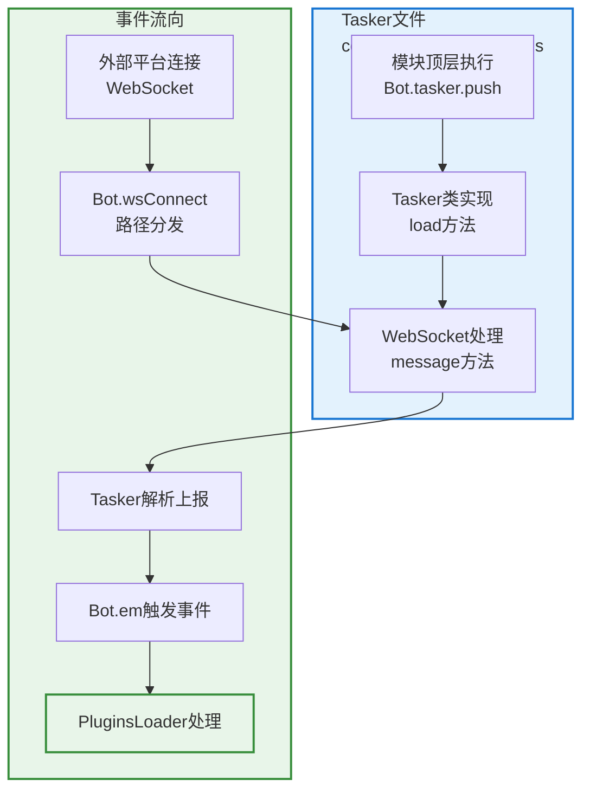

# Tasker 加载器文档

> **文件位置**：`src/infrastructure/tasker/loader.js`  
> **可扩展性**：TaskerLoader是Tasker系统的核心加载器，自动发现和加载所有Tasker。Tasker开发者只需将Tasker放置到对应目录，无需任何配置。详见 **[框架可扩展性指南](框架可扩展性指南.md)** ⭐

`TaskerLoader` 负责从所有 `core/*/tasker` 目录动态加载各类 Tasker（事件生成器，如 QQ OneBotv11 等），并与 `Bot` 主类配合，为整个系统提供统一的事件入口。

## 📚 目录

- [职责与定位](#职责与定位)
- [关键属性](#关键属性)
- [加载流程](#加载流程)
- [扫描逻辑](#扫描逻辑)
- [与 Tasker 实现的关系](#与-tasker-实现的关系)
- [扩展与调试建议](#扩展与调试建议)
- [相关文档](#相关文档)

---

## 职责与定位

> **注意**：框架支持多 core 模块架构。`TaskerLoader` 会自动扫描所有 `core/*/tasker` 目录，加载其中的所有 Tasker。

- 扫描所有 `core/*/tasker` 目录中的所有 `.js` 文件（如 `core/system-Core/tasker/`、`core/my-core/tasker/` 等）。
- 使用 `import()` 动态载入 Tasker 模块。
- 通过 Tasker 内部代码将自身注册到：
  - `Bot.tasker`：Tasker 列表。
  - `Bot.wsf[path]`：WebSocket 路径与处理函数映射。
- 提供加载过程的统计与日志：
  - 扫描数量、加载成功/失败数量、实际注册数量、错误列表等。

> Tasker 文件通常不需要直接依赖 `TaskerLoader`，只要在模块内调用 `Bot.tasker.push(...)` 即可被框架识别。

---

## 关键属性

- `this.loggerNs`：日志命名空间，固定为 `'TaskerLoader'`。

---

## 加载流程：`load(bot = Bot)`

**Tasker加载完整流程**:



**步骤说明**：

1. 初始化统计对象 `summary`（scanned/loaded/failed/registered/errors）
2. 调用 `getAdapterFiles()` 扫描所有 `core/*/tasker` 目录，筛选 `.js` 文件
3. 批量导入：对每个文件执行 `await import(href)`
4. 统计注册数量：检查 `bot.tasker.length` 的增量
5. 输出总结日志
6. 返回 `summary`，便于 API 或调试页面展示

---

## 扫描逻辑：`getAdapterFiles()`

- 调用 `paths.getCoreDirs()` 获取所有 core 目录，遍历每个 `core/*/tasker` 子目录。
- 使用 `FileLoader.readFiles(taskerDir, { ext: '.js', recursive: false })` 读取 `.js` 文件。
- 为每个文件构造 `{ name, href, core }`：`name` 为文件名（如 `OneBotv11.js`），`href` 为 `file://` URL 供 `import(href)` 使用。
- 若某 tasker 目录不存在或读取失败，跳过并打日志，不中断整体加载。

---

## 与 Tasker 实现的关系

**Tasker注册与事件流**:



**Tasker文件典型结构**：

- 模块顶层：`Bot.tasker.push(new OneBotv11Tasker())`
- Tasker类方法：
  - `load()` - 向 `Bot.wsf[path]` 注册 WebSocket 消息处理函数
  - `message(wsMessage, ws)` - 解析上报并调用 `Bot.em` 触发事件
  - 各种 send/get 接口封装（发送消息、获取列表等）

**事件流向**：

1. 外部平台通过 WebSocket 与 XRK-AGT 建立连接
2. `Bot.wsConnect` 根据路径选择对应的 Tasker 处理函数
3. Tasker 解析 JSON 上报，转换为统一事件结构
4. 调用 `Bot.em("message.group.normal", data)` 触发事件，交由 `PluginsLoader` 处理

---

## 扩展与调试建议

### 新增 Tasker

**步骤**：
1. 在任意 core 目录的 `tasker` 子目录中新建 `XXX.js`（如 `core/my-core/tasker/MyTasker.js`）
2. 在文件内：
   - 通过 `Bot.tasker.push(new XXXTasker())` 注册 Tasker
   - 在 `load()` 中向 `Bot.wsf` 映射对应 WebSocket 路径
   - 在 `message()` 中解析上报并调用 `Bot.em`
3. 重启或通过相应命令触发 Tasker 重载后，`TaskerLoader.load()` 会自动发现

**代码示例**：
```javascript
// core/my-core/tasker/MyTasker.js
export default class MyTasker {
  constructor() {
    this.id = 'mytasker';
    this.name = 'MyTasker';
  }

  async load() {
    // 注册 WebSocket 路径
    Bot.wsf['/ws/mytasker'] = (ws, req) => {
      ws.on('message', (msg) => this.message(msg, ws));
    };
  }

  async message(wsMessage, ws) {
    const data = JSON.parse(wsMessage);
    // 转换为统一事件格式
    const e = {
      tasker: 'mytasker',
      post_type: 'message',
      message_type: 'group',
      user_id: data.user_id,
      group_id: data.group_id,
      msg: data.message,
      time: Date.now()
    };
    // 触发事件
    Bot.em('mytasker.message.group.normal', e);
  }
}

// 注册 Tasker
Bot.tasker.push(new MyTasker());
```

### 调试加载问题

- 查看启动日志中 `TaskerLoader` 名下的输出
- 若 `failed > 0`，可从 `summary.errors` 或控制台日志中找到对应错误
- 注意 Tasker 文件必须是 ES Module（`export` 语法），并确保所有依赖可用

---

---

## 相关文档

- **[Tasker 底层规范](tasker-base-spec.md)** - Tasker 基础接口规范
- **[OneBotv11 Tasker](tasker-onebotv11.md)** - OneBotv11 Tasker 完整实现示例
- **[框架可扩展性指南](框架可扩展性指南.md)** - 扩展开发完整指南
- **[事件系统标准化文档](事件系统标准化文档.md)** - 事件命名与字段责任说明

---

*最后更新：2026-02-12*