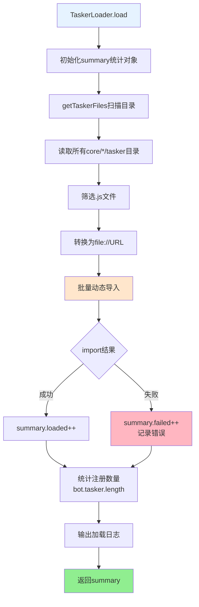
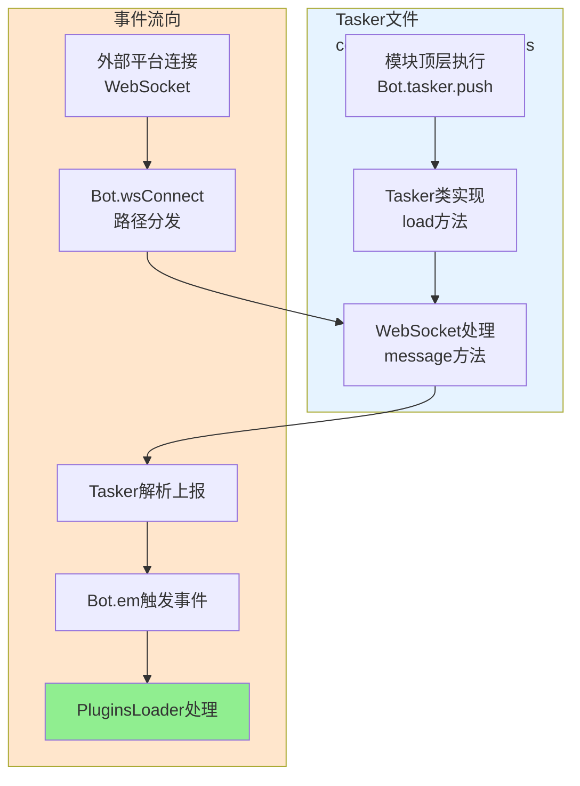

## TaskerLoader 文档（src/infrastructure/tasker/loader.js）

`TaskerLoader` 负责从所有 `core/*/tasker` 目录动态加载各类 Tasker（事件生成器，如 QQ OneBotv11 等），并与 `Bot` 主类配合，为整个系统提供统一的事件入口。

---

## 职责与定位

> **注意**：框架支持多 core 模块架构。`TaskerLoader` 会自动扫描所有 `core/*/tasker` 目录，加载其中的所有 Tasker。

- 扫描所有 `core/*/tasker` 目录中的所有 `.js` 文件（如 `core/system-Core/tasker/`、`core/my-core/tasker/` 等）。
- 使用 `import()` 动态载入 Tasker 模块。
- 通过 Tasker 内部代码将自身注册到：
  - `Bot.tasker`：Tasker 列表。
  - `Bot.wsf[path]`：WebSocket 路径与处理函数映射。
- 提供加载过程的统计与日志：
  - 扫描数量、加载成功/失败数量、实际注册数量、错误列表等。

> Tasker 文件通常不需要直接依赖 `TaskerLoader`，只要在模块内调用 `Bot.tasker.push(...)` 即可被框架识别。

---

## 关键属性

- `this.loggerNs`：日志命名空间，固定为 `'TaskerLoader'`。

> **注意**：`TaskerLoader` 不再使用固定的 `baseDir`，而是动态扫描所有 core 目录下的 `tasker` 子目录。

---

## 加载流程：`load(bot = Bot)`

**Tasker加载完整流程**:

**步骤说明**：

1. 初始化统计对象 `summary`（scanned/loaded/failed/registered/errors）
2. 调用 `getTaskerFiles()` 扫描所有 `core/*/tasker` 目录，筛选 `.js` 文件
3. 批量导入：对每个文件执行 `await import(href)`
4. 统计注册数量：检查 `bot.tasker.length` 的增量
5. 输出总结日志
6. 返回 `summary`，便于 API 或调试页面展示

---

## 扫描逻辑：`getTaskerFiles()`

- 使用 `fs.readdir(this.baseDir, { withFileTypes: true })` 读取目录。
- 过滤出「普通文件 + `.js` 扩展名」。
- 为每个文件构造：
  - `name`：文件名（如 `OneBotv11.js`）。
  - `href`：完整 `file://` URL 路径，用于 `import(href)`。
- 若目录不存在（`ENOENT`），输出告警日志并返回空数组。

---

## 与 Tasker 实现的关系

**Tasker注册与事件流**:

**Tasker文件典型结构**：

- 模块顶层：`Bot.tasker.push(new OneBotv11Tasker())`
- Tasker类方法：
  - `load()` - 向 `Bot.wsf[path]` 注册 WebSocket 消息处理函数
  - `message(wsMessage, ws)` - 解析上报并调用 `Bot.em` 触发事件
  - 各种 send/get 接口封装（发送消息、获取列表等）

**事件流向**：

1. 外部平台通过 WebSocket 与 XRK-AGT 建立连接
2. `Bot.wsConnect` 根据路径选择对应的 Tasker 处理函数
3. Tasker 解析 JSON 上报，转换为统一事件结构
4. 调用 `Bot.em("message.group.normal", data)` 触发事件，交由 `PluginsLoader` 处理

---

## 扩展与调试建议

- **新增 Tasker**
  - 在任意 core 目录的 `tasker` 子目录中新建 `XXX.js`（如 `core/my-core/tasker/MyTasker.js`）。
  - 在文件内：
    - 通过 `Bot.tasker.push(new XXXTasker())` 注册 Tasker。
    - 在 `load()` 中向 `Bot.wsf` 映射对应 WebSocket 路径。
    - 在 `message()` 中解析上报并调用 `Bot.em`。
  - 重启或通过相应命令触发 Tasker 重载后，`TaskerLoader.load()` 会自动发现。

- **调试加载问题**
  - 查看启动日志中 `TaskerLoader` 名下的输出。
  - 若 `failed > 0`，可从 `summary.errors` 或控制台日志中找到对应错误。
  - 注意 Tasker 文件必须是 ES Module（`export` 语法），并确保所有依赖可用。

