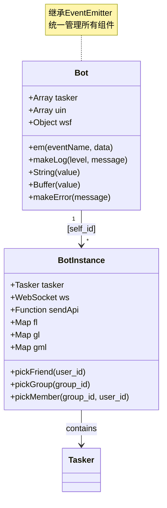
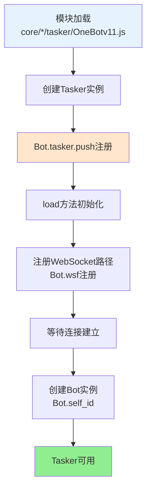
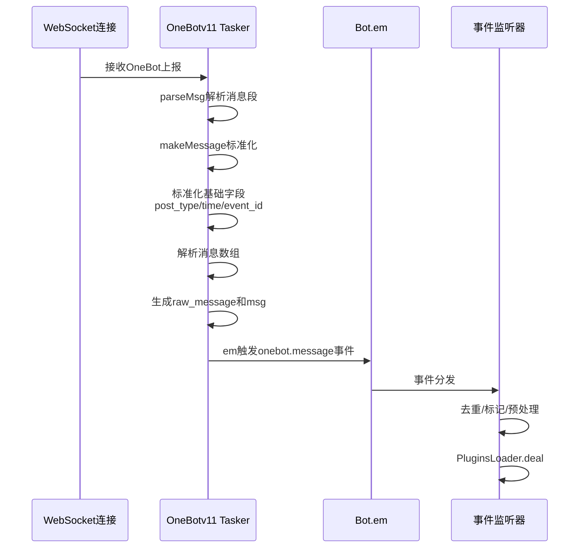

# OneBotv11 Tasker 文档

> **文件位置**：`core/system-Core/tasker/OneBotv11.js`  
> **可扩展性**：OneBotv11 Tasker 是协议适配层的实现。通过参考此实现，开发者可以快速创建新的 Tasker。详见 **[框架可扩展性指南](框架可扩展性指南.md)** ⭐

OneBotv11 Tasker（事件生成器）负责对接 QQ/OneBotv11 协议，实现：

- WebSocket 上报解析与事件转译
- 好友、群、频道等高层对象的封装（`pickFriend/pickGroup/pickMember`）
- 统一的消息发送、消息历史、文件操作等接口

### 扩展特性

- ✅ **协议转换**：将 OneBot v11 协议转换为统一事件格式
- ✅ **对象封装**：提供友好的对象访问接口（Friend、Group、Member）
- ✅ **自动注册**：通过 `Bot.tasker.push()` 自动注册
- ✅ **事件标准化**：统一的事件格式，便于插件处理
- ✅ **延迟加载**：对象访问器使用 getter 延迟加载，提升性能

---

## 📚 目录

- [全局对象说明](#全局对象说明)
- [注册与初始化](#注册与初始化)
- [核心方法说明](#核心方法说明)
- [连接与初始化流程](#连接与初始化流程)
- [正确使用示例](#正确使用示例)
- [注意事项](#注意事项)
- [开发与调试](#开发与调试)
- [API 参考](#api-参考)
- [相关文档](#相关文档)

---

## 全局对象说明

### Bot 主对象

`Bot` 是系统的核心全局对象，继承自 `EventEmitter`。

**Bot主对象结构**:



**重要属性**：

- `tasker` - Tasker 列表（事件生成器列表）
- `[self_id]` - Bot 实例映射表（key 为 self_id）
- `uin` - QQ 号列表
- `wsf` - WebSocket 工厂函数映射
- `em(eventName, data)` - 事件触发方法
- `makeLog(level, message)` - 日志方法

### Bot 实例对象 (Bot[self_id])

每个连接的 Bot 都会在 `Bot[self_id]` 下创建一个实例对象：

```javascript
Bot[self_id] = {
  // 基础属性
  tasker: OneBotv11Tasker,      // Tasker 实例
  ws: WebSocket,                   // WebSocket 连接
  sendApi: Function,               // API 调用方法
  stat: Object,                    // 统计信息
  model: string,                   // 模型名称
  info: Object,                    // Bot 信息
  version: Object,                 // 版本信息
  
  // 属性访问器
  get uin(): string,               // QQ 号
  get nickname(): string,          // 昵称
  get avatar(): string,            // 头像 URL
  
  // 好友相关
  pickFriend: Function(user_id: string): FriendObject,
  getFriendArray: Function(): Array<Object>,
  getFriendList: Function(): Array<string>,
  getFriendMap: Function(): Map<string, Object>,
  fl: Map<string, Object>,         // 好友列表映射（只读）
  
  // 群组相关
  pickGroup: Function(group_id: string): GroupObject,
  getGroupArray: Function(): Array<Object>,
  getGroupList: Function(): Array<string>,
  getGroupMap: Function(): Map<string, Object>,
  getGroupMemberMap: Function(): Map<string, Map<string, Object>>,
  gl: Map<string, Object>,         // 群列表映射（只读）
  gml: Map<string, Map<string, Object>>,  // 群成员映射（只读）
  
  // 成员相关
  pickMember: Function(group_id: string, user_id: string): MemberObject,
  
  // 其他方法
  setProfile: Function(profile: Object): Promise,
  setNickname: Function(nickname: string): Promise,
  setAvatar: Function(file: string|Buffer): Promise,
  // ... 更多方法
}
```

### 事件对象 (e)

插件处理函数接收的事件对象结构：

```javascript
e = {
  // 基础字段（OneBot v11 规范）
  post_type: 'message' | 'notice' | 'request',
  message_type: 'private' | 'group',
  sub_type: string,
  time: number,                    // Unix 时间戳
  self_id: string,                 // Bot QQ 号
  event_id: string,                // 事件唯一 ID
  
  // 消息相关
  message: Array<MessageSegment>,  // 消息段数组
  raw_message: string,            // 原始消息文本（CQ 码格式）
  msg: string,                     // 消息文本（插件系统使用）
  message_id: number,              // 消息 ID
  
  // 用户相关
  user_id: string,                 // 发送者 QQ 号
  sender: {
    user_id: string,
    nickname: string,
    card: string,                  // 群名片（群消息时）
    role: 'owner' | 'admin' | 'member',  // 群角色（群消息时）
    // ... 更多字段
  },
  
  // 群组相关（群消息时）
  group_id: string,                // 群号
  group_name: string,              // 群名
  
  // Tasker 标识
  tasker: 'onebot',
  isOneBot: true,
  isGroup: boolean,
  isPrivate: boolean,
  
  // Bot 实例
  bot: BotInstance,                // Bot[self_id] 对象
  
  // 对象访问器（延迟加载，由OneBotEnhancer插件通过accept方法挂载）
  friend: FriendObject,            // 好友对象（私聊/群聊时可用，由增强插件挂载）
  group: GroupObject,              // 群对象（群聊时可用，由增强插件挂载）
  member: MemberObject,            // 成员对象（群聊时可用，由增强插件挂载）
  
  // @相关属性（由OneBotEnhancer插件处理）
  atList: Array<string>,           // @列表
  at: string,                      // 第一个@的用户ID（兼容）
  atBot: boolean,                  // 是否@了机器人
  
  // 回复方法（由增强插件或bot.js的prepareEvent设置）
  reply: Function(msg: string|Array): Promise<Object>
}
```

### 消息段对象 (MessageSegment)

```javascript
MessageSegment = {
  type: 'text' | 'at' | 'image' | 'face' | 'reply' | 'record' | 'video' | 'file' | ...,
  // 根据 type 不同，data 字段不同
  text?: string,                   // text 类型
  qq?: string,                     // at 类型
  url?: string,                    // image 类型
  file?: string,                   // image/record/video/file 类型
  id?: string|number,              // face/reply 类型
  // ... 更多字段
}
```

---

## 注册与初始化

**OneBotv11 Tasker注册流程**:



### Tasker注册

Tasker在模块加载时自动注册：

```javascript
// core/system-Core/tasker/OneBotv11.js
Bot.tasker.push(new OneBotv11Tasker())
```

### WebSocket 连接处理

Tasker在 `load()` 方法中向 `Bot.wsf[this.path]` 注册 WebSocket 处理函数：

```javascript
// this.path = 'OneBotv11'
Bot.wsf['OneBotv11'].push((ws, ...args) => {
  ws.on('message', data => this.message(data, ws, ...args))
})
```

当 WebSocket 连接到路径 `/OneBotv11` 时，会自动调用注册的处理函数。

---

## 核心方法说明

### API 调用

#### `sendApi(data, ws, action, params)`

发送 OneBot API 请求并等待响应。

**参数：**
- `data: Object` - 包含 `self_id` 的数据对象
- `ws: WebSocket` - WebSocket 连接对象
- `action: string` - API 动作名称
- `params: Object` - API 参数

**返回：** `Promise<Object>` - API 响应数据

**示例：**
```javascript
// 在Tasker内部使用
const result = await this.sendApi(data, ws, 'get_login_info')
// result = { user_id: '123456', nickname: 'Bot' }
```

### 消息处理

**消息处理流程**:



#### `parseMsg(msg)`

将 OneBot 消息段数组转换为内部统一格式。

**参数**：`msg: Array<Object>|Object|string` - 消息数据  
**返回**：`Array<MessageSegment>` - 标准化的消息段数组

#### `makeMessage(data)`

处理消息事件，标准化数据并触发事件。

**处理流程**：
1. 标准化基础字段（`post_type`, `time`, `event_id`, `message_type`, `sub_type`）
2. 解析消息数组
3. 生成 `raw_message` 和 `msg`
4. 根据消息类型创建相应的对象访问器（`friend`, `group`, `member`）
5. 触发 `onebot.message` 事件

### 消息发送

#### `sendFriendMsg(data, msg)`

发送好友消息。

**参数：**
- `data: Object` - 包含 `self_id`, `user_id`, `bot` 的数据对象
- `msg: string|Array|Object` - 消息内容

**返回：** `Promise<Object>` - 发送结果

**示例：**
```javascript
// 在插件中使用
const friend = Bot[e.self_id].pickFriend(e.user_id)
await friend.sendMsg('Hello')
```

#### `sendGroupMsg(data, msg)`

发送群消息。

**参数：**
- `data: Object` - 包含 `self_id`, `group_id`, `bot` 的数据对象
- `msg: string|Array|Object` - 消息内容

**返回：** `Promise<Object>` - 发送结果

**示例：**
```javascript
// 在插件中使用
const group = Bot[e.self_id].pickGroup(e.group_id)
await group.sendMsg('Hello')
```

### 对象封装

#### `pickFriend(data, user_id)`

创建好友对象，提供好友相关的操作方法。

**返回对象：**
```javascript
{
  user_id: string,
  nickname: string,
  // ... 好友信息
  
  sendMsg: Function(msg): Promise<Object>,
  getMsg: Function(message_id): Promise<Object>,
  recallMsg: Function(message_id): Promise<Object>,
  sendForwardMsg: Function(messages): Promise<Object>,
  sendFile: Function(file, name?): Promise<Object>,
  getInfo: Function(): Promise<Object>,
  getAvatarUrl: Function(): string,
  getChatHistory: Function(message_seq, count, reverseOrder?): Promise<Array>,
  thumbUp: Function(times): Promise<Object>,
  delete: Function(): Promise<Object>
}
```

#### `pickGroup(data, group_id)`

创建群对象，提供群相关的操作方法。

**返回对象：**
```javascript
{
  group_id: string,
  group_name: string,
  // ... 群信息
  
  sendMsg: Function(msg): Promise<Object>,
  getMsg: Function(message_id): Promise<Object>,
  recallMsg: Function(message_id): Promise<Object>,
  sendForwardMsg: Function(messages): Promise<Object>,
  sendFile: Function(file, name?): Promise<Object>,
  getInfo: Function(): Promise<Object>,
  getAvatarUrl: Function(): string,
  getChatHistory: Function(message_seq, count, reverseOrder?): Promise<Array>,
  getHonorInfo: Function(): Promise<Object>,
  getEssence: Function(): Promise<Array>,
  getMemberArray: Function(): Promise<Array>,
  getMemberList: Function(): Promise<Array>,
  getMemberMap: Function(): Promise<Map>,
  pickMember: Function(user_id): MemberObject,
  pokeMember: Function(qq): Promise<Object>,
  setName: Function(name): Promise<Object>,
  setAvatar: Function(file): Promise<Object>,
  setAdmin: Function(user_id, enable): Promise<Object>,
  setCard: Function(user_id, card): Promise<Object>,
  setTitle: Function(user_id, title, duration): Promise<Object>,
  sign: Function(): Promise<Object>,
  muteMember: Function(user_id, duration): Promise<Object>,
  muteAll: Function(enable): Promise<Object>,
  kickMember: Function(user_id, reject_add_request?): Promise<Object>,
  quit: Function(is_dismiss?): Promise<Object>,
  fs: Object,  // 文件系统对象
  get is_owner(): boolean,
  get is_admin(): boolean
}
```

#### `pickMember(data, group_id, user_id)`

创建成员对象，提供成员相关的操作方法。

**返回对象：**
```javascript
{
  user_id: string,
  group_id: string,
  // ... 成员信息
  
  // 继承自 FriendObject 的方法
  sendMsg: Function(msg): Promise<Object>,
  getInfo: Function(): Promise<Object>,
  getAvatarUrl: Function(): string,
  // ... 更多方法
  
  // 成员特有方法
  poke: Function(): Promise<Object>,
  mute: Function(duration): Promise<Object>,
  kick: Function(reject_add_request?): Promise<Object>,
  
  // 属性访问器
  get is_friend(): boolean,
  get is_owner(): boolean,
  get is_admin(): boolean
}
```

---

## 连接与初始化流程

### 生命周期事件处理

当 OneBot 客户端发送 `lifecycle` 元事件时，Tasker会执行以下流程：

1. **创建 Bot 实例**
   - 在 `Bot[self_id]` 下创建基础 Bot 对象
   - 挂载Tasker、WebSocket、API 方法等
   - 将 `self_id` 加入 `Bot.uin` 列表

2. **获取基础信息**
   - 调用 `get_login_info` 获取登录信息
   - 调用 `get_version_info` 获取版本信息
   - 设置模型展示信息

3. **触发连接事件**
   - 立即触发 `connect.${self_id}` 事件
   - 此时 Bot 已可用，但数据可能未完全加载

4. **异步加载数据**（后台执行）
   - 加载频道资料和在线客户端列表
   - 获取多域名 cookies 和 CSRF token
   - 加载好友列表（`getFriendMap`）
   - 加载群列表和成员列表（`getGroupMemberMap`）

5. **标记就绪**
   - 设置 `_ready = true`
   - 触发 `ready.${self_id}` 事件

### 事件处理流程

1. **WebSocket 消息接收**
   - `message(data, ws)` 方法接收原始 JSON 数据

2. **消息路由**
   - 根据 `post_type` 路由到对应处理方法：
     - `meta_event` → `makeMeta(data, ws)`
     - `message` → `makeMessage(data)`
     - `notice` → `makeNotice(data)`
     - `request` → `makeRequest(data)`
     - `message_sent` → `makeMessage(data)`（转换为 message）

3. **数据标准化**
   - 标准化消息数据（`normalizeMessageData`）
   - 解析消息段数组
   - 生成必要字段

4. **事件触发**
   - 触发 `onebot.${post_type}` 事件
   - 事件监听器（`OneBotEvent`）接收并处理

5. **插件处理**
   - 事件监听器调用 `plugins.deal(e)`
   - `Bot.em` 会自动调用 `Bot.prepareEvent(e)` 设置通用属性
   - `OneBotEnhancer` 增强插件通过`accept`方法挂载OneBot特定属性（`friend`、`group`、`member`、`atBot`等）
   - 插件系统匹配并执行相应插件

---

## 正确使用示例

### 在插件中访问 Bot 实例

```javascript
// ✅ 正确：通过 self_id 访问 Bot 实例
const bot = Bot[e.self_id]
const friend = bot.pickFriend(e.user_id)

// ❌ 错误：直接使用 e.bot（可能未初始化）
const friend = e.bot.pickFriend(e.user_id)  // 不推荐
```

### 在插件中发送消息

```javascript
// ✅ 正确：使用事件对象的 reply 方法
export default class MyPlugin extends plugin {
  async test(e) {
    await e.reply('Hello')
  }
}

// ✅ 正确：使用对象的方法
export default class MyPlugin extends plugin {
  async test(e) {
    const friend = Bot[e.self_id].pickFriend(e.user_id)
    await friend.sendMsg('Hello')
  }
}

// ❌ 错误：直接调用Tasker方法
// Tasker方法不应在插件中直接调用
```

### 在插件中访问好友/群信息

```javascript
// ✅ 正确：使用事件对象的访问器
export default class MyPlugin extends plugin {
  async test(e) {
    const friend = e.friend  // 自动获取好友对象
    const info = await friend.getInfo()
    await e.reply(`好友昵称：${info.nickname}`)
  }
}

// ✅ 正确：手动获取对象
export default class MyPlugin extends plugin {
  async test(e) {
    const bot = Bot[e.self_id]
    const friend = bot.pickFriend(e.user_id)
    const info = await friend.getInfo()
  }
}
```

### 在插件中处理群消息

```javascript
// ✅ 正确：使用事件对象的访问器
export default class MyPlugin extends plugin {
  async test(e) {
    if (e.isGroup) {
      const group = e.group  // 自动获取群对象
      const member = e.member  // 自动获取成员对象
      
      await e.reply(`群名：${group.group_name}`)
      await e.reply(`成员昵称：${member.nickname}`)
    }
  }
}
```

### 在Tasker内部使用

```javascript
// ✅ 正确：在Tasker方法中使用
sendFriendMsg(data, msg) {
  // data.bot 是 Bot[self_id] 实例
  return data.bot.sendApi('send_msg', {
    user_id: data.user_id,
    message: msg
  })
}
```

---

## 注意事项

1. **Bot 实例访问**
   - 始终通过 `Bot[self_id]` 访问 Bot 实例
   - 不要直接使用 `e.bot`，除非确保已初始化

2. **对象访问器**
   - `e.friend`, `e.group`, `e.member` 由`OneBotEnhancer`增强插件通过`accept`方法挂载
   - 使用getter延迟加载，首次访问时创建对象
   - 这些属性只在OneBot事件中可用，其他Tasker事件中不存在

3. **消息格式**
   - 消息可以是字符串、对象或数组
   - 数组格式为消息段数组，符合 OneBot v11 规范

4. **错误处理**
   - 所有异步操作都应使用 try-catch
   - API 调用失败会抛出错误，需要适当处理

5. **事件去重**
   - 事件监听器会自动去重，基于 `event_id`
   - 确保 `event_id` 的唯一性

---

## 开发与调试

### 观察日志

Tasker使用 `Bot.makeLog` 记录日志：

- **info**: 正常操作（发送/接收消息、群变动等）
- **warn**: 警告信息（未知消息类型、Bot 不存在等）
- **error**: 错误信息（API 调用失败、处理异常等）
- **debug**: 调试信息（事件去重、数据加载等）

### 与插件系统的关系

- 所有通过 OneBotv11 接入的消息最终都会转译为统一事件格式
- 事件经由 `OneBotEvent` 监听器处理，然后交给 `PluginsLoader.deal(e)` 处理
- 插件通过 `e.friend/e.group/e.member` 调用的方法，实际上都由Tasker封装与执行

---

## API 参考

详细的 API 方法说明请参考：
- [OneBot v11 规范](https://github.com/botuniverse/onebot-11)
- [NapCat 文档](https://napcat.github.io/)

Tasker实现的方法与 OneBot v11 规范保持一致，部分扩展方法请参考Tasker源码注释。

---

## 相关文档

- **[Tasker 底层规范](tasker-base-spec.md)** - Tasker 基础接口规范
- **[Tasker 加载器](tasker-loader.md)** - TaskerLoader 如何扫描并加载 Tasker
- **[事件系统标准化文档](事件系统标准化文档.md)** - 事件命名规范、字段责任、处理流程
- **[Bot 主类文档](bot.md)** - Bot 主类说明，包含事件派发和 Bot 实例管理
- **[插件基类文档](plugin-base.md)** - 插件基类完整 API
- **[框架可扩展性指南](框架可扩展性指南.md)** - 扩展开发完整指南

---

*最后更新：2026-02-06*
