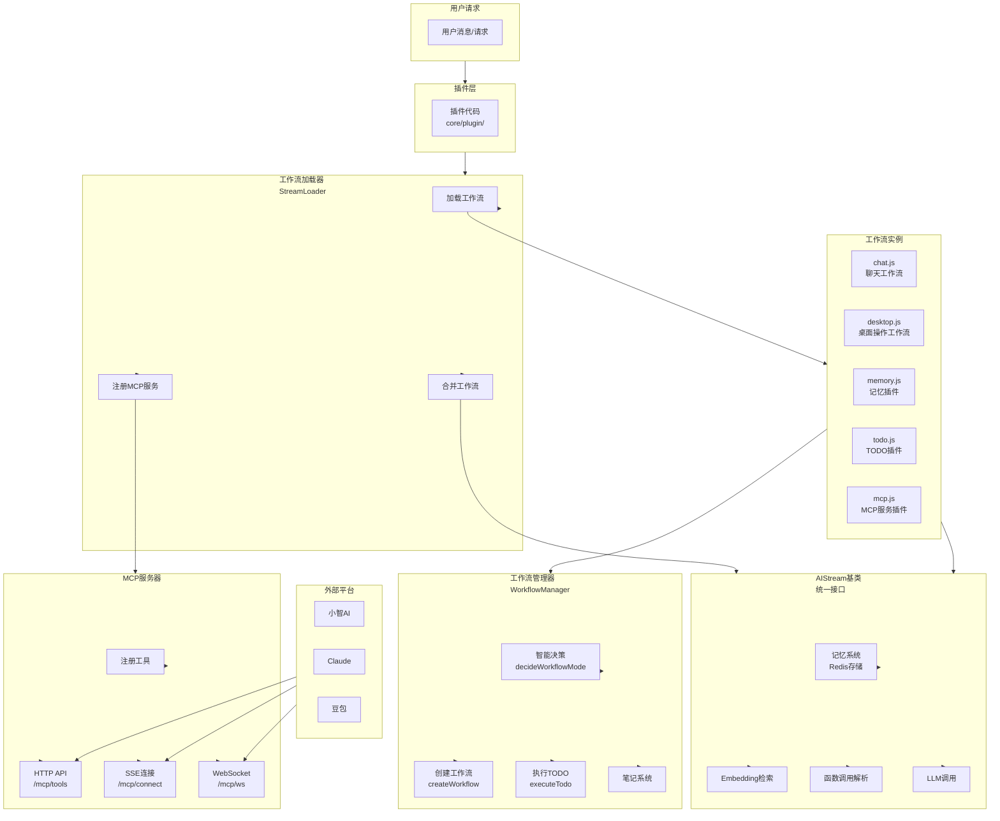
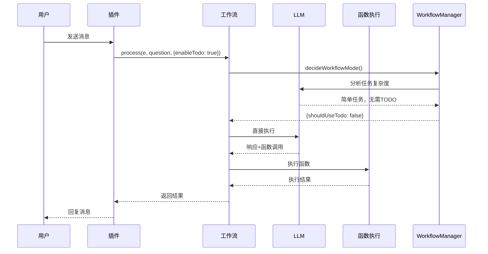
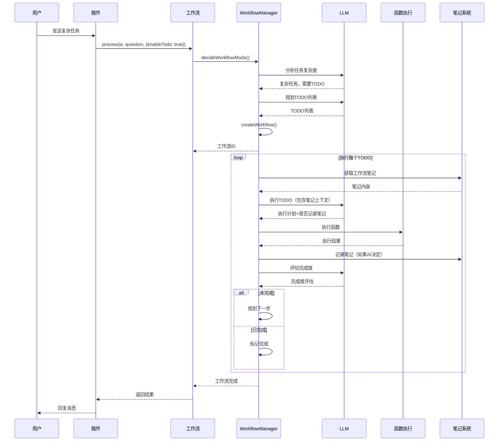
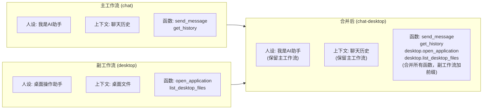
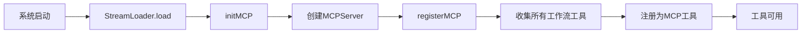

# AI工作流系统完整文档

## 📚 目录导航

- [架构概览](#架构概览)
- [核心特性](#核心特性)
- [系统架构图](#系统架构图)
- [工作流执行流程](#工作流执行流程)
- [核心组件详解](#核心组件详解)
- [工作流合并原理](#工作流合并原理)
- [MCP工具注册与连接](#mcp工具注册与连接)（详见 [`docs/mcp-guide.md`](mcp-guide.md)）
- [记忆系统](#记忆系统)
- [完整调用流程模拟](#完整调用流程模拟)
- [使用指南](#使用指南)
- [最佳实践](#最佳实践)

---

## 架构概览

XRK-AGT的AI工作流系统是一个**智能、模块化、可扩展**的工作流执行引擎，支持：

- ✅ **智能决策**：第一次LLM调用自动判断任务复杂度，决定是否开启多步骤工作流
- ✅ **工作流合并**：主工作流+副工作流灵活组合，只合并功能，不合并人设
- ✅ **MCP协议**：标准化的工具调用协议，支持外部平台（小智AI、Claude、豆包）连接
- ✅ **统一记忆**：消息记忆、笔记记忆、工作流记忆统一使用Redis存储
- ✅ **函数调用**：AI可以调用注册的函数，执行系统操作、文件操作等

---

## 核心特性

### 1. 智能决策

系统第一次调用LLM时，会自动分析任务复杂度：

- **简单任务**：直接执行，不开启TODO工作流
- **复杂任务**：开启TODO工作流，AI自主规划步骤并执行

### 2. 工作流合并

支持将多个工作流的功能合并到一个工作流中：

- **主工作流**：提供人设、上下文、主要功能
- **副工作流**：只合并functions，不合并人设/上下文
- **函数前缀**：副工作流函数自动加前缀（如`desktop.open_application`）

### 3. MCP工具注册

所有工作流的函数自动注册为MCP工具，支持：

- **HTTP API**：`GET /mcp/tools`、`POST /mcp/tools/call`
- **SSE连接**：`GET /mcp/connect`
- **WebSocket**：`WS /mcp/ws`

### 4. 统一记忆系统

所有记忆功能统一使用全局Redis：

- **消息记忆**：`ai:memory:{streamName}:{groupId}` - 带embedding的消息历史
- **笔记记忆**：`ai:notes:{workflowId}` - 工作流笔记
- **工作流记忆**：`ai:workflow:{workflowId}` - 工作流元数据

---

## 系统架构图



---

## 工作流执行流程

### 简单任务流程



### 复杂任务流程（TODO工作流）



---

## 核心组件详解

### 1. AIStream 基类

**位置**: `src/infrastructure/aistream/aistream.js`

**核心功能**:

#### 记忆系统

```javascript
// 存储消息记忆（带embedding）
await stream.storeMessageWithEmbedding(groupId, {
  user_id: '123',
  nickname: '用户',
  message: '你好',
  message_id: 'msg_001',
  time: Date.now()
});

// 存储笔记（工作流笔记）
await stream.storeNote(workflowId, '桌面文件列表：微信.lnk', 'todo_0');

// 获取笔记
const notes = await stream.getNotes(workflowId);

// 存储工作流记忆
await stream.storeWorkflowMemory(workflowId, {
  goal: '打开微信',
  todos: ['查看桌面', '打开微信']
});

// 获取工作流记忆
const memory = await stream.getWorkflowMemory(workflowId);
```

#### process方法（简化调用）

```javascript
// 最简单的调用方式
const response = await stream.process(e, question, {
  mergeStreams: ['desktop'],  // 合并desktop工作流
  enableTodo: true,           // 启用TODO智能决策
  enableMemory: true          // 启用记忆系统
});
```

### 2. WorkflowManager 工作流管理器

**位置**: `core/workflow-manager.js`

**核心功能**:

#### 智能决策

```javascript
// 第一次LLM调用，决定是否开启TODO工作流
const decision = await workflowManager.decideWorkflowMode(e, goal);

if (decision.shouldUseTodo && decision.todos.length > 0) {
  // 复杂任务：启动TODO工作流
  const workflowId = await workflowManager.createWorkflow(e, goal, decision.todos);
} else {
  // 简单任务：直接执行
  await stream.process(e, { content: goal });
}
```

#### TODO工作流执行

- 每个TODO步骤由AI自主执行
- AI决定是否记录笔记
- 笔记内容由整个工作流共享
- 自动评估完成度（0-1之间）

### 3. StreamLoader 工作流加载器

**位置**: `src/infrastructure/aistream/loader.js`

**核心功能**:

#### 工作流合并

```javascript
// 合并主工作流和副工作流
const mergedStream = StreamLoader.mergeStreams({
  name: 'chat-desktop',
  main: 'chat',           // 主工作流
  secondary: ['desktop'], // 副工作流列表
  prefixSecondary: true,  // 副工作流函数加前缀
  description: '聊天主工作流 + 桌面副工作流'
});
```

#### MCP服务注册

```javascript
// 注册MCP服务（简化版）
StreamLoader.registerMCP(mcpServer);

// 获取MCP服务器（供HTTP API使用）
const mcpServer = StreamLoader.mcpServer;
```

### 4. 可注册的工作流插件

#### MemoryStream (记忆系统插件)

**位置**: `core/stream/memory.js`

- 自动为其他工作流提供记忆能力
- 加载后自动工作，无需手动调用

#### TodoStream (TODO工作流插件)

**位置**: `core/stream/todo.js`

- 自动为其他工作流注入workflowManager
- 提供多步骤任务执行能力

#### MCP HTTP API (MCP服务HTTP接口)

**位置**: `core/http/mcp.js`

- MCP服务HTTP接口，提供RESTful API和WebSocket连接
- 使用 `core/http/mcp-server.js` 中的 `MCPServer` 类
- 不需要registerFunction，专注于MCP服务

---

## 工作流合并原理

### 什么是工作流合并？

工作流合并是指将**多个工作流的功能**合并到一个工作流中，但**只合并functions，不合并人设/上下文**。

### 合并机制



### 合并规则

1. **人设和上下文**：只保留主工作流的
2. **函数**：合并所有工作流的函数
3. **函数前缀**：副工作流的函数自动加前缀（如`desktop.open_application`）
4. **函数冲突**：如果函数名冲突，优先使用主工作流的

### 使用场景

- **场景1**：聊天工作流需要桌面操作功能
  ```javascript
  const stream = StreamLoader.mergeStreams({
    name: 'chat-desktop',
    main: 'chat',
    secondary: ['desktop']
  });
  ```

- **场景2**：设备工作流需要AI对话能力
  ```javascript
  const stream = StreamLoader.mergeStreams({
    name: 'device-chat',
    main: 'device',
    secondary: ['chat']
  });
  ```

---

## MCP工具注册与连接

> **详细文档**：请参考 **[`docs/mcp-guide.md`](mcp-guide.md)** - MCP完整指南

### 快速概览

MCP (Model Context Protocol) 是XRK-AGT提供的标准化工具调用协议，允许外部AI平台（如小智AI、Claude、豆包）通过HTTP/WebSocket连接并调用系统工具。

**核心特性**：
- ✅ 所有工作流的函数自动注册为MCP工具
- ✅ 提供HTTP REST API和WebSocket接口
- ✅ 支持多平台连接（小智AI、Claude、豆包）
- ✅ 内置4个示例工具（系统信息、计算、文本处理、时间）

**API端点**：
- `GET /api/mcp/tools` - 获取工具列表
- `POST /api/mcp/tools/call` - 调用工具
- `GET /api/mcp/connect` - SSE连接
- `WS /mcp/ws` - WebSocket连接

**配置**：
```javascript
// core/commonconfig/system.js
aistream: {
  mcp: {
    enabled: true,        // 启用MCP服务
    port: 2537,          // HTTP服务端口
    autoRegister: true   // 自动注册所有工作流工具
  }
}
```

**工具注册流程**：



**外部平台连接示例**：

详见 [`docs/mcp-guide.md`](mcp-guide.md#外部平台连接) - 包含小智AI、Claude、豆包的完整连接示例

---

## 记忆系统

> **详细文档**：请参考 [`docs/workflow-memory-system.md`](workflow-memory-system.md)

### 核心设计原则

1. **工作流独立记忆**：每个工作流有独立的记忆系统，不会互相干扰
2. **合并工作流独立记忆**：合并后的工作流使用合并后的名称作为键
3. **TODO临时记忆**：TODO笔记30分钟自动过期，只在TODO循环内有效
4. **键值对不冲突**：使用工作流名称确保唯一性

### 记忆类型

#### 1. 消息记忆

存储带embedding的消息历史，用于语义检索：

```javascript
await stream.storeMessageWithEmbedding(groupId, {
  user_id: '123',
  nickname: '用户',
  message: '你好，帮我打开微信',
  message_id: 'msg_001',
  time: Date.now()
});

// 检索相关消息（从当前工作流的独立记忆系统检索）
const contexts = await stream.retrieveRelevantContexts(groupId, '打开软件', true);
```

**存储键**: `ai:memory:{streamName}:{groupId}`
- `chat`工作流：`ai:memory:chat:group_123`
- `desktop`工作流：`ai:memory:desktop:group_123`
- `chat-desktop`合并工作流：`ai:memory:chat-desktop:group_123`

#### 2. 笔记记忆（TODO临时记忆）

存储工作流笔记，由整个工作流共享，30分钟自动过期：

```javascript
// AI在执行TODO时决定记录笔记
// 输出格式：
完成度评估: 0.8
执行动作: [列出桌面文件]
下一步建议: 打开微信软件
笔记: 桌面文件列表：微信.lnk, 记事本.lnk, 计算器.lnk

// 笔记会被自动存储（临时笔记，30分钟过期）
await stream.storeNote(workflowId, '桌面文件列表：微信.lnk', 'todo_0', true);

// 获取所有笔记（自动过滤过期笔记）
const notes = await stream.getNotes(workflowId);
```

**存储键**: `ai:notes:{workflowId}`
**过期时间**: 30分钟（1800秒）

#### 3. 工作流记忆

存储工作流元数据：

```javascript
await stream.storeWorkflowMemory(workflowId, {
  goal: '打开微信并发送消息',
  todos: ['查看桌面', '打开微信', '发送消息'],
  status: 'running'
});

const memory = await stream.getWorkflowMemory(workflowId);
```

**存储键**: `ai:workflow:{workflowId}`
**过期时间**: 3天

---

## 完整调用流程模拟

### 场景：用户请求"帮我做一个表格"

#### 完整流程表格

| 步骤 | 操作 | 工作流 | 记忆键 | 说明 |
|------|------|--------|--------|------|
| 1 | 用户发送请求 | - | - | `用户: xxx帮我做一个表格` |
| 2 | 插件触发工作流 | `chat-desktop` | `ai:memory:chat-desktop:group_123` | 合并工作流，独立记忆系统 |
| 3 | 智能决策（第一次LLM） | `chat-desktop` | `ai:memory:chat-desktop:group_123` | 分析任务复杂度，决定开启TODO |
| 4 | 创建工作流 | `chat-desktop` | `ai:notes:workflow_xxx` | TODO笔记键（30分钟过期） |
| 5 | 执行TODO步骤1 | `chat-desktop` | `ai:notes:workflow_xxx` | 获取笔记：[]，记录笔记：`用户需要创建表格` |
| 6 | 执行TODO步骤2 | `chat-desktop` | `ai:notes:workflow_xxx` | 获取笔记：[步骤1笔记]，记录笔记：`已询问用户表格内容` |
| 7 | 用户回复 | `chat-desktop` | `ai:memory:chat-desktop:group_123` | 存储到chat-desktop工作流记忆 |
| 8 | 执行TODO步骤3 | `chat-desktop` | `ai:notes:workflow_xxx` | 获取笔记：[步骤1,2笔记]，检索记忆：`ai:memory:chat-desktop:group_123` |
| 9 | 工作流完成 | `chat-desktop` | `ai:notes:workflow_xxx` | TODO笔记30分钟后自动过期 |

#### 详细说明

**步骤2：工作流合并**
```javascript
// 工作流名称：chat-desktop（合并后的名称）
// 记忆键：ai:memory:chat-desktop:group_123
// 这是chat-desktop工作流的独立记忆空间
```

**步骤4：TODO笔记键**
```javascript
// 工作流ID：workflow_1234567890_abc123
// 笔记键：ai:notes:workflow_1234567890_abc123
// 过期时间：30分钟（1800秒）
```

**步骤5-8：TODO笔记共享**
- 每个TODO步骤可以看到之前所有步骤的笔记
- 笔记只在当前TODO工作流循环内有效
- 30分钟后自动过期

**步骤9：记忆保留**
- 消息记忆：`ai:memory:chat-desktop:group_123`（保留，用于后续对话）
- TODO笔记：`ai:notes:workflow_xxx`（30分钟后自动过期）

> **完整流程文档**：
> - 简单任务流程：请参考 [`docs/workflow-memory-system.md`](workflow-memory-system.md)
> - **复杂任务流程（推荐）**：请参考 [`docs/workflow-complex-task-example.md`](workflow-complex-task-example.md) - 包含工作区概念、错误处理、TOKEN优化等完整示例

---

## 使用指南

### 1. 插件中使用工作流

```javascript
import StreamLoader from '#infrastructure/aistream/loader.js';

export default class MyPlugin extends plugin {
  async triggerWorkflow() {
    const question = this.e.msg.substring(3).trim();
    
    // 简单调用：process方法自动处理合并工作流和TODO决策
    const stream = StreamLoader.getStream('chat');
    
    const response = await stream.process(this.e, question, {
      mergeStreams: ['desktop'],  // 合并desktop工作流
      enableTodo: true,           // 启用TODO智能决策
      enableMemory: true          // 启用记忆系统
    });
    
    return response ? this.reply(response) : true;
  }
}
```

### 2. 开发工作流

```javascript
import AIStream from '../../src/infrastructure/aistream/aistream.js';

export default class MyStream extends AIStream {
  constructor() {
    super({
      name: 'my-stream',
      description: '我的工作流',
      version: '1.0.0',
      priority: 100,
      config: {
        enabled: true,
        temperature: 0.7,
        maxTokens: 2000
      },
      embedding: {
        enabled: true,
        provider: 'lightweight'
      }
    });
  }

  async init() {
    await super.init();
    await this.initEmbedding();
    this.registerAllFunctions();
  }

  registerAllFunctions() {
    // 注册功能函数
    this.registerFunction('my_function', {
      description: '功能描述',
      prompt: '[命令:参数] - 功能说明',
      handler: async (params, context) => {
        // 处理逻辑
        const { param } = params;
        // 执行操作
        return { success: true };
      },
      enabled: true
    });
  }

  buildSystemPrompt(context) {
    return `你是一个智能助手。
    
【可用功能】
${this.buildFunctionsPrompt()}`;
  }

  async buildChatContext(e, question) {
    const messages = [];
    
    // 添加系统提示词
    messages.push({
      role: 'system',
      content: this.buildSystemPrompt({ e, question })
    });
    
    // 添加用户消息
    const text = typeof question === 'string' 
      ? question 
      : (question?.content || question?.text || '');
    
    messages.push({
      role: 'user',
      content: text
    });
    
    return messages;
  }
}
```

### 3. 开发MCP服务

详见 **[`docs/mcp-guide.md`](mcp-guide.md#开发指南)** - MCP完整指南

```javascript
import AIStream from '#infrastructure/aistream/aistream.js';
import { MCPServer } from '#core/http/mcp-server.js';
import StreamLoader from '#infrastructure/aistream/loader.js';

export default class MyMCPStream extends AIStream {
  constructor() {
    super({
      name: 'mcp-service',
      description: 'MCP服务',
      version: '1.0.0',
      priority: 50,
      config: { enabled: true },
      embedding: { enabled: false }
    });
    
    this.mcpServer = null;
  }

  async init() {
    await super.init();
    
    // 初始化MCP服务器
    this.mcpServer = new MCPServer(this);
    
    // 注册MCP服务（自动收集所有工作流的工具）
    StreamLoader.registerMCP(this.mcpServer);
  }
}
```

---

## 最佳实践

### 1. 工作流设计原则

- **单一职责**：每个工作流专注于一个领域
- **功能模块化**：通过函数注册提供功能
- **可组合性**：支持工作流合并

### 2. 函数设计原则

- **清晰的描述**：`description`和`prompt`要清晰
- **参数验证**：在handler中验证参数
- **错误处理**：妥善处理错误，返回友好提示

### 3. TODO工作流设计

- **任务粒度**：每个TODO应该是可执行的、清晰的操作
- **笔记记录**：重要信息要记录到笔记
- **完成度评估**：客观评估完成度

### 4. MCP工具设计

详见 **[`docs/mcp-guide.md`](mcp-guide.md#开发指南)** - MCP完整指南

- **标准化**：遵循MCP协议规范
- **文档完善**：提供清晰的工具描述和参数说明
- **错误处理**：返回标准化的错误响应

---

## 总结

XRK-AGT的AI工作流系统是一个**功能强大、可操作、可扩展**的系统：

- ✅ **智能决策**：自动判断任务复杂度
- ✅ **工作流合并**：灵活组合多个工作流
- ✅ **MCP协议**：标准化工具调用，支持外部平台连接
- ✅ **统一记忆**：消息、笔记、工作流记忆统一管理
- ✅ **函数调用**：AI可以调用注册的函数执行操作

整个系统设计遵循"**底层干净简洁，上层功能强大**"的原则，既保证了底层的一致性，又提供了上层的灵活性。
