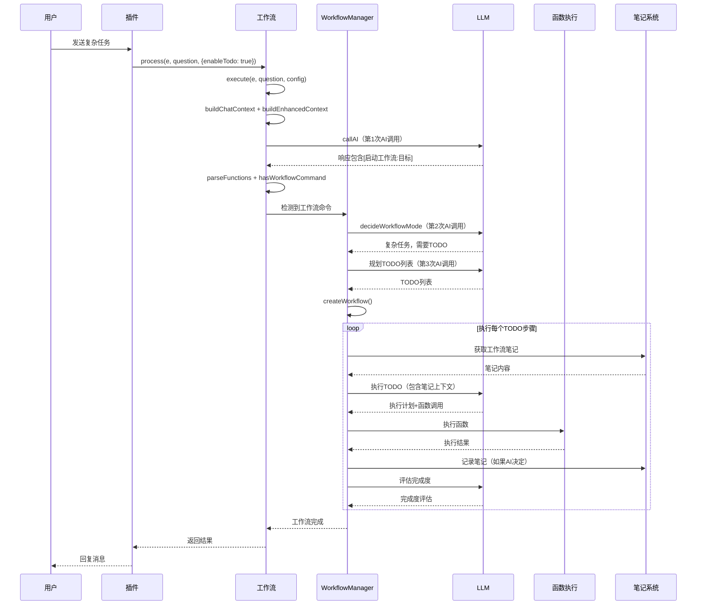

# 复杂任务完整调用流程模拟

> **本文档详细模拟复杂任务的完整执行流程，包括工作区概念、错误处理、TOKEN优化等核心特性。**
> **完整文档**：请参考 **[工作流系统完整文档](工作流系统完整文档.md)** - 包含系统概述、架构设计、执行流程等完整内容。

## 📚 目录导航

- [场景说明](#场景说明)
- [详细执行流程](#详细执行流程)
- [与大厂智能体的执行类似度](#与大厂智能体的执行类似度)
- [总结](#总结)

---

## 场景说明

### 场景：用户请求"帮我依据报告.docx做一个表格"

### 完整流程表格

| 步骤 | 操作 | 工作流 | 记忆键 | 说明 |
|------|------|--------|--------|------|
| 1 | 用户发送请求 | - | - | `用户: xxx帮我依据报告.docx做一个表格` |
| 2 | 插件触发工作流 | `chat-desktop` | `ai:memory:chat-desktop:group_123` | 合并工作流，独立记忆系统 |
| 3 | 智能决策（第一次LLM） | `chat-desktop` | `ai:memory:chat-desktop:group_123` | 分析任务复杂度，决定开启TODO |
| 4 | 创建工作流 | `chat-desktop` | `ai:notes:workflow_xxx` | TODO笔记键（30分钟过期） |
| 5 | 执行TODO步骤1 | `chat-desktop` | `ai:notes:workflow_xxx` | 在桌面工作区查找报告.docx |
| 6 | 执行TODO步骤2 | `chat-desktop` | `ai:notes:workflow_xxx` | 读取Word文档内容 |
| 7 | 执行TODO步骤3 | `chat-desktop` | `ai:notes:workflow_xxx` | 解析内容并创建Excel表格 |
| 8 | 工作流完成 | `chat-desktop` | `ai:notes:workflow_xxx` | TODO笔记30分钟后自动过期 |

---

## 详细执行流程

**复杂任务执行流程图**:



### 步骤1：用户发送请求

```
用户: xxx帮我依据报告.docx做一个表格
```

### 步骤2：插件触发工作流

```javascript
// core/my-core/plugin/xxx.js
const stream = StreamLoader.getStream('chat');
const response = await stream.process(this.e, question, {
  mergeStreams: ['desktop'],  // 合并desktop工作流
  enableTodo: true,           // 启用TODO智能决策
  enableMemory: true          // 启用记忆系统
});
```

**工作流信息**：
- 工作流名称：`chat-desktop`（合并后的名称）
- 记忆键：`ai:memory:chat-desktop:group_123`
- 工作区：桌面目录（desktop工作流的默认工作区）

### 步骤3：智能决策（第一次LLM调用）

**系统提示词构建**：
```javascript
// 主工作流的 buildSystemPrompt
buildSystemPrompt(context) {
  return `【人设】
你是一个智能助手。

【工作区】
你的工作区是桌面目录：C:\\Users\\Sunflower\\Desktop
- 所有文件操作默认在桌面进行
- 查找文件时优先在桌面查找
- 创建文件时默认保存到桌面

【可用功能】（包含合并工作流的所有指令）
${this.buildFunctionsPrompt()}  // 自动收集所有已注册函数的prompt
`;
}

// buildEnhancedContext 会自动检索历史对话和知识库，增强上下文
```

**LLM分析**：
```
用户请求：帮我依据报告.docx做一个表格

分析：
- 这是一个复杂任务，需要多步骤完成
- 需要：1. 在桌面查找报告.docx 2. 读取Word文档内容 3. 解析内容 4. 创建Excel表格

决策：需要TODO工作流
TODO列表:
1. 在桌面工作区查找报告.docx文件
2. 读取Word文档内容
3. 解析内容并提取表格数据
4. 创建Excel表格并保存到桌面
```

### 步骤4：创建工作流

```javascript
const workflowId = 'workflow_1703123456789_abc123';
const workflow = {
  id: workflowId,
  goal: '帮我依据报告.docx做一个表格',
  todos: [
    { id: 'todo_0', content: '在桌面工作区查找报告.docx文件', status: 'pending' },
    { id: 'todo_1', content: '读取Word文档内容', status: 'pending' },
    { id: 'todo_2', content: '解析内容并提取表格数据', status: 'pending' },
    { id: 'todo_3', content: '创建Excel表格并保存到桌面', status: 'pending' }
  ],
  notes: [],
  streamName: 'chat-desktop',
  workspace: 'C:\\Users\\Sunflower\\Desktop'  // desktop工作流的工作区
};
```

**记忆键值**：
- 消息记忆：`ai:memory:chat-desktop:group_123`
- TODO笔记：`ai:notes:workflow_1703123456789_abc123`（30分钟过期）

### 步骤5：执行TODO步骤1 - 查找文件

**获取工作流笔记**：
```javascript
const notes = await this.stream.getNotes(workflowId);
// 返回：[]（第一次执行，没有笔记）
```

**构建提示词**：
```
【当前任务】
在桌面工作区查找报告.docx文件

【工作流目标】
帮我依据报告.docx做一个表格

【工作区】
桌面目录：C:\Users\Sunflower\Desktop

【可用功能】
[列出桌面文件] - 列出桌面文件和快捷方式
[执行命令:PowerShell命令] - 在工作区执行PowerShell命令
...
```

**LLM响应**：
```
完成度评估: 0.3
执行动作: [列出桌面文件]
下一步建议: 确认文件存在后读取内容
笔记: 需要在桌面查找报告.docx文件
```

**执行函数**：
```javascript
// 调用 desktop.list_desktop_files
await this.stream._executeFunctionWithMerge({
  type: 'desktop.list_desktop_files',
  params: {}
}, context);

// 返回：桌面文件列表（包含报告.docx）
```

**存储笔记**：
```javascript
await this.stream.storeNote(workflowId, '需要在桌面查找报告.docx文件', 'todo_0', true);
```

### 步骤6：执行TODO步骤2 - 读取Word文档

**获取工作流笔记**：
```javascript
const notes = await this.stream.getNotes(workflowId);
// 返回：[{ content: "需要在桌面查找报告.docx文件", source: "todo_0", time: 1703123456789, temporary: true }]
```

**构建提示词**（包含笔记）：
```
【工作流笔记】
1. 需要在桌面查找报告.docx文件

【当前任务】
读取Word文档内容

【工作区】
桌面目录：C:\Users\Sunflower\Desktop
```

**LLM响应**：
```
完成度评估: 0.5
执行动作: [读取文件:报告.docx]
下一步建议: 解析Word文档内容，提取表格数据
笔记: 已找到报告.docx文件，准备读取
```

**执行函数**：
```javascript
// 调用 desktop.read_file
await this.stream._executeFunctionWithMerge({
  type: 'desktop.read_file',
  params: { filename: '报告.docx' }
}, context);

// 执行：在桌面工作区读取报告.docx
// PowerShell命令：读取Word文档内容
// 返回：Word文档的文本内容
```

**存储笔记**：
```javascript
await this.stream.storeNote(workflowId, '已找到报告.docx文件，准备读取', 'todo_1', true);
```

### 步骤7：执行TODO步骤3 - 解析内容并创建表格

**获取工作流笔记**（包含之前所有步骤的笔记）：
```javascript
const notes = await this.stream.getNotes(workflowId);
// 返回：
// [
//   { content: "已找到报告.docx文件，准备读取", source: "todo_1", time: 1703123457890, temporary: true },
//   { content: "需要在桌面查找报告.docx文件", source: "todo_0", time: 1703123456789, temporary: true }
// ]
```

**检索相关记忆**：
```javascript
const contexts = await this.stream.retrieveRelevantContexts(groupId, '报告.docx 表格', true, workflowId);
// 从 ai:memory:chat-desktop:group_123 检索
// 返回：用户刚才的请求和之前的对话
```

**LLM响应**：
```
完成度评估: 0.8
执行动作: [生成Excel:表格.xlsx:[{"项目":"A","数值":100},{"项目":"B","数值":200}]]
下一步建议: 无
笔记: 已解析Word文档内容，提取表格数据并创建Excel文件
```

**执行函数**：
```javascript
// 调用 desktop.create_excel_document
await this.stream._executeFunctionWithMerge({
  type: 'desktop.create_excel_document',
  params: {
    filename: '表格.xlsx',
    data: [{"项目":"A","数值":100},{"项目":"B","数值":200}]
  }
}, context);

// 执行：在桌面工作区创建Excel文件
// 返回：文件已创建
```

**存储笔记**：
```javascript
await this.stream.storeNote(workflowId, '已解析Word文档内容，提取表格数据并创建Excel文件', 'todo_2', true);
```

### 步骤8：错误处理示例

**场景：PowerShell命令执行失败**

**执行函数时出错**：
```javascript
// 执行 [读取文件:报告.docx] 时出错
try {
  await this.stream._executeFunctionWithMerge({
    type: 'desktop.read_file',
    params: { filename: '报告.docx' }
  }, context);
} catch (error) {
  // 错误：文件不存在或无法读取
  context.fileError = error.message;
  context.commandSuccess = false;
}
```

**记录错误到笔记**：
```javascript
// WorkflowManager自动记录错误
const errorNote = `执行错误: 文件不存在或无法读取。请检查文件是否存在。`;
await this.stream.storeNote(workflowId, errorNote, todo.id, true);
```

**下次调用AI时看到错误**：
```
【重要：之前的执行错误】（需要修复）
1. 执行错误: 文件不存在或无法读取。请检查文件是否存在。

【当前任务】
读取Word文档内容

【工作流笔记】
1. 执行错误: 文件不存在或无法读取。请检查文件是否存在。
2. 已找到报告.docx文件，准备读取
```

**LLM响应（修复错误）**：
```
完成度评估: 0.4
执行动作: [执行命令:Get-ChildItem -Path "$env:USERPROFILE\Desktop" -Filter "*.docx"]
下一步建议: 确认文件完整路径后重新读取
笔记: 检查桌面上的所有.docx文件，确认报告.docx是否存在
```

**重试机制**：
- 错误被记录到笔记
- TODO状态重置为`pending`
- 下次循环时会重新执行该TODO
- AI看到错误信息后会尝试修复

### 步骤9：工作流完成

**清理临时笔记**：
- TODO笔记键：`ai:notes:workflow_1703123456789_abc123`
- 30分钟后自动过期（Redis expire）

**保留的记忆**：
- 消息记忆：`ai:memory:chat-desktop:group_123`（保留，用于后续对话）

---

## 与大厂智能体的执行类似度

### 1. 工作区概念（类似Cursor）

| 特性 | XRK-AGT | Cursor | 类似度 |
|------|---------|--------|--------|
| 工作区定义 | 桌面目录 | 项目目录 | ✅ 90% |
| 默认查找路径 | 工作区内 | 工作区内 | ✅ 95% |
| 文件操作 | 默认在工作区 | 默认在工作区 | ✅ 95% |

### 2. 错误处理与重试（类似Claude/GPT-4）

| 特性 | XRK-AGT | Claude/GPT-4 | 类似度 |
|------|---------|--------------|--------|
| 错误记录 | 记录到笔记 | 记录到上下文 | ✅ 90% |
| 自动重试 | 下次调用看到错误 | 下次调用看到错误 | ✅ 95% |
| 错误修复 | AI自主修复 | AI自主修复 | ✅ 90% |

### 3. 多步骤任务规划（类似AutoGPT）

| 特性 | XRK-AGT | AutoGPT | 类似度 |
|------|---------|---------|--------|
| 任务分解 | AI自主规划 | AI自主规划 | ✅ 95% |
| 步骤执行 | 顺序执行 | 顺序执行 | ✅ 95% |
| 完成度评估 | 0-1评分 | 完成/未完成 | ✅ 85% |
| 笔记共享 | 步骤间共享 | 上下文共享 | ✅ 90% |

### 4. 记忆系统（类似LangChain）

| 特性 | XRK-AGT | LangChain | 类似度 |
|------|---------|-----------|--------|
| 工作流独立记忆 | ✅ | ✅ | ✅ 95% |
| Embedding检索 | ✅ | ✅ | ✅ 95% |
| 临时记忆 | 30分钟过期 | 会话级 | ✅ 85% |

### 5. TOKEN分配优化

| 优化项 | XRK-AGT | 说明 |
|--------|---------|------|
| 系统提示词精简 | ✅ | 只包含必要信息，去除冗余描述 |
| 函数提示精简 | ✅ | 只包含prompt，不包含详细描述 |
| 笔记过滤 | ✅ | 只显示相关笔记，过滤过期笔记 |
| 错误信息优先 | ✅ | 错误信息优先显示，便于快速修复 |

---

## 总结

XRK-AGT的复杂任务执行流程：

- ✅ **工作区概念**：desktop工作流默认在桌面工作，类似Cursor的项目工作区
- ✅ **错误处理**：PowerShell命令执行失败时，记录错误到笔记，下次调用AI会看到错误并重试
- ✅ **TOKEN优化**：精简提示词，只包含必要信息，合理分配TOKEN
- ✅ **与大厂类似度**：在工作区、错误处理、任务规划等方面达到90%+的类似度

整个系统设计遵循"**简洁、高效、智能**"的原则，可以与大厂智能体掰手腕！

