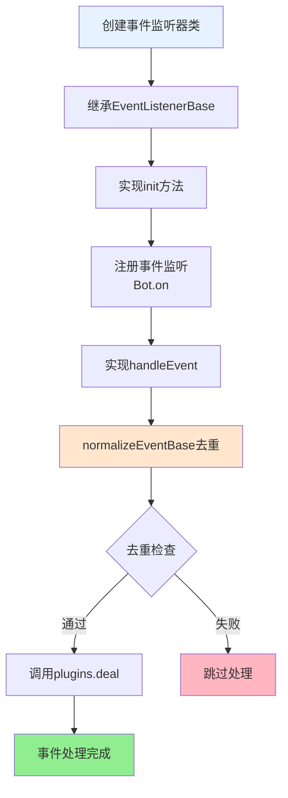

# 事件监听器开发指南

面向想要为框架扩展新事件源的开发者，聚焦「最小必要」流程，去掉重复描述。Tasker 特定属性请交给对应的增强插件，监听器只做基础字段和分发。

## 责任边界
- 必填字段（进入 `PluginsLoader.deal` 前必须存在）：`tasker`、`post_type`、细分字段 (`message_type/notice_type/request_type/detail_type`)、标识字段 (`user_id` / `group_id` / `device_id`)、`message` 或 `raw_message`、`time`
- 自动补全：`self_id`、`bot`、`event_id`、`isDevice/isStdin`、基础 `sender`、`reply` 兜底、常用工具方法
- Tasker 特定：`isGroup/isPrivate/friend/group/member/atBot` 等必须放到增强插件（不要在监听器里写）

## 快速模版

**事件监听器开发流程**:



**代码模板**：

```javascript
import PluginsLoader from '../../src/infrastructure/plugins/loader.js'
import EventListenerBase from '#infrastructure/listener/base.js'

export default class MyTaskerEvent extends EventListenerBase {
  constructor() {
    super('mytasker')
  }

  async init() {
    Bot.on('mytasker.message', (e) => this.handleEvent(e, 'mytasker.message'))
    Bot.on('mytasker.notice', (e) => this.handleEvent(e, 'mytasker.notice'))
    Bot.on('mytasker.request', (e) => this.handleEvent(e, 'mytasker.request'))
  }

  async handleEvent(e, eventType) {
    // 使用基类的去重和标记方法
    if (!this.normalizeEventBase(e, eventType)) {
      return
    }

    // Tasker 特定属性请在增强插件里挂载
    await this.plugins.deal(e)
  }
}
```

## 事件命名速查
- 基础：`{tasker}.{event_type}` → `mytasker.message`
- 细分：`{tasker}.{event_type}.{sub_type}` → `mytasker.message.group`
- 通配符：`mytasker.*` / `message`（跨 Tasker）。谨慎使用，避免无谓遍历。

## Tasker 触发示例

```javascript
Bot.em('mytasker.message', {
  event_id: `mytasker_${Date.now()}_${Math.random()}`,
  user_id: '123456',
  post_type: 'message',
  message_type: 'private',
  message: [{ type: 'text', text: 'Hello' }]
})
```

## 插件监听速记
- 指定 Tasker：`event: 'mytasker.message'`
- 跨 Tasker：`event: 'message'`
- 通配符：`event: 'mytasker.*'`
匹配优先级：完全匹配 → 通配符 → 通用事件 → 前缀。

## 注意事项
- 必须去重：基于 `event_id` 的有界 Set。
- 只补全基础字段，Tasker 特定属性交给增强插件。
- try-catch 记录错误，不要阻塞其它事件。
- 定期清理去重集合，保持常驻进程内存稳定。

## 参考
- `core/events/onebot.js` / `device.js` / `stdin.js`
- 字段细节与匹配规则：`docs/事件系统标准化文档.md`

