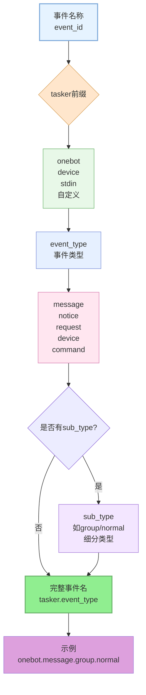
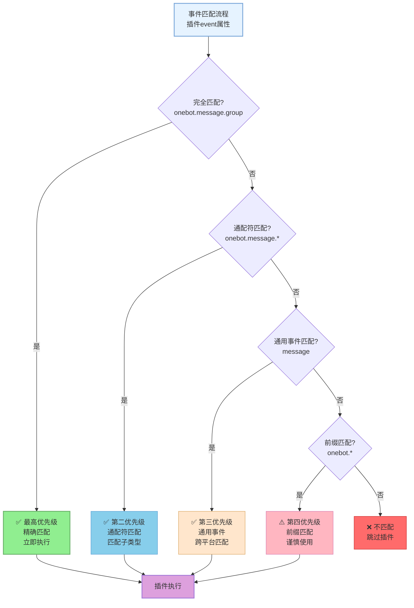
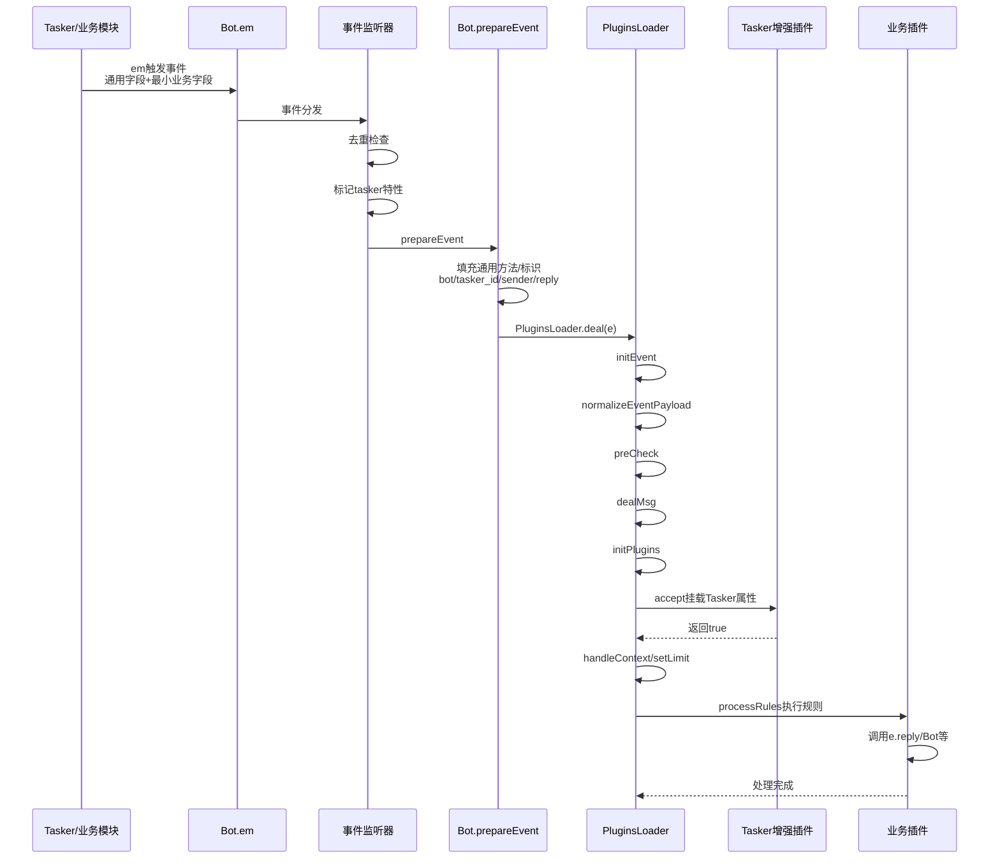
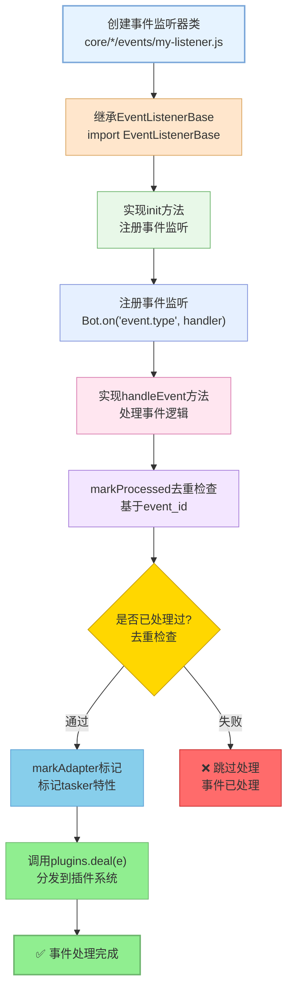

# 事件系统标准化文档

> **可扩展性**：事件系统是框架的核心扩展点之一。通过继承EventListenerBase，开发者可以快速创建自定义事件监听器，无需修改底层代码。详见 **[框架可扩展性指南](框架可扩展性指南.md)** ⭐

本文档涵盖事件系统的命名规范、字段责任边界、处理流程以及事件监听器的开发指南。

## 命名与匹配

**事件命名结构**:



**匹配优先级**:



**命名规范**：
- 结构：`{tasker}.{event_type}.{sub_type?}`，示例 `onebot.message.group.normal`
- Tasker 前缀：`onebot` / `device` / `stdin` / 自定义
- 事件类型：`message`、`notice`、`request`、`device`、`command`
- 匹配优先级：完全匹配 → 通配符（`onebot.message.*`）→ 通用事件（`message`）→ 前缀（`onebot.*`）

## 字段责任边界

**优化后的责任划分（2026年1月优化）**：

- **触发方（Tasker / 业务模块）** 必填：  
  `tasker`、`post_type`、细分字段 (`message_type/notice_type/request_type/detail_type` 可选 `sub_type`)、标识字段 (`user_id/group_id/device_id`)、`message` 或 `raw_message`、`time`

- **TaskerBase.createEvent**（任务层）：  
  创建基础事件对象，使用 `EventNormalizer` 统一标准化基础字段，确保 `event_id` 存在。

- **事件监听器（core/*/events/*.js）**：  
  负责去重（`EventListenerBase.markProcessed`）、补全 `event_id/self_id` 的兜底值、打上 Tasker 标记（`markAdapter`），并调用 `PluginsLoader.deal(e)`，不挂载 `friend/group/member` 等复杂对象。

- **PluginsLoader.normalizeEventPayload**（插件层）：  
  使用 `EventNormalizer` 统一标准化事件对象，包括基础字段、消息字段、群组字段，初始化扩展字段（`img/video/audio`）。

- **PluginsLoader + Bot.prepareEvent** 自动补全：  
  `bot`、基础 `sender`、通用 `reply` 兜底、`getSendableMedia/throttle/getEventHistory` 等工具方法。

- **Tasker 增强插件（Enhancer）** 负责：  
  `isGroup/isPrivate/friend/group/member/atBot` 等 Tasker 特定属性（监听器和底层 Tasker 不要提前挂载，保持事件最小化，便于复用）。

## 处理流程速览

**事件处理完整流程**:



**步骤说明（优化后）**：

1. **Tasker/业务模块**：`TaskerBase.createEvent` 创建事件对象，使用 `EventNormalizer` 标准化基础字段 → `Bot.em(...)` 触发事件
2. **事件监听器**：`EventListenerBase.markProcessed` 去重 → `markAdapter` 标记 `tasker` 与 Tasker 特性标志 → 调用 `PluginsLoader.deal(e)`
3. **Bot.prepareEvent**：填充通用方法/标识（`bot/tasker_id/tasker_name/sender/reply` 等）
4. **PluginsLoader.deal**：
   - `normalizeEventPayload`：使用 `EventNormalizer` 统一标准化（基础/消息/群组字段）
   - `initEvent`：确保 `self_id/bot/event_id` 存在
   - `preCheck`：检查忽略自己、关机状态、黑白名单、限流
   - `dealMsg`：解析消息、设置事件属性、检查权限、添加工具方法
   - `setupReply`：设置通用回复方法
   - `runPlugins(true)`：执行扩展插件（Enhancer），挂载 Tasker 特定属性
   - `runPlugins(false)`：执行普通插件，处理上下文和限流，执行规则匹配
5. **插件**：按优先级/匹配规则执行 `rule`，可以调用 `e.reply/Bot.callRoute/Bot.renderer/redis` 等完成业务逻辑

## 插件侧速记
- 跨 Tasker：`event: 'message'`
- 特定 Tasker：`event: 'onebot.message'` / `device.message`
- 通配符：`event: 'onebot.*'`（谨慎）

## 最佳实践

### 代码优化（2026年1月）

- ✅ **统一事件标准化**：使用 `EventNormalizer` 统一处理事件对象标准化，避免重复代码
- ✅ **责任边界清晰**：监听层负责去重和标记，任务层负责创建和标准化，插件层负责业务处理
- ✅ **减少冗余判断**：优化了 `preCheck`、`initPlugins`、`processRules` 等方法，删除重复检查
- ✅ **热更新优化**：改进了 `changePlugin` 方法，提供更详细的更新反馈

### 开发建议

- 命名保持三段式且语义清晰，避免自造缩写。
- 去重集合有界（建议 ~1000）并定期清理。
- `accept` 中尽早返回，减少无效规则遍历。
- Tasker 特定逻辑统一放增强插件，保持基础事件纯净。
- 使用 `EventNormalizer` 进行事件标准化，而不是手动处理字段。

---

## 事件监听器开发指南

### 扩展特性

- ✅ **零配置扩展**：放置到 `core/*/events/` 目录即可自动加载
- ✅ **标准化接口**：统一的事件监听接口
- ✅ **自动去重**：基类提供去重机制
- ✅ **事件分发**：自动分发到插件系统

### 开发流程

**事件监听器开发流程**:



### 代码模板

```javascript
import PluginsLoader from '#infrastructure/plugins/loader.js'
import EventListenerBase from '#infrastructure/listener/base.js'

export default class MyTaskerEvent extends EventListenerBase {
  constructor() {
    super('mytasker')
  }

  async init() {
    Bot.on('mytasker.message', (e) => this.handleEvent(e, 'mytasker.message'))
    Bot.on('mytasker.notice', (e) => this.handleEvent(e, 'mytasker.notice'))
    Bot.on('mytasker.request', (e) => this.handleEvent(e, 'mytasker.request'))
  }

  async handleEvent(e, eventType) {
    // 使用基类的去重和标记方法
    if (!this.markProcessed(e)) {
      return
    }
    
    // 标记 Tasker 特性
    this.markAdapter(e, 'mytasker')

    // Tasker 特定属性请在增强插件里挂载
    await this.plugins.deal(e)
  }
}
```

### Tasker 触发示例

```javascript
Bot.em('mytasker.message', {
  event_id: `mytasker_${Date.now()}_${Math.random()}`,
  user_id: '123456',
  post_type: 'message',
  message_type: 'private',
  message: [{ type: 'text', text: 'Hello' }]
})
```

### 注意事项

- **必须去重**：基于 `event_id` 的有界 Set，建议大小 ~1000
- **只补全基础字段**：Tasker 特定属性交给增强插件
- **错误处理**：try-catch 记录错误，不要阻塞其它事件
- **内存管理**：定期清理去重集合，保持常驻进程内存稳定

### 参考示例

- `core/system-Core/events/onebot.js`
- `core/system-Core/events/device.js`
- `core/system-Core/events/stdin.js`

---

## 相关文档

- [插件基类文档](plugin-base.md) - 插件开发详细说明
- [插件加载器文档](plugins-loader.md) - 插件匹配与执行细节
- [框架可扩展性指南](框架可扩展性指南.md) - 完整的扩展指南

