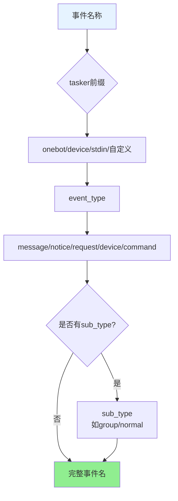
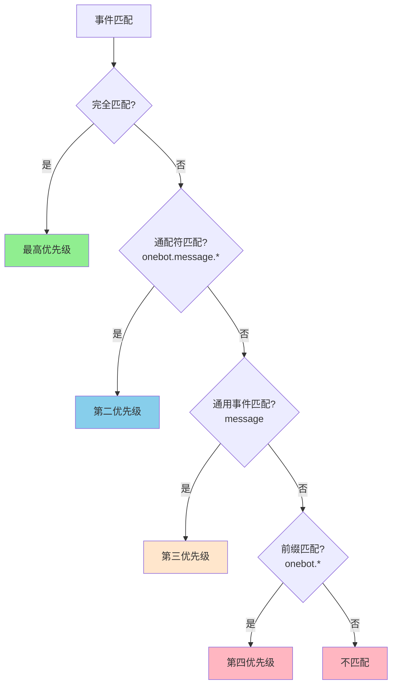
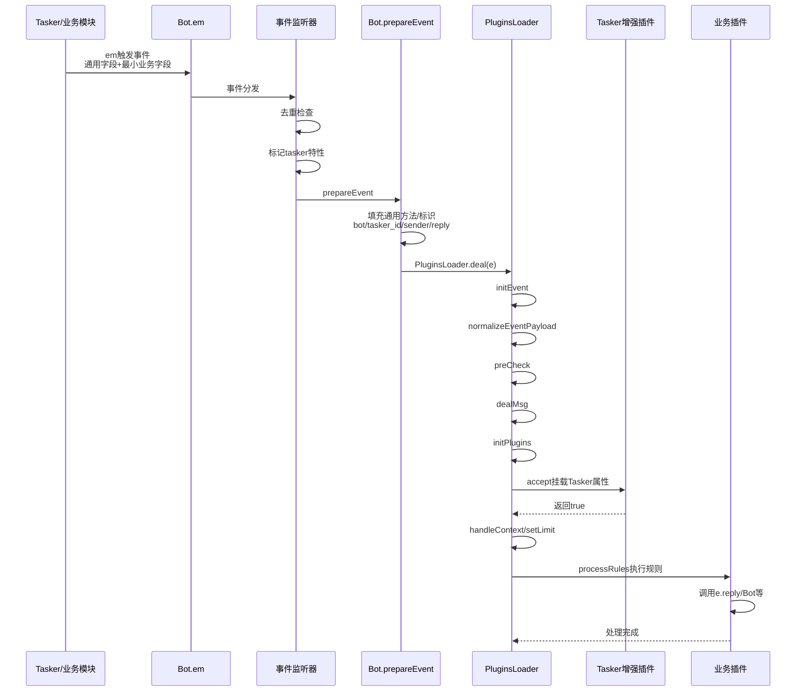

# 事件系统标准化文档

精简版：聚焦命名、字段责任与处理流程，避免与其它文档重复。最小监听器示例见 `docs/事件监听器开发指南.md`。

## 命名与匹配

**事件命名结构**:

**匹配优先级**:

**命名规范**：
- 结构：`{tasker}.{event_type}.{sub_type?}`，示例 `onebot.message.group.normal`
- Tasker 前缀：`onebot` / `device` / `stdin` / 自定义
- 事件类型：`message`、`notice`、`request`、`device`、`command`
- 匹配优先级：完全匹配 → 通配符（`onebot.message.*`）→ 通用事件（`message`）→ 前缀（`onebot.*`）

## 字段责任边界
- **触发方（Tasker / 业务模块）** 必填：  
  `tasker`、`post_type`、细分字段 (`message_type/notice_type/request_type/detail_type` 可选 `sub_type`)、标识字段 (`user_id/group_id/device_id`)、`message` 或 `raw_message`、`time`
- **事件监听器（core/events/*.js）**：  
  负责去重、补全 `event_id/self_id` 的兜底值、打上 Tasker 标记（`isOneBot/isDevice/isStdin` 等），并调用 `PluginsLoader.deal(e)`，不挂载 `friend/group/member` 等复杂对象。
- **PluginsLoader + Bot.prepareEvent** 自动补全：  
  `bot`、基础 `sender`、通用 `reply` 兜底、`getSendableMedia/throttle/getEventHistory` 等工具方法。
- **Tasker 增强插件** 负责：  
  `isGroup/isPrivate/friend/group/member/atBot` 等 Tasker 特定属性（监听器和底层 Tasker 不要提前挂载，保持事件最小化，便于复用）。

## 处理流程速览

**事件处理完整流程**:

**步骤说明**：

1. Tasker/业务模块：`Bot.em(...)` 触发事件（仅含通用字段 + 最小业务字段）
2. 事件监听器：去重 → 标记 `tasker` 与 Tasker 特性标志 → 调用 `PluginsLoader.deal(e)`
3. `Bot.prepareEvent`：填充通用方法/标识（`bot/tasker_id/tasker_name/sender/reply` 等）
4. `PluginsLoader`：`initEvent` → `normalizeEventPayload` → `preCheck` → `dealMsg` → `initPlugins` → `accept`（含增强插件）→ `handleContext/setLimit` → `processRules` → 默认处理器
5. 插件：按优先级/匹配规则执行 `rule`，可以调用 `e.reply/Bot.callRoute/Bot.renderer/redis` 等完成业务逻辑

## 插件侧速记
- 跨 Tasker：`event: 'message'`
- 特定 Tasker：`event: 'onebot.message'` / `device.message`
- 通配符：`event: 'onebot.*'`（谨慎）

## 最佳实践
- 命名保持三段式且语义清晰，避免自造缩写。
- 去重集合有界（建议 ~1000）并定期清理。
- `accept` 中尽早返回，减少无效规则遍历。
- Tasker 特定逻辑统一放增强插件，保持基础事件纯净。

## 相关文档
- `docs/事件监听器开发指南.md`：监听器模板与去重示例
- `docs/plugin-base.md` / `docs/plugins-loader.md`：插件匹配与执行细节

