# 事件系统标准化文档

> **可扩展性**：事件系统是框架的核心扩展点之一。通过继承EventListenerBase，开发者可以快速创建自定义事件监听器，无需修改底层代码。详见 **[框架可扩展性指南](框架可扩展性指南.md)** ⭐

本文档涵盖事件系统的命名规范、字段责任边界、处理流程以及事件监听器的开发指南。

## 📚 目录

- [命名与匹配](#命名与匹配)
- [字段责任边界](#字段责任边界)
- [处理流程速览](#处理流程速览)
- [创建事件监听器](#创建事件监听器)
- [相关文档](#相关文档)

---

## 命名与匹配

**事件命名结构**:

```mermaid
flowchart TB
    A["事件名称"] --> B{tasker前缀}
    B --> C["onebot/device/stdin"]
    C --> D["事件类型"]
    D --> E["message/notice/request"]
    E --> F{是否有sub_type?}
    F -->|是| G["sub_type"]
    F -->|否| H["完整事件名"]
    G --> H
    H --> I["示例: onebot.message.group.normal"]
    
    style A fill:#E3F2FD,stroke:#1976D2,stroke-width:2px
    style B fill:#FFF3E0,stroke:#F57C00,stroke-width:2px
    style C fill:#E8F5E9,stroke:#388E3C,stroke-width:2px
    style D fill:#E1F5FE,stroke:#0277BD,stroke-width:2px
    style E fill:#FCE4EC,stroke:#C2185B,stroke-width:2px
    style G fill:#F3E5F5,stroke:#7B1FA2,stroke-width:2px
    style H fill:#E8F5E9,stroke:#388E3C,stroke-width:2px
    style I fill:#FFF3E0,stroke:#F57C00,stroke-width:2px
```



**匹配优先级**:

```mermaid
flowchart TB
    A["事件匹配流程"] --> B{完全匹配?}
    B -->|是| C["最高优先级<br/>精确匹配"]
    B -->|否| D{通配符匹配?}
    D -->|是| E["第二优先级<br/>通配符匹配"]
    D -->|否| F{通用事件匹配?}
    F -->|是| G["第三优先级<br/>通用事件"]
    F -->|否| H{前缀匹配?}
    H -->|是| I["第四优先级<br/>前缀匹配"]
    H -->|否| J["不匹配<br/>跳过插件"]
    
    C --> K["插件执行"]
    E --> K
    G --> K
    I --> K
    
    style A fill:#E3F2FD,stroke:#1976D2,stroke-width:2px
    style C fill:#E8F5E9,stroke:#388E3C,stroke-width:2px
    style E fill:#E1F5FE,stroke:#0277BD,stroke-width:2px
    style G fill:#FFF3E0,stroke:#F57C00,stroke-width:2px
    style I fill:#FCE4EC,stroke:#C2185B,stroke-width:2px
    style J fill:#F3E5F5,stroke:#7B1FA2,stroke-width:2px
    style K fill:#E8F5E9,stroke:#388E3C,stroke-width:2px
```



**命名规范**：
- 结构：`{tasker}.{event_type}.{sub_type?}`，示例 `onebot.message.group.normal`
- Tasker 前缀：`onebot` / `device` / `stdin` / 自定义
- 事件类型：`message`、`notice`、`request`、`device`、`command`
- 匹配优先级：完全匹配 → 通配符（`onebot.message.*`）→ 通用事件（`message`）→ 前缀（`onebot.*`）

## 字段责任边界

**优化后的责任划分（2026年1月优化）**：

- **触发方（Tasker / 业务模块）** 必填：  
  `tasker`、`post_type`、细分字段 (`message_type/notice_type/request_type/detail_type` 可选 `sub_type`)、标识字段 (`user_id/group_id/device_id`)、`message` 或 `raw_message`、`time`

- **TaskerBase.createEvent**（任务层）：  
  创建基础事件对象，使用 `EventNormalizer` 统一标准化基础字段，确保 `event_id` 存在。

- **事件监听器（core/*/events/*.js）**：  
  负责去重（`EventListenerBase.markProcessed`）、补全 `event_id/self_id` 的兜底值、打上 Tasker 标记（`markAdapter`），并调用 `PluginsLoader.deal(e)`，不挂载 `friend/group/member` 等复杂对象。

- **PluginsLoader.normalizeEventPayload**（插件层）：  
  使用 `EventNormalizer` 统一标准化事件对象，包括基础字段、消息字段、群组字段，初始化扩展字段（`img/video/audio`）。

- **PluginsLoader + Bot.prepareEvent** 自动补全：  
  `bot`、基础 `sender`、通用 `reply` 兜底、`getSendableMedia/throttle/getEventHistory` 等工具方法。

- **Tasker 增强插件（Enhancer）** 负责：  
  `isGroup/isPrivate/friend/group/member/atBot` 等 Tasker 特定属性（监听器和底层 Tasker 不要提前挂载，保持事件最小化，便于复用）。

## 处理流程速览

**事件处理完整流程**:

```mermaid
sequenceDiagram
    participant Tasker as Tasker
    participant Bot as Bot.em
    participant Listener as 事件监听器
    participant Prepare as prepareEvent
    participant Loader as PluginsLoader
    participant Enhancer as 增强插件
    participant Plugin as 业务插件
    
    Tasker->>Bot: 触发事件
    Bot->>Listener: 事件分发
    Listener->>Listener: 去重检查
    Listener->>Prepare: prepareEvent
    Prepare->>Prepare: 填充通用方法
    Prepare->>Loader: deal(e)
    Loader->>Loader: 标准化事件
    Loader->>Loader: 前置检查
    Loader->>Enhancer: accept挂载属性
    Enhancer-->>Loader: 返回true
    Loader->>Plugin: 执行规则
    Plugin-->>Loader: 处理完成
```



**步骤说明（优化后）**：

1. **Tasker/业务模块**：`TaskerBase.createEvent` 创建事件对象，使用 `EventNormalizer` 标准化基础字段 → `Bot.em(...)` 触发事件
2. **事件监听器**：`EventListenerBase.markProcessed` 去重 → `markAdapter` 标记 `tasker` 与 Tasker 特性标志 → 调用 `PluginsLoader.deal(e)`
3. **Bot.prepareEvent**：填充通用方法/标识（`bot/tasker_id/tasker_name/sender/reply` 等）
4. **PluginsLoader.deal**：
   - `normalizeEventPayload`：使用 `EventNormalizer` 统一标准化（基础/消息/群组字段）
   - `initEvent`：确保 `self_id/bot/event_id` 存在
   - `preCheck`：检查忽略自己、关机状态、黑白名单、限流
   - `dealMsg`：解析消息、设置事件属性、检查权限、添加工具方法
   - `setupReply`：设置通用回复方法
   - `runPlugins(true)`：执行扩展插件（Enhancer），挂载 Tasker 特定属性
   - `runPlugins(false)`：执行普通插件，处理上下文和限流，执行规则匹配
5. **插件**：按优先级/匹配规则执行 `rule`，可以调用 `e.reply/Bot.callRoute/Bot.renderer/redis` 等完成业务逻辑

## 插件侧速记
- 跨 Tasker：`event: 'message'`
- 特定 Tasker：`event: 'onebot.message'` / `device.message`
- 通配符：`event: 'onebot.*'`（谨慎）

## 最佳实践

### 代码优化（2026年1月）

- ✅ **统一事件标准化**：使用 `EventNormalizer` 统一处理事件对象标准化，避免重复代码
- ✅ **责任边界清晰**：监听层负责去重和标记，任务层负责创建和标准化，插件层负责业务处理
- ✅ **减少冗余判断**：优化了 `preCheck`、`initPlugins`、`processRules` 等方法，删除重复检查
- ✅ **热更新优化**：改进了 `changePlugin` 方法，提供更详细的更新反馈

### 开发建议

- 命名保持三段式且语义清晰，避免自造缩写。
- 去重集合有界（建议 ~1000）并定期清理。
- `accept` 中尽早返回，减少无效规则遍历。
- Tasker 特定逻辑统一放增强插件，保持基础事件纯净。
- 使用 `EventNormalizer` 进行事件标准化，而不是手动处理字段。

---

## 事件监听器开发指南

### 扩展特性

- ✅ **零配置扩展**：放置到 `core/*/events/` 目录即可自动加载
- ✅ **标准化接口**：统一的事件监听接口
- ✅ **自动去重**：基类提供去重机制
- ✅ **事件分发**：自动分发到插件系统

### 开发流程

**事件监听器开发流程**:

```mermaid
flowchart TB
    A["创建事件监听器类<br/>core/*/events/my-listener.js"] --> B["继承EventListenerBase<br/>import EventListenerBase"]
    B --> C["实现init方法<br/>注册事件监听"]
    C --> D["注册事件监听<br/>Bot.on('event.type', handler)"]
    D --> E["实现handleEvent方法<br/>处理事件逻辑"]
    E --> F["markProcessed去重检查<br/>基于event_id"]
    F --> G{"是否已处理过?<br/>去重检查"}
    G -->|通过| H["markAdapter标记<br/>标记tasker特性"]
    G -->|失败| I["❌ 跳过处理<br/>事件已处理"]
    H --> J["调用plugins.deal(e)<br/>分发到插件系统"]
    J --> K["✅ 事件处理完成"]
    
    style A fill:#E6F3FF,stroke:#7AA7D9,stroke-width:2px
    style B fill:#FFE6CC,stroke:#D9A35D
    style C fill:#E8F8E8,stroke:#6CB46C
    style D fill:#E6F0FF,stroke:#7B8ED9
    style E fill:#FFE6F0,stroke:#D97BAF
    style F fill:#F3E6FF,stroke:#A57BD9
    style G fill:#FFD700,stroke:#C49A00
    style H fill:#87CEEB,stroke:#5A9FD4
    style I fill:#FF6B6B,stroke:#C92A2A
    style J fill:#90EE90,stroke:#6CB46C
    style K fill:#90EE90,stroke:#6CB46C,stroke-width:2px
```



### 代码模板

```javascript
import PluginsLoader from '#infrastructure/plugins/loader.js'
import EventListenerBase from '#infrastructure/listener/base.js'

export default class MyTaskerEvent extends EventListenerBase {
  constructor() {
    super('mytasker')
  }

  async init() {
    Bot.on('mytasker.message', (e) => this.handleEvent(e, 'mytasker.message'))
    Bot.on('mytasker.notice', (e) => this.handleEvent(e, 'mytasker.notice'))
    Bot.on('mytasker.request', (e) => this.handleEvent(e, 'mytasker.request'))
  }

  async handleEvent(e, eventType) {
    // 使用基类的去重和标记方法
    if (!this.markProcessed(e)) {
      return
    }
    
    // 标记 Tasker 特性
    this.markAdapter(e, 'mytasker')

    // Tasker 特定属性请在增强插件里挂载
    await this.plugins.deal(e)
  }
}
```

### Tasker 触发示例

```javascript
Bot.em('mytasker.message', {
  event_id: `mytasker_${Date.now()}_${Math.random()}`,
  user_id: '123456',
  post_type: 'message',
  message_type: 'private',
  message: [{ type: 'text', text: 'Hello' }]
})
```

### 注意事项

- **必须去重**：基于 `event_id` 的有界 Set，建议大小 ~1000
- **只补全基础字段**：Tasker 特定属性交给增强插件
- **错误处理**：try-catch 记录错误，不要阻塞其它事件
- **内存管理**：定期清理去重集合，保持常驻进程内存稳定

### 参考示例

- `core/system-Core/events/onebot.js`
- `core/system-Core/events/device.js`
- `core/system-Core/events/stdin.js`

---

## 相关文档

- [插件基类文档](plugin-base.md) - 插件开发详细说明
- [插件加载器文档](plugins-loader.md) - 插件匹配与执行细节
- [框架可扩展性指南](框架可扩展性指南.md) - 完整的扩展指南

