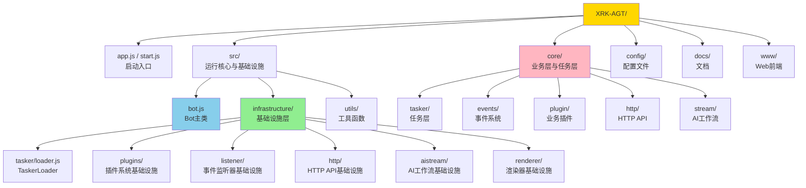
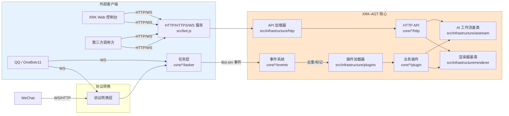
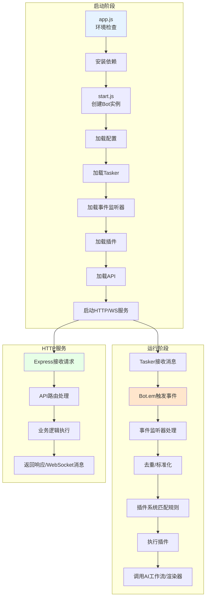
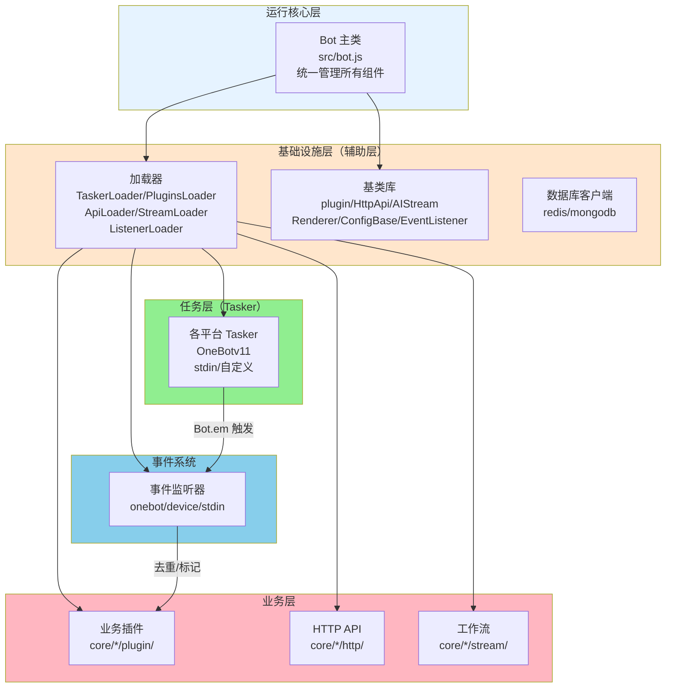
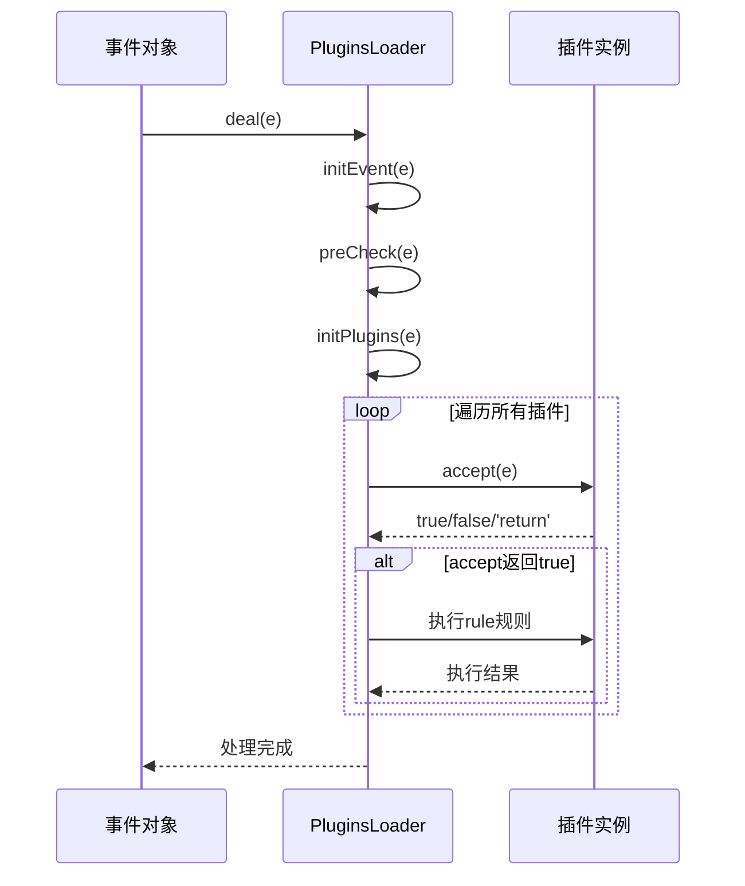
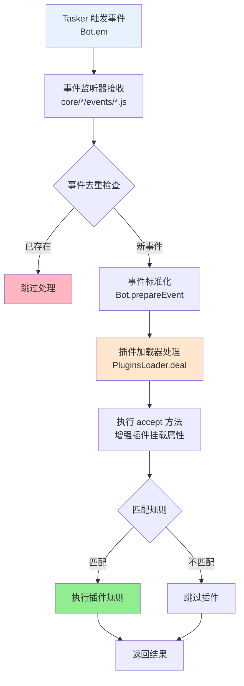
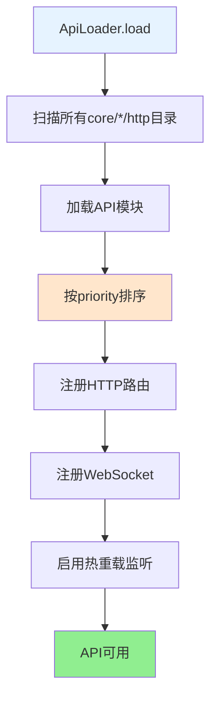
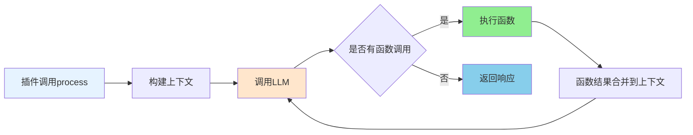

# XRK-AGT 完整文档

> 本文档整合了框架的所有核心文档，提供完整的开发指南和API参考。
> **框架可扩展性**：XRK-AGT采用分层架构+基类设计+加载器机制，实现了极高的可扩展性。详见 **[框架可扩展性指南](框架可扩展性指南.md)** ⭐ 推荐

## 📑 目录导航

- [快速开始](#快速开始)
- [架构总览](#架构总览)
- [架构层次说明](#架构层次说明)
- [核心模块](#核心模块)
- [框架可扩展性](#框架可扩展性) ⭐ 新增
- [Server服务器架构](server.md) ⭐ 新增
- [HTTP业务层](http-business-layer.md) ⭐ 新增
  - [Bot主类](#bot主类)
  - [基础设施层](#基础设施层辅助层)
  - [任务层（Tasker）](#任务层tasker)
  - [事件系统](#事件系统)
  - [插件系统](#插件系统)
  - [HTTP/API层](#httpapi层)
  - [AI工作流](#ai工作流)
  - [配置系统](#配置系统)
  - [渲染系统](#渲染系统)
  - [工具类](#工具类)
- [开发指南](#开发指南)
- [API参考](#api参考)

---

## 快速开始

### 环境要求

- **Node.js**: ≥ 24.12.0（LTS 版本，推荐）
- **pnpm**: 最新版本
- **Redis**: ≥ 5.0.0
- **MongoDB**: ≥ 4.0.0（可选）

### 安装与运行

```bash
# 克隆项目（GitHub）
git clone --depth=1 https://github.com/sunflowermm/XRK-AGT.git
# 或使用 GitCode（国内镜像）
git clone --depth=1 https://gitcode.com/Xrkseek/XRK-AGT.git
cd XRK-AGT

# 安装依赖（仅支持 pnpm）
pnpm install

# 运行
node app
```

### 项目结构



---

## 架构总览

### 核心组件关系



### 运行流程



---

## 架构层次说明

XRK-AGT 采用清晰的分层架构，各层职责明确：

### 🏗️ 架构层次图



### 📋 各层职责

#### 1. 运行核心层 (`src/bot.js`)
- **职责**：统一管理 HTTP/HTTPS/WebSocket 服务、中间件、认证、反向代理、事件总线 (`Bot.em`)
- **特点**：系统入口，协调所有组件

#### 2. 基础设施层（辅助层）(`src/infrastructure/`)
- **职责**：提供所有基础设施和基类，为业务层提供通用能力
- **包含**：
  - **加载器**：`TaskerLoader`、`PluginsLoader`、`ApiLoader`、`StreamLoader`、`ListenerLoader`
  - **基类库**：`plugin`、`HttpApi`、`AIStream`、`Renderer`、`ConfigBase`、`EventListener`
  - **数据库客户端**：`redis.js`、`mongodb.js`
- **特点**：不包含具体业务逻辑，只提供抽象和工具

#### 3. 核心模块层（Core）(`core/*/`)
- **职责**：每个 core 是一个独立的业务模块，通过业务目录（如 `plugin/`、`tasker/` 等）组织代码
- **特点**：支持多 core 模块架构，框架自动扫描并加载所有 core 目录
- **Core开发时代**：现在所有业务都在 `core/` 目录下开发，core 根目录不再直接写业务代码，而是通过业务目录来组织代码，方便业务分割和集成

**核心模块包含**：
- **任务层（Tasker）** (`core/*/tasker/`)：对接各平台协议（QQ/自定义），将平台消息转换为统一事件模型，通过 `Bot.em` 触发事件
- **事件系统** (`core/*/events/`)：监听 `Bot.em` 事件，进行去重、标记、预处理，然后调用 `PluginsLoader.deal(e)` 分发到插件
- **业务层**：
  - **业务插件** (`core/*/plugin/`)：包括 `enhancer/`（增强插件）和 `example/`（示例插件）
  - **HTTP API** (`core/*/http/`)：具体的 REST/WebSocket API 实现
  - **工作流** (`core/*/stream/`)：基于 `AIStream` 的业务工作流实现
  - **配置管理** (`core/*/commonconfig/`)：存放继承 `ConfigBase` 基类的配置管理类（⚠️ 仅当需要配置文件时使用）
  - **静态资源** (`core/*/www/`)：静态文件
    - ⚠️ **必须创建子目录**：不要在 `www/` 下直接放置文件，必须创建子目录（如 `www/xrk/`）
    - 子目录自动挂载到 `/<目录名>/*`（如 `www/xrk/` 挂载到 `/xrk/*`），避免与根目录 `www/` 冲突

---

## 核心模块

### Bot主类

**文件**: `src/bot.js`

**职责**:
- HTTP/HTTPS/WebSocket服务管理
- 中间件配置（CORS、认证、限流等）
- 反向代理支持
- 事件派发（`Bot.em`）
- 资源清理

**关键方法**:
- `prepareEvent(data)`: 设置事件通用属性
- `em(name, data)`: 触发事件
- `run(options)`: 启动服务

**详细文档**: 见下方[Bot主类详细说明](#bot主类详细说明)

---

### 插件系统

#### 插件基类 (`plugin`)

**文件**: `src/infrastructure/plugins/plugin.js`

**核心概念**:
- `name`: 插件名称
- `event`: 监听的事件类型
- `priority`: 优先级（越小越先执行）
- `rule`: 规则数组
- `task`: 定时任务

**accept方法**:
```javascript
async accept(e) {
  // 前置检查，返回true/false/'return'
  // Tasker增强插件在此挂载特定属性
  return true
}
```

**上下文管理**:
- `setContext(type, isGroup, time)`: 设置上下文
- `getContext(type, isGroup)`: 获取上下文
- `finish(type, isGroup)`: 结束上下文

#### 插件加载器 (`PluginsLoader`)

**文件**: `src/infrastructure/plugins/loader.js`

**职责**:
- 扫描并加载所有 `core/*/plugin` 目录
- 规则匹配与权限检查
- 冷却与节流管理
- 定时任务调度

**事件处理流程**:



**详细文档**: 见下方[插件系统详细说明](#插件系统详细说明)

---

### 任务层（Tasker）

#### Tasker 底层规范

所有 Tasker 应具备的基础属性：

**事件对象基础属性**:
```javascript
{
  self_id: string,           // Bot ID
  tasker: string,           // Tasker 类型
  tasker_id: string,        // Tasker ID
  tasker_name: string,      // Tasker 名称
  event_id: string,          // 事件ID
  time: number,              // 时间戳
  bot: BotInstance,         // Bot实例
  user_id: string|number,    // 用户ID
  sender: Object,            // 发送者信息
  reply: Function            // 回复方法
}
```

**Tasker 特定属性**应由增强插件处理，不在底层设置。

#### Tasker 加载器 (`TaskerLoader`)

**文件**: `src/infrastructure/tasker/loader.js`

**职责**:
- 扫描所有 `core/*/tasker` 目录
- 动态加载 Tasker 文件
- Tasker 通过`Bot.tasker.push()`注册

#### OneBotv11 Tasker

**文件**: `core/system-Core/tasker/OneBotv11.js`

**核心功能**:
- WebSocket消息处理
- 事件转译与标准化
- 对象封装（friend/group/member）

**对象访问**:
- `Bot[self_id].pickFriend(user_id)`: 获取好友对象
- `Bot[self_id].pickGroup(group_id)`: 获取群对象
- `Bot[self_id].pickMember(group_id, user_id)`: 获取成员对象

**详细文档**: 见下方[任务层详细说明](#任务层详细说明)

---

### 事件系统

#### 事件命名规范

**格式**: `{tasker}.{事件类型}.{子类型}`

**示例**:
- `onebot.message.group.normal`: OneBot群聊普通消息
- `device.message`: 设备消息
- `stdin.message`: 标准输入消息

#### 事件匹配规则

1. **完全匹配**: `plugin.event === actualEvent`
2. **通配符匹配**: `onebot.message.*`
3. **通用事件匹配**: `message`匹配所有 Tasker 的 message 事件
4. **前缀匹配**: `onebot.*`匹配所有 OneBot 事件

#### 事件处理流程



#### 事件监听器开发

**文件位置**: `core/my-core/events/mytasker.js`

**基本结构**:
```javascript
import EventListenerBase from '#infrastructure/listener/base.js'

export default class MyTaskerEvent extends EventListenerBase {
  constructor() {
    super('mytasker')
  }

  async init() {
    Bot.on('mytasker.message', (e) => this.handleEvent(e, 'mytasker.message'))
  }

  async handleEvent(e, eventType) {
    // 事件去重
    // 设置基础属性
    // 调用plugins.deal(e)
  }
}
```

**详细文档**: 见下方[事件系统详细说明](#事件系统详细说明)

---

### HTTP/API层

#### HTTP业务层

**文件**: `src/utils/http-business.js`

**功能**：
- **重定向管理**：支持301/302/307/308重定向，通配符匹配，条件重定向
- **CDN支持**：静态资源CDN回源、缓存控制、CDN头部处理
- **反向代理增强**：负载均衡（轮询/加权/最少连接）、健康检查、故障转移

**详细文档**: [`docs/http-business-layer.md`](http-business-layer.md)

#### HTTP API基类 (`HttpApi`)

**文件**: `src/infrastructure/http/http.js`

**使用方式**:
```javascript
// core/my-core/http/example.js
export default {
  name: 'example-api',
  routes: [
    {
      method: 'GET',
      path: '/api/example/ping',
      handler: async (req, res, Bot) => {
        res.json({ success: true })
      }
    }
  ],
  ws: {
    '/ws/example': async (conn, req, Bot) => {
      // WebSocket处理
    }
  }
}
```

#### API加载器 (`ApiLoader`)

**文件**: `src/infrastructure/http/loader.js`

**加载流程**:



**功能**:
- 自动扫描所有 `core/*/http` 目录
- 按优先级排序
- 注册路由和WebSocket
- 支持热重载

**详细文档**: 见下方[HTTP/API层详细说明](#httpapi层详细说明)

---

### AI工作流

#### AIStream基类

**文件**: `src/infrastructure/aistream/aistream.js`

**核心功能**:
- Chat Completion调用
- Embedding生成与检索
- 函数调用（Function Calling）
- 上下文增强

**使用方式**:
```javascript
// 在插件中
const stream = this.getStream('chat')
const reply = await stream.process(this.e, question, config)
await this.reply(reply)
```

**工作流处理流程**:



**提供商支持**:
- `generic`: OpenAI兼容接口（默认）
- `volcengine`: 火山引擎豆包

**相关文档**:
- **[工作流系统完整文档](工作流系统完整文档.md)** - 工作流系统完整文档（推荐）
- **[复杂任务示例](workflow-complex-task-example.md)** - 复杂任务完整调用流程模拟
- **[记忆系统文档](workflow-memory-system.md)** - 工作流记忆系统详细文档
- **[MCP完整指南](mcp-guide.md)** - MCP工具注册与连接

**详细文档**: 见下方[AI工作流详细说明](#ai工作流详细说明)

---

### 配置系统

#### ConfigBase基类

**文件**: `src/infrastructure/commonconfig/commonconfig.js`

**重要说明**：
- `commonconfig` 是目录名（`core/*/commonconfig/`），用于存放配置管理类
- 真正的基类是 `ConfigBase`，配置类需要继承此基类

**功能**:
- YAML/JSON读写
- 多文件配置支持（一个配置包含多个子文件）
- 路径操作（get/set/delete）
- 配置校验
- 自动备份

**使用方式**:
```javascript
// 配置类继承 ConfigBase
import ConfigBase from '#infrastructure/commonconfig/commonconfig.js';

export default class MyConfig extends ConfigBase {
  constructor() {
    super({
      name: 'myconfig',
      filePath: 'config/myconfig.yaml',
      // ...
    });
  }
}

// 使用
const config = new MyConfig();
const data = await config.read();
await config.set('server.server.port', 8080);
```

**详细文档**: 见下方[配置系统详细说明](#配置系统详细说明)

---

### 渲染系统

#### Renderer基类

**文件**: `src/infrastructure/renderer/Renderer.js`

**功能**:
- HTML模板渲染
- 文件监听与自动重载
- 静态资源路径处理

**使用方式**:
```javascript
import RendererLoader from '#infrastructure/renderer/loader.js';

const renderer = RendererLoader.getRenderer('puppeteer');
const htmlPath = await renderer.dealTpl('status', {
  tplFile: 'resources/html/status.html',
  data: { title: '状态' }
})
const img = await renderer.renderImage({ htmlPath })
```

**详细文档**: 见下方[渲染系统详细说明](#渲染系统详细说明)

---

### 工具类

#### BotUtil

**文件**: `src/utils/botutil.js`

**主要功能**:
- 日志封装（`makeLog`）
- 缓存管理（`cache`、`getMap`）
- 文件操作（`readFile`、`writeFile`、`Buffer`）
- 网络请求（`Buffer`支持HTTP）
- 异步控制（`retry`、`batch`、`sleep`）
- 时间格式化（`formatDate`、`getTimeDiff`）

**详细文档**: 见下方[工具类详细说明](#工具类详细说明)

---

## 开发指南

> **扩展开发**：XRK-AGT提供了7大扩展点，开发者可以通过继承基类快速扩展功能。详见 **[框架可扩展性指南](框架可扩展性指南.md)** ⭐ 推荐

### 扩展开发流程

1. **确定扩展类型**：插件、工作流、Tasker、事件监听器、HTTP API、渲染器、配置
2. **选择对应基类**：`plugin`、`AIStream`、`HttpApi`、`EventListener`、`Renderer`、`ConfigBase`
3. **阅读基类文档**：参考各模块的详细文档
4. **实现必要方法**：继承基类，实现业务逻辑
5. **放置到对应目录**：`core/*/业务目录/`，框架自动加载

**详细指南**：请参考 **[框架可扩展性指南](框架可扩展性指南.md)** 中的完整扩展示例和最佳实践。

---

## 详细文档索引

### Bot主类详细说明

**文件**: `docs/bot.md`

**内容**:
- Bot类职责与生命周期
- 关键方法概览
- 与其它核心对象的关系
- 开发与扩展建议

### 插件系统详细说明

**文件**: `docs/plugin-base.md`、`docs/plugins-loader.md`

**内容**:
- 插件基类完整API
- accept方法详解
- 上下文管理
- 插件加载器流程
- 冷却与节流机制

### Tasker 系统详细说明（事件生成器/任务层）

**文件**: `docs/tasker-base-spec.md`、`docs/tasker-loader.md`、`docs/tasker-onebotv11.md`

**内容**:
- Tasker底层规范
- Tasker加载器机制
- OneBotv11 Tasker完整文档
- 对象封装与API调用

### 事件系统详细说明

**文件**: `docs/事件系统标准化文档.md`、`docs/事件监听器开发指南.md`

**内容**:
- 事件命名与匹配优先级（精简版）
- 字段责任分界：必填/自动补全/增强插件字段
- 处理流程速览
- 最小事件监听器模版与去重要点

### HTTP/API层详细说明

**文件**: `docs/http-api.md`、`docs/api-loader.md`

**内容**:
- HttpApi基类API
- 路由与WebSocket注册
- API加载器机制
- 热重载支持

### AI工作流详细说明

**主要文档**:
- **[`docs/工作流系统完整文档.md`](工作流系统完整文档.md)** - **工作流系统完整文档** ⭐ 推荐
  - 系统概述与核心架构
  - 工作流执行流程（简单任务和复杂任务）
  - 工作流管理器详解
  - 工作流开发指南
  - 记忆系统与工作流合并机制
  - MCP工具注册
  - 最佳实践与常见问题
- **[`docs/workflow-complex-task-example.md`](workflow-complex-task-example.md)** - 复杂任务完整调用流程模拟
- **[`docs/workflow-memory-system.md`](workflow-memory-system.md)** - 工作流记忆系统详细文档
- **[`docs/mcp-guide.md`](mcp-guide.md)** - MCP完整指南

**基类文档**:
- **文件**: `docs/aistream.md`
- **内容**:
- AIStream基类API
- Embedding提供商
- 函数调用机制
- 上下文增强

### 配置系统详细说明

**文件**: `docs/config-base.md`

**内容**:
- ConfigBase基类API
- 路径操作
- 配置校验
- Schema定义
- 多文件配置（multiFile）

### 渲染系统详细说明

**文件**: `docs/renderer.md`

**内容**:
- Renderer基类API
- 模板处理
- 文件监听
- 自定义渲染器开发

### 工具类详细说明

**文件**: `docs/botutil.md`

**内容**:
- BotUtil完整API
- 日志与字符串工具
- 文件与网络操作
- 异步控制方法

### 应用开发详细说明

**文件**: `docs/app-dev.md`

**内容**:
- 启动流程详解
- 配置体系说明
- Web控制台开发
- 前后端协作

---

## 下一步

- 📖 **深入学习**：查看 [框架可扩展性指南](框架可扩展性指南.md) 了解如何开发新 Core
- 🔧 **开发实践**：参考各模块的详细文档进行开发
- 💡 **最佳实践**：查看 [框架可扩展性指南](框架可扩展性指南.md) 中的最佳实践章节

---

*本文档整合了所有核心文档，如需更详细的信息，请参考对应的详细文档。*

