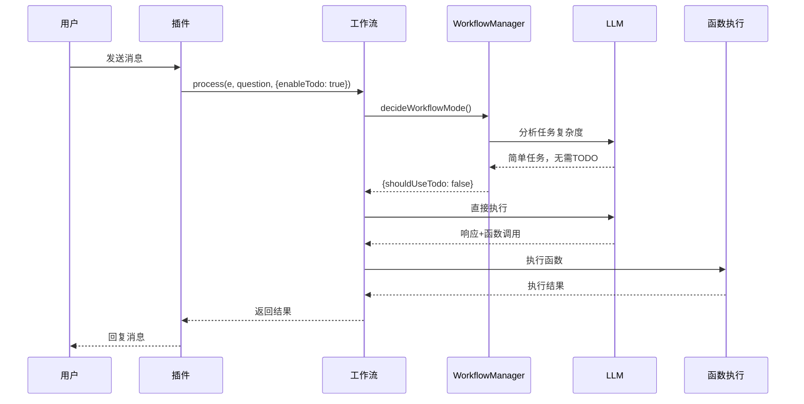
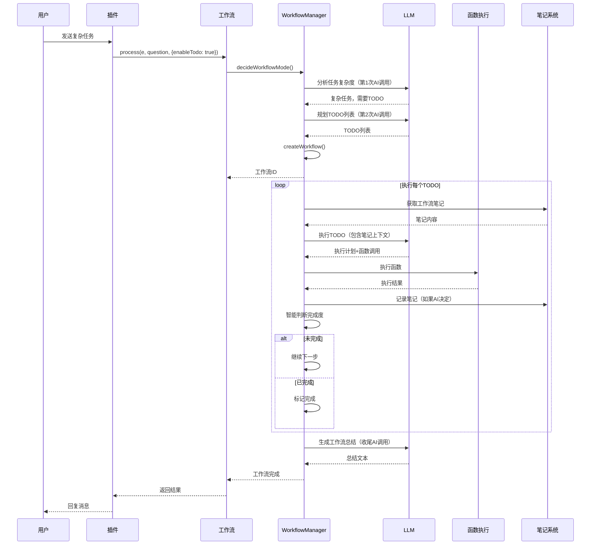
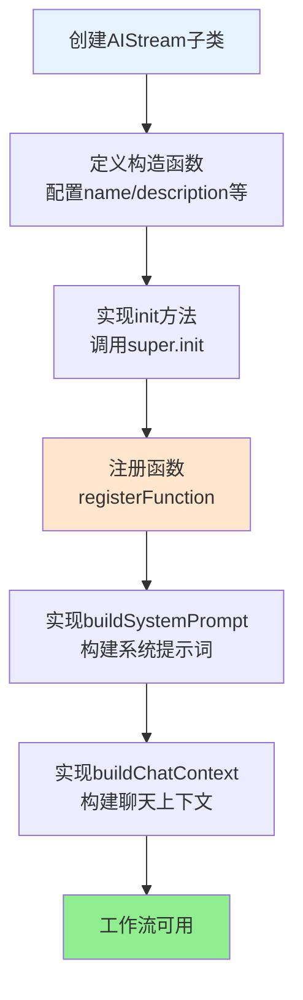
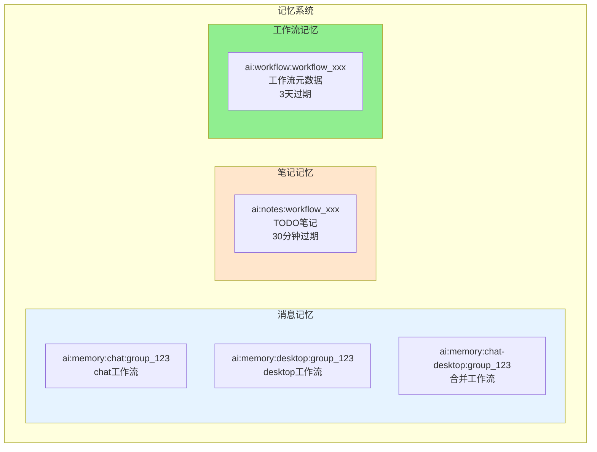

# 工作流系统完整文档

## 📚 目录导航

- [系统概述](#系统概述)
- [核心架构](#核心架构)
- [工作流执行流程](#工作流执行流程)
- [工作流管理器详解](#工作流管理器详解)
- [工作流开发指南](#工作流开发指南)
- [记忆系统](#记忆系统)
- [工作流合并机制](#工作流合并机制)
- [MCP工具注册](#mcp工具注册)
- [最佳实践](#最佳实践)
- [常见问题](#常见问题)

---

## 系统概述

XRK-AGT的工作流系统是一个**智能、模块化、可扩展**的多步骤任务执行框架，支持：

- ✅ **智能决策**：自动判断任务复杂度，决定是否开启多步骤工作流
- ✅ **工作流合并**：主工作流+辅助工作流灵活组合，只合并功能，不合并人设
- ✅ **上下文传递**：自动在步骤间传递执行结果和上下文
- ✅ **记忆系统**：消息记忆、笔记记忆、工作流记忆统一使用Redis存储
- ✅ **函数调用**：AI可以调用注册的函数，执行系统操作、文件操作等

### 核心概念

- **核心工作流**：提供主要功能（如 `desktop.js`、`chat.js`）
- **辅助工作流**：专门提供功能给其他工作流合并使用（如 `memory.js`、`database.js`、`todo.js`）
- **工作流管理器**：负责工作流的创建、执行和状态管理（`WorkflowManager`）

---

## 核心架构

### 系统架构图


### 架构层次


---

## 工作流执行流程

### 简单任务流程



### 复杂任务流程（TODO工作流）



### 完整执行流程图


### AI调用次数和用途

| 调用次数 | 用途 | 使用的Prompt | 说明 |
|---------|------|-------------|------|
| 第1次 | 用户对话，AI决定启动工作流 | 主stream的prompt + 所有stream的functions | 规则：如果要启动工作流，不要执行其他命令 |
| 第2次 | 任务分析助手，分析任务并分解步骤 | 任务分析助手的专用prompt | 只分析，不执行，响应会被清理 |
| 第3次及以后 | 每个TODO执行时，AI决定执行什么命令 | 主stream的prompt + 所有stream的functions | 只输出[]指令，系统智能判断完成度 |
| 最后1次 | 工作流完成总结 | 总结助手的专用prompt | 生成工作流完成总结 |

---

## 工作流管理器详解

### WorkflowManager核心功能

**位置**: `core/workflow-manager.js`

**核心职责**：
- 工作流的创建、执行和管理
- 任务规划和步骤分解
- 上下文在步骤间的传递
- 状态管理和错误处理

### 工作流状态


### 工作流对象结构

```javascript
{
  id: 'workflow_1234567890_abc123',
  goal: '帮我依据报告.docx做一个表格',
  todos: [
    {
      id: 'todo_0',
      content: '在桌面工作区查找报告.docx文件',
      status: 'pending',  // pending | in_progress | completed | failed
      result: null,
      error: null,
      notes: []
    }
  ],
  notes: [],  // 工作流笔记（30分钟过期）
  context: {  // 上下文，在步骤间传递
    e: eventObject,
    fileContent: '...',
    commandOutput: '...'
  },
  iteration: 0,
  maxIterations: 20,
  status: 'running',  // pending | running | completed | failed | paused
  createdAt: 1703123456789,
  completedAt: null,
  debugSteps: [],  // 调试信息
  decisionSteps: []  // 决策阶段的AI调用记录
}
```

### 核心方法

#### 1. decideWorkflowMode - 智能决策


**代码示例**：
```javascript
const decision = await workflowManager.decideWorkflowMode(e, goal);

if (decision.shouldUseTodo && decision.todos.length > 0) {
  // 复杂任务：启动TODO工作流
  const workflowId = await workflowManager.createWorkflow(e, goal, decision.todos);
} else {
  // 简单任务：直接执行
  await stream.process(e, { content: goal });
}
```

#### 2. createWorkflow - 创建工作流


#### 3. executeWorkflow - 执行工作流


#### 4. processTodo - 处理单个TODO


<｜tool▁calls▁begin｜><｜tool▁call▁begin｜>
read_file

**详细步骤**：
1. **准备上下文和提示**：获取工作流笔记，构建TODO提示
2. **调用AI获取执行指令**：使用主stream的prompt，合并所有stream的functions
3. **解析AI响应**：提取[]指令，检查是否有[完成]指令
4. **执行所有提取的指令**：顺序执行所有函数
5. **智能判断完成度**：基于执行结果、上下文、完成指令等
6. **合并上下文**：将执行结果合并到workflow.context
7. **发送流程回复**：发送标准化的JSON格式回复
8. **发送自然语言回复**：提取AI的自然语言回复并发送
9. **记录调试信息**：保存完整的执行日志

#### 5. 智能完成度判断


**完成度阈值**：
- `COMPLETION_THRESHOLD: 0.8` - 达到此值标记为完成
- `PROGRESS_THRESHOLD: 0.5` - 达到此值标记为进行中

---

## 工作流开发指南

### 快速开始

**工作流开发流程**:



### 创建核心工作流

```javascript
// core/stream/my-core.js
import AIStream from '#infrastructure/aistream/aistream.js';

export default class MyCoreStream extends AIStream {
  constructor() {
    super({
      name: 'my-core',
      description: '我的核心工作流',
      priority: 100,  // 核心工作流优先级较高
      config: {
        enabled: true,
        temperature: 0.8,
        maxTokens: 6000
      }
    });
  }

  async init() {
    await super.init();
    this.registerAllFunctions();
  }

  registerAllFunctions() {
    // 注册核心功能
    this.registerFunction('core_function', {
      description: '核心功能',
      prompt: `[核心功能:参数] - 核心功能描述`,
      parser: (text, context) => {
        const functions = [];
        const reg = /\[核心功能:([^\]]+)\]/g;
        let match;
        while ((match = reg.exec(text)) !== null) {
          functions.push({ 
            type: 'core_function', 
            params: { param: match[1].trim() } 
          });
        }
        return { 
          functions, 
          cleanText: text.replace(reg, '').trim() 
        };
      },
      handler: async (params, context) => {
        const { param } = params || {};
        // 处理逻辑
      },
      enabled: true
    });
  }

  buildSystemPrompt(context) {
    return `【人设】
你是一个智能助手。

【核心功能】
${this.buildFunctionsPrompt()}`;
  }

  async buildChatContext(e, question) {
    return [];
  }
}
```

### 创建辅助工作流

```javascript
// core/stream/my-auxiliary.js
import AIStream from '#infrastructure/aistream/aistream.js';

export default class MyAuxiliaryStream extends AIStream {
  constructor() {
    super({
      name: 'my-auxiliary',
      description: '我的辅助工作流',
      priority: 1,  // 辅助工作流优先级较低
      config: {
        enabled: true,
        temperature: 0.7,
        maxTokens: 4000
      },
      embedding: { enabled: false }
    });
  }

  async init() {
    await super.init();
    this.registerAllFunctions();
  }

  registerAllFunctions() {
    // 动态获取辅助信息
    const getAuxiliaryInfo = () => {
      const info = this.getSomeInfo();
      return info ? `\n当前信息：${info}` : '';
    };

    // 注册函数（使用动态prompt）
    this.registerFunction('my_function', {
      description: '我的功能',
      prompt: () => `[我的功能:参数] - 功能描述${getAuxiliaryInfo()}`,
      parser: (text, context) => {
        const match = text.match(/\[我的功能:([^\]]+)\]/);
        if (!match) {
          return { functions: [], cleanText: text };
        }
        return {
          functions: [{ type: 'my_function', params: { param: match[1] } }],
          cleanText: text.replace(/\[我的功能:[^\]]+\]/g, '').trim()
        };
      },
      handler: async (params, context) => {
        const { param } = params || {};
        // 处理逻辑
      },
      enabled: true
    });
  }

  /**
   * 构建系统提示（辅助工作流，合并时不会被调用）
   * 只有主工作流的buildSystemPrompt会被使用
   */
  buildSystemPrompt(context) {
    return '我的辅助工作流插件，为其他工作流提供功能。';
  }

  async buildChatContext(e, question) {
    return [];
  }
}
```

### 函数注册详解

函数是工作流的基本执行单元，每个函数包含：

- `description`: 函数描述
- `prompt`: 用户可见的命令格式（支持字符串或函数类型）
- `parser`: 解析文本中的函数调用
- `handler`: 执行函数逻辑
- `enabled`: 是否启用
- `onlyTopLevel`: 是否仅允许顶层调用（工作流内部会被过滤）

**动态Prompt示例**：
```javascript
// 静态prompt
prompt: `[保存知识:知识库名:内容] - 保存知识`

// 动态prompt（推荐）
prompt: () => {
  const databases = this.getDatabasesSync();
  return `[保存知识:知识库名:内容] - 保存知识\n可用知识库：${databases.join('、')}`;
}
```

### 上下文传递机制

工作流会自动在步骤间传递上下文：


**代码示例**：
```javascript
// 步骤1：设置数据
handler: async (params, context) => {
  context.fileContent = '文件内容';
  context.myResult = { success: true };
}

// 步骤2：自动获取数据
handler: async (params, context) => {
  const data = context.fileContent; // 自动可用
  const result = context.myResult; // 自动可用
}
```

---

## 记忆系统

### 记忆系统架构



### 核心设计原则

1. **工作流独立记忆**：每个工作流有独立的记忆系统，不会互相干扰
2. **合并工作流独立记忆**：合并后的工作流使用合并后的名称作为键
3. **TODO临时记忆**：TODO笔记30分钟自动过期，只在TODO循环内有效
4. **键值对不冲突**：使用工作流名称确保唯一性

### 记忆类型

#### 1. 消息记忆

**存储键**: `ai:memory:{streamName}:{groupId}`

**特点**：
- 每个工作流独立
- 合并工作流使用合并后的名称
- 支持embedding检索

**示例**：
- `chat`工作流：`ai:memory:chat:group_123`
- `desktop`工作流：`ai:memory:desktop:group_123`
- `chat-desktop`合并工作流：`ai:memory:chat-desktop:group_123`

#### 2. 笔记记忆（TODO临时记忆）

**存储键**: `ai:notes:{workflowId}`

**特点**：
- 30分钟自动过期
- 只在TODO循环内有效
- 所有TODO步骤共享

**使用示例**：
```javascript
// 存储TODO笔记
await stream.storeNote(workflowId, '桌面文件列表：微信.lnk', 'todo_0', true);

// 获取所有笔记（自动过滤过期笔记）
const notes = await stream.getNotes(workflowId);
```

#### 3. 工作流记忆

**存储键**: `ai:workflow:{workflowId}`

**特点**：
- 存储工作流元数据
- 3天过期

**使用示例**：
```javascript
await stream.storeWorkflowMemory(workflowId, {
  goal: '打开微信并发送消息',
  todos: ['查看桌面', '打开微信', '发送消息'],
  createdAt: Date.now()
});
```

---

## 工作流合并机制

### 合并原理

工作流合并是指将**多个工作流的功能**合并到一个工作流中，但**只合并functions，不合并人设/上下文**。


### 合并规则

1. **人设和上下文**：只保留主工作流的
2. **函数**：合并所有工作流的函数
3. **函数前缀**：副工作流的函数自动加前缀（如`desktop.open_application`）
4. **函数冲突**：如果函数名冲突，优先使用主工作流的

### 使用场景

**场景1**：聊天工作流需要桌面操作功能
```javascript
const stream = StreamLoader.mergeStreams({
  name: 'chat-desktop',
  main: 'chat',
  secondary: ['desktop']
});
```

**场景2**：设备工作流需要AI对话能力
```javascript
const stream = StreamLoader.mergeStreams({
  name: 'device-chat',
  main: 'device',
  secondary: ['chat']
});
```

---

## MCP工具注册

> **详细文档**：请参考 **[`docs/mcp-guide.md`](mcp-guide.md)** - MCP完整指南

### 快速概览

MCP (Model Context Protocol) 是XRK-AGT提供的标准化工具调用协议，允许外部AI平台（如小智AI、Claude、豆包）通过HTTP/WebSocket连接并调用系统工具。

**核心特性**：
- ✅ 所有工作流的函数自动注册为MCP工具
- ✅ 提供HTTP REST API和WebSocket接口
- ✅ 支持多平台连接（小智AI、Claude、豆包）

**API端点**：
- `GET /api/mcp/tools` - 获取工具列表
- `POST /api/mcp/tools/call` - 调用工具
- `GET /api/mcp/connect` - SSE连接
- `WS /mcp/ws` - WebSocket连接

---

## 最佳实践

### 1. 工作流设计原则

- **单一职责**：每个工作流专注于一个领域
- **功能模块化**：通过函数注册提供功能
- **可组合性**：支持工作流合并

### 2. 函数设计原则

- **清晰的描述**：`description`和`prompt`要清晰
- **参数验证**：在handler中验证参数
- **错误处理**：妥善处理错误，返回友好提示
- **使用动态prompt**：包含实时信息（如知识库列表、记忆列表）

### 3. TODO工作流设计

- **任务粒度**：每个TODO应该是可执行的、清晰的操作
- **笔记记录**：重要信息要记录到笔记
- **完成度评估**：客观评估完成度

### 4. 代码优化原则

- **删除冗余判断**：避免不必要的存在性检查
- **合并冗余函数**：删除只做简单包装的函数
- **简化嵌套**：减少try-catch嵌套，使用`.catch()`链式调用
- **统一reply机制**：所有工作流消息由`sendReply()`统一发送，插件不处理

### 5. 工作流Reply机制

**核心原则**：
- ✅ **工作流负责所有reply**：一旦工作流启动，所有消息由工作流管理器统一发送
- ✅ **插件不负责reply**：插件只需传递`e`给工作流，不需要调用`reply()`
- ✅ **标准化输出格式**：所有工作流回复使用统一的JSON格式，便于客户端（如tasker）解析

**Reply格式**：
```json
{
  "type": "workflow",
  "event": "start|step|complete|error|retry|update",
  "workflowId": "workflow_1234567890_abc123",
  "goal": "帮我分析易忘信息.txt并创建excel表格",
  "progress": { "completed": 2, "total": 4 },
  "iteration": 1,
  "timestamp": 1234567890,
  "task": "读取文件内容",
  "action": "[读取文件:易忘信息.txt]",
  "completion": 0.9
}
```

---

## 常见问题

### Q: 工作流不启动怎么办？

**A**: 检查以下几点：
1. `workflowManager`是否正确注入
2. `decideWorkflowMode`的返回值
3. 查看日志中的错误信息

### Q: 上下文不传递怎么办？

**A**: 确保：
1. 在handler中设置`context.xxx`
2. `workflowId`是否存在
3. 数据格式正确

### Q: 函数不执行怎么办？

**A**: 检查：
1. 函数是否已注册
2. parser是否正确解析
3. `enabled`是否为true

### Q: 如何调试工作流？

**A**: 
1. 查看工作流笔记：`workflow.notes`
2. 查看执行历史：`workflow.history`
3. 检查上下文：`workflow.context`
4. 查看调试日志：`data/debug/workflow-{workflowId}.json`

---

## 相关文档

- **[工作流记忆系统](workflow-memory-system.md)** - 记忆系统详细文档
- **[复杂任务示例](workflow-complex-task-example.md)** - 复杂任务完整调用流程模拟
- **[MCP完整指南](mcp-guide.md)** - MCP工具注册与连接
- **[工作流开发文档](工作流开发文档.md)** - 开发工作流的详细指南

---

## 总结

XRK-AGT的工作流系统是一个**功能强大、可操作、可扩展**的系统：

- ✅ **智能决策**：自动判断任务复杂度
- ✅ **工作流合并**：灵活组合多个工作流
- ✅ **上下文传递**：自动在步骤间传递执行结果
- ✅ **统一记忆**：消息、笔记、工作流记忆统一管理
- ✅ **函数调用**：AI可以调用注册的函数执行操作

整个系统设计遵循"**底层干净简洁，上层功能强大**"的原则，既保证了底层的一致性，又提供了上层的灵活性。

