# 工作流系统完整文档

## 📚 目录导航

- [系统概述](#系统概述)
- [核心架构](#核心架构)
- [工作流执行流程](#工作流执行流程)
- [工作流管理器详解](#工作流管理器详解)
- [工作流开发指南](#工作流开发指南)
- [记忆系统](#记忆系统)
- [工作流合并机制](#工作流合并机制)
- [MCP工具注册](#mcp工具注册)
- [最佳实践](#最佳实践)
- [常见问题](#常见问题)

---

## 系统概述

XRK-AGT的工作流系统是一个**智能、模块化、可扩展**的多步骤任务执行框架，支持：

- ✅ **智能决策**：自动判断任务复杂度，决定是否开启多步骤工作流
- ✅ **工作流合并**：主工作流+辅助工作流灵活组合，只合并功能，不合并人设
- ✅ **上下文传递**：自动在步骤间传递执行结果和上下文
- ✅ **记忆系统**：消息记忆、笔记记忆、工作流记忆统一使用Redis存储
- ✅ **函数调用**：AI可以调用注册的函数，执行系统操作、文件操作等

### 核心概念

- **核心工作流**：提供主要功能（如 `desktop.js`、`chat.js`）
- **辅助工作流**：专门提供功能给其他工作流合并使用（如 `memory.js`、`database.js`、`todo.js`）
- **工作流管理器**：负责工作流的创建、执行和状态管理（`WorkflowManager`）

---

## 核心架构

### 系统架构图

```mermaid
flowchart TB
    subgraph User["用户请求"]
        Request["用户消息/请求"]
    end

    subgraph Plugin["插件层"]
        PluginCode["插件代码<br/>core/plugin/"]
    end

    subgraph StreamLoader["工作流加载器"]
        LoadStreams["加载工作流"]
        MergeStreams["合并工作流"]
        RegisterMCP["注册MCP服务"]
    end

    subgraph Workflows["工作流实例"]
        ChatStream["chat.js<br/>聊天工作流"]
        DesktopStream["desktop.js<br/>桌面操作工作流"]
        MemoryStream["memory.js<br/>记忆插件"]
        TodoStream["todo.js<br/>TODO插件"]
    end

    subgraph AIStream["AIStream基类"]
        Memory["记忆系统<br/>Redis存储"]
        Embedding["Embedding检索"]
        FunctionCall["函数调用解析"]
        LLMCall["LLM调用"]
    end

    subgraph WorkflowManager["工作流管理器"]
        DecideMode["智能决策<br/>decideWorkflowMode"]
        CreateWorkflow["创建工作流<br/>createWorkflow"]
        ExecuteTodo["执行TODO<br/>executeTodo"]
        Notes["笔记系统"]
    end

    Request --> PluginCode
    PluginCode --> LoadStreams
    LoadStreams --> ChatStream
    LoadStreams --> DesktopStream
    LoadStreams --> MemoryStream
    LoadStreams --> TodoStream
    
    MergeStreams --> Memory
    MergeStreams --> Embedding
    
    ChatStream --> Memory
    DesktopStream --> Memory
    MemoryStream --> Memory
    
    Memory --> Embedding
    Embedding --> FunctionCall
    FunctionCall --> LLMCall
    
    TodoStream --> DecideMode
    DecideMode --> CreateWorkflow
    CreateWorkflow --> ExecuteTodo
    ExecuteTodo --> Notes
    
    style User fill:#E6F3FF
    style Plugin fill:#E6F3FF
    style StreamLoader fill:#FFE6CC
    style Workflows fill:#90EE90
    style AIStream fill:#87CEEB
    style WorkflowManager fill:#FFB6C1
```

### 架构层次

```mermaid
flowchart TB
    subgraph Business["业务层"]
        Custom["自定义工作流"]
        Logic["业务逻辑"]
    end
    
    subgraph Workflow["工作流层"]
        Manager["WorkflowManager<br/>任务规划与执行"]
        Context["上下文管理"]
    end
    
    subgraph Stream["流层"]
        Base["AIStream基类"]
        Functions["函数注册与解析"]
        Message["消息处理"]
    end
    
    subgraph Infra["基础设施层"]
        Loader["StreamLoader"]
        LLM["LLM集成"]
        Config["配置管理"]
    end
    
    Custom --> Manager
    Logic --> Manager
    Manager --> Context
    Context --> Base
    Base --> Functions
    Functions --> Message
    Message --> Loader
    Loader --> LLM
    LLM --> Config
    
    style Business fill:#E6F3FF
    style Workflow fill:#FFE6CC
    style Stream fill:#90EE90
    style Infra fill:#87CEEB
```

---

## 工作流执行流程

### 简单任务流程

```mermaid
sequenceDiagram
    participant User as 用户
    participant Plugin as 插件
    participant Stream as 工作流
    participant Context as 上下文增强
    participant LLM as LLM
    participant Func as 函数执行

    User->>Plugin: 发送消息
    Plugin->>Stream: process(e, question, options)
    Stream->>Stream: buildChatContext(e, question)
    Stream->>Context: buildEnhancedContext<br/>检索历史+知识库
    Context-->>Stream: 增强后的消息数组
    Stream->>LLM: callAI(messages)
    LLM-->>Stream: 响应+函数调用
    Stream->>Stream: parseFunctions(response)
    Stream->>Func: executeFunctionsWithReAct<br/>ReAct模式执行
    Func-->>Stream: 执行结果
    Stream->>Stream: storeMessageWithEmbedding<br/>存储到记忆系统
    Stream-->>Plugin: 返回cleanText
    Plugin-->>User: 回复消息
```

### 复杂任务流程（TODO工作流）

```mermaid
sequenceDiagram
    participant User as 用户
    participant Plugin as 插件
    participant Stream as 工作流
    participant Manager as WorkflowManager
    participant LLM as LLM
    participant Func as 函数执行
    participant Notes as 笔记系统

    User->>Plugin: 发送复杂任务
    Plugin->>Stream: process(e, question, {enableTodo: true})
    Stream->>Stream: execute(e, question, config)
    Stream->>Stream: buildChatContext + buildEnhancedContext
    Stream->>LLM: callAI（第1次AI调用）
    LLM-->>Stream: 响应包含[启动工作流:目标]
    Stream->>Stream: parseFunctions + hasWorkflowCommand
    Stream->>Manager: 检测到工作流命令
    Manager->>LLM: decideWorkflowMode（第2次AI调用）
    LLM-->>Manager: 复杂任务，需要TODO
    Manager->>LLM: 规划TODO列表（第3次AI调用）
    LLM-->>Manager: TODO列表
    Manager->>Manager: createWorkflow()
    Manager-->>Stream: 工作流ID
    
    loop 执行每个TODO
        Manager->>Notes: 获取工作流笔记
        Notes-->>Manager: 笔记内容
        Manager->>LLM: 执行TODO（包含笔记上下文）
        LLM-->>Manager: 执行计划+函数调用
        Manager->>Func: 执行函数
        Func-->>Manager: 执行结果
        Manager->>Notes: 记录笔记（如果AI决定）
        Manager->>Manager: 智能判断完成度
        alt 未完成
            Manager->>Manager: 继续下一步
        else 已完成
            Manager->>Manager: 标记完成
        end
    end
    
    Manager->>LLM: 生成工作流总结（收尾AI调用）
    LLM-->>Manager: 总结文本
    Manager-->>Stream: 工作流完成
    Stream-->>Plugin: 返回结果
    Plugin-->>User: 回复消息
```

### 完整执行流程图

```mermaid
flowchart TB
    A["用户请求"] --> B["decideWorkflowMode<br/>判断是否需要工作流"]
    B --> C{"是否需要工作流"}
    C -->|是| D["createWorkflow<br/>创建工作流"]
    C -->|否| E["直接执行"]
    D --> F["executeWorkflow<br/>执行工作流循环"]
    F --> G["executeTodo<br/>执行单个任务"]
    G --> H["buildTodoPrompt<br/>构建任务提示"]
    H --> I["callAI<br/>调用AI"]
    I --> J["parseAIResponse<br/>解析AI响应"]
    J --> K["executeAction<br/>执行函数"]
    K --> L["calculateSmartCompletion<br/>智能判断完成度"]
    L --> M{"是否完成"}
    M -->|否| G
    M -->|是| N["工作流完成"]
    E --> N
    
    style A fill:#E6F3FF
    style D fill:#FFE6CC
    style N fill:#90EE90
```

### AI调用次数和用途

| 调用次数 | 用途 | 使用的Prompt | 说明 |
|---------|------|-------------|------|
| 第1次 | 用户对话，AI决定启动工作流 | 主stream的buildSystemPrompt + buildFunctionsPrompt + buildEnhancedContext | 如果AI输出[启动工作流:目标]，则启动TODO工作流 |
| 第2次 | 任务分析助手，分析任务并分解步骤 | 任务分析助手的专用prompt | 只分析，不执行，响应会被清理 |
| 第3次及以后 | 每个TODO执行时，AI决定执行什么命令 | 主stream的buildSystemPrompt + buildFunctionsPrompt + 工作流笔记 | 只输出[]指令，系统智能判断完成度 |
| 最后1次 | 工作流完成总结 | 总结助手的专用prompt | 生成工作流完成总结 |

**注意**：
- 简单任务（不需要TODO）只有第1次AI调用
- 复杂任务（需要TODO）会有多次AI调用
- `buildEnhancedContext`会自动检索历史对话和知识库，增强上下文

---

## 工作流管理器详解

### WorkflowManager核心功能

**位置**: `core/workflow-manager.js`

**核心职责**：
- 工作流的创建、执行和管理
- 任务规划和步骤分解
- 上下文在步骤间的传递
- 状态管理和错误处理

### 工作流状态

```mermaid
stateDiagram-v2
    [*] --> PENDING: 创建工作流
    PENDING --> RUNNING: 开始执行
    RUNNING --> COMPLETED: 所有TODO完成
    RUNNING --> FAILED: 执行失败
    RUNNING --> PAUSED: 手动暂停
    COMPLETED --> [*]
    FAILED --> [*]
    PAUSED --> RUNNING: 恢复执行
```

### 工作流对象结构

```javascript
{
  id: 'workflow_1234567890_abc123',
  goal: '帮我依据报告.docx做一个表格',
  todos: [
    {
      id: 'todo_0',
      content: '在桌面工作区查找报告.docx文件',
      status: 'pending',  // pending | in_progress | completed | failed
      result: null,
      error: null,
      notes: []
    }
  ],
  notes: [],  // 工作流笔记（30分钟过期）
  context: {  // 上下文，在步骤间传递
    e: eventObject,
    fileContent: '...',
    commandOutput: '...'
  },
  iteration: 0,
  maxIterations: 20,
  status: 'running',  // pending | running | completed | failed | paused
  createdAt: 1703123456789,
  completedAt: null,
  debugSteps: [],  // 调试信息
  decisionSteps: []  // 决策阶段的AI调用记录
}
```

### 核心方法

#### 1. decideWorkflowMode - 智能决策

```mermaid
flowchart TB
    A["用户请求"] --> B["检查是否有运行中的工作流"]
    B --> C{"已有工作流?"}
    C -->|是| D["返回已有工作流ID"]
    C -->|否| E["调用AI分析任务复杂度"]
    E --> F{"是否需要工作流"}
    F -->|否| G["返回简单任务"]
    F -->|是| H["提取TODO列表"]
    H --> I{"TODO列表为空?"}
    I -->|是| J["生成初始TODO"]
    I -->|否| K["返回TODO列表"]
    J --> K
    D --> L["结束"]
    G --> L
    K --> L
    
    style E fill:#E6F3FF
    style H fill:#FFE6CC
    style K fill:#90EE90
```

**代码示例**：
```javascript
const decision = await workflowManager.decideWorkflowMode(e, goal);

if (decision.shouldUseTodo && decision.todos.length > 0) {
  // 复杂任务：启动TODO工作流
  const workflowId = await workflowManager.createWorkflow(e, goal, decision.todos);
} else {
  // 简单任务：直接执行
  await stream.process(e, { content: goal });
}
```

#### 2. createWorkflow - 创建工作流

```mermaid
flowchart TB
    A["createWorkflow"] --> B["清理已完成的工作流"]
    B --> C["检查是否已存在相同工作流"]
    C --> D{"已存在?"}
    D -->|是| E["返回已有工作流ID"]
    D -->|否| F["创建工作流对象"]
    F --> G["保存工作流到内存"]
    G --> H["发送工作流启动消息"]
    H --> I["异步启动executeWorkflow"]
    I --> J["返回工作流ID"]
    E --> K["结束"]
    J --> K
    
    style F fill:#E6F3FF
    style I fill:#FFE6CC
```

#### 3. executeWorkflow - 执行工作流

```mermaid
flowchart TB
    A["executeWorkflow"] --> B["进入循环"]
    B --> C{"所有TODO完成?"}
    C -->|是| D["标记为完成"]
    C -->|否| E["获取下一个待执行的TODO"]
    E --> F{"TODO存在?"}
    F -->|否| D
    F -->|是| G["executeTodo执行TODO"]
    G --> H["等待STEP_DELAY"]
    H --> I{"达到最大迭代次数?"}
    I -->|是| J["标记为失败"]
    I -->|否| B
    D --> K["生成工作流总结"]
    J --> L["结束"]
    K --> L
    
    style G fill:#E6F3FF
    style K fill:#FFE6CC
```

#### 4. processTodo - 处理单个TODO

```mermaid
flowchart TB
    A["processTodo"] --> B["准备上下文和提示"]
    B --> C["调用AI获取执行指令"]
    C --> D["解析AI响应"]
    D --> E["记录历史"]
    E --> F["执行所有提取的指令"]
    F --> G["智能判断完成度"]
    G --> H["合并上下文"]
    H --> I["发送流程回复"]
    I --> J["发送自然语言回复"]
    J --> K["记录调试信息"]
    K --> L["更新TODO状态"]
    
    style C fill:#E6F3FF
    style F fill:#FFE6CC
    style G fill:#90EE90
```
<｜tool▁calls▁begin｜><｜tool▁call▁begin｜>
read_file

**详细步骤**：
1. **准备上下文和提示**：获取工作流笔记，构建TODO提示
2. **调用AI获取执行指令**：使用主stream的prompt，合并所有stream的functions
3. **解析AI响应**：提取[]指令，检查是否有[完成]指令
4. **执行所有提取的指令**：顺序执行所有函数
5. **智能判断完成度**：基于执行结果、上下文、完成指令等
6. **合并上下文**：将执行结果合并到workflow.context
7. **发送流程回复**：发送标准化的JSON格式回复
8. **发送自然语言回复**：提取AI的自然语言回复并发送
9. **记录调试信息**：保存完整的执行日志

#### 5. 智能完成度判断

```mermaid
flowchart TB
    A["calculateSmartCompletion"] --> B{"AI输出了完成指令?"}
    B -->|是| C["返回1.0"]
    B -->|否| D["检查上下文是否显示任务已完成"]
    D --> E{"上下文显示已完成?"}
    E -->|是| F["返回0.85-1.0"]
    E -->|否| G{"执行成功且没有错误?"}
    G -->|是| H["返回0.8-0.9"]
    G -->|否| I{"有执行但失败?"}
    I -->|是| J["返回0.3"]
    I -->|否| K{"有执行但部分成功?"}
    K -->|是| L["根据成功率计算0.3-0.9"]
    K -->|否| M{"AI输出了指令但未执行?"}
    M -->|是| N["返回0.5"]
    M -->|否| O["返回0.6"]
    
    style C fill:#90EE90
    style F fill:#90EE90
    style H fill:#87CEEB
    style J fill:#FF6B6B
```

**完成度阈值**：
- `COMPLETION_THRESHOLD: 0.8` - 达到此值标记为完成
- `PROGRESS_THRESHOLD: 0.5` - 达到此值标记为进行中

---

## 核心方法详解

### execute 方法

**签名**：`async execute(e, question, config)`

**功能**：执行工作流的核心方法，包含完整的AI调用、函数执行、上下文增强流程。

**参数**：
- `e`: 事件对象（可选）
- `question`: 用户问题（字符串或对象 `{content: string, text: string}`）
- `config`: LLM配置对象（可选，会与 `this.config` 合并）

**执行流程**：
1. 构建基础上下文：`buildChatContext(e, question)`
2. 增强上下文：`buildEnhancedContext(e, question, baseMessages)` - 自动检索历史对话和知识库
3. 调用AI：`callAI(messages, config)`
4. 解析函数：`parseFunctions(response, context)`
5. 发送自然语言回复（如果有）
6. 执行函数：`executeFunctionsWithReAct(functions, context, question)` - 使用ReAct模式
7. 存储到记忆系统：`storeMessageWithEmbedding(groupId, message)`
8. 返回清洗后的文本 `cleanText`

**返回值**：`Promise<string|null>` - 清洗后的AI回复文本

### process 方法

**签名**：`async process(e, question, options = {})`

**功能**：工作流处理的简化入口，支持工作流合并、TODO决策、记忆系统等高级功能。

**参数**：
- `e`: 事件对象
- `question`: 用户问题（字符串或对象）
- `options`: 处理选项对象
  - `mergeStreams`: `Array<string>` - 要合并的工作流名称列表（如 `['desktop', 'tools']`）
  - `enableTodo`: `boolean` - 是否启用TODO智能决策（默认 `false`）
  - `enableMemory`: `boolean` - 是否启用记忆系统（默认 `false`）
  - `enableDatabase`: `boolean` - 是否启用知识库系统（默认 `false`）
  - `apiConfig`: `Object` - LLM配置（可选，会与 `this.config` 合并）

**执行流程**：
1. 自动合并辅助工作流（如果启用 `enableMemory` 或 `enableDatabase`）
2. 合并指定工作流（如果提供 `mergeStreams`）
3. 调用 `execute(e, question, apiConfig)` 执行工作流
4. 检查是否需要启动TODO工作流（如果启用 `enableTodo` 且AI输出了工作流命令）

**返回值**：`Promise<string|null>` - AI回复文本

**使用示例**：
```javascript
// 简单调用
await stream.process(e, question);

// 启用记忆和知识库
await stream.process(e, question, {
  enableMemory: true,
  enableDatabase: true
});

// 合并工作流并启用TODO
await stream.process(e, question, {
  mergeStreams: ['desktop', 'tools'],
  enableTodo: true,
  enableMemory: true
});
```

### buildEnhancedContext 方法

**签名**：`async buildEnhancedContext(e, question, baseMessages)`

**功能**：构建增强上下文（RAG流程），自动检索历史对话和知识库，增强AI的上下文理解能力。

**执行流程**：
1. 提取查询文本（从 `question` 或 `baseMessages` 中提取）
2. 检索历史对话上下文：`retrieveRelevantContexts(groupId, query)` - 使用Embedding相似度检索
3. 检索知识库上下文：`retrieveKnowledgeContexts(query)` - 自动集成database stream
4. 合并所有上下文（历史对话 + 知识库）
5. 使用注意力机制优化上下文：`optimizeContextsWithAttention(contexts, query, maxTokens)`
6. 构建上下文提示词，附加到 `baseMessages` 开头

**返回值**：`Promise<Array>` - 增强后的消息数组

**注意**：
- 只有在 `embeddingConfig.enabled === true` 且 `embeddingReady === true` 时才会检索历史对话
- 知识库检索会自动检查是否有合并的 `database` stream
- 上下文优化使用注意力机制，自动选择最相关的上下文

---

## 工作流开发指南

### 快速开始

**工作流开发流程**:

```mermaid
flowchart TB
    A["创建AIStream子类"] --> B["定义构造函数<br/>配置name/description等"]
    B --> C["实现init方法<br/>调用super.init"]
    C --> D["注册函数<br/>registerFunction"]
    D --> E["可选：实现buildSystemPrompt<br/>构建系统提示词"]
    E --> F["可选：实现buildChatContext<br/>构建聊天上下文"]
    F --> G["工作流可用"]
    
    style A fill:#E6F3FF
    style D fill:#FFE6CC
    style G fill:#90EE90
```

### 创建核心工作流

```javascript
// core/stream/my-core.js
import AIStream from '#infrastructure/aistream/aistream.js';

export default class MyCoreStream extends AIStream {
  constructor() {
    super({
      name: 'my-core',
      description: '我的核心工作流',
      priority: 100,  // 核心工作流优先级较高
      config: {
        enabled: true,
        temperature: 0.8,
        maxTokens: 6000
      }
    });
  }

  async init() {
    await super.init();
    this.registerAllFunctions();
  }

  registerAllFunctions() {
    // 注册核心功能
    this.registerFunction('core_function', {
      description: '核心功能',
      prompt: `[核心功能:参数] - 核心功能描述`,
      parser: (text, context) => {
        const functions = [];
        const reg = /\[核心功能:([^\]]+)\]/g;
        let match;
        while ((match = reg.exec(text)) !== null) {
          functions.push({ 
            type: 'core_function', 
            params: { param: match[1].trim() } 
          });
        }
        return { 
          functions, 
          cleanText: text.replace(reg, '').trim() 
        };
      },
      handler: async (params, context) => {
        const { param } = params || {};
        // 处理逻辑
      },
      enabled: true
    });
  }

  // 可选实现：构建系统提示词（如果未实现，基类返回空字符串）
  buildSystemPrompt(context) {
    return `【人设】
你是一个智能助手。

【核心功能】
${this.buildFunctionsPrompt()}`;
  }

  // 可选实现：构建聊天上下文（如果未实现，基类返回空数组）
  async buildChatContext(e, question) {
    return [];
  }
}
```

### 创建辅助工作流

```javascript
// core/stream/my-auxiliary.js
import AIStream from '#infrastructure/aistream/aistream.js';

export default class MyAuxiliaryStream extends AIStream {
  constructor() {
    super({
      name: 'my-auxiliary',
      description: '我的辅助工作流',
      priority: 1,  // 辅助工作流优先级较低
      config: {
        enabled: true,
        temperature: 0.7,
        maxTokens: 4000
      },
      embedding: { enabled: false }
    });
  }

  async init() {
    await super.init();
    this.registerAllFunctions();
  }

  registerAllFunctions() {
    // 动态获取辅助信息
    const getAuxiliaryInfo = () => {
      const info = this.getSomeInfo();
      return info ? `\n当前信息：${info}` : '';
    };

    // 注册函数（使用动态prompt）
    this.registerFunction('my_function', {
      description: '我的功能',
      prompt: () => `[我的功能:参数] - 功能描述${getAuxiliaryInfo()}`,
      parser: (text, context) => {
        const match = text.match(/\[我的功能:([^\]]+)\]/);
        if (!match) {
          return { functions: [], cleanText: text };
        }
        return {
          functions: [{ type: 'my_function', params: { param: match[1] } }],
          cleanText: text.replace(/\[我的功能:[^\]]+\]/g, '').trim()
        };
      },
      handler: async (params, context) => {
        const { param } = params || {};
        // 处理逻辑
      },
      enabled: true
    });
  }

  /**
   * 构建系统提示（可选实现，辅助工作流合并时不会被调用）
   * 只有主工作流的buildSystemPrompt会被使用
   * 如果未实现，基类会返回空字符串
   */
  buildSystemPrompt(context) {
    return '我的辅助工作流插件，为其他工作流提供功能。';
  }

  /**
   * 构建聊天上下文（可选实现）
   * 如果未实现，基类会返回空数组
   */
  async buildChatContext(e, question) {
    return [];
  }
}
```

### 函数注册详解

函数是工作流的基本执行单元，每个函数包含：

- `description`: 函数描述
- `prompt`: 用户可见的命令格式（支持字符串或函数类型）
- `parser`: 解析文本中的函数调用
- `handler`: 执行函数逻辑
- `enabled`: 是否启用
- `onlyTopLevel`: 是否仅允许顶层调用（工作流内部会被过滤）

**动态Prompt示例**：
```javascript
// 静态prompt
prompt: `[保存知识:知识库名:内容] - 保存知识`

// 动态prompt（推荐）
prompt: () => {
  const databases = this.getDatabasesSync();
  return `[保存知识:知识库名:内容] - 保存知识\n可用知识库：${databases.join('、')}`;
}
```

### 上下文传递机制

工作流会自动在步骤间传递上下文：

```mermaid
sequenceDiagram
    participant Step1 as 步骤1
    participant Context as workflow.context
    participant Step2 as 步骤2
    participant Step3 as 步骤3
    
    Step1->>Step1: 执行任务
    Step1->>Context: 设置context.fileContent
    Step1->>Context: mergeContext合并上下文
    Step2->>Context: 读取fileContent
    Step2->>Step2: 使用fileContent完成任务
    Step2->>Context: 设置新的context.xxx
    Step3->>Context: 读取之前步骤的上下文
    Step3->>Step3: 继续执行任务
```

**代码示例**：
```javascript
// 步骤1：设置数据
handler: async (params, context) => {
  context.fileContent = '文件内容';
  context.myResult = { success: true };
}

// 步骤2：自动获取数据
handler: async (params, context) => {
  const data = context.fileContent; // 自动可用
  const result = context.myResult; // 自动可用
}
```

---

## 记忆系统

### 记忆系统架构


### 核心设计原则

1. **工作流独立记忆**：每个工作流有独立的记忆系统，不会互相干扰
2. **合并工作流独立记忆**：合并后的工作流使用合并后的名称作为键
3. **TODO临时记忆**：TODO笔记30分钟自动过期，只在TODO循环内有效
4. **键值对不冲突**：使用工作流名称确保唯一性
5. **Embedding模式**：支持本地（BM25）和远程（API）两种模式，自动从配置读取
6. **自动上下文增强**：`buildEnhancedContext` 自动检索历史对话和知识库，无需手动调用

### 记忆类型

#### 1. 消息记忆

**存储键**: `ai:memory:{streamName}:{groupId}`

**特点**：
- 每个工作流独立
- 合并工作流使用合并后的名称
- 支持embedding检索

**示例**：
- `chat`工作流：`ai:memory:chat:group_123`
- `desktop`工作流：`ai:memory:desktop:group_123`
- `chat-desktop`合并工作流：`ai:memory:chat-desktop:group_123`

#### 2. 笔记记忆（TODO临时记忆）

**存储键**: `ai:notes:{workflowId}`

**特点**：
- 30分钟自动过期
- 只在TODO循环内有效
- 所有TODO步骤共享

**使用示例**：
```javascript
// 存储TODO笔记
await stream.storeNote(workflowId, '桌面文件列表：微信.lnk', 'todo_0', true);

// 获取所有笔记（自动过滤过期笔记）
const notes = await stream.getNotes(workflowId);
```

#### 3. 工作流记忆

**存储键**: `ai:workflow:{workflowId}`

**特点**：
- 存储工作流元数据
- 3天过期

**使用示例**：
```javascript
await stream.storeWorkflowMemory(workflowId, {
  goal: '打开微信并发送消息',
  todos: ['查看桌面', '打开微信', '发送消息'],
  createdAt: Date.now()
});
```

---

## 工作流合并机制

### 合并原理

工作流合并是指将**多个工作流的功能**合并到一个工作流中，但**只合并functions，不合并人设/上下文**。

```mermaid
flowchart TB
    subgraph Main["主工作流 chat"]
        MainPersona["人设: 我是AI助手"]
        MainContext["上下文: 聊天历史"]
        MainFuncs["函数: send_message<br/>get_history"]
    end

    subgraph Secondary["副工作流 desktop"]
        SecPersona["人设: 桌面操作助手"]
        SecContext["上下文: 桌面文件"]
        SecFuncs["函数: open_application<br/>list_desktop_files"]
    end

    subgraph Merged["合并后 chat-desktop"]
        MergedPersona["人设: 我是AI助手<br/>保留主工作流"]
        MergedContext["上下文: 聊天历史<br/>保留主工作流"]
        MergedFuncs["函数: send_message<br/>get_history<br/>desktop.open_application<br/>desktop.list_desktop_files<br/>副工作流加前缀"]
    end

    MainFuncs --> MergedFuncs
    SecFuncs --> MergedFuncs
    MainPersona --> MergedPersona
    MainContext --> MergedContext
    
    style Main fill:#E6F3FF
    style Secondary fill:#FFE6CC
    style Merged fill:#90EE90
```

### 合并规则

1. **人设和上下文**：只保留主工作流的
2. **函数**：合并所有工作流的函数
3. **函数前缀**：副工作流的函数自动加前缀（如`desktop.open_application`）
4. **函数冲突**：如果函数名冲突，优先使用主工作流的

### 使用场景

**场景1**：聊天工作流需要桌面操作功能
```javascript
const stream = StreamLoader.mergeStreams({
  name: 'chat-desktop',
  main: 'chat',
  secondary: ['desktop']
});
```

**场景2**：设备工作流需要AI对话能力
```javascript
const stream = StreamLoader.mergeStreams({
  name: 'device-chat',
  main: 'device',
  secondary: ['chat']
});
```

---

## MCP工具注册

> **详细文档**：请参考 **[`docs/mcp-guide.md`](mcp-guide.md)** - MCP完整指南

### 快速概览

MCP (Model Context Protocol) 是XRK-AGT提供的标准化工具调用协议，允许外部AI平台（如小智AI、Claude、豆包）通过HTTP/WebSocket连接并调用系统工具。

**核心特性**：
- ✅ 所有工作流的函数自动注册为MCP工具
- ✅ 提供HTTP REST API和WebSocket接口
- ✅ 支持多平台连接（小智AI、Claude、豆包）

**API端点**：
- `GET /api/mcp/tools` - 获取工具列表
- `POST /api/mcp/tools/call` - 调用工具
- `GET /api/mcp/connect` - SSE连接
- `WS /mcp/ws` - WebSocket连接

---

## 最佳实践

### 1. 工作流设计原则

- **单一职责**：每个工作流专注于一个领域
- **功能模块化**：通过函数注册提供功能
- **可组合性**：支持工作流合并

### 2. 函数设计原则

- **清晰的描述**：`description`和`prompt`要清晰
- **参数验证**：在handler中验证参数
- **错误处理**：妥善处理错误，返回友好提示
- **使用动态prompt**：包含实时信息（如知识库列表、记忆列表）

### 3. TODO工作流设计

- **任务粒度**：每个TODO应该是可执行的、清晰的操作
- **笔记记录**：重要信息要记录到笔记
- **完成度评估**：客观评估完成度

### 4. 代码优化原则

- **删除冗余判断**：避免不必要的存在性检查
- **合并冗余函数**：删除只做简单包装的函数
- **简化嵌套**：减少try-catch嵌套，使用`.catch()`链式调用
- **统一reply机制**：所有工作流消息由`sendReply()`统一发送，插件不处理

### 5. 工作流Reply机制

**核心原则**：
- ✅ **工作流负责所有reply**：一旦工作流启动，所有消息由工作流管理器统一发送
- ✅ **插件不负责reply**：插件只需传递`e`给工作流，不需要调用`reply()`
- ✅ **标准化输出格式**：所有工作流回复使用统一的JSON格式，便于客户端（如tasker）解析

**Reply格式**：
```json
{
  "type": "workflow",
  "event": "start|step|complete|error|retry|update",
  "workflowId": "workflow_1234567890_abc123",
  "goal": "帮我分析易忘信息.txt并创建excel表格",
  "progress": { "completed": 2, "total": 4 },
  "iteration": 1,
  "timestamp": 1234567890,
  "task": "读取文件内容",
  "action": "[读取文件:易忘信息.txt]",
  "completion": 0.9
}
```

---

## 常见问题

### Q: 工作流不启动怎么办？

**A**: 检查以下几点：
1. `workflowManager`是否正确注入
2. `decideWorkflowMode`的返回值
3. 查看日志中的错误信息

### Q: 上下文不传递怎么办？

**A**: 确保：
1. 在handler中设置`context.xxx`
2. `workflowId`是否存在
3. 数据格式正确

### Q: 函数不执行怎么办？

**A**: 检查：
1. 函数是否已注册
2. parser是否正确解析
3. `enabled`是否为true

### Q: 如何调试工作流？

**A**: 
1. 查看工作流笔记：`workflow.notes`
2. 查看执行历史：`workflow.history`
3. 检查上下文：`workflow.context`
4. 查看调试日志：`data/debug/workflow-{workflowId}.json`

---

## 相关文档

- **[工作流记忆系统](workflow-memory-system.md)** - 记忆系统详细文档
- **[复杂任务示例](workflow-complex-task-example.md)** - 复杂任务完整调用流程模拟
- **[MCP完整指南](mcp-guide.md)** - MCP工具注册与连接
- **[工作流开发文档](工作流开发文档.md)** - 开发工作流的详细指南

---

## 总结

XRK-AGT的工作流系统是一个**功能强大、可操作、可扩展**的系统：

- ✅ **智能决策**：自动判断任务复杂度
- ✅ **工作流合并**：灵活组合多个工作流
- ✅ **上下文传递**：自动在步骤间传递执行结果
- ✅ **统一记忆**：消息、笔记、工作流记忆统一管理
- ✅ **函数调用**：AI可以调用注册的函数执行操作

整个系统设计遵循"**底层干净简洁，上层功能强大**"的原则，既保证了底层的一致性，又提供了上层的灵活性。


