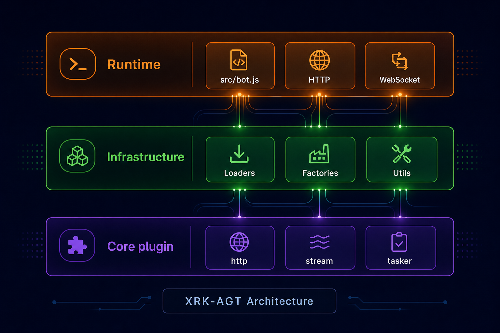

# XRK-AGT 底层架构设计

> **项目定位**：融合**智能体业务逻辑**的**通用后端** — Runtime（`src/`）提供 HTTP/WS、加载器、工厂与数据库；智能体与业务在 **Core**（`core/*/`）通过 plugin / http / stream / tasker 扩展。  
> 分层边界与配置/AI 链路的单一事实源。专题索引见 [docs/README.md](README.md)。  
> 适用范围：`src/`、`core/*/`、`config/`、`data/server_bots/{port}/`。

---

## 1. 架构分层

| 层 | 路径 | 职责 |
|----|------|------|
| Runtime | `src/bot.js` | HTTP/WS、全局 `Bot`、中间件与路由入口 |
| Infrastructure | `src/infrastructure/`、`src/utils/`、`src/factory/` | Loader、基类、工厂、通用工具（不写业务） |
| Core | `core/<name>/` | `plugin/`、`http/`、`stream/`、`tasker/`、`events/`、`commonconfig/`、`www/<app>/` |

### 工具模块

`src/utils/`、`src/factory/`、渲染器与数据库的职责与路径见 [runtime-surface.md](runtime-surface.md)、[factory.md](factory.md)、[database.md](database.md)、[node-26-runtime.md](node-26-runtime.md)、[coding-style.md](coding-style.md)。

扩展点与基类路径见 [框架可扩展性指南.md](框架可扩展性指南.md)、[base-classes.md](base-classes.md)；**运行时挂载**见 [runtime-surface.md](runtime-surface.md)。

---

## 2. AI 与外部服务（索引）

- 主服务 LLM / v3：[factory.md](factory.md)，入口 `core/system-Core/http/ai.js`；工作流内 `AIStream.callAI` → `LLMFactory`
- 工作流：[aistream.md](aistream.md)，扫描 `core/*/stream/*.js`
- Python 子服务端（可选扩展）：[subserver-api.md](subserver-api.md)；**无内置模型下载/本地推理**；主→子 HTTP 见 `#utils/subserver-client.js`

---

## 3. 配置

- 模板：`config/default_config/*.yaml`
- 运行时：`data/server_bots/{port}/*.yaml`（全局段在 `data/server_bots/*.yaml`）
- LLM 优先级：`请求参数 > provider 配置 > 工作流默认 > 系统默认`
- `/api/v3/chat/completions` 的 `model` 为 **provider key**；真实模型名在 provider YAML 的 `model` / `chatModel`

路径与 schema 变更清单见 skill `xrk-config`、`docs/config-base.md`。

---

## 4. HTTP 鉴权

`/api/` 路由默认 `Bot.checkApiAuthorization`（`http.js` → `auth.js`）；公开接口设 `systemAuth: false`。业务 handler 不重复实现密钥比对。详见 [AUTH.md](AUTH.md)。

---

## 5. 启动

`node app` → `app.js` → `src/utils/bootstrap.js` → `start.js` → `src/bot.js`。步骤、环境变量、Playwright 与 Ctrl+C 语义见 **[startup.md](startup.md)**；Bot 生命周期见 [bot.md](bot.md)。

---

*最后更新：2026-06-14*
