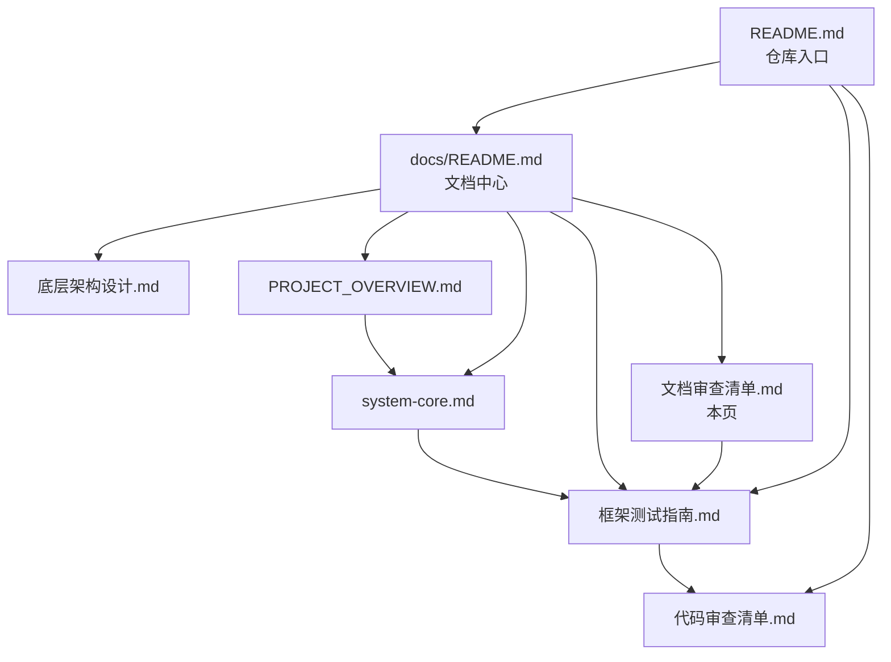

# 文档审查清单

与 [代码审查清单.md](代码审查清单.md) 配套：**代码清单**管可运行性与架构边界，**本文**管文档是否准确、互链是否完整。  
自动化指标以 [框架测试指南.md](框架测试指南.md) 为准；模块细节以 [system-core.md](system-core.md) 为准。

---

## 文档层级（阅读与维护顺序）

| 层级 | 文件 | 用途 |
|------|------|------|
| L0 入口 | [README.md](../README.md) | 克隆、启动、目录导航、测试入口 |
| L1 枢纽 | [docs/README.md](README.md) | 全量文档索引、按角色阅读路径 |
| L1 架构 | [底层架构设计.md](底层架构设计.md)、[startup.md](startup.md)、[PROJECT_OVERVIEW.md](../PROJECT_OVERVIEW.md) | 分层边界、启动链、目录树 |
| L1 内置能力 | [system-core.md](system-core.md) | 12 HTTP / 7 stream / 15 plugin / 4 events 等 API 与模块说明 |
| L1 质量 | [框架测试指南.md](框架测试指南.md)、[代码审查清单.md](代码审查清单.md)、**本页** | 标准值、实测、发布前检查 |
| L2 专题 | [plugin-base.md](plugin-base.md)、[http-api.md](http-api.md)、[aistream.md](aistream.md) 等 | 单点扩展开发；基类图以源码 + 专题文档为准 |

---

## 权威事实源（冲突时优先级）

1. **运行时代码**：`core/system-Core/`、`src/infrastructure/`
2. **测试断言**：`tests/helpers/system-core.mjs` → `SYSTEM_CORE_BASELINE`
3. **CI 输出**：`pnpm test` / `pnpm test:e2e` 日志
4. **文档**：以上三者为准修订文档，不以旧文档反推代码

---

## system-Core 关键数字（须全文一致）

| 项 | 标准值 | 维护位置 |
|----|--------|----------|
| HTTP API | 12 | `tests/helpers/system-core.mjs`、`module-inventory` |
| stream | 7 | 同上 |
| plugin | 15 | `git ls-files` + `SYSTEM_CORE_BASELINE` |
| tasker | 4 | 同上 |
| events | 4 | 同上 |
| MCP 工具（仅七个自带工作流） | 80 | `core/system-Core/stream/*.js` 内 `registerMCPTool` |
| CI 单测（快速） | 59 pass | `package.json` → `pnpm test:fast` |
| CI 单测（全量） | 64 pass | `package.json` → `pnpm test` |
| CI E2E | 3 pass | `pnpm test:e2e` |

**不得写入框架达标线的数字**：全仓库 ApiLoader 19、插件 21、工作流 11、MCP 90 等（扩展 core 运行时参考，见框架测试指南「日志参考」）。

须出现上述标准值的文档（改数字时**全部扫一遍**）：

- [README.md](../README.md)（概述、测试与质量）
- [PROJECT_OVERVIEW.md](../PROJECT_OVERVIEW.md)（system-Core 小节）
- [docs/README.md](README.md)（架构说明段）
- [system-core.md](system-core.md)（概述与总结）
- [框架测试指南.md](框架测试指南.md)、[代码审查清单.md](代码审查清单.md)

---

## 发布前文档自检

### A. 数字与测试

- [ ] `SYSTEM_CORE_BASELINE` 与 [框架测试指南](框架测试指南.md) 表内「标准」列一致
- [ ] README / PROJECT_OVERVIEW / system-core 与 `SYSTEM_CORE_BASELINE` 一致（当前 **12 / 7 / 15 / 4 / 4**，MCP **80**）
- [ ] MCP：**80** 指 system-Core 七工作流；全仓库启动日志更高时须标注「含扩展 core」
- [ ] 已本地执行 `pnpm test`、`pnpm test:e2e`（**Node ≥ 26**），实测表日期与 pass 数已更新（若变更测试）
- [ ] ApiLoader key 文档与 `resolveCoreModuleKey` 一致（如 `ai-workspace`，无 `http/` 前缀）；集成测见 `tests/helpers/system-core.mjs` → `systemCoreHttpApiKeys()`
- [ ] vendor 插件表述为「未 git 入库的本地 `.js`」，无硬编码文件名白名单

### B. 互链与入口

- [ ] 根 README「目录」含 [测试与质量](../README.md#测试与质量)，并链到框架测试指南、代码/文档审查清单
- [ ] [docs/README.md](README.md) 快速开始含框架测试指南、代码审查清单、**文档审查清单（本页）**
- [ ] [system-core.md](system-core.md) 文首或概述含链到框架测试指南
- [ ] 新增/重命名 `docs/*.md` 后已在 docs/README 导航中登记

### C. 配置与 API 文档

- [ ] 新增配置字段：已同步 `config/default_config/`、`commonconfig` schema、消费代码（见代码审查清单 §4）
- [ ] 新增/变更 HTTP 路由：`http-api.md` 或 `system-core.md` 对应端点表已更新
- [ ] 鉴权说明与 [AUTH.md](AUTH.md) 一致（`/api/*` 默认 Key、`systemAuth: false` 公开）

### D. 架构表述

- [ ] 未写「业务进 `src/`」或与「业务只在 `core/`」矛盾的描述
- [ ] 扩展 core 与 system-Core 区分清楚（框架测试只锁后者）
- [ ] Node / 引导 / 信号与 [node-26-runtime.md](node-26-runtime.md)、[startup.md](startup.md)、[bot.md](bot.md) 一致（≥26、pnpm、Playwright 可选安装、Ctrl+C 三击）
- [ ] 事件监听器基类为 **`EventListenerBase`**（`listener/base.js`），勿写未使用的旧 `EventListener`
- [ ] 插件 `rule[]` 无 `priority` 字段；顺序由 `super({ priority })` 控制（数字越小越先）

---

## 变更类型 → 须同步的文档

| 变更 | 必改文档 | 可选 |
|------|----------|------|
| system-Core 增删 HTTP | `system-core.mjs` 测试、`system-core.md` HTTP 章、`框架测试指南` | `api-loader.md`、`README` 数字 |
| system-Core 增删 stream/plugin | 同上 + `aistream.md` / `plugins-loader.md` 示例 | `mcp-config-guide.md` |
| 仅扩展 core | 扩展 core 自有 README（若有） | **勿改**框架标准值 |
| 底层加载器/鉴权/引导/信号/写法 | `底层架构设计.md`、`coding-style.md`、`startup.md`、`infrastructure-shared.md`、`bot.md`、`node-26-runtime.md` | `框架测试指南` 若新增断言 |
| 部署 / 存储 | `docker.md`、`database.md`、`README` 快速开始 | `PROJECT_OVERVIEW` |
| 仅文案/错别字 | 涉及页面即可 | — |

---

## 专题文档索引（L2，由枢纽跳转）

| 主题 | 文档 |
|------|------|
| 扩展开发 | [框架可扩展性指南.md](框架可扩展性指南.md)、[base-classes.md](base-classes.md) |
| 基础设施 | [runtime-surface.md](runtime-surface.md)、[coding-style.md](coding-style.md)、[base-classes.md](base-classes.md)、[底层架构设计.md](底层架构设计.md)、[startup.md](startup.md) |
| 文档规范 | [DOCSTYLE.md](DOCSTYLE.md)、[coding-style.md](coding-style.md) |
| 插件 | [plugin-base.md](plugin-base.md)、[plugins-loader.md](plugins-loader.md) |
| Tasker / 事件 | [tasker-base-spec.md](tasker-base-spec.md)、[事件系统标准化文档.md](事件系统标准化文档.md) |
| HTTP | [http-api.md](http-api.md)、[api-loader.md](api-loader.md)、[AUTH.md](AUTH.md) |
| AI / MCP | [aistream.md](aistream.md)、[mcp-guide.md](mcp-guide.md)、[factory.md](factory.md) |
| 配置 / 渲染 / 存储 | [config-base.md](config-base.md)、[renderer.md](renderer.md)、[database.md](database.md) |
| 运维 | [docker.md](docker.md)、[server.md](server.md) |

完整列表见 [docs/README.md](README.md#-文档导航)。

---

*与代码审查一并使用：先 `pnpm test` / `pnpm test:e2e`，再勾选本文与 [代码审查清单.md](代码审查清单.md)。*
