```mermaid
flowchart TB
    subgraph Extension["扩展能力"]
        A["插件扩展<br/>plugin基类"]
        B["工作流扩展<br/>AIStream基类"]
        C["Tasker扩展<br/>协议适配器"]
        D["事件监听器扩展<br/>EventListener基类"]
        E["HTTP API扩展<br/>HttpApi基类"]
        F["渲染器扩展<br/>Renderer基类"]
        G["配置扩展<br/>ConfigBase基类"]
        H["加载器扩展<br/>自定义加载器"]
    end
    
    subgraph Infrastructure["基础设施层"]
        I["基类库"]
        J["加载器"]
        K["工具类"]
    end
    
    A --> I
    B --> I
    C --> I
    D --> I
    E --> I
    F --> I
    G --> I
    H --> J
    
    style Extension fill:#E6F3FF
    style Infrastructure fill:#FFE6CC
```

```mermaid
flowchart TB
    A["创建插件类<br/>继承plugin"] --> B["定义构造函数<br/>配置name/event/priority"]
    B --> C["实现accept方法<br/>前置检查"]
    C --> D["定义rule规则<br/>消息匹配"]
    D --> E["实现处理方法<br/>业务逻辑"]
    E --> F["可选：定时任务<br/>task配置"]
    F --> G["可选：事件订阅<br/>eventSubscribe"]
    G --> H["放置到core/plugin/<br/>自动加载"]
    
    style A fill:#E6F3FF
    style H fill:#90EE90
```

```mermaid
flowchart TB
    A["创建AIStream子类"] --> B["配置基础信息<br/>name/description/priority"]
    B --> C["配置AI参数<br/>temperature/maxTokens"]
    C --> D["配置Embedding<br/>enabled（mode自动从cfg读取）"]
    D --> E["实现init方法<br/>注册函数"]
    E --> F["可选：实现buildSystemPrompt<br/>构建系统提示"]
    F --> G["可选：实现buildChatContext<br/>构建上下文"]
    G --> H["注册函数<br/>registerFunction"]
    H --> I["放置到core/stream/<br/>自动加载"]
    
    style A fill:#E6F3FF
    style I fill:#90EE90
```

```mermaid
flowchart TB
    A["创建Tasker类"] --> B["定义基础属性<br/>id/name/path"]
    B --> C["实现load方法<br/>初始化连接"]
    C --> D["实现消息处理<br/>handleMessage"]
    D --> E["转换平台消息<br/>统一事件格式"]
    E --> F["触发Bot.em事件<br/>事件标准化"]
    F --> G["注册到Bot.tasker<br/>自动加载"]
    
    style A fill:#E6F3FF
    style G fill:#90EE90
```

```mermaid
flowchart TB
    A["创建ConfigBase子类"] --> B["定义配置元数据<br/>name/displayName"]
    B --> C["定义文件路径<br/>filePath静态或动态"]
    C --> D["定义Schema<br/>配置结构验证"]
    D --> E["实现read/write<br/>读写配置"]
    E --> F["自动验证<br/>Schema校验"]
    
    style A fill:#E6F3FF
    style F fill:#90EE90
```

# XRK-AGT 框架可扩展性指南

> **本文档全面介绍XRK-AGT框架的可扩展性设计，帮助开发者充分利用框架的扩展能力，快速构建自定义功能。**

## 📚 目录导航

- [可扩展性概述](#可扩展性概述)
- [核心扩展点](#核心扩展点)
- [插件系统扩展](#插件系统扩展)
- [工作流系统扩展](#工作流系统扩展)
- [Tasker扩展](#tasker扩展)
- [事件系统扩展](#事件系统扩展)
- [HTTP/API扩展](#httpapi扩展)
- [渲染器扩展](#渲染器扩展)
- [配置系统扩展](#配置系统扩展)
- [加载器扩展](#加载器扩展)
- [最佳实践](#最佳实践)
- [扩展示例](#扩展示例)

---

## 可扩展性概述

XRK-AGT框架采用**分层架构 + 基类设计 + 加载器机制**，实现了高度的可扩展性：

### 核心设计原则

1. **基础设施与业务分离**：基础设施层提供通用能力，业务层专注具体实现
2. **基类抽象**：所有功能都基于基类，通过继承快速扩展
3. **自动加载**：通过加载器自动发现和加载扩展
4. **标准化接口**：统一的接口规范，易于集成和维护
5. **无特化逻辑**：底层代码不包含任何针对特定业务场景的硬编码

### 扩展能力矩阵



---

## 核心扩展点

### 1. 插件系统扩展

**基类位置**: `src/infrastructure/plugins/plugin.js`

**扩展能力**:
- ✅ 消息处理（规则匹配、权限控制）
- ✅ 定时任务（cron表达式）
- ✅ 事件订阅（跨平台事件监听）
- ✅ 上下文管理（会话状态）
- ✅ 工作流集成（AIStream调用）

**扩展流程图**:



**关键扩展点**:

1. **规则匹配系统**
   ```javascript
   // 支持多种规则格式
   rule: [
     { reg: '^#测试$', fnc: 'test' },           // 正则匹配
     { reg: /^#命令$/, fnc: 'command' },       // 正则对象
     { reg: '^#复杂', fnc: 'complex', priority: 100 }  // 带优先级
   ]
   ```

2. **事件订阅系统**
   ```javascript
   // 跨平台事件监听
   eventSubscribe: [
     { eventType: 'message', handler: this.handleMessage },
     { eventType: 'onebot.*', handler: this.handleOneBot },
     { eventType: 'device.notice', handler: this.handleDevice }
   ]
   ```

3. **上下文管理**
   ```javascript
   // 设置上下文
   this.setContext('type', isGroup, time);
   
   // 获取上下文
   const ctx = this.getContext('type', isGroup);
   
   // 结束上下文
   this.finish('type', isGroup);
   ```

### 2. 工作流系统扩展

**基类位置**: `src/infrastructure/aistream/aistream.js`

**扩展能力**:
- ✅ 自定义工作流（继承AIStream）
- ✅ 函数注册（Function Calling）
- ✅ Embedding提供商扩展
- ✅ 工作流合并（功能组合）
- ✅ 动态Prompt生成

**扩展流程图**:



**关键扩展点**:

1. **函数注册系统**
   ```javascript
   // 支持动态prompt
   this.registerFunction('my_function', {
     description: '功能描述',
     prompt: () => `[命令:参数] - 动态信息：${this.getInfo()}`,
     parser: (text, context) => { /* 解析逻辑 */ },
     handler: async (params, context) => { /* 执行逻辑 */ },
     enabled: true
   });
   ```

2. **Embedding提供商扩展**
   ```javascript
   // 支持多种提供商
   embedding: {
     enabled: true,
     // embedding 配置自动从 cfg 读取，无需手动指定
   }
   ```

3. **工作流合并**
   ```javascript
   // 自动合并辅助工作流
   await stream.process(e, question, {
     mergeStreams: ['desktop', 'memory'],
     enableTodo: true,
     enableMemory: true
   });
   ```

### 3. Tasker扩展

**扩展位置**: `core/tasker/`

**扩展能力**:
- ✅ 协议适配器（新平台接入）
- ✅ 事件生成（统一事件模型）
- ✅ 对象封装（平台特定对象）

**扩展流程图**:



**关键扩展点**:

1. **事件生成**
   ```javascript
   // 通过Bot.em触发标准化事件
   Bot.em('tasker.message', {
     event_id: `tasker_${Date.now()}`,
     tasker: 'mytasker',
     user_id: data.user_id,
     message: [{ type: 'text', text: data.text }]
   });
   ```

2. **对象封装**
   ```javascript
   // 通过增强插件挂载平台特定对象
   // 在enhancer插件中
   e.friend = Bot[self_id].pickFriend(user_id);
   e.group = Bot[self_id].pickGroup(group_id);
   ```

### 4. 事件监听器扩展

**基类位置**: `src/infrastructure/listener/EventListener.js`

**扩展能力**:
- ✅ 事件监听（跨平台事件）
- ✅ 事件预处理（去重、标记）
- ✅ 事件分发（调用PluginsLoader）

**扩展流程图**:



```mermaid
flowchart TB
    A["创建EventListener子类"] --> B["定义监听事件<br/>eventTypes"]
    B --> C["实现handle方法<br/>事件处理"]
    C --> D["事件去重<br/>避免重复处理"]
    D --> E["事件标记<br/>添加元数据"]
    E --> F["调用PluginsLoader<br/>分发到插件"]
    F --> G["放置到core/events/<br/>自动加载"]
    
    style A fill:#E6F3FF
    style G fill:#90EE90
```

### 5. HTTP/API扩展

**基类位置**: `src/infrastructure/http/HttpApi.js`

**扩展能力**:
- ✅ REST API（路由注册）
- ✅ WebSocket（实时通信）
- ✅ 中间件（认证、日志等）

**扩展流程图**:



```mermaid
flowchart TB
    A["创建HttpApi子类"] --> B["定义路由<br/>registerRoutes"]
    B --> C["实现处理方法<br/>业务逻辑"]
    C --> D["注册WebSocket<br/>实时通信"]
    D --> E["配置中间件<br/>认证/日志"]
    E --> F["放置到core/http/<br/>自动加载"]
    
    style A fill:#E6F3FF
    style F fill:#90EE90
```

### 6. 渲染器扩展

**基类位置**: `src/infrastructure/renderer/Renderer.js`

**扩展能力**:
- ✅ 模板渲染（HTML模板）
- ✅ 图片生成（Puppeteer/Playwright）
- ✅ 文件监听（自动重载）

**扩展流程图**:



```mermaid
flowchart TB
    A["创建Renderer子类"] --> B["配置渲染器<br/>id/type/render"]
    B --> C["实现渲染方法<br/>renderImage/renderHTML"]
    C --> D["模板处理<br/>dealTpl"]
    D --> E["文件监听<br/>watch"]
    E --> F["注册到Bot.renderer<br/>自动加载"]
    
    style A fill:#E6F3FF
    style F fill:#90EE90
```

### 7. 配置系统扩展

**基类位置**: `src/infrastructure/commonconfig/commonconfig.js`

**扩展能力**:
- ✅ 配置文件管理（YAML/JSON）
- ✅ 动态路径（函数式路径）
- ✅ 配置验证（Schema验证）
- ✅ 配置备份（自动备份）

**扩展流程图**:



---

## 插件系统扩展

### 完整扩展示例

```javascript
import plugin from '#infrastructure/plugins/plugin.js';
import StreamLoader from '#infrastructure/aistream/loader.js';

export default class MyPlugin extends plugin {
  constructor() {
    super({
      name: '我的插件',
      event: 'message',  // 监听消息事件
      priority: 5000,   // 优先级（越小越先执行）
      
      // 规则匹配
      rule: [
        { reg: '^#测试$', fnc: 'test' },
        { reg: '^#复杂命令', fnc: 'complex', priority: 100 }
      ],
      
      // 定时任务
      task: [
        {
          name: '定时任务',
          cron: '0 0 * * *',  // 每天0点执行
          fnc: 'scheduledTask',
          immediate: false
        }
      ],
      
      // 事件订阅
      eventSubscribe: [
        { eventType: 'onebot.notice', handler: this.handleNotice },
        { eventType: 'device.*', handler: this.handleDevice }
      ]
    });
  }

  // 前置检查
  async accept(e) {
    // 可以在这里进行权限检查、上下文检查等
    return true;
  }

  // 规则处理方法
  async test(e) {
    await this.reply('测试成功');
  }

  async complex(e) {
    // 调用工作流
    const stream = StreamLoader.getStream('chat');
    await stream.process(e, e.msg, {
      enableTodo: true,
      enableMemory: true
    });
  }

  // 定时任务
  async scheduledTask() {
    BotUtil.makeLog('info', '定时任务执行', 'MyPlugin');
  }

  // 事件订阅处理
  async handleNotice(e) {
    // 处理OneBot通知事件
  }

  async handleDevice(e) {
    // 处理设备事件
  }
}
```

### 扩展点详解

#### 1. 规则匹配系统

支持多种规则格式，灵活匹配消息：

```javascript
rule: [
  // 字符串正则
  { reg: '^#测试$', fnc: 'test' },
  
  // 正则对象
  { reg: /^#命令\d+$/, fnc: 'command' },
  
  // 带优先级
  { reg: '^#重要', fnc: 'important', priority: 1 },
  
  // 带权限检查
  { reg: '^#管理员', fnc: 'admin', permission: 'master' }
]
```

#### 2. 上下文管理

支持会话状态管理：

```javascript
// 设置上下文（30秒有效）
this.setContext('waiting_input', e.isGroup, 30);

// 获取上下文
const ctx = this.getContext('waiting_input', e.isGroup);
if (ctx) {
  // 处理上下文相关逻辑
  this.finish('waiting_input', e.isGroup);
}
```

#### 3. 工作流集成

插件可以无缝调用工作流：

```javascript
// 获取工作流
const stream = StreamLoader.getStream('chat');

// 调用工作流
await stream.process(e, question, {
  mergeStreams: ['desktop'],
  enableTodo: true,
  enableMemory: true,
  enableDatabase: true
});
```

---

## 工作流系统扩展

### 完整扩展示例

```javascript
import AIStream from '#infrastructure/aistream/aistream.js';
import BotUtil from '#utils/botutil.js';

export default class MyWorkflow extends AIStream {
  constructor() {
    super({
      name: 'my-workflow',
      description: '我的自定义工作流',
      version: '1.0.0',
      author: 'YourName',
      priority: 100,
      
      // AI配置
      config: {
        enabled: true,
        temperature: 0.7,
        maxTokens: 4000
      },
      
      // Embedding配置
      embedding: {
        enabled: true,
        // embedding 配置自动从 cfg 读取，无需手动指定
      }
    });
  }

  async init() {
    await super.init();
    await this.initEmbedding();
    this.registerAllFunctions();
    BotUtil.makeLog('info', `[${this.name}] 工作流已初始化`, 'MyWorkflow');
  }

  registerAllFunctions() {
    // 注册函数（支持动态prompt）
    this.registerFunction('my_function', {
      description: '我的功能',
      prompt: () => {
        // 动态获取信息
        const info = this.getDynamicInfo();
        return `[我的功能:参数] - 功能描述\n当前信息：${info}`;
      },
      parser: (text, context) => {
        const functions = [];
        const reg = /\[我的功能:([^\]]+)\]/g;
        let match;
        while ((match = reg.exec(text)) !== null) {
          functions.push({
            type: 'my_function',
            params: { param: match[1].trim() }
          });
        }
        return {
          functions,
          cleanText: text.replace(reg, '').trim()
        };
      },
      handler: async (params, context) => {
        const { param } = params || {};
        // 处理逻辑
        context.myResult = '执行结果';
        
        // 在工作流中记录笔记
        if (context.workflowId) {
          await this.storeNote(
            context.workflowId,
            `执行结果：${context.myResult}`,
            'my_function',
            true
          );
        }
      },
      enabled: true
    });
  }

  // 可选实现：构建系统提示词（如果未实现，基类返回空字符串）
  buildSystemPrompt(context) {
    return `【人设】
你是一个智能助手。

【可用功能】
${this.buildFunctionsPrompt()}

【执行规则】
1. 规则1
2. 规则2`;
  }

  // 可选实现：构建聊天上下文（如果未实现，基类返回空数组）
  async buildChatContext(e, question) {
    const messages = [];
    
    // 添加系统提示词
    const systemPrompt = this.buildSystemPrompt({ e, question });
    if (systemPrompt) {
    messages.push({
      role: 'system',
        content: systemPrompt
    });
    }
    
    // 添加用户消息
    messages.push({
      role: 'user',
      content: typeof question === 'string' ? question : (question?.content || '')
    });
    
    return messages;
  }

  getDynamicInfo() {
    // 动态获取信息
    return '实时信息';
  }
}
```

### 扩展点详解

#### 1. 函数注册系统

支持多种函数注册方式：

```javascript
// 静态prompt
prompt: `[命令:参数] - 功能描述`

// 动态prompt（推荐）
prompt: () => {
  const info = this.getInfo();
  return `[命令:参数] - 功能描述\n当前信息：${info}`;
}

// 复杂解析
parser: (text, context) => {
  // 支持多命令解析
  // 支持上下文感知
  // 支持参数验证
  return { functions: [], cleanText: text };
}

// 异步处理
handler: async (params, context) => {
  // 支持异步操作
  // 支持上下文传递
  // 支持错误处理
}
```

#### 2. Embedding提供商扩展

Embedding 配置自动从 cfg 读取：

```javascript
// Embedding 配置（自动从 cfg 读取）
embedding: {
  enabled: true
  // mode 自动从 cfg.aistream.embedding.mode 读取（local 或 remote）
  // local: 使用本地 BM25 算法（无需额外配置）
  // remote: 使用远程 API 接口（需要在 cfg.aistream.embedding.remote 中配置 apiUrl、apiKey、apiModel）
}
```

#### 3. 工作流合并机制

支持工作流功能合并：

```javascript
// 主工作流
const mainStream = StreamLoader.getStream('chat');

// 合并辅助工作流
await mainStream.process(e, question, {
  mergeStreams: ['desktop', 'memory', 'database'],
  enableTodo: true
});

// 合并后的工作流包含所有功能，但保留主工作流的人设
```

---

## Tasker扩展

### 完整扩展示例

```javascript
// core/tasker/MyTasker.js

class MyTasker {
  id = 'mytasker';
  name = 'MyTasker';
  path = this.name;

  load() {
    // 初始化连接
    Bot.wsf[this.path].push((ws) => {
      ws.on('message', (data) => this.handleMessage(data));
      ws.on('error', (error) => this.handleError(error));
    });
  }

  handleMessage(data) {
    // 转换平台消息为统一事件格式
    Bot.em('mytasker.message', {
      event_id: `mytasker_${Date.now()}`,
      tasker: 'mytasker',
      tasker_id: this.id,
      tasker_name: this.name,
      user_id: data.user_id,
      sender: {
        user_id: data.user_id,
        nickname: data.nickname
      },
      message: [{ type: 'text', text: data.text }],
      raw_message: data.text,
      time: Date.now(),
      bot: Bot[this.id],
      reply: async (msg) => {
        // 实现回复逻辑
        await this.sendMessage(data.user_id, msg);
      }
    });
  }

  handleError(error) {
    BotUtil.makeLog('error', `Tasker错误: ${error.message}`, 'MyTasker');
  }

  async sendMessage(userId, message) {
    // 实现发送消息逻辑
  }
}

// 注册Tasker
Bot.tasker.push(new MyTasker());
```

### 扩展点详解

#### 1. 事件生成

Tasker需要将平台消息转换为统一事件格式：

```javascript
Bot.em('tasker.message', {
  // 基础字段（必填）
  event_id: string,      // 事件ID
  tasker: string,        // Tasker类型
  tasker_id: string,     // Tasker ID
  tasker_name: string,   // Tasker名称
  user_id: string,       // 用户ID
  message: Array,        // 消息数组
  raw_message: string,   // 原始消息
  time: number,          // 时间戳
  bot: BotInstance,      // Bot实例
  reply: Function,       // 回复方法
  
  // 可选字段
  sender: Object,        // 发送者信息
  group_id: string,     // 群组ID（群消息时）
  // ... 其他平台特定字段
});
```

#### 2. 增强插件

平台特定对象通过增强插件挂载：

```javascript
// core/plugin/enhancer/MyTaskerEnhancer.js
export default class MyTaskerEnhancer extends plugin {
  constructor() {
    super({
      name: 'MyTasker增强插件',
      event: 'mytasker.message',
      priority: 1
    });
  }

  async accept(e) {
    // 挂载平台特定对象
    e.friend = this.getFriend(e.user_id);
    e.group = this.getGroup(e.group_id);
    e.isGroup = !!e.group_id;
    e.isPrivate = !e.isGroup;
    
    return true;
  }
}
```

---

## 事件系统扩展

### 完整扩展示例

```javascript
import EventListener from '#infrastructure/listener/EventListener.js';

export default class MyEventListener extends EventListener {
  constructor() {
    super({
      name: 'MyEventListener',
      eventTypes: ['mytasker.message', 'mytasker.notice']
    });
  }

  async handle(e) {
    // 事件去重
    if (this.isDuplicate(e)) {
      return;
    }

    // 事件标记
    e.processed = true;
    e.processedBy = this.name;

    // 分发到插件
    await PluginsLoader.deal(e);
  }

  isDuplicate(e) {
    // 实现去重逻辑
    const key = `${e.tasker}_${e.event_id}`;
    if (this.processedEvents.has(key)) {
      return true;
    }
    this.processedEvents.set(key, Date.now());
    return false;
  }
}
```

---

## HTTP/API扩展

### 完整扩展示例

```javascript
import HttpApi from '#infrastructure/http/HttpApi.js';

export default class MyAPI extends HttpApi {
  constructor() {
    super({
      name: 'MyAPI',
      path: '/api/my',
      description: '我的API'
    });
  }

  registerRoutes(app) {
    // REST API
    app.get('/api/my/status', this.handleStatus.bind(this));
    app.post('/api/my/action', this.handleAction.bind(this));
    
    // WebSocket
    this.registerWebSocket('/ws/my', this.handleWebSocket.bind(this));
  }

  async handleStatus(req, res) {
    res.json({ status: 'ok' });
  }

  async handleAction(req, res) {
    const { action } = req.body;
    // 处理逻辑
    res.json({ success: true });
  }

  handleWebSocket(ws, req) {
    ws.on('message', (data) => {
      // 处理WebSocket消息
      ws.send(JSON.stringify({ response: 'ok' }));
    });
  }
}
```

---

## 渲染器扩展

### 完整扩展示例

```javascript
import Renderer from '#infrastructure/renderer/Renderer.js';

export default class MyRenderer extends Renderer {
  constructor() {
    super({
      id: 'my-renderer',
      type: 'image',
      render: 'renderImage'
    });
  }

  async renderImage(data) {
    // 处理模板
    const htmlPath = await this.dealTpl('my-template', {
      tplFile: 'resources/html/my-template.html',
      data: data
    });

    // 使用Puppeteer/Playwright渲染
    const imagePath = await this.renderWithPuppeteer(htmlPath);
    
    return imagePath;
  }
}
```

---

## 配置系统扩展

### 完整扩展示例

```javascript
import ConfigBase from '#infrastructure/commonconfig/commonconfig.js';

export default class MyConfig extends ConfigBase {
  constructor() {
    super({
      name: 'myconfig',
      displayName: '我的配置',
      description: '自定义配置示例',
      filePath: 'config/myconfig.yaml',
      fileType: 'yaml',
      schema: {
        fields: {
          enabled: {
            type: 'boolean',
            default: true,
            description: '是否启用'
          },
          port: {
            type: 'number',
            default: 8080,
            description: '端口号'
          },
          settings: {
            type: 'object',
            fields: {
              key: {
                type: 'string',
                default: 'value',
                description: '设置项'
              }
            }
          }
        }
      }
    });
  }
}

// 使用
const config = new MyConfig();
const data = await config.read();
await config.set('enabled', true);
await config.write({ enabled: true, port: 8080 });
```

### 动态路径支持

```javascript
// 支持函数式路径
filePath: (cfg) => {
  return `config/server_bots/${cfg.server.port}/myconfig.yaml`;
}
```

---

## 加载器扩展

### 自定义加载器

框架的加载器都是可扩展的，可以创建自定义加载器：

```javascript
// src/infrastructure/my-loader/MyLoader.js

class MyLoader {
  constructor() {
    this.items = new Map();
    this.loaded = false;
  }

  async load() {
    if (this.loaded) return;
    
    const files = await this.getFiles();
    for (const file of files) {
      await this.loadItem(file);
    }
    
    this.loaded = true;
  }

  async getFiles() {
    // 获取文件列表
  }

  async loadItem(file) {
    // 加载单个项目
  }
}

export default new MyLoader();
```

---

## 最佳实践

### 1. 扩展开发流程

```mermaid
flowchart TB
    A["确定扩展类型"] --> B["选择对应基类"]
    B --> C["阅读基类文档"]
    C --> D["实现必要方法"]
    D --> E["测试扩展功能"]
    E --> F["放置到对应目录"]
    F --> G["自动加载生效"]
    
    style A fill:#E6F3FF
    style G fill:#90EE90
```



### 2. 扩展命名规范

- **插件**: `core/plugin/example/my-plugin.js`
- **工作流**: `core/stream/my-workflow.js`
- **Tasker**: `core/tasker/MyTasker.js`
- **事件监听器**: `core/events/my-listener.js`
- **HTTP API**: `core/http/my-api.js`
- **渲染器**: `src/renderers/my-renderer.js`

### 3. 扩展优先级

- **插件**: `priority` 越小越先执行
- **工作流**: `priority` 越大优先级越高
- **规则匹配**: `priority` 越小越先匹配

### 4. 扩展测试

```javascript
// 测试插件
const plugin = new MyPlugin();
await plugin.init();
const result = await plugin.test(e);

// 测试工作流
const stream = StreamLoader.getStream('my-workflow');
const response = await stream.process(e, '测试消息');

// 测试API
const api = new MyAPI();
await api.registerRoutes(app);
```

### 5. 扩展调试

- 使用 `BotUtil.makeLog()` 记录日志
- 查看加载器统计信息
- 检查扩展是否正确注册
- 验证扩展方法是否被调用

---

## 扩展示例

### 示例1：完整插件扩展

```javascript
import plugin from '#infrastructure/plugins/plugin.js';
import StreamLoader from '#infrastructure/aistream/loader.js';

export default class CompletePlugin extends plugin {
  constructor() {
    super({
      name: '完整插件示例',
      event: 'message',
      priority: 5000,
      rule: [
        { reg: '^#测试$', fnc: 'test' },
        { reg: '^#工作流', fnc: 'workflow' }
      ],
      task: [
        {
          name: '定时任务',
          cron: '0 0 * * *',
          fnc: 'scheduledTask'
        }
      ],
      eventSubscribe: [
        { eventType: 'onebot.notice', handler: this.handleNotice }
      ]
    });
  }

  async accept(e) {
    // 权限检查
    if (e.user_id !== 'admin') {
      return false;
    }
    return true;
  }

  async test(e) {
    await this.reply('测试成功');
  }

  async workflow(e) {
    const stream = StreamLoader.getStream('chat');
    await stream.process(e, e.msg, {
      enableTodo: true
    });
  }

  async scheduledTask() {
    BotUtil.makeLog('info', '定时任务执行', 'CompletePlugin');
  }

  async handleNotice(e) {
    // 处理通知事件
  }
}
```

### 示例2：完整工作流扩展

```javascript
import AIStream from '#infrastructure/aistream/aistream.js';

export default class CompleteWorkflow extends AIStream {
  constructor() {
    super({
      name: 'complete-workflow',
      description: '完整工作流示例',
      version: '1.0.0',
      priority: 100,
      config: {
        temperature: 0.7,
        maxTokens: 4000
      },
      embedding: {
        enabled: true
        // mode 自动从 cfg 读取
      }
    });
  }

  async init() {
    await super.init();
    await this.initEmbedding();
    this.registerAllFunctions();
  }

  registerAllFunctions() {
    // 注册多个函数
    this.registerFunction('function1', { /* ... */ });
    this.registerFunction('function2', { /* ... */ });
  }

  buildSystemPrompt(context) {
    return `【人设】
你是一个智能助手。

【可用功能】
${this.buildFunctionsPrompt()}`;
  }

  async buildChatContext(e, question) {
    // 构建上下文
    return messages;
  }
}
```

---

## 扩展能力总结

### 扩展能力矩阵

| 扩展类型 | 基类位置 | 扩展目录 | 自动加载 | 优先级支持 | 热重载 |
|---------|---------|---------|---------|-----------|--------|
| 插件 | `plugin.js` | `core/plugin/` | ✅ | ✅ | ✅ |
| 工作流 | `aistream.js` | `core/stream/` | ✅ | ✅ | ✅ |
| Tasker | - | `core/tasker/` | ✅ | - | ✅ |
| 事件监听器 | `EventListener.js` | `core/events/` | ✅ | ✅ | ✅ |
| HTTP API | `HttpApi.js` | `core/http/` | ✅ | ✅ | ✅ |
| 渲染器 | `Renderer.js` | `src/renderers/` | ✅ | - | ✅ |
| 配置 | `ConfigBase.js` | 任意位置 | - | - | - |

### 扩展优势

1. **零配置扩展**：放置到对应目录即可自动加载
2. **标准化接口**：统一的基类和接口规范
3. **灵活组合**：支持功能合并和组合
4. **热重载支持**：修改代码后自动重载
5. **完整生命周期**：提供init、cleanup等生命周期钩子

---

## 相关文档

- **[工作流系统完整文档](工作流系统完整文档.md)** - 工作流系统详细文档
- **[插件基类文档](plugin-base.md)** - 插件基类完整API
- **[AIStream文档](aistream.md)** - AIStream基类完整API
- **[项目概览](../PROJECT_OVERVIEW.md)** - 项目整体架构

---

## 总结

XRK-AGT框架通过**分层架构 + 基类设计 + 加载器机制**，实现了极高的可扩展性：

- ✅ **7大扩展点**：插件、工作流、Tasker、事件监听器、HTTP API、渲染器、配置
- ✅ **标准化接口**：统一的基类和接口规范
- ✅ **自动加载**：放置到对应目录即可自动加载
- ✅ **灵活组合**：支持功能合并和组合
- ✅ **完整生命周期**：提供init、cleanup等生命周期钩子

开发者可以通过继承基类、实现必要方法，快速扩展框架功能，无需修改底层代码。

